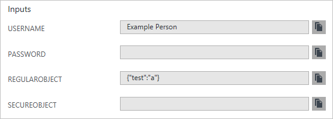

# Understand the structure and syntax of Azure Resource Manager templates
This topic describes the structure of an Azure Resource Manager template. It presents the different sections of a template and the properties that are available in those sections. The template consists of JSON and expressions that you can use to construct values for your deployment. For a step-by-step tutorial on creating a template, see [Create your first Azure Resource Manager template](resource-manager-create-first-template.md).

## Template format
In its simplest structure, a template contains the following elements:

```json
{
    "$schema": "http://schema.management.azure.com/schemas/2015-01-01/deploymentTemplate.json#",
    "contentVersion": "",
    "parameters": {  },
    "variables": {  },
    "resources": [  ],
    "outputs": {  }
}
```

| Element name | Required | Description |
|:--- |:--- |:--- |
| $schema |Yes |Location of the JSON schema file that describes the version of the template language. Use the URL shown in the preceding example. |
| contentVersion |Yes |Version of the template (such as 1.0.0.0). You can provide any value for this element. When deploying resources using the template, this value can be used to make sure that the right template is being used. |
| parameters |No |Values that are provided when deployment is executed to customize resource deployment. |
| variables |No |Values that are used as JSON fragments in the template to simplify template language expressions. |
| resources |Yes |Resource types that are deployed or updated in a resource group. |
| outputs |No |Values that are returned after deployment. |

Each element contains properties you can set. The following example contains the full syntax for a template:

```json
{
    "$schema": "http://schema.management.azure.com/schemas/2015-01-01/deploymentTemplate.json#",
    "contentVersion": "",
    "parameters": {  
        "<parameter-name>" : {
            "type" : "<type-of-parameter-value>",
            "defaultValue": "<default-value-of-parameter>",
            "allowedValues": [ "<array-of-allowed-values>" ],
            "minValue": <minimum-value-for-int>,
            "maxValue": <maximum-value-for-int>,
            "minLength": <minimum-length-for-string-or-array>,
            "maxLength": <maximum-length-for-string-or-array-parameters>,
            "metadata": {
                "description": "<description-of-the parameter>" 
            }
        }
    },
    "variables": {  
        "<variable-name>": "<variable-value>",
        "<variable-name>": { 
            <variable-complex-type-value> 
        }
    },
    "resources": [
      {
          "condition": "<boolean-value-whether-to-deploy>",
          "apiVersion": "<api-version-of-resource>",
          "type": "<resource-provider-namespace/resource-type-name>",
          "name": "<name-of-the-resource>",
          "location": "<location-of-resource>",
          "tags": {
              "<tag-name1>": "<tag-value1>",
              "<tag-name2>": "<tag-value2>"
          },
          "comments": "<your-reference-notes>",
          "copy": {
              "name": "<name-of-copy-loop>",
              "count": "<number-of-iterations>",
              "mode": "<serial-or-parallel>",
              "batchSize": "<number-to-deploy-serially>"
          },
          "dependsOn": [
              "<array-of-related-resource-names>"
          ],
          "properties": {
              "<settings-for-the-resource>",
              "copy": [
                  {
                      "name": ,
                      "count": ,
                      "input": {}
                  }
              ]
          },
          "resources": [
              "<array-of-child-resources>"
          ]
      }
    ],
    "outputs": {
        "<outputName>" : {
            "type" : "<type-of-output-value>",
            "value": "<output-value-expression>"
        }
    }
}
```

We examine the sections of the template in greater detail later in this topic.

## Expressions and functions
The basic syntax of the template is JSON. However, expressions and functions extend the JSON values available within the template.  Expressions are written within JSON string literals whose first and last characters are the brackets: `[` and `]`, respectively. The value of the expression is evaluated when the template is deployed. While written as a string literal, the result of evaluating the expression can be of a different JSON type, such as an array or integer, depending on the actual expression.  To have a literal string start with a bracket `[`, but not have it interpreted as an expression, add an extra bracket to start the string with `[[`.

Typically, you use expressions with functions to perform operations for configuring the deployment. Just like in JavaScript, function calls are formatted as `functionName(arg1,arg2,arg3)`. You reference properties by using the dot and [index] operators.

The following example shows how to use several functions when constructing values:

```json
"variables": {
    "location": "[resourceGroup().location]",
    "usernameAndPassword": "[concat(parameters('username'), ':', parameters('password'))]",
    "authorizationHeader": "[concat('Basic ', base64(variables('usernameAndPassword')))]"
}
```

For the full list of template functions, see [Azure Resource Manager template functions](resource-group-template-functions.md). 

## Parameters
In the parameters section of the template, you specify which values you can input when deploying the resources. These parameter values enable you to customize the deployment by providing values that are tailored for a particular environment (such as dev, test, and production). You do not have to provide parameters in your template, but without parameters your template would always deploy the same resources with the same names, locations, and properties.

You define parameters with the following structure:

```json
"parameters": {
    "<parameter-name>" : {
        "type" : "<type-of-parameter-value>",
        "defaultValue": "<default-value-of-parameter>",
        "allowedValues": [ "<array-of-allowed-values>" ],
        "minValue": <minimum-value-for-int>,
        "maxValue": <maximum-value-for-int>,
        "minLength": <minimum-length-for-string-or-array>,
        "maxLength": <maximum-length-for-string-or-array-parameters>,
        "metadata": {
            "description": "<description-of-the parameter>" 
        }
    }
}
```

| Element name | Required | Description |
|:--- |:--- |:--- |
| parameterName |Yes |Name of the parameter. Must be a valid JavaScript identifier. |
| type |Yes |Type of the parameter value. See the list of allowed types after this table. |
| defaultValue |No |Default value for the parameter, if no value is provided for the parameter. |
| allowedValues |No |Array of allowed values for the parameter to make sure that the right value is provided. |
| minValue |No |The minimum value for int type parameters, this value is inclusive. |
| maxValue |No |The maximum value for int type parameters, this value is inclusive. |
| minLength |No |The minimum length for string, secureString, and array type parameters, this value is inclusive. |
| maxLength |No |The maximum length for string, secureString, and array type parameters, this value is inclusive. |
| description |No |Description of the parameter that is displayed to users through the portal. |

The allowed types and values are:

* **string**
* **secureString**
* **int**
* **bool**
* **object** 
* **secureObject**
* **array**

To specify a parameter as optional, provide a defaultValue (can be an empty string). 

If you specify a parameter name in your template that matches a parameter in the command to deploy the template, there is potential ambiguity about the values you provide. Resource Manager resolves this confusion by adding the postfix **FromTemplate** to the template parameter. For example, if you include a parameter named **ResourceGroupName** in your template, it conflicts with the **ResourceGroupName** parameter in the [New-AzureRmResourceGroupDeployment](/powershell/module/azurerm.resources/new-azurermresourcegroupdeployment) cmdlet. During deployment, you are prompted to provide a value for **ResourceGroupNameFromTemplate**. In general, you should avoid this confusion by not naming parameters with the same name as parameters used for deployment operations.

> [!NOTE]
> All passwords, keys, and other secrets should use the **secureString** type. If you pass sensitive data in a JSON object, use the **secureObject** type. Template parameters with secureString or secureObject types cannot be read after resource deployment. 
> 
> For example, the following entry in the deployment history shows the value for a string and object but not for secureString and secureObject.
>
>   
>

The following example shows how to define parameters:

```json
"parameters": {
    "siteName": {
        "type": "string",
        "defaultValue": "[concat('site', uniqueString(resourceGroup().id))]"
    },
    "hostingPlanName": {
        "type": "string",
        "defaultValue": "[concat(parameters('siteName'),'-plan')]"
    },
    "skuName": {
        "type": "string",
        "defaultValue": "F1",
        "allowedValues": [
          "F1",
          "D1",
          "B1",
          "B2",
          "B3",
          "S1",
          "S2",
          "S3",
          "P1",
          "P2",
          "P3",
          "P4"
        ]
    },
    "skuCapacity": {
        "type": "int",
        "defaultValue": 1,
        "minValue": 1
    }
}
```

For how to input the parameter values during deployment, see [Deploy an application with Azure Resource Manager template](resource-group-template-deploy.md). 

## Variables
In the variables section, you construct values that can be used throughout your template. You do not need to define variables, but they often simplify your template by reducing complex expressions.

You define variables with the following structure:

```json
"variables": {
    "<variable-name>": "<variable-value>",
    "<variable-name>": { 
        <variable-complex-type-value> 
    }
}
```

The following example shows how to define a variable that is constructed from two parameter values:

```json
"variables": {
    "connectionString": "[concat('Name=', parameters('username'), ';Password=', parameters('password'))]"
}
```

The next example shows a variable that is a complex JSON type, and variables that are constructed from other variables:

```json
"parameters": {
    "environmentName": {
        "type": "string",
        "allowedValues": [
          "test",
          "prod"
        ]
    }
},
"variables": {
    "environmentSettings": {
        "test": {
            "instancesSize": "Small",
            "instancesCount": 1
        },
        "prod": {
            "instancesSize": "Large",
            "instancesCount": 4
        }
    },
    "currentEnvironmentSettings": "[variables('environmentSettings')[parameters('environmentName')]]",
    "instancesSize": "[variables('currentEnvironmentSettings').instancesSize]",
    "instancesCount": "[variables('currentEnvironmentSettings').instancesCount]"
}
```

## Resources
In the resources section, you define the resources that are deployed or updated. This section can get complicated because you must understand the types you are deploying to provide the right values. For the resource-specific values (apiVersion, type, and properties) that you need to set, see [Define resources in Azure Resource Manager templates](/azure/templates/). 

You define resources with the following structure:

```json
"resources": [
  {
      "condition": "<boolean-value-whether-to-deploy>",
      "apiVersion": "<api-version-of-resource>",
      "type": "<resource-provider-namespace/resource-type-name>",
      "name": "<name-of-the-resource>",
      "location": "<location-of-resource>",
      "tags": {
          "<tag-name1>": "<tag-value1>",
          "<tag-name2>": "<tag-value2>"
      },
      "comments": "<your-reference-notes>",
      "copy": {
          "name": "<name-of-copy-loop>",
          "count": "<number-of-iterations>",
          "mode": "<serial-or-parallel>",
          "batchSize": "<number-to-deploy-serially>"
      },
      "dependsOn": [
          "<array-of-related-resource-names>"
      ],
      "properties": {
          "<settings-for-the-resource>",
          "copy": [
              {
                  "name": ,
                  "count": ,
                  "input": {}
              }
          ]
      },
      "resources": [
          "<array-of-child-resources>"
      ]
  }
]
```

| Element name | Required | Description |
|:--- |:--- |:--- |
| condition | No | Boolean value that indicates whether the resource is deployed. |
| apiVersion |Yes |Version of the REST API to use for creating the resource. |
| type |Yes |Type of the resource. This value is a combination of the namespace of the resource provider and the resource type (such as **Microsoft.Storage/storageAccounts**). |
| name |Yes |Name of the resource. The name must follow URI component restrictions defined in RFC3986. In addition, Azure services that expose the resource name to outside parties validate the name to make sure it is not an attempt to spoof another identity. |
| location |Varies |Supported geo-locations of the provided resource. You can select any of the available locations, but typically it makes sense to pick one that is close to your users. Usually, it also makes sense to place resources that interact with each other in the same region. Most resource types require a location, but some types (such as a role assignment) do not require a location. See [Set resource location in Azure Resource Manager templates](resource-manager-template-location.md). |
| tags |No |Tags that are associated with the resource. See [Tag resources in Azure Resource Manager templates](resource-manager-template-tags.md). |
| comments |No |Your notes for documenting the resources in your template |
| copy |No |If more than one instance is needed, the number of resources to create. The default mode is parallel. Specify serial mode when you do not want all or the resources to deploy at the same time. For more information, see [Create multiple instances of resources in Azure Resource Manager](resource-group-create-multiple.md). |
| dependsOn |No |Resources that must be deployed before this resource is deployed. Resource Manager evaluates the dependencies between resources and deploys them in the correct order. When resources are not dependent on each other, they are deployed in parallel. The value can be a comma-separated list of a resource names or resource unique identifiers. Only list resources that are deployed in this template. Resources that are not defined in this template must already exist. Avoid adding unnecessary dependencies as they can slow your deployment and create circular dependencies. For guidance on setting dependencies, see [Defining dependencies in Azure Resource Manager templates](resource-group-define-dependencies.md). |
| properties |No |Resource-specific configuration settings. The values for the properties are the same as the values you provide in the request body for the REST API operation (PUT method) to create the resource. You can also specify a copy array to create multiple instances of a property. For more information, see [Create multiple instances of resources in Azure Resource Manager](resource-group-create-multiple.md). |
| resources |No |Child resources that depend on the resource being defined. Only provide resource types that are permitted by the schema of the parent resource. The fully qualified type of the child resource includes the parent resource type, such as **Microsoft.Web/sites/extensions**. Dependency on the parent resource is not implied. You must explicitly define that dependency. |

The resources section contains an array of the resources to deploy. Within each resource, you can also define an array of child resources. Therefore, your resources section could have a structure like:

```json
"resources": [
  {
      "name": "resourceA",
  },
  {
      "name": "resourceB",
      "resources": [
        {
            "name": "firstChildResourceB",
        },
        {   
            "name": "secondChildResourceB",
        }
      ]
  },
  {
      "name": "resourceC",
  }
]
```      

For more information about defining child resources, see [Set name and type for child resource in Resource Manager template](resource-manager-template-child-resource.md).

The **condition** element specifies whether the resource is deployed. The value for this element resolves to true or false. For example, to specify whether a new storage account is deployed, use:

```json
{
    "condition": "[equals(parameters('newOrExisting'),'new')]",
    "type": "Microsoft.Storage/storageAccounts",
    "name": "[variables('storageAccountName')]",
    "apiVersion": "2017-06-01",
    "location": "[resourceGroup().location]",
    "sku": {
        "name": "[variables('storageAccountType')]"
    },
    "kind": "Storage",
    "properties": {}
}
```

For an example of using a new or existing resource, see [New or existing condition template](https://github.com/rjmax/Build2017/blob/master/Act1.TemplateEnhancements/Chapter05.ConditionalResources.NewOrExisting.json).

To specify whether a virtual machine is deployed with a password or SSH key, define two versions of the virtual machine in your template and use **condition** to differentiate usage. Pass a parameter that specifies which scenario to deploy.

```json
{
    "condition": "[equals(parameters('passwordOrSshKey'),'password')]",
    "apiVersion": "2016-03-30",
    "type": "Microsoft.Compute/virtualMachines",
    "name": "[concat(variables('vmName'),'password')]",
    "properties": {
        "osProfile": {
            "computerName": "[variables('vmName')]",
            "adminUsername": "[parameters('adminUsername')]",
            "adminPassword": "[parameters('adminPassword')]"
        },
        ...
    },
    ...
},
{
    "condition": "[equals(parameters('passwordOrSshKey'),'sshKey')]",
    "apiVersion": "2016-03-30",
    "type": "Microsoft.Compute/virtualMachines",
    "name": "[concat(variables('vmName'),'ssh')]",
    "properties": {
        "osProfile": {
            "linuxConfiguration": {
                "disablePasswordAuthentication": "true",
                "ssh": {
                    "publicKeys": [
                        {
                            "path": "[variables('sshKeyPath')]",
                            "keyData": "[parameters('adminSshKey')]"
                        }
                    ]
                }
            }
        },
        ...
    },
    ...
}
``` 

For an example of using a password or SSH key to deploy virtual machine, see [Username or SSH condition template](https://github.com/rjmax/Build2017/blob/master/Act1.TemplateEnhancements/Chapter05.ConditionalResourcesUsernameOrSsh.json).

## Outputs
In the Outputs section, you specify values that are returned from deployment. For example, you could return the URI to access a deployed resource.

The following example shows the structure of an output definition:

```json
"outputs": {
    "<outputName>" : {
        "type" : "<type-of-output-value>",
        "value": "<output-value-expression>"
    }
}
```

| Element name | Required | Description |
|:--- |:--- |:--- |
| outputName |Yes |Name of the output value. Must be a valid JavaScript identifier. |
| type |Yes |Type of the output value. Output values support the same types as template input parameters. |
| value |Yes |Template language expression that is evaluated and returned as output value. |

The following example shows a value that is returned in the Outputs section.

```json
"outputs": {
    "siteUri" : {
        "type" : "string",
        "value": "[concat('http://',reference(resourceId('Microsoft.Web/sites', parameters('siteName'))).hostNames[0])]"
    }
}
```

For more information about working with output, see [Sharing state in Azure Resource Manager templates](best-practices-resource-manager-state.md).

## Template limits

Limit the size of your template to 1 MB, and each parameter file to 64 KB. The 1-MB limit applies to the final state of the template after it has been expanded with iterative resource definitions, and values for variables and parameters. 

You are also limited to:

* 256 parameters
* 256 variables
* 800 resources (including copy count)
* 64 output values
* 24,576 characters in a template expression

You can exceed some template limits by using a nested template. For more information, see [Using linked templates when deploying Azure resources](resource-group-linked-templates.md). To reduce the number of parameters, variables, or outputs, you can combine several values into an object. For more information, see [Objects as parameters](resource-manager-objects-as-parameters.md).

## Next steps
* To view complete templates for many different types of solutions, see the [Azure Quickstart Templates](https://azure.microsoft.com/documentation/templates/).
* For details about the functions you can use from within a template, see [Azure Resource Manager Template Functions](resource-group-template-functions.md).
* To combine multiple templates during deployment, see [Using linked templates with Azure Resource Manager](resource-group-linked-templates.md).
* You may need to use resources that exist within a different resource group. This scenario is common when working with storage accounts or virtual networks that are shared across multiple resource groups. For more information, see the [resourceId function](resource-group-template-functions-resource.md#resourceid).
