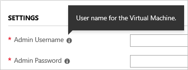
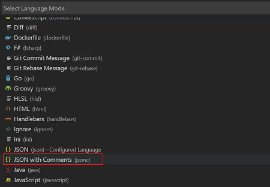

# Understand the structure and syntax of Azure Resource Manager templates

This article describes the structure of an Azure Resource Manager template. It presents the different sections of a template and the properties that are available in those sections. The template consists of JSON and expressions that you can use to construct values for your deployment.

This article is intended for users who have some familiarity with Resource Manager templates. It provides detailed information about the structure and syntax of the template. If you want an introduction to creating a template, see [Create your first Azure Resource Manager template](resource-manager-create-first-template.md).

## Template format

In its simplest structure, a template has the following elements:

```json
{
  "$schema": "https://schema.management.azure.com/schemas/2015-01-01/deploymentTemplate.json#",
  "contentVersion": "",
  "apiProfile": "",
  "parameters": {  },
  "variables": {  },
  "functions": [  ],
  "resources": [  ],
  "outputs": {  }
}
```

| Element name | Required | Description |
|:--- |:--- |:--- |
| $schema |Yes |Location of the JSON schema file that describes the version of the template language.<br><br> For resource group deployments, use: `https://schema.management.azure.com/schemas/2015-01-01/deploymentTemplate.json#`<br><br>For subscription deployments, use: `https://schema.management.azure.com/schemas/2018-05-01/subscriptionDeploymentTemplate.json#` |
| contentVersion |Yes |Version of the template (such as 1.0.0.0). You can provide any value for this element. Use this value to document significant changes in your template. When deploying resources using the template, this value can be used to make sure that the right template is being used. |
| apiProfile |No | An API version that serves as a collection of API versions for resource types. Use this value to avoid having to specify API versions for each resource in the template. When you specify an API profile version and don't specify an API version for the resource type, Resource Manager uses the API version for that resource type that is defined in the profile.<br><br>The API profile property is especially helpful when deploying a template to different environments, such as Azure Stack and global Azure. Use the API profile version to make sure your template automatically uses versions that are supported in both environments. For a list of the current API profile versions and the resources API versions defined in the profile, see [API Profile](https://github.com/Azure/azure-rest-api-specs/tree/master/profile).<br><br>For more information, see [Track versions using API profiles](templates-cloud-consistency.md#track-versions-using-api-profiles). |
| [parameters](#parameters) |No |Values that are provided when deployment is executed to customize resource deployment. |
| [variables](#variables) |No |Values that are used as JSON fragments in the template to simplify template language expressions. |
| [functions](#functions) |No |User-defined functions that are available within the template. |
| [resources](#resources) |Yes |Resource types that are deployed or updated in a resource group or subscription. |
| [outputs](#outputs) |No |Values that are returned after deployment. |

Each element has properties you can set. This article describes the sections of the template in greater detail.

## Syntax

The basic syntax of the template is JSON. However, you can use expressions to extend the JSON values available within the template.  Expressions start and end with brackets: `[` and `]`, respectively. The value of the expression is evaluated when the template is deployed. An expression can return a string, integer, boolean, array, or object. The following example shows an expression in the default value of a parameter:

```json
"parameters": {
  "location": {
    "type": "string",
    "defaultValue": "[resourceGroup().location]"
  }
},
```

Within the expression, the syntax `resourceGroup()` calls one of the functions that Resource Manager provides for use within a template. Just like in JavaScript, function calls are formatted as `functionName(arg1,arg2,arg3)`. The syntax `.location` retrieves one property from the object returned by that function.

Template functions and their parameters are case-insensitive. For example, Resource Manager resolves **variables('var1')** and **VARIABLES('VAR1')** as the same. When evaluated, unless the function expressly modifies case (such as toUpper or toLower), the function preserves the case. Certain resource types may have case requirements irrespective of how functions are evaluated.

To have a literal string start with a left bracket `[` and end with a right bracket `]`, but not have it interpreted as an expression, add an extra bracket to start the string with `[[`. For example, the variable:

```json
"demoVar1": "[[test value]"
```

Resolves to `[test value]`.

However, if the literal string doesn't end with a bracket, don't escape the first bracket. For example, the variable:

```json
"demoVar2": "[test] value"
```

Resolves to `[test] value`.

To pass a string value as a parameter to a function, use single quotes.

```json
"name": "[concat('storage', uniqueString(resourceGroup().id))]"
```

To escape double quotes in an expression, such as adding a JSON object in the template, use the backslash.

```json
"tags": {
    "CostCenter": "{\"Dept\":\"Finance\",\"Environment\":\"Production\"}"
},
```

A template expression can't exceed 24,576 characters.

For the full list of template functions, see [Azure Resource Manager template functions](resource-group-template-functions.md). 

## Parameters

In the parameters section of the template, you specify which values you can input when deploying the resources. These parameter values enable you to customize the deployment by providing values that are tailored for a particular environment (such as dev, test, and production). You don't have to provide parameters in your template, but without parameters your template would always deploy the same resources with the same names, locations, and properties.

You're limited to 256 parameters in a template. You can reduce the number of parameters by using objects that contain multiple properties, as shown in this article.

### Available properties

The available properties for a parameter are:

```json
"parameters": {
  "<parameter-name>" : {
    "type" : "<type-of-parameter-value>",
    "defaultValue": "<default-value-of-parameter>",
    "allowedValues": [ "<array-of-allowed-values>" ],
    "minValue": <minimum-value-for-int>,
    "maxValue": <maximum-value-for-int>,
    "minLength": <minimum-length-for-string-or-array>,
    "maxLength": <maximum-length-for-string-or-array-parameters>,
    "metadata": {
      "description": "<description-of-the parameter>" 
    }
  }
}
```

| Element name | Required | Description |
|:--- |:--- |:--- |
| parameterName |Yes |Name of the parameter. Must be a valid JavaScript identifier. |
| type |Yes |Type of the parameter value. The allowed types and values are **string**, **securestring**, **int**, **bool**, **object**, **secureObject**, and **array**. |
| defaultValue |No |Default value for the parameter, if no value is provided for the parameter. |
| allowedValues |No |Array of allowed values for the parameter to make sure that the right value is provided. |
| minValue |No |The minimum value for int type parameters, this value is inclusive. |
| maxValue |No |The maximum value for int type parameters, this value is inclusive. |
| minLength |No |The minimum length for string, secure string, and array type parameters, this value is inclusive. |
| maxLength |No |The maximum length for string, secure string, and array type parameters, this value is inclusive. |
| description |No |Description of the parameter that is displayed to users through the portal. For more information, see [Comments in templates](#comments). |

### Define and use a parameter

The following example shows a simple parameter definition. It defines the name of the parameter, and specifies that it takes a string value. The parameter only accepts values that make sense for its intended use. It specifies a default value when no value is provided during deployment. Finally, the parameter includes a description of its use.

```json
"parameters": {
  "storageSKU": {
    "type": "string",
    "allowedValues": [
      "Standard_LRS",
      "Standard_ZRS",
      "Standard_GRS",
      "Standard_RAGRS",
      "Premium_LRS"
    ],
    "defaultValue": "Standard_LRS",
    "metadata": {
      "description": "The type of replication to use for the storage account."
    }
  }   
}
```

In the template, you reference the value for the parameter with the following syntax:

```json
"resources": [
  {
    "type": "Microsoft.Storage/storageAccounts",
    "sku": {
      "name": "[parameters('storageSKU')]"
    },
    ...
  }
]
```

### Template functions with parameters

When specifying the default value for a parameter, you can use most template functions. You can use another parameter value to build a default value. The following template demonstrates the use of functions in the default value:

```json
"parameters": {
  "siteName": {
    "type": "string",
    "defaultValue": "[concat('site', uniqueString(resourceGroup().id))]",
    "metadata": {
      "description": "The site name. To use the default value, do not specify a new value."
    }
  },
  "hostingPlanName": {
    "type": "string",
    "defaultValue": "[concat(parameters('siteName'),'-plan')]",
    "metadata": {
      "description": "The host name. To use the default value, do not specify a new value."
    }
  }
}
```

You can't use the `reference` function in the parameters section. Parameters are evaluated before deployment so the `reference` function can't get the runtime state of a resource. 

### Objects as parameters

It can be easier to organize related values by passing them in as an object. This approach also reduces the number of parameters in the template.

Define the parameter in your template and specify a JSON object instead of a single value during deployment. 

```json
"parameters": {
  "VNetSettings": {
    "type": "object",
    "defaultValue": {
      "name": "VNet1",
      "location": "eastus",
      "addressPrefixes": [
        {
          "name": "firstPrefix",
          "addressPrefix": "10.0.0.0/22"
        }
      ],
      "subnets": [
        {
          "name": "firstSubnet",
          "addressPrefix": "10.0.0.0/24"
        },
        {
          "name": "secondSubnet",
          "addressPrefix": "10.0.1.0/24"
        }
      ]
    }
  }
},
```

Then, reference the subproperties of the parameter by using the dot operator.

```json
"resources": [
  {
    "apiVersion": "2015-06-15",
    "type": "Microsoft.Network/virtualNetworks",
    "name": "[parameters('VNetSettings').name]",
    "location": "[parameters('VNetSettings').location]",
    "properties": {
      "addressSpace":{
        "addressPrefixes": [
          "[parameters('VNetSettings').addressPrefixes[0].addressPrefix]"
        ]
      },
      "subnets":[
        {
          "name":"[parameters('VNetSettings').subnets[0].name]",
          "properties": {
            "addressPrefix": "[parameters('VNetSettings').subnets[0].addressPrefix]"
          }
        },
        {
          "name":"[parameters('VNetSettings').subnets[1].name]",
          "properties": {
            "addressPrefix": "[parameters('VNetSettings').subnets[1].addressPrefix]"
          }
        }
      ]
    }
  }
]
```

### Parameter example templates

These example templates demonstrate some scenarios for using parameters. Deploy them to test how parameters are handled in different scenarios.

|Template  |Description  |
|---------|---------|
|[parameters with functions for default values](https://github.com/Azure/azure-docs-json-samples/blob/master/azure-resource-manager/parameterswithfunctions.json) | Demonstrates how to use template functions when defining default values for parameters. The template doesn't deploy any resources. It constructs parameter values and returns those values. |
|[parameter object](https://github.com/Azure/azure-docs-json-samples/blob/master/azure-resource-manager/parameterobject.json) | Demonstrates using an object for a parameter. The template doesn't deploy any resources. It constructs parameter values and returns those values. |

## Variables

In the variables section, you construct values that can be used throughout your template. You don't need to define variables, but they often simplify your template by reducing complex expressions.

### Available definitions

The following example shows the available options for defining a variable:

```json
"variables": {
  "<variable-name>": "<variable-value>",
  "<variable-name>": { 
    <variable-complex-type-value> 
  },
  "<variable-object-name>": {
    "copy": [
      {
        "name": "<name-of-array-property>",
        "count": <number-of-iterations>,
        "input": <object-or-value-to-repeat>
      }
    ]
  },
  "copy": [
    {
      "name": "<variable-array-name>",
      "count": <number-of-iterations>,
      "input": <object-or-value-to-repeat>
    }
  ]
}
```

For information about using `copy` to create several values for a variable, see [Variable iteration](resource-group-create-multiple.md#variable-iteration).

### Define and use a variable

The following example shows a variable definition. It creates a string value for a storage account name. It uses several template functions to get a parameter value, and concatenates it to a unique string.

```json
"variables": {
  "storageName": "[concat(toLower(parameters('storageNamePrefix')), uniqueString(resourceGroup().id))]"
},
```

You use the variable when defining the resource.

```json
"resources": [
  {
    "name": "[variables('storageName')]",
    "type": "Microsoft.Storage/storageAccounts",
    ...
```

### Configuration variables

You can use complex JSON types to define related values for an environment.

```json
"variables": {
  "environmentSettings": {
    "test": {
      "instanceSize": "Small",
      "instanceCount": 1
    },
    "prod": {
      "instanceSize": "Large",
      "instanceCount": 4
    }
  }
},
```

In parameters, you create a value that indicates which configuration values to use.

```json
"parameters": {
  "environmentName": {
    "type": "string",
    "allowedValues": [
      "test",
      "prod"
    ]
  }
},
```

You retrieve the current settings with:

```json
"[variables('environmentSettings')[parameters('environmentName')].instanceSize]"
```

### Variable example templates

These example templates demonstrate some scenarios for using variables. Deploy them to test how variables are handled in different scenarios. 

|Template  |Description  |
|---------|---------|
| [variable definitions](https://github.com/Azure/azure-docs-json-samples/blob/master/azure-resource-manager/variables.json) | Demonstrates the different types of variables. The template doesn't deploy any resources. It constructs variable values and returns those values. |
| [configuration variable](https://github.com/Azure/azure-docs-json-samples/blob/master/azure-resource-manager/variablesconfigurations.json) | Demonstrates the use of a variable that defines configuration values. The template doesn't deploy any resources. It constructs variable values and returns those values. |
| [network security rules](https://github.com/Azure/azure-docs-json-samples/blob/master/azure-resource-manager/multipleinstance/multiplesecurityrules.json) and [parameter file](https://github.com/Azure/azure-docs-json-samples/blob/master/azure-resource-manager/multipleinstance/multiplesecurityrules.parameters.json) | Constructs an array in the correct format for assigning security rules to a network security group. |


## Functions

Within your template, you can create your own functions. These functions are available for use in your template. Typically, you define complicated expression that you don't want to repeat throughout your template. You create the user-defined functions from expressions and [functions](resource-group-template-functions.md) that are supported in templates.

When defining a user function, there are some restrictions:

* The function can't access variables.
* The function can only use parameters that are defined in the function. When you use the [parameters function](resource-group-template-functions-deployment.md#parameters) within a user-defined function, you're restricted to the parameters for that function.
* The function can't call other user-defined functions.
* The function can't use the [reference function](resource-group-template-functions-resource.md#reference).
* Parameters for the function can't have default values.

Your functions require a namespace value to avoid naming conflicts with template functions. The following example shows a function that returns a storage account name:

```json
"functions": [
  {
    "namespace": "contoso",
    "members": {
      "uniqueName": {
        "parameters": [
          {
            "name": "namePrefix",
            "type": "string"
          }
        ],
        "output": {
          "type": "string",
          "value": "[concat(toLower(parameters('namePrefix')), uniqueString(resourceGroup().id))]"
        }
      }
    }
  }
],
```

You call the function with:

```json
"resources": [
  {
    "name": "[contoso.uniqueName(parameters('storageNamePrefix'))]",
    "type": "Microsoft.Storage/storageAccounts",
    "apiVersion": "2016-01-01",
    "sku": {
      "name": "Standard_LRS"
    },
    "kind": "Storage",
    "location": "South Central US",
    "tags": {},
    "properties": {}
  }
]
```

## Resources
In the resources section, you define the resources that are deployed or updated.

### Available properties

You define resources with the following structure:

```json
"resources": [
  {
      "condition": "<true-to-deploy-this-resource>",
      "apiVersion": "<api-version-of-resource>",
      "type": "<resource-provider-namespace/resource-type-name>",
      "name": "<name-of-the-resource>",
      "location": "<location-of-resource>",
      "tags": {
          "<tag-name1>": "<tag-value1>",
          "<tag-name2>": "<tag-value2>"
      },
      "comments": "<your-reference-notes>",
      "copy": {
          "name": "<name-of-copy-loop>",
          "count": <number-of-iterations>,
          "mode": "<serial-or-parallel>",
          "batchSize": <number-to-deploy-serially>
      },
      "dependsOn": [
          "<array-of-related-resource-names>"
      ],
      "properties": {
          "<settings-for-the-resource>",
          "copy": [
              {
                  "name": ,
                  "count": ,
                  "input": {}
              }
          ]
      },
      "sku": {
          "name": "<sku-name>",
          "tier": "<sku-tier>",
          "size": "<sku-size>",
          "family": "<sku-family>",
          "capacity": <sku-capacity>
      },
      "kind": "<type-of-resource>",
      "plan": {
          "name": "<plan-name>",
          "promotionCode": "<plan-promotion-code>",
          "publisher": "<plan-publisher>",
          "product": "<plan-product>",
          "version": "<plan-version>"
      },
      "resources": [
          "<array-of-child-resources>"
      ]
  }
]
```

| Element name | Required | Description |
|:--- |:--- |:--- |
| condition | No | Boolean value that indicates whether the resource will be provisioned during this deployment. When `true`, the resource is created during deployment. When `false`, the resource is skipped for this deployment. See [condition](#condition). |
| apiVersion |Yes |Version of the REST API to use for creating the resource. To determine available values, see [template reference](/azure/templates/). |
| type |Yes |Type of the resource. This value is a combination of the namespace of the resource provider and the resource type (such as **Microsoft.Storage/storageAccounts**). To determine available values, see [template reference](/azure/templates/). For a child resource, the format of the type depends on whether it's nested within the parent resource or defined outside of the parent resource. See [child resources](#child-resources). |
| name |Yes |Name of the resource. The name must follow URI component restrictions defined in RFC3986. In addition, Azure services that expose the resource name to outside parties validate the name to make sure it isn't an attempt to spoof another identity. For a child resource, the format of the name depends on whether it's nested within the parent resource or defined outside of the parent resource. See [child resources](#child-resources). |
| location |Varies |Supported geo-locations of the provided resource. You can select any of the available locations, but typically it makes sense to pick one that is close to your users. Usually, it also makes sense to place resources that interact with each other in the same region. Most resource types require a location, but some types (such as a role assignment) don't require a location. |
| tags |No |Tags that are associated with the resource. Apply tags to logically organize resources across your subscription. |
| comments |No |Your notes for documenting the resources in your template. For more information, see [Comments in templates](resource-group-authoring-templates.md#comments). |
| copy |No |If more than one instance is needed, the number of resources to create. The default mode is parallel. Specify serial mode when you don't want all or the resources to deploy at the same time. For more information, see [Create several instances of resources in Azure Resource Manager](resource-group-create-multiple.md). |
| dependsOn |No |Resources that must be deployed before this resource is deployed. Resource Manager evaluates the dependencies between resources and deploys them in the correct order. When resources aren't dependent on each other, they're deployed in parallel. The value can be a comma-separated list of a resource names or resource unique identifiers. Only list resources that are deployed in this template. Resources that aren't defined in this template must already exist. Avoid adding unnecessary dependencies as they can slow your deployment and create circular dependencies. For guidance on setting dependencies, see [Defining dependencies in Azure Resource Manager templates](resource-group-define-dependencies.md). |
| properties |No |Resource-specific configuration settings. The values for the properties are the same as the values you provide in the request body for the REST API operation (PUT method) to create the resource. You can also specify a copy array to create several instances of a property. To determine available values, see [template reference](/azure/templates/). |
| sku | No | Some resources allow values that define the SKU to deploy. For example, you can specify the type of redundancy for a storage account. |
| kind | No | Some resources allow a value that defines the type of resource you deploy. For example, you can specify the type of Cosmos DB to create. |
| plan | No | Some resources allow values that define the plan to deploy. For example, you can specify the marketplace image for a virtual machine. | 
| resources |No |Child resources that depend on the resource being defined. Only provide resource types that are permitted by the schema of the parent resource. Dependency on the parent resource isn't implied. You must explicitly define that dependency. See [child resources](#child-resources). |

### Condition

When you must decide during deployment whether to create a resource, use the `condition` element. The value for this element resolves to true or false. When the value is true, the resource is created. When the value is false, the resource isn't created. The value can only be applied to the whole resource.

Typically, you use this value when you want to create a new resource or use an existing one. For example, to specify whether a new storage account is deployed or an existing storage account is used, use:

```json
{
    "condition": "[equals(parameters('newOrExisting'),'new')]",
    "type": "Microsoft.Storage/storageAccounts",
    "name": "[variables('storageAccountName')]",
    "apiVersion": "2017-06-01",
    "location": "[resourceGroup().location]",
    "sku": {
        "name": "[variables('storageAccountType')]"
    },
    "kind": "Storage",
    "properties": {}
}
```

For a complete example template that uses the `condition` element, see [VM with a new or existing Virtual Network, Storage, and Public IP](https://github.com/Azure/azure-quickstart-templates/tree/master/201-vm-new-or-existing-conditions).

If you use a [reference](resource-group-template-functions-resource.md#reference) or [list](resource-group-template-functions-resource.md#list) function with a resource that is conditionally deployed, the function is evaluated even if the resource isn't deployed. You get an error if the function refers to a resource that doesn't exist. Use the [if](resource-group-template-functions-logical.md#if) function to make sure the function is only evaluated for conditions when the resource is deployed. See the [if function](resource-group-template-functions-logical.md#if) for a sample template that uses if and reference with a conditionally deployed resource.

### Resource names

Generally, you work with three types of resource names in Resource Manager:

* Resource names that must be unique.
* Resource names that aren't required to be unique, but you choose to provide a name that can help you identify the resource.
* Resource names that can be generic.

Provide a **unique resource name** for any resource type that has a data access endpoint. Some common resource types that require a unique name include:

* Azure Storage<sup>1</sup> 
* Web Apps feature of Azure App Service
* SQL Server
* Azure Key Vault
* Azure Cache for Redis
* Azure Batch
* Azure Traffic Manager
* Azure Search
* Azure HDInsight

<sup>1</sup> Storage account names also must be lowercase, 24 characters or less, and not have any hyphens.

When setting the name, you can either manually create a unique name or use the [uniqueString()](resource-group-template-functions-string.md#uniquestring) function to generate a name. You also might want to add a prefix or suffix to the **uniqueString** result. Modifying the unique name can help you more easily identify the resource type from the name. For example, you can generate a unique name for a storage account by using the following variable:

```json
"variables": {
  "storageAccountName": "[concat(uniqueString(resourceGroup().id),'storage')]"
}
```

For some resource types, you might want to provide a **name for identification**, but the name doesn't have to be unique. For these resource types, provide a name that describes it use or characteristics.

```json
"parameters": {
  "vmName": { 
    "type": "string",
    "defaultValue": "demoLinuxVM",
    "metadata": {
      "description": "The name of the VM to create."
    }
  }
}
```

For resource types that you mostly access through a different resource, you can use a **generic name** that is hard-coded in the template. For example, you can set a standard, generic name for firewall rules on a SQL server:

```json
{
  "type": "firewallrules",
  "name": "AllowAllWindowsAzureIps",
  ...
}
```

### Resource location

When deploying a template, you must provide a location for each resource. Different resource types are supported in different locations. To get the supported locations for a resource type, see [Azure resource providers and types](resource-manager-supported-services.md).

Use a parameter to specify the location for resources, and set the default value to `resourceGroup().location`.

The following example shows a storage account that is deployed to a location specified as a parameter:

```json
{
  "$schema": "https://schema.management.azure.com/schemas/2015-01-01/deploymentTemplate.json#",
  "contentVersion": "1.0.0.0",
  "parameters": {
    "storageAccountType": {
      "type": "string",
      "defaultValue": "Standard_LRS",
      "allowedValues": [
        "Standard_LRS",
        "Standard_GRS",
        "Standard_ZRS",
        "Premium_LRS"
      ],
      "metadata": {
        "description": "Storage Account type"
      }
    },
    "location": {
      "type": "string",
      "defaultValue": "[resourceGroup().location]",
      "metadata": {
        "description": "Location for all resources."
      }
    }
  },
  "variables": {
    "storageAccountName": "[concat('storage', uniquestring(resourceGroup().id))]"
  },
  "resources": [
    {
      "type": "Microsoft.Storage/storageAccounts",
      "name": "[variables('storageAccountName')]",
      "location": "[parameters('location')]",
      "apiVersion": "2018-07-01",
      "sku": {
        "name": "[parameters('storageAccountType')]"
      },
      "kind": "StorageV2",
      "properties": {}
    }
  ],
  "outputs": {
    "storageAccountName": {
      "type": "string",
      "value": "[variables('storageAccountName')]"
    }
  }
}
```

### Child resources

Within some resource types, you can also define an array of child resources. Child resources are resources that only exist within the context of another resource. For example, a SQL database can't exist without a SQL server so the database is a child of the server. You can define the database within the definition for the server.

```json
{
  "apiVersion": "2015-05-01-preview",
  "type": "Microsoft.Sql/servers",
  "name": "exampleserver",
  ...
  "resources": [
    {
      "apiVersion": "2017-10-01-preview",
      "type": "databases",
      "name": "exampledatabase",
      ...
    }
  ]
}
```

But, you don't have to define the database within the server. You can define the child resource at the top level. You might use this approach if the parent resource isn't deployed in the same template, or if want to use `copy` to create more than one child resource. With this approach, you must provide the full resource type, and include the parent resource name in the child resource name.

```json
{
  "apiVersion": "2015-05-01-preview",
  "type": "Microsoft.Sql/servers",
  "name": "exampleserver",
  "resources": [ 
  ],
  ...
},
{
  "apiVersion": "2017-10-01-preview",
  "type": "Microsoft.Sql/servers/databases",
  "name": "exampleserver/exampledatabase",
  ...
}
```

The values you provide for type and name vary based on whether the child resource is defined within the parent resource or outside of the parent resource.

When nested in the parent resource, use:

```json
"type": "{child-resource-type}",
"name": "{child-resource-name}",
```

When defined outside of the parent resource, use:

```json
"type": "{resource-provider-namespace}/{parent-resource-type}/{child-resource-type}",
"name": "{parent-resource-name}/{child-resource-name}",
```

When nested, the type is set to `databases` but its full resource type is still `Microsoft.Sql/servers/databases`. You don't provide `Microsoft.Sql/servers/` because it's assumed from the parent resource type. The child resource name is set to `exampledatabase` but the full name includes the parent name. You don't provide `exampleserver` because it's assumed from the parent resource.

When constructing a fully qualified reference to a resource, the order to combine segments from the type and name isn't simply a concatenation of the two. Instead, after the namespace, use a sequence of *type/name* pairs from least specific to most specific:

```json
{resource-provider-namespace}/{parent-resource-type}/{parent-resource-name}[/{child-resource-type}/{child-resource-name}]*
```

For example:

`Microsoft.Compute/virtualMachines/myVM/extensions/myExt` is correct
`Microsoft.Compute/virtualMachines/extensions/myVM/myExt` is not correct

## Outputs

In the Outputs section, you specify values that are returned from deployment. Typically, you return values from resources that were deployed.

### Available properties

The following example shows the structure of an output definition:

```json
"outputs": {
  "<outputName>" : {
    "condition": "<boolean-value-whether-to-output-value>",
    "type" : "<type-of-output-value>",
    "value": "<output-value-expression>"
  }
}
```

| Element name | Required | Description |
|:--- |:--- |:--- |
| outputName |Yes |Name of the output value. Must be a valid JavaScript identifier. |
| condition |No | Boolean value that indicates whether this output value is returned. When `true`, the value is included in the output for the deployment. When `false`, the output value is skipped for this deployment. When not specified, the default value is `true`. |
| type |Yes |Type of the output value. Output values support the same types as template input parameters. If you specify **securestring** for the output type, the value isn't displayed in the deployment history and can't be retrieved from another template. To use a secret value in more than one template, store the secret in a Key Vault and reference the secret in the parameter file. For more information, see [Use Azure Key Vault to pass secure parameter value during deployment](resource-manager-keyvault-parameter.md). |
| value |Yes |Template language expression that is evaluated and returned as output value. |

### Define and use output values

The following example shows how to return the resource ID for a public IP address:

```json
"outputs": {
  "resourceID": {
    "type": "string",
    "value": "[resourceId('Microsoft.Network/publicIPAddresses', parameters('publicIPAddresses_name'))]"
  }
}
```

The next example shows how to conditionally return the resource ID for a public IP address based on whether a new one was deployed:

```json
"outputs": {
  "resourceID": {
    "condition": "[equals(parameters('publicIpNewOrExisting'), 'new')]",
    "type": "string",
    "value": "[resourceId('Microsoft.Network/publicIPAddresses', parameters('publicIPAddresses_name'))]"
  }
}
```

For a simple example of conditional output, see [conditional output template](https://github.com/bmoore-msft/AzureRM-Samples/blob/master/conditional-output/azuredeploy.json).

After the deployment, you can retrieve the value with script. For PowerShell, use:

```powershell
(Get-AzResourceGroupDeployment -ResourceGroupName <resource-group-name> -Name <deployment-name>).Outputs.resourceID.value
```

For Azure CLI, use:

```azurecli-interactive
az group deployment show -g <resource-group-name> -n <deployment-name> --query properties.outputs.resourceID.value
```

You can retrieve the output value from a linked template by using the [reference](resource-group-template-functions-resource.md#reference) function. To get an output value from a linked template, retrieve the property value with syntax like: `"[reference('deploymentName').outputs.propertyName.value]"`.

When getting an output property from a linked template, the property name can't include a dash.

The following example shows how to set the IP address on a load balancer by retrieving a value from a linked template.

```json
"publicIPAddress": {
  "id": "[reference('linkedTemplate').outputs.resourceID.value]"
}
```

You can't use the `reference` function in the outputs section of a [nested template](resource-group-linked-templates.md#link-or-nest-a-template). To return the values for a deployed resource in a nested template, convert your nested template to a linked template.

### Output example templates

|Template  |Description  |
|---------|---------|
|[Copy variables](https://github.com/Azure/azure-docs-json-samples/blob/master/azure-resource-manager/multipleinstance/copyvariables.json) | Creates complex variables and outputs those values. Doesn't deploy any resources. |
|[Public IP address](https://github.com/Azure/azure-docs-json-samples/blob/master/azure-resource-manager/linkedtemplates/public-ip.json) | Creates a public IP address and outputs the resource ID. |
|[Load balancer](https://github.com/Azure/azure-docs-json-samples/blob/master/azure-resource-manager/linkedtemplates/public-ip-parentloadbalancer.json) | Links to the preceding template. Uses the resource ID in the output when creating the load balancer. |


<a id="comments" />

## Comments and metadata

You have a few options for adding comments and metadata to your template.

You can add a `metadata` object almost anywhere in your template. Resource Manager ignores the object, but your JSON editor may warn you that the property isn't valid. In the object, define the properties you need.

```json
{
  "$schema": "https://schema.management.azure.com/schemas/2015-01-01/deploymentTemplate.json#",
  "contentVersion": "1.0.0.0",
  "metadata": {
    "comments": "This template was developed for demonstration purposes.",
    "author": "Example Name"
  },
```

For **parameters**, add a `metadata` object with a `description` property.

```json
"parameters": {
  "adminUsername": {
    "type": "string",
    "metadata": {
      "description": "User name for the Virtual Machine."
    }
  },
```

When deploying the template through the portal, the text you provide in the description is automatically used as a tip for that parameter.



For **resources**, add a `comments` element or a metadata object. The following example shows both a comments element and a metadata object.

```json
"resources": [
  {
    "comments": "Storage account used to store VM disks",
    "apiVersion": "2018-07-01",
    "type": "Microsoft.Storage/storageAccounts",
    "name": "[concat('storage', uniqueString(resourceGroup().id))]",
    "location": "[parameters('location')]",
    "metadata": {
      "comments": "These tags are needed for policy compliance."
    },
    "tags": {
      "Dept": "[parameters('deptName')]",
      "Environment": "[parameters('environment')]"
    },
    "sku": {
      "name": "Standard_LRS"
    },
    "kind": "Storage",
    "properties": {}
  }
]
```

For **outputs**, add a metadata object to the output value.

```json
"outputs": {
  "hostname": {
    "type": "string",
    "value": "[reference(variables('publicIPAddressName')).dnsSettings.fqdn]",
    "metadata": {
      "comments": "Return the fully qualified domain name"
    }
  },
```

You can't add a metadata object to user-defined functions.

For inline comments, you can use `//` but this syntax doesn't work with all tools. You can't use Azure CLI to deploy the template with inline comments. And, you can't use the portal template editor to work on templates with inline comments. If you add this style of comment, be sure the tools you use support inline JSON comments.

```json
{
  "type": "Microsoft.Compute/virtualMachines",
  "name": "[variables('vmName')]", // to customize name, change it in variables
  "location": "[parameters('location')]", //defaults to resource group location
  "apiVersion": "2018-10-01",
  "dependsOn": [ // storage account and network interface must be deployed first
    "[resourceId('Microsoft.Storage/storageAccounts/', variables('storageAccountName'))]",
    "[resourceId('Microsoft.Network/networkInterfaces/', variables('nicName'))]"
  ],
```

In VS Code, you can set the language mode to JSON with comments. The inline comments are no longer marked as invalid. To change the mode:

1. Open language mode selection (Ctrl+K M)

1. Select **JSON with Comments**.

   

[!INCLUDE [arm-tutorials-quickstarts](../../includes/resource-manager-tutorials-quickstarts.md)]

## Next steps
* To view complete templates for many different types of solutions, see the [Azure Quickstart Templates](https://azure.microsoft.com/documentation/templates/).
* For details about the functions you can use from within a template, see [Azure Resource Manager Template Functions](resource-group-template-functions.md).
* To combine several templates during deployment, see [Using linked templates with Azure Resource Manager](resource-group-linked-templates.md).
* For recommendations about creating templates, see [Azure Resource Manager template best practices](template-best-practices.md).
* For recommendations on creating Resource Manager templates that you can use across all Azure environments and Azure Stack, see [Develop Azure Resource Manager templates for cloud consistency](templates-cloud-consistency.md).
