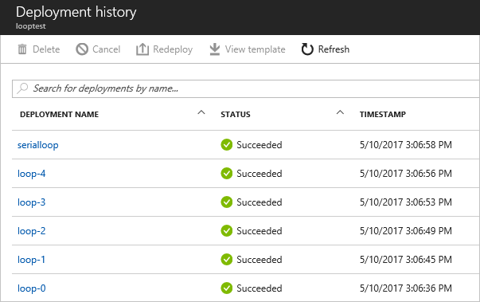

# Deploy multiple instances of a resource or property in Azure Resource Manager templates
This topic shows you how to iterate in your Azure Resource Manager template to create multiple instances of a resource, or multiple instances of a property on a resource.

If you need to add logic to your template that enables you to specify whether a resource is deployed, see [Conditionally deploy resource](#conditionally-deploy-resource).

## Resource iteration
To create multiple instances of a resource type, add a `copy` element to the resource type. In the copy element, you specify the number of iterations and a name for this loop. The count value must be a positive integer and cannot exceed 800. Resource Manager creates the resources in parallel. Therefore, the order in which they are created is not guaranteed. To create iterated resources in sequence, see [Serial copy](#serial-copy). 

The resource to create multiple times takes the following format:

```json
{
	"$schema": "https://schema.management.azure.com/schemas/2015-01-01/deploymentTemplate.json#",
	"contentVersion": "1.0.0.0",
	"resources": [
		{
			"apiVersion": "2016-01-01",
			"type": "Microsoft.Storage/storageAccounts",
			"name": "[concat(copyIndex(),'storage', uniqueString(resourceGroup().id))]",
			"location": "[resourceGroup().location]",
			"sku": {
				"name": "Standard_LRS"
			},
			"kind": "Storage",
			"properties": {},
			"copy": {
				"name": "storagecopy",
				"count": 3
			}
		}
	],
	"outputs": {}
}
```

Notice that the name of each resource includes the `copyIndex()` function, which returns the current iteration in the loop. `copyIndex()` is zero-based. So, the following example:

```json
"name": "[concat('storage', copyIndex())]",
```

Creates these names:

* storage0
* storage1
* storage2.

To offset the index value, you can pass a value in the copyIndex() function. The number of iterations to perform is still specified in the copy element, but the value of copyIndex is offset by the specified value. So, the following example:

```json
"name": "[concat('storage', copyIndex(1))]",
```

Creates these names:

* storage1
* storage2
* storage3

The copy operation is helpful when working with arrays because you can iterate through each element in the array. Use the `length` function on the array to specify the count for iterations, and `copyIndex` to retrieve the current index in the array. So, the following example:

```json
"parameters": { 
  "org": { 
     "type": "array", 
     "defaultValue": [ 
         "contoso", 
         "fabrikam", 
         "coho" 
      ] 
  }
}, 
"resources": [ 
  { 
      "name": "[concat('storage', parameters('org')[copyIndex()])]", 
      "copy": { 
         "name": "storagecopy", 
         "count": "[length(parameters('org'))]" 
      }, 
      ...
  } 
]
```

Creates these names:

* storagecontoso
* storagefabrikam
* storagecoho

## Serial copy

When you use the copy element to create multiple instances of a resource type, Resource Manager, by default, deploys those instances in parallel. However, you may want to specify that the resources are deployed in sequence. For example, when updating a production environment, you may want to stagger the updates so only a certain number are updated at any one time.

Resource Manager provides properties on the copy element that enable you to serially deploy multiple instances. In the copy element, set `mode` to **serial** and `batchSize` to the number of instances to deploy at a time. With serial mode, Resource Manager creates a dependency on earlier instances in the loop, so it does not start one batch until the previous batch completes.

```json
"copy": {
    "name": "iterator",
    "count": "[parameters('numberToDeploy')]",
    "mode": "serial",
    "batchSize": 2
},
```

The mode property also accepts **parallel**, which is the default value.

To test serial copy without creating actual resources, use the following template that deploys empty nested templates:

```json
{
  "$schema": "https://schema.management.azure.com/schemas/2015-01-01/deploymentTemplate.json#",
  "contentVersion": "1.0.0.0",
  "parameters": {
    "numberToDeploy": {
      "type": "int",
      "minValue": 2,
      "defaultValue": 5
    }
  },
  "resources": [
    {
      "apiVersion": "2015-01-01",
      "type": "Microsoft.Resources/deployments",
      "name": "[concat('loop-', copyIndex())]",
      "copy": {
        "name": "iterator",
        "count": "[parameters('numberToDeploy')]",
        "mode": "serial",
        "batchSize": 1
      },
      "properties": {
        "mode": "Incremental",
        "template": {
          "$schema": "http://schema.management.azure.com/schemas/2015-01-01/deploymentTemplate.json#",
          "contentVersion": "1.0.0.0",
          "parameters": {},
          "variables": {},
          "resources": [],
          "outputs": {
          }
        }
      }
    }
  ],
  "outputs": {
  }
}
```

In the deployment history, notice that the nested deployments are processed in sequence.



For a more realistic scenario, the following example deploys two instances at a time of a Linux VM from a nested template:

```json
{
    "$schema": "https://schema.management.azure.com/schemas/2015-01-01/deploymentTemplate.json#",
    "contentVersion": "1.0.0.0",
    "parameters": {
        "adminUsername": {
            "type": "string",
            "metadata": {
                "description": "User name for the Virtual Machine."
            }
        },
        "adminPassword": {
            "type": "securestring",
            "metadata": {
                "description": "Password for the Virtual Machine."
            }
        },
        "dnsLabelPrefix": {
            "type": "string",
            "metadata": {
                "description": "Unique DNS Name for the Public IP used to access the Virtual Machine."
            }
        },
        "ubuntuOSVersion": {
            "type": "string",
            "defaultValue": "16.04.0-LTS",
            "allowedValues": [
                "12.04.5-LTS",
                "14.04.5-LTS",
                "15.10",
                "16.04.0-LTS"
            ],
            "metadata": {
                "description": "The Ubuntu version for the VM. This will pick a fully patched image of this given Ubuntu version."
            }
        }
    },
    "variables": {
        "templatelink": "https://raw.githubusercontent.com/rjmax/Build2017/master/Act1.TemplateEnhancements/Chapter03.LinuxVM.json"
    },
    "resources": [
        {
            "apiVersion": "2015-01-01",
            "name": "[concat('nestedDeployment',copyIndex())]",
            "type": "Microsoft.Resources/deployments",
            "copy": {
                "name": "myCopySet",
                "count": 4,
                "mode": "serial",
                "batchSize": 2
            },
            "properties": {
                "mode": "Incremental",
                "templateLink": {
                    "uri": "[variables('templatelink')]",
                    "contentVersion": "1.0.0.0"
                },
                "parameters": {
                    "adminUsername": {
                        "value": "[parameters('adminUsername')]"
                    },
                    "adminPassword": {
                        "value": "[parameters('adminPassword')]"
                    },
                    "dnsLabelPrefix": {
                        "value": "[parameters('dnsLabelPrefix')]"
                    },
                    "ubuntuOSVersion": {
                        "value": "[parameters('ubuntuOSVersion')]"
                    },
                    "index":{
                        "value": "[copyIndex()]"
                    }
                }
            }
        }
    ]
}
```

## Property iteration

To create multiple values for a property on a resource, add a `copy` array in the properties element. This array contains objects, and each object has the following properties:

* name - the name of the property to create multiple values for
* count - the number of values to create
* input - an object that contains the values to assign to the property  

The following example shows how to apply `copy` to the dataDisks property on a virtual machine:

```json
{
  "name": "examplevm",
  "type": "Microsoft.Compute/virtualMachines",
  "apiVersion": "2017-03-30",
  "properties": {
    "storageProfile": {
      "copy": [{
          "name": "dataDisks",
          "count": 3,
          "input": {
              "lun": "[copyIndex('dataDisks')]",
              "createOption": "Empty",
              "diskSizeGB": "1023"
          }
      }],
      ...
```

Notice that when using `copyIndex` inside a property iteration, you must provide the name of the iteration. You do not have to provide the name when used with resource iteration.

Resource Manager expands the `copy` array during deployment. The name of the array becomes the name of the property. The input values become the object properties. The deployed template becomes:

```json
{
  "name": "examplevm",
  "type": "Microsoft.Compute/virtualMachines",
  "apiVersion": "2017-03-30",
  "properties": {
    "storageProfile": {
      "dataDisks": [
          {
              "lun": 0,
              "createOption": "Empty",
              "diskSizeGB": "1023"
          },
          {
              "lun": 1,
              "createOption": "Empty",
              "diskSizeGB": "1023"
          },
          {
              "lun": 2,
              "createOption": "Empty",
              "diskSizeGB": "1023"
          }
      }],
      ...
```

You can use resource and property iteration together. Reference the property iteration by name.

```json
{
    "type": "Microsoft.Network/virtualNetworks",
    "name": "[concat(parameters('vnetname'), copyIndex())]",
    "apiVersion": "2016-06-01",
    "copy":{
        "count": 2,
        "name": "vnetloop"
    },
    "location": "[resourceGroup().location]",
    "properties": {
        "addressSpace": {
            "addressPrefixes": [
                "[parameters('addressPrefix')]"
            ]
        },
        "copy": [
            {
                "name": "subnets",
                "count": 2,
                "input": {
                    "name": "[concat('subnet-', copyIndex('subnets'))]",
                    "properties": {
                        "addressPrefix": "[variables('subnetAddressPrefix')[copyIndex('subnets')]]"
                    }
                }
            }
        ]
    }
}
```

You can only include one copy element in the properties for each resource. To specify an iteration loop for more than one property, define multiple objects in the copy array. Each object is iterated separately. For example, to create multiple instances of both the `frontendIPConfigurations` property and the `loadBalancingRules` property on a load balancer, define both objects in a single copy element: 

```json
{
    "name": "[variables('loadBalancerName')]",
    "type": "Microsoft.Network/loadBalancers",
    "properties": {
        "copy": [
          {
              "name": "frontendIPConfigurations",
              "count": 2,
              "input": {
                  "name": "[concat('loadBalancerFrontEnd', copyIndex('frontendIPConfigurations', 1))]",
                  "properties": {
                      "publicIPAddress": {
                          "id": "[variables(concat('publicIPAddressID', copyIndex('frontendIPConfigurations', 1)))]"
                      }
                  }
              }
          },
          {
              "name": "loadBalancingRules",
              "count": 2,
              "input": {
                  "name": "[concat('LBRuleForVIP', copyIndex('loadBalancingRules', 1))]",
                  "properties": {
                      "frontendIPConfiguration": {
                          "id": "[variables(concat('frontEndIPConfigID', copyIndex('loadBalancingRules', 1)))]"
                      },
                      "backendAddressPool": {
                          "id": "[variables('lbBackendPoolID')]"
                      },
                      "protocol": "tcp",
                      "frontendPort": "[variables(concat('frontEndPort' copyIndex('loadBalancingRules', 1))]",
                      "backendPort": "[variables(concat('backEndPort' copyIndex('loadBalancingRules', 1))]",
                      "probe": {
                          "id": "[variables('lbProbeID')]"
                      }
                  }
              }
          }
        ],
        ...
    }
}
```

## Depend on resources in a loop
You specify that a resource is deployed after another resource by using the `dependsOn` element. To deploy a resource that depends on the collection of resources in a loop, provide the name of the copy loop in the dependsOn element. The following example shows how to deploy three storage accounts before deploying the Virtual Machine. The full Virtual Machine definition is not shown. Notice that the copy element has name set to `storagecopy` and the dependsOn element for the Virtual Machines is also set to `storagecopy`.

```json
{
    "$schema": "https://schema.management.azure.com/schemas/2015-01-01/deploymentTemplate.json#",
    "contentVersion": "1.0.0.0",
    "parameters": {},
    "resources": [
        {
			"apiVersion": "2016-01-01",
			"type": "Microsoft.Storage/storageAccounts",
			"name": "[concat(copyIndex(),'storage', uniqueString(resourceGroup().id))]",
			"location": "[resourceGroup().location]",
			"sku": {
				"name": "Standard_LRS"
			},
			"kind": "Storage",
			"properties": {},
			"copy": {
				"name": "storagecopy",
				"count": 3
			}
		},
        {
            "apiVersion": "2015-06-15", 
            "type": "Microsoft.Compute/virtualMachines", 
            "name": "[concat('VM', uniqueString(resourceGroup().id))]",  
            "dependsOn": ["storagecopy"],
            ...
        }
    ],
    "outputs": {}
}
```

## Create multiple instances of a child resource
You cannot use a copy loop for a child resource. To create multiple instances of a resource that you typically define as nested within another resource, you must instead create that resource as a top-level resource. You define the relationship with the parent resource through the type and name properties.

For example, suppose you typically define a dataset as a child resource within a data factory.

```json
"resources": [
{
    "type": "Microsoft.DataFactory/datafactories",
    "name": "exampleDataFactory",
    ...
    "resources": [
    {
        "type": "datasets",
        "name": "exampleDataSet",
        "dependsOn": [
            "exampleDataFactory"
        ],
        ...
    }
}]
```

To create multiple instances of data sets, move it outside of the data factory. The dataset must be at the same level as the data factory, but it is still a child resource of the data factory. You preserve the relationship between data set and data factory through the type and name properties. Since type can no longer be inferred from its position in the template, you must provide the fully qualified type in the format: `{resource-provider-namespace}/{parent-resource-type}/{child-resource-type}`.

To establish a parent/child relationship with an instance of the data factory, provide a name for the data set that includes the parent resource name. Use the format: `{parent-resource-name}/{child-resource-name}`.  

The following example shows the implementation:

```json
"resources": [
{
    "type": "Microsoft.DataFactory/datafactories",
    "name": "exampleDataFactory",
    ...
},
{
    "type": "Microsoft.DataFactory/datafactories/datasets",
    "name": "[concat('exampleDataFactory', '/', 'exampleDataSet', copyIndex())]",
    "dependsOn": [
        "exampleDataFactory"
    ],
    "copy": { 
        "name": "datasetcopy", 
        "count": "3" 
    } 
    ...
}]
```

## Conditionally deploy resource

To specify whether a resource is deployed, use the `condition` element. The value for this element resolves to true or false. When the value is true, the resource is deployed. When the value is false, the resource is not deployed. For example, to specify whether a new storage account is deployed or an existing storage account is used, use:

```json
{
    "condition": "[equals(parameters('newOrExisting'),'new')]",
    "type": "Microsoft.Storage/storageAccounts",
    "name": "[variables('storageAccountName')]",
    "apiVersion": "2017-06-01",
    "location": "[resourceGroup().location]",
    "sku": {
        "name": "[variables('storageAccountType')]"
    },
    "kind": "Storage",
    "properties": {}
}
```

For an example of using a new or existing resource, see [New or existing condition template](https://github.com/rjmax/Build2017/blob/master/Act1.TemplateEnhancements/Chapter05.ConditionalResources.NewOrExisting.json).

For an example of using a password or SSH key to deploy virtual machine, see [Username or SSH condition template](https://github.com/rjmax/Build2017/blob/master/Act1.TemplateEnhancements/Chapter05.ConditionalResourcesUsernameOrSsh.json).

## Next steps
* If you want to learn about the sections of a template, see [Authoring Azure Resource Manager Templates](resource-group-authoring-templates.md).
* To learn how to deploy your template, see [Deploy an application with Azure Resource Manager Template](resource-group-template-deploy.md).

