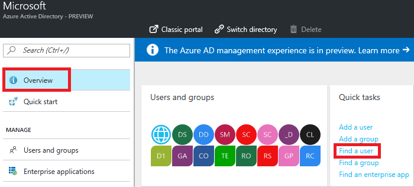
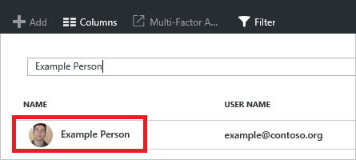
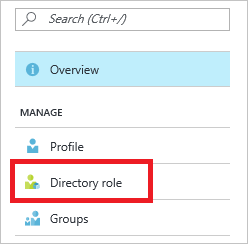
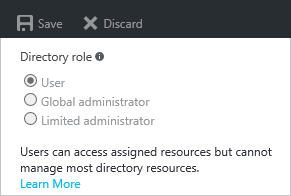
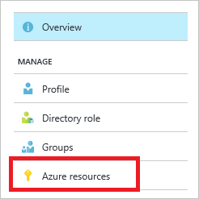
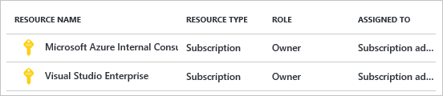
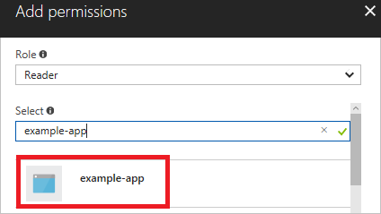

# Use portal to create an Azure Active Directory application and service principal that can access resources

When you have an application that needs to access or modify resources, you must set up an Azure Active Directory (AD) application and assign the required permissions to it. This approach is preferable to running the app under your own credentials because:

* You can assign permissions to the app identity that are different than your own permissions. Typically, these permissions are restricted to exactly what the app needs to do.
* You do not have to change the app's credentials if your responsibilities change. 
* You can use a certificate to automate authentication when executing an unattended script.

This topic shows you how to perform those steps through the portal. It focuses on a single-tenant application where the application is intended to run within only one organization. You typically use single-tenant applications for line-of-business applications that run within your organization.
 
## Required permissions
To complete this topic, you must have sufficient permissions to register an application with your Azure AD tenant, and assign the application to a role in your Azure subscription. Let's make sure you have the right permissions to perform those steps.

### Check Azure Active Directory permissions
1. Log in to your Azure Account through the [Azure portal](https://portal.azure.com).
2. Select **Azure Active Directory**.

     
3. In Azure Active Directory, select **User settings**.

     
4. Check the **App registrations** setting. If set to **Yes**, non-admin users can register AD apps. This setting means any user in the Azure AD tenant can register an app. You can proceed to [Check Azure subscription permissions](#check-azure-subscription-permissions).

     
5. If the app registrations setting is set to **No**, only admin users can register apps. You need to check whether your account is an admin for the Azure AD tenant. Select **Overview** and **Find a user** from Quick tasks.

     
6. Search for your account, and select it when you find it.

     
7. For your account, select **Directory role**. 

     
8. View your assigned directory role in Azure AD. If your account is assigned to the User role, but the app registration setting (from the preceding steps) is limited to admin users, ask your administrator to either assign you to an administrator role, or to enable users to register apps.

     

### Check Azure subscription permissions
In your Azure subscription, your account must have `Microsoft.Authorization/*/Write` access to assign an AD app to a role. This action is granted through the [Owner](../active-directory/role-based-access-built-in-roles.md#owner) role or [User Access Administrator](../active-directory/role-based-access-built-in-roles.md#user-access-administrator) role. If your account is assigned to the **Contributor** role, you do not have adequate permission. You will receive an error when attempting to assign the service principal to a role. 

To check your subscription permissions:

1. If you are not already looking at your Azure AD account from the preceding steps, select **Azure Active Directory** from the left pane.

2. Find your Azure AD account. Select **Overview** and **Find a user** from Quick tasks.

     
2. Search for your account, and select it when you find it.

      
     
3. Select **Azure resources**.

      
3. View your assigned roles, and determine if you have adequate permissions to assign an AD app to a role. If not, ask your subscription administrator to add you to User Access Administrator role. In the following image, the user is assigned to the Owner role for two subscriptions, which means that user has adequate permissions. 

     

## Create an Azure Active Directory application
1. Log in to your Azure Account through the [Azure portal](https://portal.azure.com).
2. Select **Azure Active Directory**.

     

4. Select **App registrations**.   

     
5. Select **Add**.

     

6. Provide a name and URL for the application. Select either **Web app / API** or **Native** for the type of application you want to create. After setting the values, select **Create**.

     

You have created your application.

## Get application ID and authentication key
When programmatically logging in, you need the ID for your application and an authentication key. To get those values, use the following steps:

1. From **App registrations** in Azure Active Directory, select your application.

     
2. Copy the **Application ID** and store it in your application code. The applications in the [sample applications](#sample-applications) section refer to this value as the client id.

     
3. To generate an authentication key, select **Keys**.

     
4. Provide a description of the key, and a duration for the key. When done, select **Save**.

     

     After saving the key, the value of the key is displayed. Copy this value because you are not able to retrieve the key later. You provide the key value with the application ID to log in as the application. Store the key value where your application can retrieve it.

     

## Get tenant ID
When programmatically logging in, you need to pass the tenant ID with your authentication request. 

1. To get the tenant ID, select **Properties** for your Azure AD tenant. 

     

2. Copy the **Directory ID**. This value is your tenant ID.

     

## Assign application to role
To access resources in your subscription, you must assign the application to a role. Decide which role represents the right permissions for the application. To learn about the available roles, see [RBAC: Built in Roles](../active-directory/role-based-access-built-in-roles.md).

You can set the scope at the level of the subscription, resource group, or resource. Permissions are inherited to lower levels of scope. For example, adding an application to the Reader role for a resource group means it can read the resource group and any resources it contains.

1. Navigate to the level of scope you wish to assign the application to. For example, to assign a role at the subscription scope, select **Subscriptions**. You could instead select a resource group or resource.

     

2. Select the particular subscription (resource group or resource) to assign the application to.

     

3. Select **Access Control (IAM)**.

     

4. Select **Add**.

     
6. Select the role you wish to assign to the application. The following image shows the **Reader** role.

     

8. Search for your application, and select it.

     
9. Select **OK** to finish assigning the role. You see your application in the list of users assigned to a role for that scope.

## Log in as the application

Your application is now set up in Azure Active Directory. You have an ID and key to use for signing in as the application. The application is assigned to a role that gives it certain actions it can perform. 

To log in through PowerShell, see [Provide credentials through PowerShell](resource-group-authenticate-service-principal.md#provide-credentials-through-powershell).

To log in through Azure CLI, see [Provide credentials through Azure CLI](resource-group-authenticate-service-principal-cli.md#provide-credentials-through-azure-cli).

To get the access token for REST operations, see [Create the request](/rest/api/#create-the-request).

Look at the following sample applications to learn about logging in through application code.

### Sample applications
The following sample applications show how to log in as the AD application.

**.NET**

* [Deploy an SSH Enabled VM with a Template with .NET](https://azure.microsoft.com/documentation/samples/resource-manager-dotnet-template-deployment/)
* [Manage Azure resources and resource groups with .NET](https://azure.microsoft.com/documentation/samples/resource-manager-dotnet-resources-and-groups/)

**Java**

* [Getting Started with Resources - Deploy Using Azure Resource Manager Template - in Java](https://azure.microsoft.com/documentation/samples/resources-java-deploy-using-arm-template/)
* [Getting Started with Resources - Manage Resource Group - in Java](https://azure.microsoft.com/documentation/samples/resources-java-manage-resource-group//)

**Python**

* [Deploy an SSH Enabled VM with a Template in Python](https://azure.microsoft.com/documentation/samples/resource-manager-python-template-deployment/)
* [Managing Azure Resource and Resource Groups with Python](https://azure.microsoft.com/documentation/samples/resource-manager-python-resources-and-groups/)

**Node.js**

* [Deploy an SSH Enabled VM with a Template in Node.js](https://azure.microsoft.com/documentation/samples/resource-manager-node-template-deployment/)
* [Manage Azure resources and resource groups with Node.js](https://azure.microsoft.com/documentation/samples/resource-manager-node-resources-and-groups/)

**Ruby**

* [Deploy an SSH Enabled VM with a Template in Ruby](https://azure.microsoft.com/documentation/samples/resource-manager-ruby-template-deployment/)
* [Managing Azure Resource and Resource Groups with Ruby](https://azure.microsoft.com/documentation/samples/resource-manager-ruby-resources-and-groups/)

## Next Steps
* To set up a multi-tenant application, see [Developer's guide to authorization with the Azure Resource Manager API](resource-manager-api-authentication.md).
* To learn about specifying security policies, see [Azure Role-based Access Control](../active-directory/role-based-access-control-configure.md).  
* For a list of available actions that can be granted or denied to users, see [Azure Resource Manager Resource Provider operations](../active-directory/role-based-access-control-resource-provider-operations.md).
