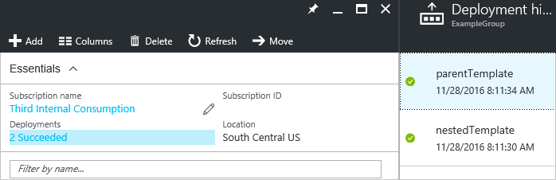

# Using linked templates when deploying Azure resources
From within one Azure Resource Manager template, you can link to another template, which enables you to decompose your deployment into a set of targeted, purpose-specific templates. As with decomposing an application into several code classes, decomposition provides benefits in terms of testing, reuse, and readability.  

You can pass parameters from a main template to a linked template, and those parameters can directly map to parameters or variables exposed by the calling template. The linked template can also pass an output variable back to the source template, enabling a two-way data exchange between templates.

## Linking to a template
You create a link between two templates by adding a deployment resource within the main template that points to the linked template. You set the **templateLink** property to the URI of the linked template. You can provide parameter values for the linked template directly in your template or in a parameter file. The following example uses the **parameters** property to specify a parameter value directly.

```json
"resources": [ 
  { 
      "apiVersion": "2017-05-10", 
      "name": "linkedTemplate", 
      "type": "Microsoft.Resources/deployments", 
      "properties": { 
        "mode": "incremental", 
        "templateLink": {
          "uri": "https://www.contoso.com/AzureTemplates/newStorageAccount.json",
          "contentVersion": "1.0.0.0"
        }, 
        "parameters": { 
          "StorageAccountName":{"value": "[parameters('StorageAccountName')]"} 
        } 
      } 
  } 
] 
```

Like other resource types, you can set dependencies between the linked template and other resources. Therefore, when other resources require an output value from the linked template, you can make sure the linked template is deployed before them. Or, when the linked template relies on other resources, you can make sure other resources are deployed before the linked template. You can retrieve a value from a linked template with the following syntax:

```json
"[reference('linkedTemplate').outputs.exampleProperty.value]"
```

The Resource Manager service must be able to access the linked template. You cannot specify a local file or a file that is only available on your local network for the linked template. You can only provide a URI value that includes either **http** or **https**. One option is to place your linked template in a storage account, and use the URI for that item, such as shown in the following example:

```json
"templateLink": {
    "uri": "http://mystorageaccount.blob.core.windows.net/templates/template.json",
    "contentVersion": "1.0.0.0",
}
```

Although the linked template must be externally available, it does not need to be generally available to the public. You can add your template to a private storage account that is accessible to only the storage account owner. Then, you create a shared access signature (SAS) token to enable access during deployment. You add that SAS token to the URI for the linked template. For steps on setting up a template in a storage account and generating a SAS token, see [Deploy resources with Resource Manager templates and Azure PowerShell](resource-group-template-deploy.md) or [Deploy resources with Resource Manager templates and Azure CLI](resource-group-template-deploy-cli.md). 

The following example shows a parent template that links to another template. The linked template is accessed with a SAS token that is passed in as a parameter.

```json
"parameters": {
    "sasToken": { "type": "securestring" }
},
"resources": [
    {
        "apiVersion": "2017-05-10",
        "name": "linkedTemplate",
        "type": "Microsoft.Resources/deployments",
        "properties": {
          "mode": "incremental",
          "templateLink": {
            "uri": "[concat('https://storagecontosotemplates.blob.core.windows.net/templates/helloworld.json', parameters('sasToken'))]",
            "contentVersion": "1.0.0.0"
          }
        }
    }
],
```

Even though the token is passed in as a secure string, the URI of the linked template, including the SAS token, is logged in the deployment operations. To limit exposure, set an expiration for the token.

Resource Manager handles each linked template as a separate deployment. In the deployment history for the resource group, you see separate deployments for the parent and nested templates.



## Linking to a parameter file
The next example uses the **parametersLink** property to link to a parameter file.

```json
"resources": [ 
  { 
     "apiVersion": "2017-05-10", 
     "name": "linkedTemplate", 
     "type": "Microsoft.Resources/deployments", 
     "properties": { 
       "mode": "incremental", 
       "templateLink": {
          "uri":"https://www.contoso.com/AzureTemplates/newStorageAccount.json",
          "contentVersion":"1.0.0.0"
       }, 
       "parametersLink": { 
          "uri":"https://www.contoso.com/AzureTemplates/parameters.json",
          "contentVersion":"1.0.0.0"
       } 
     } 
  } 
] 
```

The URI value for the linked parameter file cannot be a local file, and must include either **http** or **https**. The parameter file can also be limited to access through a SAS token.

## Using variables to link templates
The previous examples showed hard-coded URL values for the template links. This approach might work for a simple template but it does not work well when working with a large set of modular templates. Instead, you can create a static variable that stores a base URL for the main template and then dynamically create URLs for the linked templates from that base URL. The benefit of this approach is you can easily move or fork the template because you only need to change the static variable in the main template. The main template passes the correct URIs throughout the decomposed template.

The following example shows how to use a base URL to create two URLs for linked templates (**sharedTemplateUrl** and **vmTemplate**). 

```json
"variables": {
    "templateBaseUrl": "https://raw.githubusercontent.com/Azure/azure-quickstart-templates/master/postgresql-on-ubuntu/",
    "sharedTemplateUrl": "[concat(variables('templateBaseUrl'), 'shared-resources.json')]",
    "vmTemplateUrl": "[concat(variables('templateBaseUrl'), 'database-2disk-resources.json')]"
}
```

You can also use [deployment()](resource-group-template-functions-deployment.md#deployment) to get the base URL for the current template, and use that to get the URL for other templates in the same location. This approach is useful if your template location changes (maybe due to versioning) or you want to avoid hard coding URLs in the template file. 

```json
"variables": {
    "sharedTemplateUrl": "[uri(deployment().properties.templateLink.uri, 'shared-resources.json')]"
}
```

## Complete example
The following example templates show a simplified arrangement of linked templates to illustrate several of the concepts in this article. It assumes the templates have been added to the same container in a storage account with public access turned off. The linked template passes a value back to the main template in the **outputs** section.

The **parent.json** file consists of:

```json
{
  "$schema": "https://schema.management.azure.com/schemas/2015-01-01/deploymentTemplate.json#",
  "contentVersion": "1.0.0.0",
  "parameters": {
    "containerSasToken": { "type": "string" }
  },
  "resources": [
    {
      "apiVersion": "2017-05-10",
      "name": "linkedTemplate",
      "type": "Microsoft.Resources/deployments",
      "properties": {
        "mode": "incremental",
        "templateLink": {
          "uri": "[concat(uri(deployment().properties.templateLink.uri, 'helloworld.json'), parameters('containerSasToken'))]",
          "contentVersion": "1.0.0.0"
        }
      }
    }
  ],
  "outputs": {
    "result": {
      "type": "string",
      "value": "[reference('linkedTemplate').outputs.result.value]"
    }
  }
}
```

The **helloworld.json** file consists of:

```json
{
  "$schema": "https://schema.management.azure.com/schemas/2015-01-01/deploymentTemplate.json#",
  "contentVersion": "1.0.0.0",
  "parameters": {},
  "variables": {},
  "resources": [],
  "outputs": {
    "result": {
        "value": "Hello World",
        "type" : "string"
    }
  }
}
```

In PowerShell, you get a token for the container and deploy the templates with:

```powershell
Set-AzureRmCurrentStorageAccount -ResourceGroupName ManageGroup -Name storagecontosotemplates
$token = New-AzureStorageContainerSASToken -Name templates -Permission r -ExpiryTime (Get-Date).AddMinutes(30.0)
$url = (Get-AzureStorageBlob -Container templates -Blob parent.json).ICloudBlob.uri.AbsoluteUri
New-AzureRmResourceGroupDeployment -ResourceGroupName ExampleGroup -TemplateUri ($url + $token) -containerSasToken $token
```

In Azure CLI 2.0, you get a token for the container and deploy the templates with the following code:

```azurecli
expiretime=$(date -u -d '30 minutes' +%Y-%m-%dT%H:%MZ)
connection=$(az storage account show-connection-string \
    --resource-group ManageGroup \
    --name storagecontosotemplates \
    --query connectionString)
token=$(az storage container generate-sas \
    --name templates \
    --expiry $expiretime \
    --permissions r \
    --output tsv \
    --connection-string $connection)
url=$(az storage blob url \
    --container-name templates \
    --name parent.json \
    --output tsv \
    --connection-string $connection)
parameter='{"containerSasToken":{"value":"?'$token'"}}'
az group deployment create --resource-group ExampleGroup --template-uri $url?$token --parameters $parameter
```

## Next steps
* To learn about the defining the deployment order for your resources, see [Defining dependencies in Azure Resource Manager templates](resource-group-define-dependencies.md)
* To learn how to define one resource but create many instances of it, see [Create multiple instances of resources in Azure Resource Manager](resource-group-create-multiple.md)

