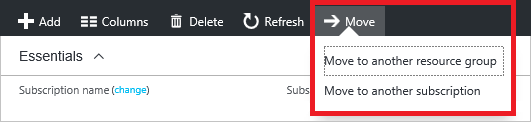

# Move resources to a new resource group or subscription

This article shows you how to move Azure resources to either another Azure subscription or another resource group under the same subscription. You can use the Azure portal, Azure PowerShell, Azure CLI, or the REST API to move resources.

Both the source group and the target group are locked during the move operation. Write and delete operations are blocked on the resource groups until the move completes. This lock means you can't add, update, or delete resources in the resource groups, but it doesn't mean the resources are frozen. For example, if you move a SQL Server and its database to a new resource group, an application that uses the database experiences no downtime. It can still read and write to the database.

Moving a resource only moves it to a new resource group or subscription. It doesn't change the location of the resource.

## Checklist before moving resources

There are some important steps to do before moving a resource. By verifying these conditions, you can avoid errors.

1. The resources you want to move must support the move operation. For a list of which resources support move, see [Move operation support for resources](move-support-resources.md).

1. Some services have specific limitations or requirements when moving resources. If you've moving any of the following services, check that guidance before moving.

   * [App Services move guidance](./move-limitations/app-service-move-limitations.md)
   * [Azure DevOps Services move guidance](/azure/devops/organizations/billing/change-azure-subscription?toc=/azure/azure-resource-manager/toc.json)
   * [Classic deployment model move guidance](./move-limitations/classic-model-move-limitations.md) - Classic Compute, Classic Storage, Classic Virtual Networks, and Cloud Services
   * [Recovery Services move guidance](../backup/backup-azure-move-recovery-services-vault.md?toc=/azure/azure-resource-manager/toc.json)
   * [Virtual Machines move guidance](./move-limitations/virtual-machines-move-limitations.md)
   * [Virtual Networks move guidance](./move-limitations/virtual-network-move-limitations.md)

1. The source and destination subscriptions must be active. If you have trouble enabling an account that has been disabled, [create an Azure support request](../azure-supportability/how-to-create-azure-support-request.md). Select **Subscription Management** for the issue type.

1. The source and destination subscriptions must exist within the same [Azure Active Directory tenant](../active-directory/develop/quickstart-create-new-tenant.md). To check that both subscriptions have the same tenant ID, use Azure PowerShell or Azure CLI.

   For Azure PowerShell, use:

   ```azurepowershell-interactive
   (Get-AzSubscription -SubscriptionName <your-source-subscription>).TenantId
   (Get-AzSubscription -SubscriptionName <your-destination-subscription>).TenantId
   ```

   For Azure CLI, use:

   ```azurecli-interactive
   az account show --subscription <your-source-subscription> --query tenantId
   az account show --subscription <your-destination-subscription> --query tenantId
   ```

   If the tenant IDs for the source and destination subscriptions aren't the same, use the following methods to reconcile the tenant IDs:

   * [Transfer ownership of an Azure subscription to another account](../billing/billing-subscription-transfer.md)
   * [How to associate or add an Azure subscription to Azure Active Directory](../active-directory/fundamentals/active-directory-how-subscriptions-associated-directory.md)

1. The destination subscription must be registered for the resource provider of the resource being moved. If not, you receive an error stating that the **subscription is not registered for a resource type**. You might see this error when moving a resource to a new subscription, but that subscription has never been used with that resource type.

   For PowerShell, use the following commands to get the registration status:

   ```azurepowershell-interactive
   Set-AzContext -Subscription <destination-subscription-name-or-id>
   Get-AzResourceProvider -ListAvailable | Select-Object ProviderNamespace, RegistrationState
   ```

   To register a resource provider, use:

   ```azurepowershell-interactive
   Register-AzResourceProvider -ProviderNamespace Microsoft.Batch
   ```

   For Azure CLI, use the following commands to get the registration status:

   ```azurecli-interactive
   az account set -s <destination-subscription-name-or-id>
   az provider list --query "[].{Provider:namespace, Status:registrationState}" --out table
   ```

   To register a resource provider, use:

   ```azurecli-interactive
   az provider register --namespace Microsoft.Batch
   ```

1. The account moving the resources must have at least the following permissions:

   * **Microsoft.Resources/subscriptions/resourceGroups/moveResources/action** on the source resource group.
   * **Microsoft.Resources/subscriptions/resourceGroups/write** on the destination resource group.

1. Before moving the resources, check the subscription quotas for the subscription you're moving the resources to. If moving the resources means the subscription will exceed its limits, you need to review whether you can request an increase in the quota. For a list of limits and how to request an increase, see [Azure subscription and service limits, quotas, and constraints](../azure-subscription-service-limits.md).

## Validate move

The [validate move operation](/rest/api/resources/resources/validatemoveresources) lets you test your move scenario without actually moving the resources. Use this operation to check if the move will succeed. Validation is automatically called when you send a move request. Use this operation only when you need to predetermine the results. To run this operation, you need the:

* name of the source resource group
* resource ID of the target resource group
* resource ID of each resource to move
* the [access token](/rest/api/azure/#acquire-an-access-token) for your account

Send the following request:

```HTTP
POST https://management.azure.com/subscriptions/<subscription-id>/resourceGroups/<source-group>/validateMoveResources?api-version=2019-05-10
Authorization: Bearer <access-token>
Content-type: application/json
```

With a request body:

```json
{
 "resources": ["<resource-id-1>", "<resource-id-2>"],
 "targetResourceGroup": "/subscriptions/<subscription-id>/resourceGroups/<target-group>"
}
```

If the request is formatted correctly, the operation returns:

```HTTP
Response Code: 202
cache-control: no-cache
pragma: no-cache
expires: -1
location: https://management.azure.com/subscriptions/<subscription-id>/operationresults/<operation-id>?api-version=2018-02-01
retry-after: 15
...
```

The 202 status code indicates the validation request was accepted, but it hasn't yet determined if the move operation will succeed. The `location` value contains a URL that you use to check the status of the long-running operation.  

To check the status, send the following request:

```HTTP
GET <location-url>
Authorization: Bearer <access-token>
```

While the operation is still running, you continue to receive the 202 status code. Wait the number of seconds indicated in the `retry-after` value before trying again. If the move operation validates successfully, you receive the 204 status code. If the move validation fails, you receive an error message, such as:

```json
{"error":{"code":"ResourceMoveProviderValidationFailed","message":"<message>"...}}
```

## Use the portal

To move resources, select the resource group with those resources, and then select the **Move** button.



Select whether you're moving the resources to a new resource group or a new subscription.

Select the resources to move and the destination resource group. Acknowledge that you need to update scripts for these resources and select **OK**. If you selected the edit subscription icon in the previous step, you must also select the destination subscription.


In **Notifications**, you see that the move operation is running.


When it has completed, you're notified of the result.


If you get an error, see [Troubleshoot moving Azure resources to new resource group or subscription](troubleshoot-move.md).

## Use Azure PowerShell

To move existing resources to another resource group or subscription, use the [Move-AzResource](/powershell/module/az.resources/move-azresource) command. The following example shows how to move several resources to a new resource group.

```azurepowershell-interactive
$webapp = Get-AzResource -ResourceGroupName OldRG -ResourceName ExampleSite
$plan = Get-AzResource -ResourceGroupName OldRG -ResourceName ExamplePlan
Move-AzResource -DestinationResourceGroupName NewRG -ResourceId $webapp.ResourceId, $plan.ResourceId
```

To move to a new subscription, include a value for the `DestinationSubscriptionId` parameter.

If you get an error, see [Troubleshoot moving Azure resources to new resource group or subscription](troubleshoot-move.md).

## Use Azure CLI

To move existing resources to another resource group or subscription, use the [az resource move](/cli/azure/resource?view=azure-cli-latest#az-resource-move) command. Provide the resource IDs of the resources to move. The following example shows how to move several resources to a new resource group. In the `--ids` parameter, provide a space-separated list of the resource IDs to move.

```azurecli
webapp=$(az resource show -g OldRG -n ExampleSite --resource-type "Microsoft.Web/sites" --query id --output tsv)
plan=$(az resource show -g OldRG -n ExamplePlan --resource-type "Microsoft.Web/serverfarms" --query id --output tsv)
az resource move --destination-group newgroup --ids $webapp $plan
```

To move to a new subscription, provide the `--destination-subscription-id` parameter.

If you get an error, see [Troubleshoot moving Azure resources to new resource group or subscription](troubleshoot-move.md).

## Use REST API

To move existing resources to another resource group or subscription, use the [Move resources](/rest/api/resources/Resources/MoveResources) operation.

```HTTP
POST https://management.azure.com/subscriptions/{source-subscription-id}/resourcegroups/{source-resource-group-name}/moveResources?api-version={api-version}
```

In the request body, you specify the target resource group and the resources to move.

```json
{
 "resources": ["<resource-id-1>", "<resource-id-2>"],
 "targetResourceGroup": "/subscriptions/<subscription-id>/resourceGroups/<target-group>"
}
```

If you get an error, see [Troubleshoot moving Azure resources to new resource group or subscription](troubleshoot-move.md).

## Next steps

For a list of which resources support move, see [Move operation support for resources](move-support-resources.md).
