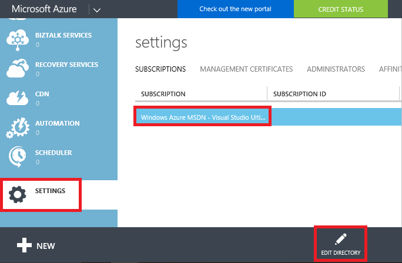

# Move resources to new resource group or subscription
This topic shows you how to move resources to either a new subscription or a new resource group in the same subscription. You can use the portal, PowerShell, Azure CLI, or the REST API to move resource. The move operations in this topic are available to you without any assistance from Azure support.

When moving resources, both the source group and the target group are locked during the operation. Write and delete operations are blocked on the resource groups until the move completes. This lock means you cannot add, update, or delete resources in the resource groups, but it does not mean the resources are frozen. For example, if you move a SQL Server and its database to a new resource group, an application that uses the database experiences no downtime. It can still read and write to the database.

You cannot change the location of the resource. Moving a resource only moves it to a new resource group. The new resource group may have a different location, but that does not change the location of the resource.

> [!NOTE]
> This article describes how to move resources within an existing Azure account offering. If you actually want to change your Azure account offering (such as upgrading from pay-as-you-go to pre-pay) while continuing to work with your existing resources, see [Switch your Azure subscription to another offer](../billing/billing-how-to-switch-azure-offer.md).
>
>

## Checklist before moving resources
There are some important steps to perform before moving a resource. By verifying these conditions, you can avoid errors.

1. The source and destination subscriptions must exist within the same [Azure Active Directory tenant](../active-directory/active-directory-howto-tenant.md). To check that both subscriptions have the same tenant ID, use Azure PowerShell or Azure CLI.

  For Azure PowerShell, use:

  ```powershell
  (Get-AzureRmSubscription -SubscriptionName "Example Subscription").TenantId
  ```

  For Azure CLI 2.0, use:

  ```azurecli
  az account show --subscription "Example Subscription" --query tenantId
  ```

  If the tenant IDs for the source and destination subscriptions are not the same, you can attempt to change the directory for the subscription. However, this option is only available to Service Administrators who are signed in with a Microsoft account (not an organizational account). To attempt changing the directory, log in to the [classic portal](https://manage.windowsazure.com/), and select **Settings**, and select the subscription. If the **Edit Directory** icon is available, select it to change the associated Azure Active Directory.

  

  If that icon is not available, you must contact support to move the resources to a new tenant.

2. The service must enable the ability to move resources. This topic lists which services enable moving resources and which services do not enable moving resources.
3. The destination subscription must be registered for the resource provider of the resource being moved. If not, you receive an error stating that the **subscription is not registered for a resource type**. You might encounter this problem when moving a resource to a new subscription, but that subscription has never been used
   with that resource type. To learn how to check the registration status and register resource providers, see [Resource providers and types](resource-manager-supported-services.md).

## When to call support
You can move most resources through the self-service operations shown in this topic. Use the self-service operations to:

* Move Resource Manager resources.
* Move classic resources according to the [classic deployment limitations](#classic-deployment-limitations).

Call support when you need to:

* Move your resources to a new Azure account (and Azure Active Directory tenant).
* Move classic resources but are having trouble with the limitations.

## Services that enable move
For now, the services that enable moving to both a new resource group and subscription are:

* API Management
* App Service apps (web apps) - see [App Service limitations](#app-service-limitations)
* Application Insights
* Automation
* Batch
* Bing Maps
* CDN
* Cloud Services - see [Classic deployment limitations](#classic-deployment-limitations)
* Cognitive Services
* Content Moderator
* Data Catalog
* Data Factory
* Data Lake Analytics
* Data Lake Store
* DNS
* Azure Cosmos DB
* Event Hubs
* HDInsight clusters - see [HDInsight limitations](#hdinsight-limitations)
* IoT Hubs
* Key Vault
* Load Balancers
* Logic Apps
* Machine Learning
* Media Services
* Mobile Engagement
* Notification Hubs
* Operational Insights
* Operations Management
* Power BI
* Redis Cache
* Scheduler
* Search
* Server Management
* Service Bus
* Service Fabric
* Storage
* Storage (classic) - see [Classic deployment limitations](#classic-deployment-limitations)
* Stream Analytics
* SQL Database server - The database and server must reside in the same resource group. When you move a SQL server, all its databases are also moved.
* Traffic Manager
* Virtual Machines - Does not support move to a new subscription when its certificates are stored in a Key Vault
* Virtual Machines (classic) - see [Classic deployment limitations](#classic-deployment-limitations)
* Virtual Machine Scale Sets
* Virtual Networks - Currently, a peered Virtual Network cannot be moved until VNet peering has been disabled. Once disabled, the Virtual Network can be moved successfully and the VNet peering can be enabled. In addition,
a Virtual Network cannot be moved to a different subscription if the Virtual Network contains any subnet with resource navigation links. For example, a Virtual Network subnet has a resource navigation link when a Microsoft.Cache
redis resource is deployed into this subnet.
* VPN Gateway


## Services that do not enable move
The services that currently do not enable moving a resource are:

* AD Hybrid Health Service
* Application Gateway
* Availability sets with Virtual Machines with Managed Disks
* BizTalk Services
* Container Service
* Express Route
* DevTest Labs - Move to new resource group in same subscription is enabled, but cross subscription move is not enabled.
* Dynamics LCS
* Images created from Managed Disks
* Managed Disks
* Managed Applications
* Recovery Services vault - also do not move the Compute, Network, and Storage resources associated with the Recovery Services vault, see [Recovery Services limitations](#recovery-services-limitations).
* Security
* Snapshots created from Managed Disks
* StorSimple Device Manager
* Virtual Machines with certificate stored in Key Vault
* Virtual Machines with Managed Disks
* Virtual Networks (classic) - see [Classic deployment limitations](#classic-deployment-limitations)
* Virtual Machines created from Marketplace resources - cannot be moved across subscriptions. Resource needs to be deprovisioned in the current subscription and deployed again in the new subscription

## App Service limitations
When working with App Service apps, you cannot move only an App Service plan. To move App Service apps, your options are:

* Move the App Service plan and all other App Service resources in that resource group to a new resource group that does not already have App Service resources. This requirement means you must move even the App Service resources that are not associated with the App Service plan.
* Move the apps to a different resource group, but keep all App Service plans in the original resource group.

App Service plan do not need to reside in the same resource group as the app for the app to function correctly.

For example, if your resource group contains:

* **web-a** which is associated with **plan-a**
* **web-b** which is associated with **plan-b**

Your options are:

* Move **web-a**, **plan-a**, **web-b**, and **plan-b**
* Move **web-a** and **web-b**
* Move **web-a**
* Move **web-b**

All other combinations involve leaving behind a resource type that can't be left behind when moving an App Service plan (any type of App Service resource).

If your web app resides in a different resource group than its App Service plan but you want to move both to a new resource group, you must perform the move in two steps. For example:

* **web-a** resides in **web-group**
* **plan-a** resides in **plan-group**
* You want **web-a** and **plan-a** to reside in **combined-group**

To accomplish this move, perform two separate move operations in the following sequence:

1. Move the **web-a** to **plan-group**
2. Move **web-a** and **plan-a** to **combined-group**.

You can move an App Service Certificate to a new resource group or subscription without any issues. However, if your web app includes an SSL certificate that you purchased externally and uploaded to the app, you must delete the certificate before moving the web app. For example, you can perform the following steps:

1. Delete the uploaded certificate from the web app
2. Move the web app
3. Upload the certificate to the web app

## Recovery Services limitations
Move is not enabled for Storage, Network, or Compute resources used to set up disaster recovery with Azure Site Recovery.

For example, suppose you have set up replication of your on-premises machines to a storage account (Storage1) and want the protected machine to come up after failover to Azure as a virtual machine (VM1) attached to a virtual network (Network1). You cannot move any of these Azure resources - Storage1, VM1, and Network1 - across resource groups within the same subscription or across subscriptions.

## HDInsight limitations

You can move HDInsight clusters to a new subscription or resource group. However, you cannot move across subscriptions the networking resources linked to the HDInsight cluster (such as the virtual network, NIC, or load balancer). In addition, you cannot move to a new resource group a NIC that is attached to a virtual machine for the cluster.

When moving an HDInsight cluster to a new subscription, first move other resources (like the storage account). Then, move the HDInsight cluster by itself.

## Classic deployment limitations
The options for moving resources deployed through the classic model differ based on whether you are moving the resources within a subscription or to a new subscription.

### Same subscription
When moving resources from one resource group to another resource group within the same subscription, the following restrictions apply:

* Virtual networks (classic) cannot be moved.
* Virtual machines (classic) must be moved with the cloud service.
* Cloud service can only be moved when the move includes all its virtual machines.
* Only one cloud service can be moved at a time.
* Only one storage account (classic) can be moved at a time.
* Storage account (classic) cannot be moved in the same operation with a virtual machine or a cloud service.

To move classic resources to a new resource group within the same subscription, use the standard move operations through the [portal](#use-portal), [Azure PowerShell](#use-powershell), [Azure CLI](#use-azure-cli), or [REST API](#use-rest-api). You use the same operations as you use for moving Resource Manager resources.

### New subscription
When moving resources to a new subscription, the following restrictions apply:

* All classic resources in the subscription must be moved in the same operation.
* The target subscription must not contain any other classic resources.
* The move can only be requested through a separate REST API for classic moves. The standard Resource Manager move commands do not work when moving classic resources to a new subscription.

To move classic resources to a new subscription, use the REST operations that are specific to classic resources. To use REST, perform the following steps:

1. Check if the source subscription can participate in a cross-subscription move. Use the following operation:

  ```HTTP   
  POST https://management.azure.com/subscriptions/{sourceSubscriptionId}/providers/Microsoft.ClassicCompute/validateSubscriptionMoveAvailability?api-version=2016-04-01
  ```

     In the request body, include:

  ```json
  {
    "role": "source"
  }
  ```

     The response for the validation operation is in the following format:

  ```json
  {
    "status": "{status}",
    "reasons": [
      "reason1",
      "reason2"
    ]
  }
  ```

2. Check if the destination subscription can participate in a cross-subscription move. Use the following operation:

  ```HTTP
  POST https://management.azure.com/subscriptions/{destinationSubscriptionId}/providers/Microsoft.ClassicCompute/validateSubscriptionMoveAvailability?api-version=2016-04-01
  ```

     In the request body, include:

  ```json
  {
    "role": "target"
  }
  ```

     The response is in the same format as the source subscription validation.
3. If both subscriptions pass validation, move all classic resources from one subscription to another subscription with the following operation:

  ```HTTP
  POST https://management.azure.com/subscriptions/{subscription-id}/providers/Microsoft.ClassicCompute/moveSubscriptionResources?api-version=2016-04-01
  ```

    In the request body, include:

  ```json
  {
    "target": "/subscriptions/{target-subscription-id}"
  }
  ```

The operation may run for several minutes.

## Use portal
To move resources, select the resource group containing those resources, and then select the **Move** button.


Select whether you are moving the resources to a new resource group or a new subscription.

Select the resources to move and the destination resource group. Acknowledge that you need to update scripts for these resources and select **OK**. If you selected the edit subscription icon in the previous step, you must also select the destination subscription.


In **Notifications**, you see that the move operation is running.


When it has completed, you are notified of the result.


## Use PowerShell
To move existing resources to another resource group or subscription, use the `Move-AzureRmResource` command.

The first example shows how to move one resource to a new resource group.

```powershell
$resource = Get-AzureRmResource -ResourceName ExampleApp -ResourceGroupName OldRG
Move-AzureRmResource -DestinationResourceGroupName NewRG -ResourceId $resource.ResourceId
```

The second example shows how to move multiple resources to a new resource group.

```powershell
$webapp = Get-AzureRmResource -ResourceGroupName OldRG -ResourceName ExampleSite
$plan = Get-AzureRmResource -ResourceGroupName OldRG -ResourceName ExamplePlan
Move-AzureRmResource -DestinationResourceGroupName NewRG -ResourceId $webapp.ResourceId, $plan.ResourceId
```

To move to a new subscription, include a value for the `DestinationSubscriptionId` parameter.

You are asked to confirm that you want to move the specified resources.

```powershell
Confirm
Are you sure you want to move these resources to the resource group
'/subscriptions/{guid}/resourceGroups/newRG' the resources:

/subscriptions/{guid}/resourceGroups/destinationgroup/providers/Microsoft.Web/serverFarms/exampleplan
/subscriptions/{guid}/resourceGroups/destinationgroup/providers/Microsoft.Web/sites/examplesite
[Y] Yes  [N] No  [S] Suspend  [?] Help (default is "Y"): y
```

## Use Azure CLI 2.0
To move existing resources to another resource group or subscription, use the `az resource move` command. Provide the resource IDs of the resources to move. You can get resource IDs with the following command:

```azurecli
az resource show -g sourceGroup -n storagedemo --resource-type "Microsoft.Storage/storageAccounts" --query id
```

The following example shows how to move a storage account to a new resource group. In the `--ids` parameter, provide a space-separated list of the resource IDs to move.

```azurecli
az resource move --destination-group newgroup --ids "/subscriptions/{guid}/resourceGroups/sourceGroup/providers/Microsoft.Storage/storageAccounts/storagedemo"
```

To move to a new subscription, provide the `--destination-subscription-id` parameter.

## Use Azure CLI 1.0
To move existing resources to another resource group or subscription, use the `azure resource move` command. Provide the resource IDs of the resources to move. You can get resource IDs with the following command:

```azurecli
azure resource list -g sourceGroup --json
```

Which returns the following format:

```azurecli
[
  {
    "id": "/subscriptions/{guid}/resourceGroups/sourceGroup/providers/Microsoft.Storage/storageAccounts/storagedemo",
    "name": "storagedemo",
    "type": "Microsoft.Storage/storageAccounts",
    "location": "southcentralus",
    "tags": {},
    "kind": "Storage",
    "sku": {
      "name": "Standard_RAGRS",
      "tier": "Standard"
    }
  }
]
```

The following example shows how to move a storage account to a new resource group. In the `-i` parameter, provide a comma-separated list of the resource IDs to move.

```azurecli
azure resource move -i "/subscriptions/{guid}/resourceGroups/sourceGroup/providers/Microsoft.Storage/storageAccounts/storagedemo" -d "destinationGroup"
```

You are asked to confirm that you want to move the specified resource.

## Use REST API
To move existing resources to another resource group or subscription, run:

```HTTP
POST https://management.azure.com/subscriptions/{source-subscription-id}/resourcegroups/{source-resource-group-name}/moveResources?api-version={api-version}
```

In the request body, you specify the target resource group and the resources to move. For more information about the move REST operation, see [Move resources](https://msdn.microsoft.com/library/azure/mt218710.aspx).

## Next steps
* To learn about PowerShell cmdlets for managing your subscription, see [Using Azure PowerShell with Resource Manager](powershell-azure-resource-manager.md).
* To learn about Azure CLI commands for managing your subscription, see [Using the Azure CLI with Resource Manager](xplat-cli-azure-resource-manager.md).
* To learn about portal features for managing your subscription, see [Using the Azure portal to manage resources](resource-group-portal.md).
* To learn about applying a logical organization to your resources, see [Using tags to organize your resources](resource-group-using-tags.md).
