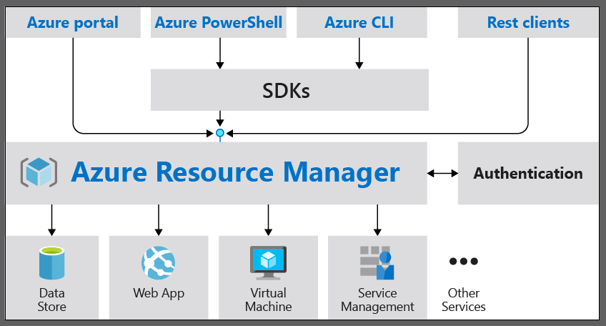
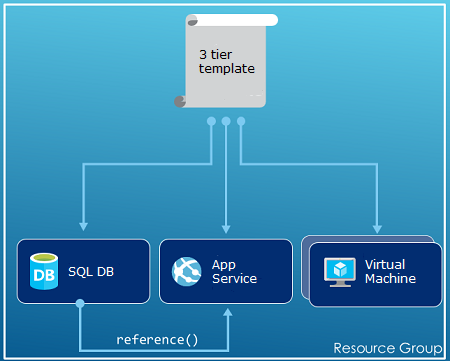
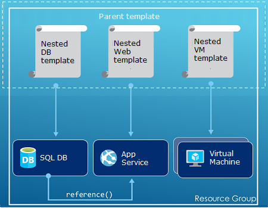
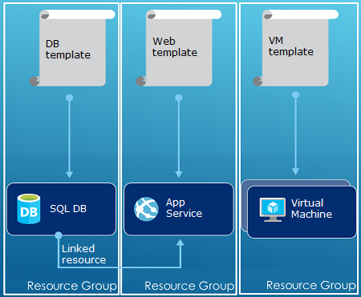

# Azure Resource Manager overview
The infrastructure for your application is typically made up of many components – maybe a virtual machine, storage account, and virtual network, or a web app, database, database server, and third-party services. You don't see these components as separate entities, instead you see them as related and interdependent parts of a single entity. You want to deploy, manage, and monitor them as a group. Azure Resource Manager enables you to work with the resources in your solution as a group. You can deploy, update, or delete all the resources for your solution in a single, coordinated operation. You use a template for deployment and that template can work for different environments such as testing, staging, and production. Resource Manager provides security, auditing, and tagging features to help you manage your resources after deployment. 

## Consistent management layer
Resource Manager provides a consistent management layer to perform tasks through Azure PowerShell, Azure CLI, Azure portal, REST API, and client SDKs. All capabilities that are available in the Azure portal are also available through Azure PowerShell, Azure CLI, the Azure REST APIs, and client SDKs. Functionality initially released through APIs will be represented in the portal within 180 days of initial release.

Choose the tools and APIs that work best for you - they have the same capability and provide consistent results.

The following image shows how all the tools interact with the same Azure Resource Manager API. The API passes requests to the Resource Manager service, which authenticates and authorizes the requests. Resource Manager then routes the requests to the appropriate resource providers.



## Terminology
If you're new to Azure Resource Manager, there are some terms you might not be familiar with.

* **resource** - A manageable item that is available through Azure. Some common resources are a virtual machine, storage account, web app, database, and virtual network, but there are many more.
* **resource group** - A container that holds related resources for an Azure solution. The resource group can include all the resources for the solution, or only those resources that you want to manage as a group. You decide how you want to allocate resources to resource groups based on what makes the most sense for your organization. See [Resource groups](#resource-groups).
* **resource provider** - A service that supplies the resources you can deploy and manage through Resource Manager. Each resource provider offers operations for working with the resources that are deployed. Some common resource providers are Microsoft.Compute, which supplies the virtual machine resource, Microsoft.Storage, which supplies the storage account resource, and Microsoft.Web, which supplies resources related to web apps. See [Resource providers](#resource-providers).
* **Resource Manager template** - A JavaScript Object Notation (JSON) file that defines one or more resources to deploy to a resource group. It also defines the dependencies between the deployed resources. The template can be used to deploy the resources consistently and repeatedly. See [Template deployment](#template-deployment).
* **declarative syntax** - Syntax that lets you state "Here is what I intend to create" without having to write the sequence of programming commands to create it. The Resource Manager template is an example of declarative syntax. In the file, you define the properties for the infrastructure to deploy to Azure. 

## The benefits of using Resource Manager
Resource Manager provides several benefits:

* You can deploy, manage, and monitor all the resources for your solution as a group, rather than handling these resources individually.
* You can repeatedly deploy your solution throughout the development lifecycle and have confidence your resources are deployed in a consistent state.
* You can manage your infrastructure through declarative templates rather than scripts.
* You can define the dependencies between resources so they're deployed in the correct order.
* You can apply access control to all services in your resource group because Role-Based Access Control (RBAC) is natively integrated into the management platform.
* You can apply tags to resources to logically organize all the resources in your subscription.
* You can clarify your organization's billing by viewing costs for a group of resources sharing the same tag.  

## Guidance
The following suggestions help you take full advantage of Resource Manager when working with your solutions.

1. Define and deploy your infrastructure through the declarative syntax in Resource Manager templates, rather than through imperative commands.
2. Define all deployment and configuration steps in the template. You should have no manual steps for setting up your solution.
3. Run imperative commands to manage your resources, such as to start or stop an app or machine.
4. Arrange resources with the same lifecycle in a resource group. Use tags for all other organizing of resources.

For guidance on how enterprises can use Resource Manager to effectively manage subscriptions, see [Azure enterprise scaffold - prescriptive subscription governance](/azure/architecture/cloud-adoption-guide/subscription-governance?toc=%2fazure%2fazure-resource-manager%2ftoc.json).

For recommendations on creating Resource Manager templates that you can use across global Azure, Azure sovereign clouds, and Azure Stack, see [Develop Azure Resource Manager templates for cloud consistency](templates-cloud-consistency.md).

## Resource groups
There are some important factors to consider when defining your resource group:

1. All the resources in your group should share the same lifecycle. You deploy, update, and delete them together. If one resource, such as a database server, needs to exist on a different deployment cycle it should be in another resource group.
2. Each resource can only exist in one resource group.
3. You can add or remove a resource to a resource group at any time.
4. You can move a resource from one resource group to another group. For more information, see [Move resources to new resource group or subscription](resource-group-move-resources.md).
5. A resource group can contain resources that reside in different regions.
6. A resource group can be used to scope access control for administrative actions.
7. A resource can interact with resources in other resource groups. This interaction is common when the two resources are related but don't share the same lifecycle (for example, web apps connecting to a database).

When creating a resource group, you need to provide a location for that resource group. You may be wondering, "Why does a resource group need a location? And, if the resources can have different locations than the resource group, why does the resource group location matter at all?" The resource group stores metadata about the resources. Therefore, when you specify a location for the resource group, you're specifying where that metadata is stored. For compliance reasons, you may need to ensure that your data is stored in a particular region.

## Resource providers
Each resource provider offers a set of resources and operations for working with an Azure service. For example, if you want to store keys and secrets, you work with the **Microsoft.KeyVault** resource provider. This resource provider offers a resource type called **vaults** for creating the key vault. 

The name of a resource type is in the format: **{resource-provider}/{resource-type}**. For example, the key vault type is **Microsoft.KeyVault/vaults**.

Before getting started with deploying your resources, you should gain an understanding of the available resource providers. Knowing the names of resource providers and resources helps you define resources you want to deploy to Azure. Also, you need to know the valid locations and API versions for each resource type. For more information, see [Resource providers and types](resource-manager-supported-services.md).

## Template deployment
With Resource Manager, you can create a template (in JSON format) that defines the infrastructure and configuration of your Azure solution. By using a template, you can repeatedly deploy your solution throughout its lifecycle and have confidence your resources are deployed in a consistent state. When you create a solution from the portal, the solution automatically includes a deployment template. You don't have to create your template from scratch because you can start with the template for your solution and customize it to meet your specific needs. For a sample, see [Quickstart: Create and deploy Azure Resource Manager templates by using the Azure portal](./resource-manager-quickstart-create-templates-use-the-portal.md). You can also retrieve a template for an existing resource group by either exporting the current state of the resource group, or viewing the template used for a particular deployment. Viewing the [exported template](resource-manager-export-template.md) is a helpful way to learn about the template syntax.

To learn about the format of the template and how you construct it, see [Quickstart: Create and deploy Azure Resource Manager templates by using the Azure portal](./resource-manager-quickstart-create-templates-use-the-portal.md). To view the JSON syntax for resources types, see [Define resources in Azure Resource Manager templates](/azure/templates/).

Resource Manager processes the template like any other request (see the image for [Consistent management layer](#consistent-management-layer)). It parses the template and converts its syntax into REST API operations for the appropriate resource providers. For example, when Resource Manager receives a template with the following resource definition:

```json
"resources": [
  {
    "apiVersion": "2016-01-01",
    "type": "Microsoft.Storage/storageAccounts",
    "name": "mystorageaccount",
    "location": "westus",
    "sku": {
      "name": "Standard_LRS"
    },
    "kind": "Storage",
    "properties": {
    }
  }
]
```

It converts the definition to the following REST API operation, which is sent to the Microsoft.Storage resource provider:

```HTTP
PUT
https://management.azure.com/subscriptions/{subscriptionId}/resourceGroups/{resourceGroupName}/providers/Microsoft.Storage/storageAccounts/mystorageaccount?api-version=2016-01-01
REQUEST BODY
{
  "location": "westus",
  "properties": {
  }
  "sku": {
    "name": "Standard_LRS"
  },   
  "kind": "Storage"
}
```

How you define templates and resource groups is entirely up to you and how you want to manage your solution. For example, you can deploy your three tier application through a single template to a single resource group.



But, you don't have to define your entire infrastructure in a single template. Often, it makes sense to divide your deployment requirements into a set of targeted, purpose-specific templates. You can easily reuse these templates for different solutions. To deploy a particular solution, you create a master template that links all the required templates. The following image shows how to deploy a three tier solution through a parent template that includes three nested templates.



If you envision your tiers having separate lifecycles, you can deploy your three tiers to separate resource groups. Notice the resources can still be linked to resources in other resource groups.



For information about nested templates, see [Using linked templates with Azure Resource Manager](resource-group-linked-templates.md).

Azure Resource Manager analyzes dependencies to ensure resources are created in the correct order. If one resource relies on a value from another resource (such as a virtual machine needing a storage account for disks), you set a dependency. For more information, see [Defining dependencies in Azure Resource Manager templates](resource-group-define-dependencies.md).

You can also use the template for updates to the infrastructure. For example, you can add a resource to your solution and add configuration rules for the resources that are already deployed. If the template specifies creating a resource but that resource already exists, Azure Resource Manager performs an update instead of creating a new asset. Azure Resource Manager updates the existing asset to the same state as it would be as new.  

Resource Manager provides extensions for scenarios when you need additional operations such as installing particular software that isn't included in the setup. If you're already using a configuration management service, like DSC, Chef or Puppet, you can continue working with that service by using extensions. For information about virtual machine extensions, see [About virtual machine extensions and features](../virtual-machines/windows/extensions-features.md?toc=%2fazure%2fvirtual-machines%2fwindows%2ftoc.json). 

Finally, the template becomes part of the source code for your app. You can check it in to your source code repository and update it as your app evolves. You can edit the template through Visual Studio.

After defining your template, you're ready to deploy the resources to Azure. For the commands to deploy the resources, see:

* [Deploy resources with Resource Manager templates and Azure PowerShell](resource-group-template-deploy.md)
* [Deploy resources with Resource Manager templates and Azure CLI](resource-group-template-deploy-cli.md)
* [Deploy resources with Resource Manager templates and Azure portal](resource-group-template-deploy-portal.md)
* [Deploy resources with Resource Manager templates and Resource Manager REST API](resource-group-template-deploy-rest.md)

## Safe deployment practices

When deploying a complex service to Azure, you might need to deploy your service to multiple regions, and check its health before proceeding to the next step. Use [Azure Deployment Manager](deployment-manager-overview.md) to coordinate a staged rollout of the service. By staging the rollout of your service, you can find potential problems before it has been deployed to all regions. If you don't need these precautions, the deployment operations in the preceding section are the better option.

Deployment Manager is currently in public preview.

## Tags
Resource Manager provides a tagging feature that enables you to categorize resources according to your requirements for managing or billing. Use tags when you have a complex collection of resource groups and resources, and need to visualize those assets in the way that makes the most sense to you. For example, you could tag resources that serve a similar role in your organization or belong to the same department. Without tags, users in your organization can create multiple resources that may be difficult to later identify and manage. For example, you may wish to delete all the resources for a particular project. If those resources aren't tagged for the project, you have to manually find them. Tagging can be an important way for you to reduce unnecessary costs in your subscription. 

Resources do not need to reside in the same resource group to share a tag. You can create your own tag taxonomy to ensure that all users in your organization use common tags rather than users inadvertently applying slightly different tags (such as "dept" instead of "department").

The following example shows a tag applied to a virtual machine.

```json
"resources": [    
  {
    "type": "Microsoft.Compute/virtualMachines",
    "apiVersion": "2015-06-15",
    "name": "SimpleWindowsVM",
    "location": "[resourceGroup().location]",
    "tags": {
        "costCenter": "Finance"
    },
    ...
  }
]
```

The [usage report](../billing/billing-understand-your-bill.md) for your subscription includes tag names and values, which enables you to break out costs by tags. For more information about tags, see [Using tags to organize your Azure resources](resource-group-using-tags.md).

## Access control
Resource Manager enables you to control who has access to specific actions for your organization. It natively integrates role-based access control (RBAC) into the management platform and applies that access control to all services in your resource group. 

There are two main concepts to understand when working with role-based access control:

* Role definitions - describe a set of permissions and can be used in many assignments.
* Role assignments - associate a definition with an identity (user or group) for a particular scope (subscription, resource group, or resource). The assignment is inherited by lower scopes.

You can add users to pre-defined platform and resource-specific roles. For example, you can take advantage of the pre-defined role called Reader that permits users to view resources but not change them. You add users in your organization that need this type of access to the Reader role and apply the role to the subscription, resource group, or resource.

Azure provides the following four platform roles:

1. Owner - can manage everything, including access
2. Contributor - can manage everything except access
3. Reader - can view everything, but can't make changes
4. User Access Administrator - can manage user access to Azure resources

Azure also provides several resource-specific roles. Some common ones are:

1. Virtual Machine Contributor - can manage virtual machines but not grant access to them, and can't manage the virtual network or storage account to which they're connected
2. Network Contributor - can manage all network resources, but not grant access to them
3. Storage Account Contributor - Can manage storage accounts, but not grant access to them
4. SQL Server Contributor - Can manage SQL servers and databases, but not their security-related policies
5. Website Contributor - Can manage websites, but not the web plans to which they're connected

For the full list of roles and permitted actions, see [RBAC: Built in Roles](../role-based-access-control/built-in-roles.md). For more information about role-based access control, see [Azure Role-based Access Control](../role-based-access-control/role-assignments-portal.md). 

In some cases, you want to run code or script that accesses resources, but you don't want to run it under a user’s credentials. Instead, you want to create an identity called a service principal for the application and assign the appropriate role for the service principal. Resource Manager enables you to create credentials for the application and programmatically authenticate the application. To learn about creating service principals, see one of following topics:

* [Use Azure PowerShell to create a service principal to access resources](resource-group-authenticate-service-principal.md)
* [Use Azure CLI to create a service principal to access resources](resource-group-authenticate-service-principal-cli.md)
* [Use portal to create Azure Active Directory application and service principal that can access resources](resource-group-create-service-principal-portal.md)

You can also explicitly lock critical resources to prevent users from deleting or modifying them. For more information, see [Lock resources with Azure Resource Manager](resource-group-lock-resources.md).

## Customized policies
Resource Manager enables you to create customized policies for managing your resources. The types of policies you create can include diverse scenarios. You can enforce a naming convention on resources, limit which types and instances of resources can be deployed, or limit which regions can host a type of resource. You can require a tag value on resources to organize billing by departments. You create policies to help reduce costs and maintain consistency in your subscription. 

There are many more types of policies you can create. For more information, see [What is Azure Policy?](../azure-policy/azure-policy-introduction.md).

## SDKs
Azure SDKs are available for multiple languages and platforms. Each of these language implementations is available through its ecosystem package manager and GitHub.

Here are the Open Source SDK repositories.

* [Azure SDK for .NET](https://github.com/Azure/azure-sdk-for-net)
* [Azure Management Libraries for Java](https://github.com/Azure/azure-sdk-for-java)
* [Azure SDK for Node.js](https://github.com/Azure/azure-sdk-for-node)
* [Azure SDK for PHP](https://github.com/Azure/azure-sdk-for-php)
* [Azure SDK for Python](https://github.com/Azure/azure-sdk-for-python)
* [Azure SDK for Ruby](https://github.com/Azure/azure-sdk-for-ruby)

For information about using these languages with your resources, see:

* [Azure for .NET developers](/dotnet/azure/?view=azure-dotnet)
* [Azure for Java developers](/java/azure/)
* [Azure for Node.js developers](/nodejs/azure/)
* [Azure for Python developers](/python/azure/)

> [!NOTE]
> If the SDK doesn't provide the required functionality,
> you can also call to the [Azure REST API](https://docs.microsoft.com/rest/api/resources/) directly.


## Next steps

In this article, you learned how to use Azure Resource Manager for deployment, management, and access control of resources on Azure. Proceed to the next article to learn how to create your first Azure Resource Manager template.

> [!div class="nextstepaction"]
> [Quickstart: Create and deploy Azure Resource Manager templates by using the Azure portal](./resource-manager-quickstart-create-templates-use-the-portal.md)
