# Deploy resources with Resource Manager templates and Azure portal

This topic shows how to use the [Azure portal](https://portal.azure.com) with [Azure Resource Manager](resource-group-overview.md) to deploy your Azure resources. To learn about managing your resources, see [Manage Azure resources through portal](resource-group-portal.md).

## Create resource group

1. To create an empty resource group, select **Resource groups**.

   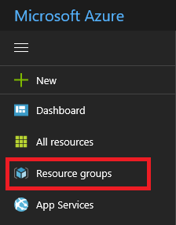

1. Under Resource groups, select **Add**.

   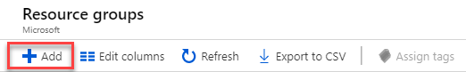

1. Give it a name and location, and, if necessary, select a subscription. You need to provide a location for the resource group because the resource group stores metadata about the resources. For compliance reasons, you may want to specify where that metadata is stored. In general, we recommend that you specify a location where most of your resources will reside. Using the same location can simplify your template.

   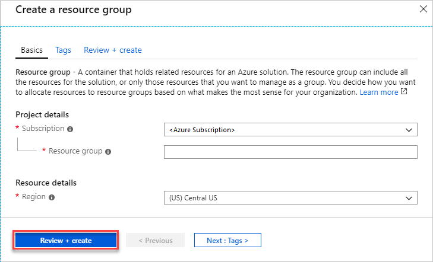

   When you have finished setting the properties, select **Create**.

1. To see your new resource group, select **Refresh**.

   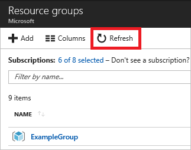

## Deploy resources from Marketplace

After you create a resource group, you can deploy resources to it from the Marketplace. The Marketplace provides pre-defined solutions for common scenarios.

1. To start a deployment, select **New**.

   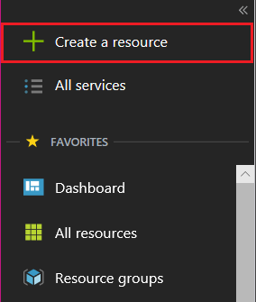

1. Find the type of resource you would like to deploy.

   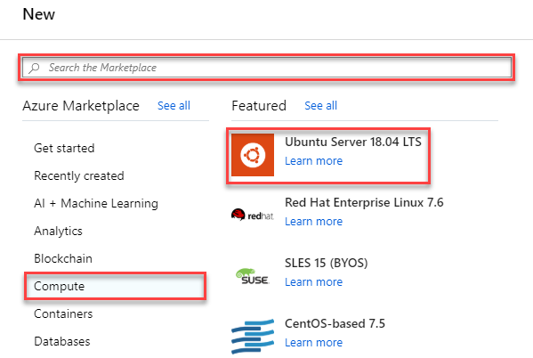

1. If you do not see the particular solution you would like to deploy, you can search the Marketplace for it. For example, to find a Wordpress solution, start typing **Wordpress** and select the option you want.

   

1. Depending on the type of selected resource, you have a collection of relevant properties to set before deployment. For all types, you must select a destination resource group. The following image shows how to create a web app and deploy it to the resource group you created.

   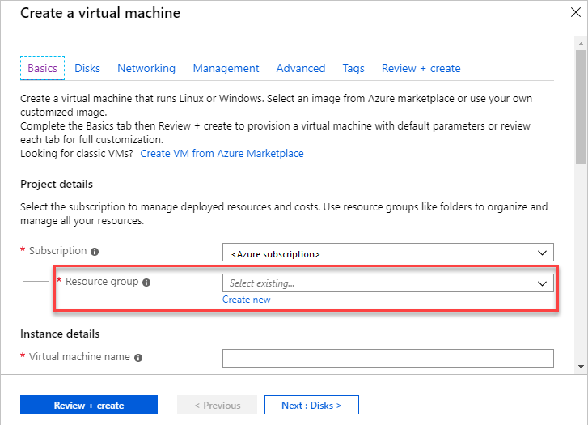

   Alternatively, you can decide to create a resource group when deploying your resources. Select **Create new** and give the resource group a name.

   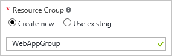

1. Your deployment begins. The deployment could take a few minutes. When the deployment has finished, you see a notification.

   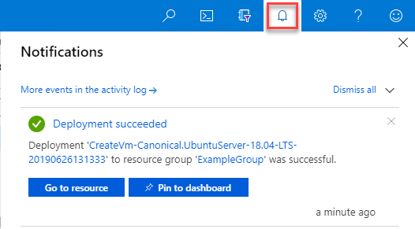

1. After deploying your resources, you can add more resources to the resource group by selecting **Add**.

   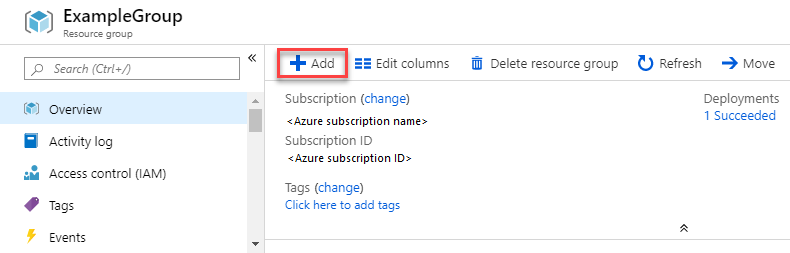

## Deploy resources from custom template

If you want to execute a deployment but not use any of the templates in the Marketplace, you can create a customized template that defines the infrastructure for your solution. To learn about creating templates, see [Understand the structure and syntax of Azure Resource Manager templates](resource-group-authoring-templates.md).

1. To deploy a customized template through the portal, select **New**, and search for **Template Deployment** until you can select it from the options.

   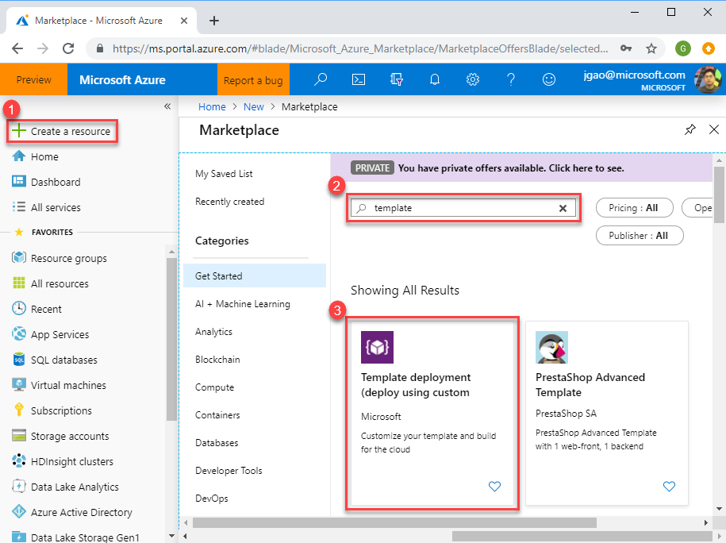

1. Select **Create**.

   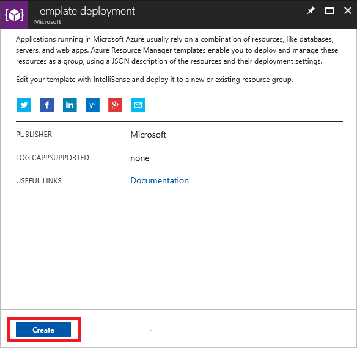

1. You see several options for creating a template. Select **Build your own template in the editor**.

   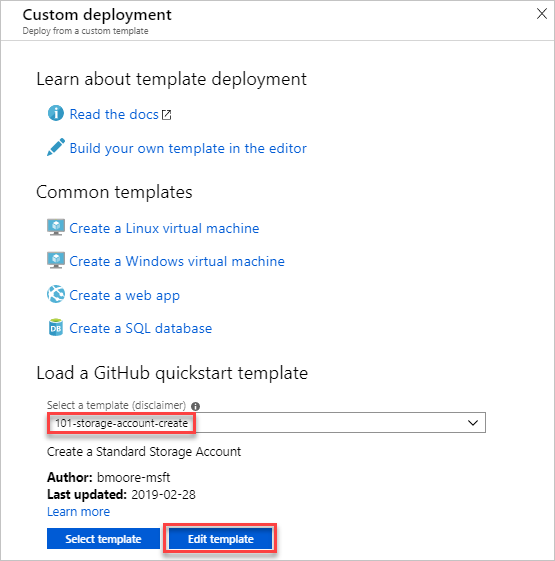

1. You have a blank template that is available for customizing.

   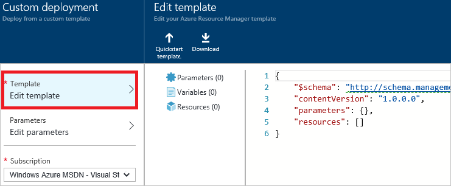

1. You can edit the JSON syntax manually, or select a pre-built template from the [Quickstart template gallery](https://azure.microsoft.com/en-us/resources/templates/). However, for this article, you use the **Add resource** option.

   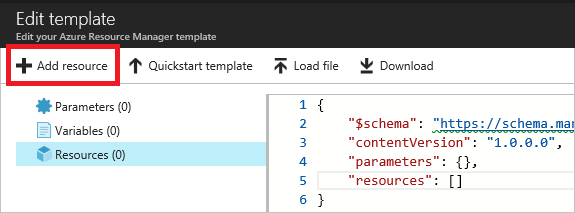

1. Select **Storage account** and provide a name. When finished providing values, select **OK**.

   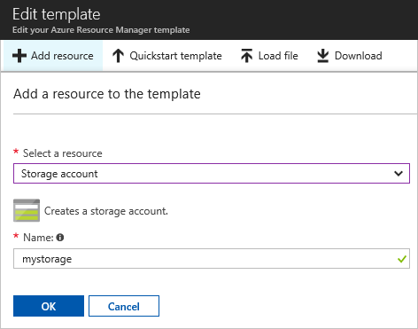

1. The editor automatically adds JSON for the resource type. Notice that it includes a parameter for defining the type of storage account. Select **Save**.

   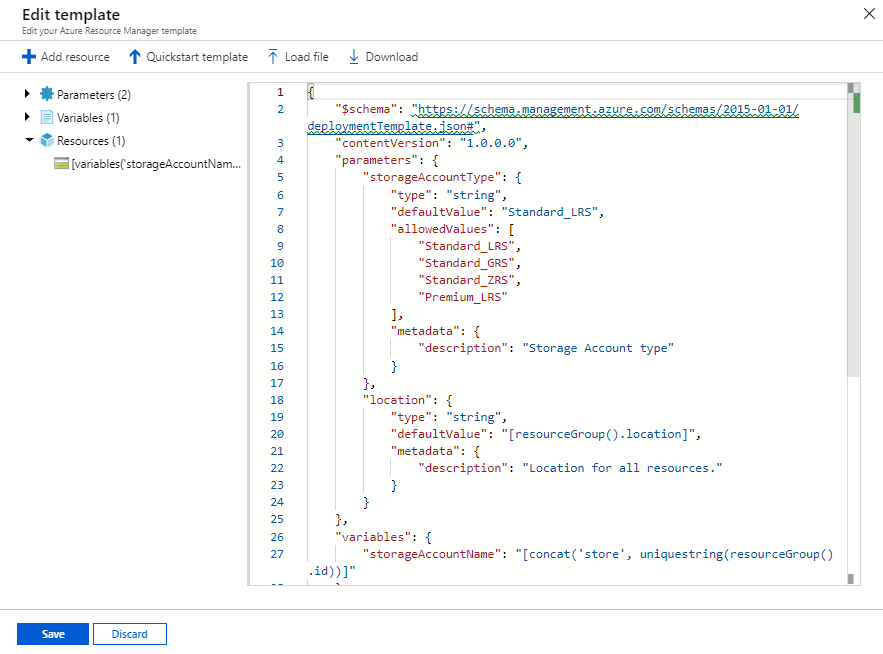

1. Now, you have the option to deploy the resources defined in the template. To deploy, agree to the terms and conditions, and select **Purchase**.

   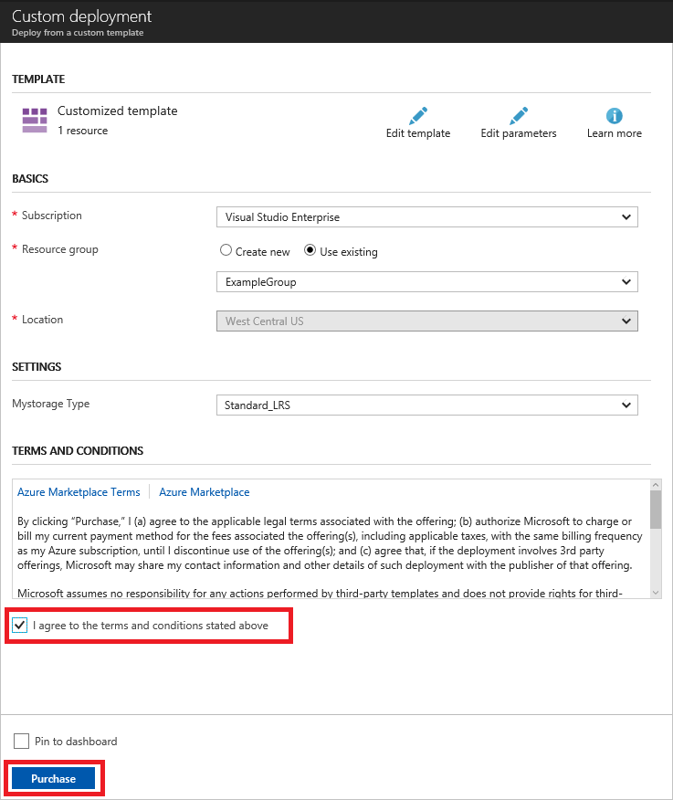

## Deploy resources from a template saved to your account

The portal enables you to save a template to your Azure account, and redeploy it later. For more information about working with these saved templates, [Get started with private templates on the Azure portal](../marketplace-consumer/mytemplates-getstarted.md).

1. To find your saved templates, select **More services**.

   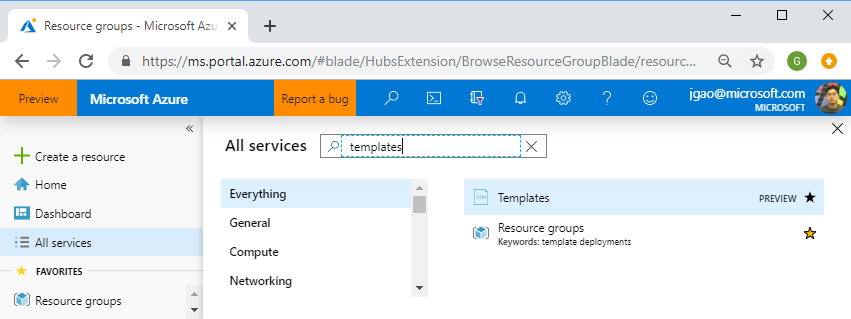

1. Search for **templates** and select that option.

   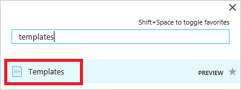

1. From the list of templates saved to your account, select the one you wish to work on.

   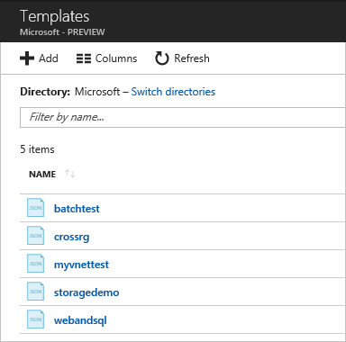

1. Select **Deploy** to redeploy this saved template.

   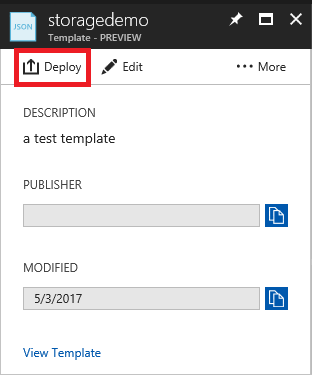

## Next steps
* To view audit logs, see [Audit operations with Resource Manager](resource-group-audit.md).
* To troubleshoot deployment errors, see [View deployment operations](resource-manager-deployment-operations.md).
* To retrieve a template from a deployment or resource group, see [Export Azure Resource Manager template from existing resources](resource-manager-export-template.md).
* For guidance on how enterprises can use Resource Manager to effectively manage subscriptions, see [Azure enterprise scaffold - prescriptive subscription governance](resource-manager-subscription-governance.md).
