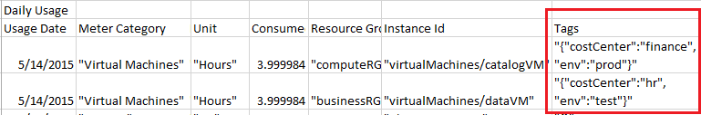

# Use tags to organize your Azure resources

[!INCLUDE [resource-manager-governance-tags](../../includes/resource-manager-governance-tags.md)]

To apply tags to resources, the user must have write access to that resource type. To apply tags to all resource types, use the [Contributor](../role-based-access-control/built-in-roles.md#contributor) role. To apply tags to only one resource type, use the contributor role for that resource. For example, to apply tags to virtual machines, use the [Virtual Machine Contributor](../role-based-access-control/built-in-roles.md#virtual-machine-contributor).

[!INCLUDE [Handle personal data](../../includes/gdpr-intro-sentence.md)]

## PowerShell

The examples in this article require version 6.0 or later of Azure PowerShell. If you do not have version 6.0 or later, [update your version](/powershell/azure/install-azurerm-ps).

To see the existing tags for a *resource group*, use:

```powershell
(Get-AzureRmResourceGroup -Name examplegroup).Tags
```

That script returns the following format:

```powershell
Name                           Value
----                           -----
Dept                           IT
Environment                    Test
```

To see the existing tags for a *resource that has a specified resource ID*, use:

```powershell
(Get-AzureRmResource -ResourceId /subscriptions/<subscription-id>/resourceGroups/<rg-name>/providers/Microsoft.Storage/storageAccounts/<storage-name>).Tags
```

Or, to see the existing tags for a *resource that has a specified name and resource group*, use:

```powershell
(Get-AzureRmResource -ResourceName examplevnet -ResourceGroupName examplegroup).Tags
```

To get *resource groups that have a specific tag*, use:

```powershell
(Get-AzureRmResourceGroup -Tag @{ Dept="Finance" }).ResourceGroupName
```

To get *resources that have a specific tag*, use:

```powershell
(Get-AzureRmResource -Tag @{ Dept="Finance"}).Name
```

To get *resources that have a specific tag name*, use:

```powershell
(Get-AzureRmResource -TagName Dept).Name
```

Every time you apply tags to a resource or a resource group, you overwrite the existing tags on that resource or resource group. Therefore, you must use a different approach based on whether the resource or resource group has existing tags.

To add tags to a *resource group without existing tags*, use:

```powershell
Set-AzureRmResourceGroup -Name examplegroup -Tag @{ Dept="IT"; Environment="Test" }
```

To add tags to a *resource group that has existing tags*, retrieve the existing tags, add the new tag, and reapply the tags:

```powershell
$tags = (Get-AzureRmResourceGroup -Name examplegroup).Tags
$tags.Add("Status", "Approved")
Set-AzureRmResourceGroup -Tag $tags -Name examplegroup
```

To add tags to a *resource without existing tags*, use:

```powershell
$r = Get-AzureRmResource -ResourceName examplevnet -ResourceGroupName examplegroup
Set-AzureRmResource -Tag @{ Dept="IT"; Environment="Test" } -ResourceId $r.ResourceId -Force
```

To add tags to a *resource that has existing tags*, use:

```powershell
$r = Get-AzureRmResource -ResourceName examplevnet -ResourceGroupName examplegroup
$r.Tags.Add("Status", "Approved") 
Set-AzureRmResource -Tag $r.Tags -ResourceId $r.ResourceId -Force
```

To apply all tags from a resource group to its resources, and *not retain existing tags on the resources*, use the following script:

```powershell
$groups = Get-AzureRmResourceGroup
foreach ($g in $groups)
{
    Get-AzureRmResource -ResourceGroupName $g.ResourceGroupName | ForEach-Object {Set-AzureRmResource -ResourceId $_.ResourceId -Tag $g.Tags -Force }
}
```

To apply all tags from a resource group to its resources, and *retain existing tags on resources that are not duplicates*, use the following script:

```powershell
$group = Get-AzureRmResourceGroup "examplegroup"
if ($group.Tags -ne $null) {
    $resources = Get-AzureRmResource -ResourceGroupName $group.ResourceGroupName
    foreach ($r in $resources)
    {
        $resourcetags = (Get-AzureRmResource -ResourceId $r.ResourceId).Tags
        if ($resourcetags)
        {
            foreach ($key in $group.Tags.Keys)
            {
                if (-not($resourcetags.ContainsKey($key)))
                {
                    $resourcetags.Add($key, $group.Tags[$key])
                }
            }
            Set-AzureRmResource -Tag $resourcetags -ResourceId $r.ResourceId -Force
        }
        else
        {
            Set-AzureRmResource -Tag $group.Tags -ResourceId $r.ResourceId -Force
        }
    }
}
```

To remove all tags, pass an empty hash table:

```powershell
Set-AzureRmResourceGroup -Tag @{} -Name examplegroup
```

## Azure CLI

To see the existing tags for a *resource group*, use:

```azurecli
az group show -n examplegroup --query tags
```

That script returns the following format:

```json
{
  "Dept"        : "IT",
  "Environment" : "Test"
}
```

Or, to see the existing tags for a *resource that has a specified name, type, and resource group*, use:

```azurecli
az resource show -n examplevnet -g examplegroup --resource-type "Microsoft.Network/virtualNetworks" --query tags
```

When looping through a collection of resources, you might want to show the resource by resource ID. A complete example is shown later in this article. To see the existing tags for a *resource that has a specified resource ID*, use:

```azurecli
az resource show --id <resource-id> --query tags
```

To get resource groups that have a specific tag, use `az group list`:

```azurecli
az group list --tag Dept=IT
```

To get all the resources that have a particular tag and value, use `az resource list`:

```azurecli
az resource list --tag Dept=Finance
```

Every time you apply tags to a resource or a resource group, you overwrite the existing tags on that resource or resource group. Therefore, you must use a different approach based on whether the resource or resource group has existing tags.

To add tags to a *resource group without existing tags*, use:

```azurecli
az group update -n examplegroup --set tags.Environment=Test tags.Dept=IT
```

To add tags to a *resource without existing tags*, use:

```azurecli
az resource tag --tags Dept=IT Environment=Test -g examplegroup -n examplevnet --resource-type "Microsoft.Network/virtualNetworks"
```

To add tags to a resource that already has tags, retrieve the existing tags, reformat that value, and reapply the existing and new tags: 

```azurecli
jsonrtag=$(az resource show -g examplegroup -n examplevnet --resource-type "Microsoft.Network/virtualNetworks" --query tags)
rt=$(echo $jsonrtag | tr -d '"{},' | sed 's/: /=/g')
az resource tag --tags $rt Project=Redesign -g examplegroup -n examplevnet --resource-type "Microsoft.Network/virtualNetworks"
```

To apply all tags from a resource group to its resources, and *not retain existing tags on the resources*, use the following script:

```azurecli
groups=$(az group list --query [].name --output tsv)
for rg in $groups
do
  jsontag=$(az group show -n $rg --query tags)
  t=$(echo $jsontag | tr -d '"{},' | sed 's/: /=/g')
  r=$(az resource list -g $rg --query [].id --output tsv)
  for resid in $r
  do
    az resource tag --tags $t --id $resid
  done
done
```

To apply all tags from a resource group to its resources, and *retain existing tags on resources*, use the following script:

```azurecli
groups=$(az group list --query [].name --output tsv)
for rg in $groups
do
  jsontag=$(az group show -n $rg --query tags)
  t=$(echo $jsontag | tr -d '"{},' | sed 's/: /=/g')
  r=$(az resource list -g $rg --query [].id --output tsv)
  for resid in $r
  do
    jsonrtag=$(az resource show --id $resid --query tags)
    rt=$(echo $jsonrtag | tr -d '"{},' | sed 's/: /=/g')
    az resource tag --tags $t$rt --id $resid
  done
done
```

## Templates

[!INCLUDE [resource-manager-tags-in-templates](../../includes/resource-manager-tags-in-templates.md)]

## Portal

[!INCLUDE [resource-manager-tag-resource](../../includes/resource-manager-tag-resources.md)]

## REST API

The Azure portal and PowerShell both use the [Resource Manager REST API](https://docs.microsoft.com/rest/api/resources/) behind the scenes. If you need to integrate tagging into another environment, you can get tags by using **GET** on the resource ID and update the set of tags by using a **PATCH** call.

## Tags and billing

You can use tags to group your billing data. For example, if you are running multiple VMs for different organizations, use the tags to group usage by cost center. You can also use tags to categorize costs by runtime environment, such as the billing usage for VMs running in the production environment.

You can retrieve information about tags through the [Azure Resource Usage and RateCard APIs](../billing/billing-usage-rate-card-overview.md) or the usage comma-separated values (CSV) file. You download the usage file from the [Azure account portal](https://account.windowsazure.com/) or [EA portal](https://ea.azure.com). For more information about programmatic access to billing information, see [Gain insights into your Microsoft Azure resource consumption](../billing/billing-usage-rate-card-overview.md). For REST API operations, see [Azure Billing REST API Reference](https://msdn.microsoft.com/library/azure/1ea5b323-54bb-423d-916f-190de96c6a3c).

When you download the usage CSV for services that support tags with billing, the tags appear in the **Tags** column. For more information, see [Understand your bill for Microsoft Azure](../billing/billing-understand-your-bill.md).



## Next steps

* You can apply restrictions and conventions across your subscription by using customized policies. A policy that you define might require that all resources have a value for a particular tag. For more information, see [What is Azure Policy?](../azure-policy/azure-policy-introduction.md)
* For an introduction to using Azure PowerShell when you're deploying resources, see [Using Azure PowerShell with Azure Resource Manager](powershell-azure-resource-manager.md).
* For an introduction to using the Azure CLI when you're deploying resources, see [Using the Azure CLI for Mac, Linux, and Windows with Azure Resource Manager](xplat-cli-azure-resource-manager.md).
* For an introduction to using the portal, see [Using the Azure portal to manage your Azure resources](resource-group-portal.md).  
* For guidance on how enterprises can use Resource Manager to effectively manage subscriptions, see [Azure enterprise scaffold - prescriptive subscription governance](/azure/architecture/cloud-adoption-guide/subscription-governance).
