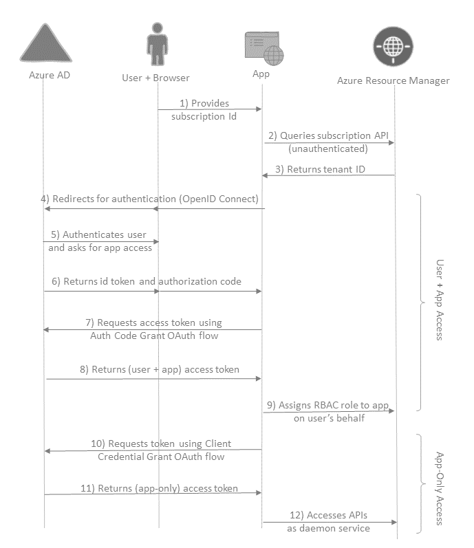
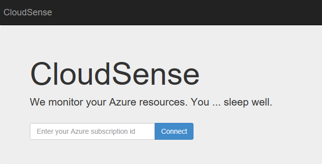
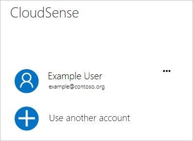
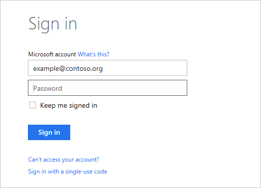
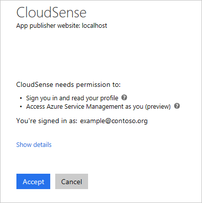
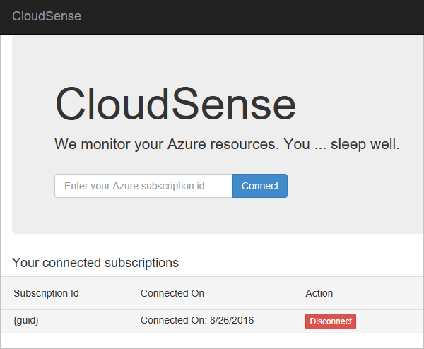

# Use Resource Manager authentication API to access subscriptions

If you're a software developer who needs to create an app that manages a customer's Azure resources, this article shows you how to authenticate with the Azure Resource Manager APIs and gain access to resources in other subscriptions.

Your app can access the Resource Manager APIs in couple of ways:

1. **User + app access**: for apps that access resources for a signed-in user. This approach works for apps, such as web apps and command-line tools, that deal with only "interactive management" of Azure resources.
2. **App-only access**: for apps that run daemon services and scheduled jobs. The app's identity is granted direct access to the resources. This approach works for apps that need long-term headless (unattended) access to Azure.

This article provides step-by-step instructions to create an app that employs both these authorization methods. It shows how to do each step with REST API or C#. The complete ASP.NET MVC application is available at [https://github.com/dushyantgill/VipSwapper/tree/master/CloudSense](https://github.com/dushyantgill/VipSwapper/tree/master/CloudSense).

## What the web app does

The web app:

1. Signs-in an Azure user.
2. Asks user to grant the web app access to Resource Manager.
3. Gets user + app access token for accessing Resource Manager.
4. Uses token (from step 3) to assign the app's service principal to a role in the subscription. This step gives the app long-term access to the subscription.
5. Gets app-only access token.
6. Uses token (from step 5) to manage resources in the subscription through Resource Manager.

Here's the flow of the web application.

As a user, you provide the subscription ID for the subscription you want to use:

Select the account to use for logging in.

Provide your credentials.

Grant the app access to your Azure subscriptions:

Manage your connected subscriptions:

## Register application
Before you start coding, register your web app with Azure Active Directory (AD). The app registration creates a central identity for your app in Azure AD. It holds basic information about your application like OAuth Client ID, Reply URLs, and credentials that your application uses to authenticate and access Azure Resource Manager APIs. The app registration also records the various delegated permissions that your application needs when accessing Microsoft APIs for the user.

To register your app, see [Quickstart: Register an application with the Microsoft identity platform](../active-directory/develop/quickstart-register-app.md). Give your app a name, and select **Accounts in any organizational directory** for the supported account types. For redirect URL, provide a domain associated with your Azure Active Directory.

To sign in as the AD application, you need the application ID and a secret. The application ID is displayed in the overview for the application. To create a secret and request API permissions, see [Quickstart: Configure a client application to access web APIs](../active-directory/develop/quickstart-configure-app-access-web-apis.md). Provide a new client secret. For API permissions, select **Azure Service Management**. Select **Delegated permissions** and **user_impersonation**.

### Optional configuration - certificate credential
Azure AD also supports certificate credentials for applications: you create a self-signed cert, keep the private key, and add
the public key to your Azure AD application registration. For authentication, your application sends a small payload to Azure AD
signed using your private key, and Azure AD validates the signature using the public key that you registered.

For information about creating an AD app with a certificate, see [Use Azure PowerShell to create a service principal to access resources](../active-directory/develop/howto-authenticate-service-principal-powershell.md#create-service-principal-with-certificate-from-certificate-authority) or [Use Azure CLI to create a service principal to access resources](resource-group-authenticate-service-principal-cli.md).

## Get tenant ID from subscription ID
To request a token that can be used to call Resource Manager, your application needs to know the tenant ID of the Azure AD tenant that hosts the Azure subscription. Most likely, your users know their subscription IDs, but they might not know their tenant IDs for Azure Active Directory. To get the user's tenant ID, ask the user for the subscription ID. Provide that subscription ID when sending a request about the subscription:

    https://management.azure.com/subscriptions/{subscription-id}?api-version=2015-01-01

The request fails because the user hasn't logged in yet, but you can retrieve the tenant ID from the response. In that exception, retrieve the tenant ID from the response header value for **WWW-Authenticate**. You see this implementation in the [GetDirectoryForSubscription](https://github.com/dushyantgill/VipSwapper/blob/master/CloudSense/CloudSense/AzureResourceManagerUtil.cs#L20) method.

## Get user + app access token
Your application redirects the user to Azure AD with an OAuth 2.0 Authorize Request - to authenticate the user's credentials and get back an authorization code. Your application uses the authorization code to get an access token for Resource Manager. The [ConnectSubscription](https://github.com/dushyantgill/VipSwapper/blob/master/CloudSense/CloudSense/Controllers/HomeController.cs#L42) method creates the authorization request.

This article shows the REST API requests to authenticate the user. You can also use helper libraries to authenticate in your code. For more information about these libraries, see [Azure Active Directory Authentication Libraries](../active-directory/active-directory-authentication-libraries.md). For guidance on integrating identity management in an application, see [Azure Active Directory developer's guide](../active-directory/develop/v1-overview.md).

### Auth request (OAuth 2.0)
Issue an Open ID Connect/OAuth2.0 Authorize Request to the Azure AD Authorize endpoint:

    https://login.microsoftonline.com/{tenant-id}/OAuth2/Authorize

The query string parameters that are available for this request are described in the [request an authorization code](../active-directory/develop/v1-protocols-oauth-code.md#request-an-authorization-code) article.

The following example shows how to request OAuth2.0 authorization:

    https://login.microsoftonline.com/{tenant-id}/OAuth2/Authorize?client_id=a0448380-c346-4f9f-b897-c18733de9394&response_mode=query&response_type=code&redirect_uri=http%3a%2f%2fwww.vipswapper.com%2fcloudsense%2fAccount%2fSignIn&resource=https%3a%2f%2fgraph.windows.net%2f&domain_hint=live.com

Azure AD authenticates the user, and, if necessary, asks the user to grant permission to the app. It returns the authorization code to the Reply URL of your application. Depending on the requested response_mode, Azure AD either sends back the data in query string or as post data.

    code=AAABAAAAiL****FDMZBUwZ8eCAA&session_state=2d16bbce-d5d1-443f-acdf-75f6b0ce8850

### Auth request (Open ID Connect)
If you not only wish to access Azure Resource Manager for the user, but also allow the user to sign in to your application using their Azure AD account, issue an Open ID Connect Authorize Request. With Open ID Connect, your application also receives an id_token from Azure AD that your app can use to sign in the user.

The query string parameters that are available for this request are described in the [Send the sign-in request](../active-directory/develop/v1-protocols-openid-connect-code.md#send-the-sign-in-request) article.

An example Open ID Connect request is:

     https://login.microsoftonline.com/{tenant-id}/OAuth2/Authorize?client_id=a0448380-c346-4f9f-b897-c18733de9394&response_mode=form_post&response_type=code+id_token&redirect_uri=http%3a%2f%2fwww.vipswapper.com%2fcloudsense%2fAccount%2fSignIn&resource=https%3a%2f%2fgraph.windows.net%2f&scope=openid+profile&nonce=63567Dc4MDAw&domain_hint=live.com&state=M_12tMyKaM8

Azure AD authenticates the user, and, if necessary, asks the user to grant permission to the app. It returns the authorization code to the Reply URL of your application. Depending on the requested response_mode, Azure AD either sends back the data in query string or as post data.

An example Open ID Connect response is:

    code=AAABAAAAiL*****I4rDWd7zXsH6WUjlkIEQxIAA&id_token=eyJ0eXAiOiJKV1Q*****T3GrzzSFxg&state=M_12tMyKaM8&session_state=2d16bbce-d5d1-443f-acdf-75f6b0ce8850

### Token request (OAuth2.0 Code Grant Flow)
Now that your application has received the authorization code from Azure AD, it's time to get the access token for Azure Resource Manager.  Post an OAuth2.0 Code Grant Token Request to the Azure AD Token endpoint:

    https://login.microsoftonline.com/{tenant-id}/OAuth2/Token

The query string parameters that are available for this request are described in the [use the authorization code](../active-directory/develop/v1-protocols-oauth-code.md#use-the-authorization-code-to-request-an-access-token) article.

The following example shows a request for code grant token with password credential:

    POST https://login.microsoftonline.com/7fe877e6-a150-4992-bbfe-f517e304dfa0/oauth2/token HTTP/1.1

    Content-Type: application/x-www-form-urlencoded
    Content-Length: 1012

    grant_type=authorization_code&code=AAABAAAAiL9Kn2Z*****L1nVMH3Z5ESiAA&redirect_uri=http%3A%2F%2Flocalhost%3A62080%2FAccount%2FSignIn&client_id=a0448380-c346-4f9f-b897-c18733de9394&client_secret=olna84E8*****goScOg%3D

When working with certificate credentials, create a JSON Web Token (JWT) and sign (RSA SHA256) using the private key of your application's certificate credential. Building this token is shown in the [client credential flow](../active-directory/develop/v1-oauth2-client-creds-grant-flow.md#second-case-access-token-request-with a-certificate).  For reference, see the [Active Directory Auth Library (.NET) code](https://github.com/AzureAD/azure-activedirectory-library-for-dotnet/blob/dev/src/ADAL.PCL.Desktop/CryptographyHelper.cs) to sign Client Assertion JWT tokens.

See the [Open ID Connect spec](https://openid.net/specs/openid-connect-core-1_0.html#ClientAuthentication) for details on client authentication.

The following example shows a request for code grant token with certificate credential:

    POST https://login.microsoftonline.com/7fe877e6-a150-4992-bbfe-f517e304dfa0/oauth2/token HTTP/1.1

    Content-Type: application/x-www-form-urlencoded
    Content-Length: 1012

    grant_type=authorization_code&code=AAABAAAAiL9Kn2Z*****L1nVMH3Z5ESiAA&redirect_uri=http%3A%2F%2Flocalhost%3A62080%2FAccount%2FSignIn&client_id=a0448380-c346-4f9f-b897-c18733de9394&client_assertion_type=urn%3Aietf%3Aparams%3Aoauth%3Aclient-assertion-type%3Ajwt-bearer&client_assertion=eyJhbG*****Y9cYo8nEjMyA

An example response for code grant token:

    HTTP/1.1 200 OK

    {"token_type":"Bearer","expires_in":"3599","expires_on":"1432039858","not_before":"1432035958","resource":"https://management.core.windows.net/","access_token":"eyJ0eXAiOiJKV1Q****M7Cw6JWtfY2lGc5A","refresh_token":"AAABAAAAiL9Kn2Z****55j-sjnyYgAA","scope":"user_impersonation","id_token":"eyJ0eXAiOiJKV*****-drP1J3P-HnHi9Rr46kGZnukEBH4dsg"}

#### Handle code grant token response
A successful token response contains the (user + app) access token for Azure Resource Manager. Your application uses this access token to access Resource Manager for the user. The lifetime of access tokens issued by Azure AD is one hour. It's unlikely that your web application needs to renew the (user + app) access token. If it needs to renew the access token, use the refresh token that your application receives in the token response. Post an OAuth2.0 Token Request to the Azure AD Token endpoint:

    https://login.microsoftonline.com/{tenant-id}/OAuth2/Token

The parameters to use with the refresh request are described in [refreshing the access token](../active-directory/develop/v1-protocols-oauth-code.md#refreshing-the-access-tokens).

The following example shows how to use the refresh token:

    POST https://login.microsoftonline.com/7fe877e6-a150-4992-bbfe-f517e304dfa0/oauth2/token HTTP/1.1

    Content-Type: application/x-www-form-urlencoded
    Content-Length: 1012

    grant_type=refresh_token&refresh_token=AAABAAAAiL9Kn2Z****55j-sjnyYgAA&client_id=a0448380-c346-4f9f-b897-c18733de9394&client_secret=olna84E8*****goScOg%3D

Although refresh tokens can be used to get new access tokens for Azure Resource Manager, they aren't suitable for offline access by your application. The refresh tokens lifetime is limited, and refresh tokens are bound to the user. If the user leaves the organization, the application using the refresh token loses access. This approach isn't suitable for applications that are used by teams to manage their Azure resources.

## Check if user can assign access to subscription
Your application now has a token to access Azure Resource Manager for the user. The next step is to connect your app to the subscription. After connecting, your app can manage those subscriptions even when the user isn't present (long-term offline access).

For each subscription to connect, call the [Resource Manager list permissions](https://docs.microsoft.com/rest/api/authorization/permissions) API to determine whether the user has access management rights for the subscription.

The [UserCanManagerAccessForSubscription](https://github.com/dushyantgill/VipSwapper/blob/master/CloudSense/CloudSense/AzureResourceManagerUtil.cs#L44) method of the ASP.NET MVC sample app implements this call.

The following example shows how to request a user's permissions on a subscription. 83cfe939-2402-4581-b761-4f59b0a041e4 is the ID of the subscription.

    GET https://management.azure.com/subscriptions/83cfe939-2402-4581-b761-4f59b0a041e4/providers/microsoft.authorization/permissions?api-version=2015-07-01 HTTP/1.1

    Authorization: Bearer eyJ0eXAiOiJKV1QiLC***lwO1mM7Cw6JWtfY2lGc5A

An example of the response to get user's permissions on subscription is:

    HTTP/1.1 200 OK

    {"value":[{"actions":["*"],"notActions":["Microsoft.Authorization/*/Write","Microsoft.Authorization/*/Delete"]},{"actions":["*/read"],"notActions":[]}]}

The permissions API returns multiple permissions. Each permission consists of allowed actions (**actions**) and disallowed actions (**notactions**). If an action is present in the allowed actions of any permission and not present in the disallowed actions of that permission, the user is allowed to do that action. **microsoft.authorization/roleassignments/write** is the action that grants access management rights. Your application must parse the permissions result to look for a regex match on this action string in the **actions** and **notactions** of each permission.

## Get app-only access token
Now, you know if the user can assign access to the Azure subscription. The next steps are:

1. Assign the appropriate RBAC role to your application's identity on the subscription.
2. Validate the access assignment by querying for the application's permission on the subscription or by accessing Resource Manager using app-only token.
3. Record the connection in your applications "connected subscriptions" data structure - persisting the ID of the subscription.

Let's look closer at the first step. To assign the appropriate RBAC role to the application's identity, you must determine:

* The object ID of your application's identity in the user's Azure Active Directory
* The identifier of the RBAC role that your application requires on the subscription

When your application authenticates a user from an Azure AD, it creates a service principal object for your application in that Azure AD. Azure allows RBAC roles to be assigned to service principals to grant direct access to corresponding applications on Azure resources. This action is exactly what you wish to do. Query the Azure AD Graph API to determine the identifier of the service principal of your application in the signed-in user's Azure AD.

You only have an access token for Azure Resource Manager - you need a new access token to call the Azure AD Graph API. Every application in Azure AD has permission to query its own service principal object, so an app-only access token is sufficient.

<a id="app-azure-ad-graph" />

### Get app-only access token for Azure AD Graph API

To authenticate your app and get a token to Azure AD Graph API, issue a Client Credential Grant OAuth2.0 flow token request to Azure AD token endpoint (**https:\//login.microsoftonline.com/{directory_domain_name}/OAuth2/Token**).

The [GetObjectIdOfServicePrincipalInOrganization](https://github.com/dushyantgill/VipSwapper/blob/master/CloudSense/CloudSense/AzureADGraphAPIUtil.cs) method of the ASP.net MVC sample application gets an app-only access token for Graph API using the Active Directory Authentication Library for .NET.

The query string parameters that are available for this request are described in the [Request an Access Token](../active-directory/develop/v1-oauth2-client-creds-grant-flow.md#request-an-access-token) article.

An example request for client credential grant token:

    POST https://login.microsoftonline.com/62e173e9-301e-423e-bcd4-29121ec1aa24/oauth2/token HTTP/1.1
    Content-Type: application/x-www-form-urlencoded
    Content-Length: 187</pre>
    <pre>grant_type=client_credentials&client_id=a0448380-c346-4f9f-b897-c18733de9394&resource=https%3A%2F%2Fgraph.windows.net%2F &client_secret=olna8C*****Og%3D

An example response for client credential grant token:

    HTTP/1.1 200 OK

    {"token_type":"Bearer","expires_in":"3599","expires_on":"1432039862","not_before":"1432035962","resource":"https://graph.windows.net/","access_token":"eyJ0eXAiOiJKV1QiLCJhbGciOiJSUzI1NiIsIng1dCI6Ik1uQ19WWmNBVGZNNXBPWWlKSE1iYTlnb0VLWSIsImtpZCI6Ik1uQ19WWmNBVGZNNXBPWWlKSE1iYTlnb0VLWSJ9.eyJhdWQiOiJodHRwczovL2dyYXBoLndpbmRv****G5gUTV-kKorR-pg"}

### Get ObjectId of application service principal in user Azure AD
Now, use the app-only access token to query the [Azure AD Graph Service Principals](/previous-versions/azure/ad/graph/api/entity-and-complex-type-reference#serviceprincipal-entity) API to determine the Object ID of the application's service principal in the directory.

The [GetObjectIdOfServicePrincipalInOrganization](https://github.com/dushyantgill/VipSwapper/blob/master/CloudSense/CloudSense/AzureADGraphAPIUtil.cs#) method of the ASP.net MVC sample application implements this call.

The following example shows how to request an application's service principal. a0448380-c346-4f9f-b897-c18733de9394 is the client ID of the application.

    GET https://graph.windows.net/62e173e9-301e-423e-bcd4-29121ec1aa24/servicePrincipals?api-version=1.5&$filter=appId%20eq%20'a0448380-c346-4f9f-b897-c18733de9394' HTTP/1.1

    Authorization: Bearer eyJ0eXAiOiJK*****-kKorR-pg

The following example shows a response to the request for an application's service principal

    HTTP/1.1 200 OK

    {"odata.metadata":"https://graph.windows.net/62e173e9-301e-423e-bcd4-29121ec1aa24/$metadata#directoryObjects/Microsoft.DirectoryServices.ServicePrincipal","value":[{"odata.type":"Microsoft.DirectoryServices.ServicePrincipal","objectType":"ServicePrincipal","objectId":"9b5018d4-6951-42ed-8a92-f11ec283ccec","deletionTimestamp":null,"accountEnabled":true,"appDisplayName":"CloudSense","appId":"a0448380-c346-4f9f-b897-c18733de9394","appOwnerTenantId":"62e173e9-301e-423e-bcd4-29121ec1aa24","appRoleAssignmentRequired":false,"appRoles":[],"displayName":"CloudSense","errorUrl":null,"homepage":"http://www.vipswapper.com/cloudsense","keyCredentials":[],"logoutUrl":null,"oauth2Permissions":[{"adminConsentDescription":"Allow the application to access CloudSense on behalf of the signed-in user.","adminConsentDisplayName":"Access CloudSense","id":"b7b7338e-683a-4796-b95e-60c10380de1c","isEnabled":true,"type":"User","userConsentDescription":"Allow the application to access CloudSense on your behalf.","userConsentDisplayName":"Access CloudSense","value":"user_impersonation"}],"passwordCredentials":[],"preferredTokenSigningKeyThumbprint":null,"publisherName":"vipswapper"quot;,"replyUrls":["http://www.vipswapper.com/cloudsense","http://www.vipswapper.com","http://vipswapper.com","http://vipswapper.azurewebsites.net","http://localhost:62080"],"samlMetadataUrl":null,"servicePrincipalNames":["http://www.vipswapper.com/cloudsense","a0448380-c346-4f9f-b897-c18733de9394"],"tags":["WindowsAzureActiveDirectoryIntegratedApp"]}]}

### Get Azure RBAC role identifier
To assign the appropriate RBAC role to your service principal, you must determine the identifier of the Azure RBAC role.

The right RBAC role for your application:

* If your application only monitors the subscription, without making any changes, it requires only reader permissions on the subscription. Assign the **Reader** role.
* If your application manages Azure the subscription, creating/modifying/deleting entities, it requires one of the contributor permissions.
  * To manage a particular type of resource, assign the resource-specific contributor roles (Virtual Machine Contributor, Virtual Network Contributor, Storage Account Contributor, etc.)
  * To manage any resource type, assign the **Contributor** role.

The role assignment for your application is visible to users, so select the least-required privilege.

Call the [Resource Manager role definition API](https://docs.microsoft.com/rest/api/authorization/roledefinitions) to list all Azure RBAC roles and then iterate over the result to find the role definition by name.

The [GetRoleId](https://github.com/dushyantgill/VipSwapper/blob/master/CloudSense/CloudSense/AzureResourceManagerUtil.cs#L246) method of the ASP.net MVC sample app implements this call.

The following request example shows how to get Azure RBAC role identifier. 09cbd307-aa71-4aca-b346-5f253e6e3ebb is the ID of the subscription.

    GET https://management.azure.com/subscriptions/09cbd307-aa71-4aca-b346-5f253e6e3ebb/providers/Microsoft.Authorization/roleDefinitions?api-version=2015-07-01 HTTP/1.1

    Authorization: Bearer eyJ0eXAiOiJKV*****fY2lGc5

The response is in the following format:

    HTTP/1.1 200 OK

    {"value":[{"properties":{"roleName":"API Management Service Contributor","type":"BuiltInRole","description":"Lets you manage API Management services, but not access to them.","scope":"/","permissions":[{"actions":["Microsoft.ApiManagement/Services/*","Microsoft.Authorization/*/read","Microsoft.Resources/subscriptions/resources/read","Microsoft.Resources/subscriptions/resourceGroups/read","Microsoft.Resources/subscriptions/resourceGroups/resources/read","Microsoft.Resources/subscriptions/resourceGroups/deployments/*","Microsoft.Insights/alertRules/*","Microsoft.Support/*"],"notActions":[]}]},"id":"/subscriptions/09cbd307-aa71-4aca-b346-5f253e6e3ebb/providers/Microsoft.Authorization/roleDefinitions/312a565d-c81f-4fd8-895a-4e21e48d571c","type":"Microsoft.Authorization/roleDefinitions","name":"312a565d-c81f-4fd8-895a-4e21e48d571c"},{"properties":{"roleName":"Application Insights Component Contributor","type":"BuiltInRole","description":"Lets you manage Application Insights components, but not access to them.","scope":"/","permissions":[{"actions":["Microsoft.Insights/components/*","Microsoft.Insights/webtests/*","Microsoft.Authorization/*/read","Microsoft.Resources/subscriptions/resources/read","Microsoft.Resources/subscriptions/resourceGroups/read","Microsoft.Resources/subscriptions/resourceGroups/resources/read","Microsoft.Resources/subscriptions/resourceGroups/deployments/*","Microsoft.Insights/alertRules/*","Microsoft.Support/*"],"notActions":[]}]},"id":"/subscriptions/09cbd307-aa71-4aca-b346-5f253e6e3ebb/providers/Microsoft.Authorization/roleDefinitions/ae349356-3a1b-4a5e-921d-050484c6347e","type":"Microsoft.Authorization/roleDefinitions","name":"ae349356-3a1b-4a5e-921d-050484c6347e"}]}

You don't need to call this API on an ongoing basis. Once you've determined the well-known GUID of the role definition, you can construct the role definition ID as:

    /subscriptions/{subscription_id}/providers/Microsoft.Authorization/roleDefinitions/{well-known-role-guid}

Here are the identifiers of commonly used built-in roles:

| Role | GUID |
| --- | --- |
| Reader |acdd72a7-3385-48ef-bd42-f606fba81ae7 |
| Contributor |b24988ac-6180-42a0-ab88-20f7382dd24c |
| Virtual Machine Contributor |d73bb868-a0df-4d4d-bd69-98a00b01fccb |
| Virtual Network Contributor |b34d265f-36f7-4a0d-a4d4-e158ca92e90f |
| Storage Account Contributor |86e8f5dc-a6e9-4c67-9d15-de283e8eac25 |
| Website Contributor |de139f84-1756-47ae-9be6-808fbbe84772 |
| Web Plan Contributor |2cc479cb-7b4d-49a8-b449-8c00fd0f0a4b |
| SQL Server Contributor |6d8ee4ec-f05a-4a1d-8b00-a9b17e38b437 |
| SQL DB Contributor |9b7fa17d-e63e-47b0-bb0a-15c516ac86ec |

### Assign RBAC role to application
You have everything you need to assign the appropriate RBAC role to your service principal by using
the [Resource Manager create role assignment](https://docs.microsoft.com/rest/api/authorization/roleassignments) API.

The [GrantRoleToServicePrincipalOnSubscription](https://github.com/dushyantgill/VipSwapper/blob/master/CloudSense/CloudSense/AzureResourceManagerUtil.cs#L170) method of the ASP.net MVC sample app implements this call.

An example request to assign RBAC role to application:

    PUT https://management.azure.com/subscriptions/09cbd307-aa71-4aca-b346-5f253e6e3ebb/providers/microsoft.authorization/roleassignments/4f87261d-2816-465d-8311-70a27558df4c?api-version=2015-07-01 HTTP/1.1

    Authorization: Bearer eyJ0eXAiOiJKV1QiL*****FlwO1mM7Cw6JWtfY2lGc5
    Content-Type: application/json
    Content-Length: 230

    {"properties": {"roleDefinitionId":"/subscriptions/09cbd307-aa71-4aca-b346-5f253e6e3ebb/providers/Microsoft.Authorization/roleDefinitions/b24988ac-6180-42a0-ab88-20f7382dd24c","principalId":"c3097b31-7309-4c59-b4e3-770f8406bad2"}}

In the request, the following values are used:

| Guid | Description |
| --- | --- |
| 09cbd307-aa71-4aca-b346-5f253e6e3ebb |the ID of the subscription |
| c3097b31-7309-4c59-b4e3-770f8406bad2 |the object ID of the service principal of the application |
| b24988ac-6180-42a0-ab88-20f7382dd24c |the ID of the contributor role |
| 4f87261d-2816-465d-8311-70a27558df4c |a new guid created for the new role assignment |

The response is in the following format:

    HTTP/1.1 201 Created

    {"properties":{"roleDefinitionId":"/subscriptions/09cbd307-aa71-4aca-b346-5f253e6e3ebb/providers/Microsoft.Authorization/roleDefinitions/b24988ac-6180-42a0-ab88-20f7382dd24c","principalId":"c3097b31-7309-4c59-b4e3-770f8406bad2","scope":"/subscriptions/09cbd307-aa71-4aca-b346-5f253e6e3ebb"},"id":"/subscriptions/09cbd307-aa71-4aca-b346-5f253e6e3ebb/providers/Microsoft.Authorization/roleAssignments/4f87261d-2816-465d-8311-70a27558df4c","type":"Microsoft.Authorization/roleAssignments","name":"4f87261d-2816-465d-8311-70a27558df4c"}

### Get app-only access token for Azure Resource Manager
To validate that app can access the subscription, do a test task on the subscription using an app-only token.

To get an app-only access token, follow instructions from section [Get app-only access token for Azure AD Graph API](#app-azure-ad-graph), with a different value for the resource parameter:

    https://management.core.windows.net/

The [ServicePrincipalHasReadAccessToSubscription](https://github.com/dushyantgill/VipSwapper/blob/master/CloudSense/CloudSense/AzureResourceManagerUtil.cs#L110) method of the ASP.NET MVC sample application gets an app-only access token for Azure Resource Manager using the Active Directory Authentication Library for .net.

#### Get Application's Permissions on Subscription
To check that your application can access an Azure subscription, you may also call the [Resource Manager Permissions](https://docs.microsoft.com/rest/api/authorization/permissions) API. This approach is similar to how you determined whether the user has Access Management rights for the subscription. However, this time, call the permissions API with the app-only access token that you received in the previous step.

The [ServicePrincipalHasReadAccessToSubscription](https://github.com/dushyantgill/VipSwapper/blob/master/CloudSense/CloudSense/AzureResourceManagerUtil.cs#L110) method of the ASP.NET MVC sample app implements this call.

## Manage connected subscriptions
When the appropriate RBAC role is assigned to your application's service principal on the subscription, your application can keep
monitoring/managing it using app-only access tokens for Azure Resource Manager.

If a subscription owner removes your application's role assignment using the portal or command-line tools, your application is no longer able to access that subscription. In that case, you should notify the user that the connection with the subscription was severed from outside the application and give them an option to "repair" the connection. "Repair" would re-create the role assignment that was deleted offline.

Just as you enabled the user to connect subscriptions to your application, you must allow the user to disconnect subscriptions too. From an access management point of view, disconnect means removing the role assignment that the application's service principal has on the subscription. Optionally, any state in the application for the subscription might be removed too.
Only users with access management permission on the subscription can disconnect the subscription.

The [RevokeRoleFromServicePrincipalOnSubscription method](https://github.com/dushyantgill/VipSwapper/blob/master/CloudSense/CloudSense/AzureResourceManagerUtil.cs#L200) of the ASP.net MVC sample app implements this call.

That's it - users can now easily connect and manage their Azure subscriptions with your application.
