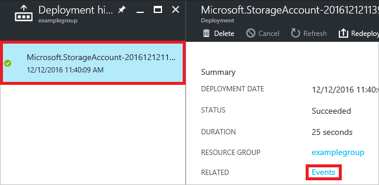
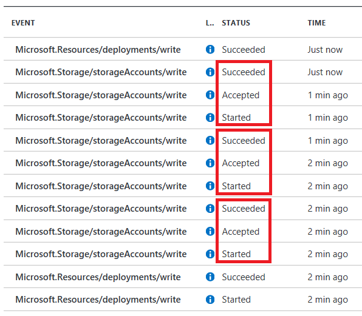

# Troubleshoot common Azure deployment errors with Azure Resource Manager
This topic describes how you can resolve some common Azure deployment errors you may encounter.

## Two types of errors
There are two types of errors you can receive:

* validation errors
* deployment errors

The following image shows the activity log for a subscription. There are three operations that occurred in two deployments. In the first deployment, the template passed validation but failed when creating the resources (**Write Deployments**). In the second deployment, the template failed validation and did not proceed to the **Write Deployments**.


Validation errors arise from scenarios that can be pre-determined to cause a problem. Validation errors include syntax errors in your template, or trying to deploy resources that would exceed your subscription quotas. Deployment errors arise from conditions that occur during the deployment process. For example, a deployment error might arise from trying to access a resource that is being deployed in parallel.

Both types of errors return an error code that you use to troubleshoot the deployment. Both types of errors appear in the [activity log](resource-group-audit.md). However, validation errors do not appear in your deployment history because the deployment never started.


## Error codes

The following error codes are described in this topic:

* [AccountNameInvalid](#accountnameinvalid)
* [Authorization failed](#authorization-failed)
* [BadRequest](#badrequest)
* [DeploymentFailed](#deploymentfailed)
* [DisallowedOperation](#disallowedoperation)
* [InvalidContentLink](#invalidcontentlink)
* [InvalidTemplate](#invalidtemplate)
* [MissingSubscriptionRegistration](#noregisteredproviderfound)
* [NotFound](#notfound)
* [NoRegisteredProviderFound](#noregisteredproviderfound)
* [OperationNotAllowed](#quotaexceeded)
* [ParentResourceNotFound](#parentresourcenotfound)
* [QuotaExceeded](#quotaexceeded)
* [RequestDisallowedByPolicy](#requestdisallowedbypolicy)
* [ResourceNotFound](#notfound)
* [SkuNotAvailable](#skunotavailable)
* [StorageAccountAlreadyExists](#storagenamenotunique)
* [StorageAccountAlreadyTaken](#storagenamenotunique)

### DeploymentFailed

This error code indicates a general deployment error, but it is not the error code you need to start troubleshooting. The error code that actually helps you resolve the issue is usually one level below this error. For example, the following image shows the **RequestDisallowedByPolicy** error code that is under the deployment error.


### SkuNotAvailable

When deploying a resource (typically a virtual machine), you may receive the following error code and error message:

```
Code: SkuNotAvailable
Message: The requested tier for resource '<resource>' is currently not available in location '<location>' 
for subscription '<subscriptionID>'. Please try another tier or deploy to a different location.
```

You receive this error when the resource SKU you have selected (such as VM size) is not available for the location you have selected. To resolve this issue, you need to determine which SKUs are available in a region. You can use either the portal or a REST operation to find available SKUs.

- To use the [portal](https://portal.azure.com), log in to the portal and add a resource through the interface. As you set the values, you see the available SKUs for that resource. You do not need to complete the deployment.

    

- To use the REST API for virtual machines, send the following request:

  ```HTTP 
  GET
  https://management.azure.com/subscriptions/{subscription-id}/providers/Microsoft.Compute/skus?api-version=2016-03-30
  ```

  It returns available SKUs and regions in the following format:

  ```json
  {
    "value": [
      {
        "resourceType": "virtualMachines",
        "name": "Standard_A0",
        "tier": "Standard",
        "size": "A0",
        "locations": [
          "eastus"
        ],
        "restrictions": []
      },
      {
        "resourceType": "virtualMachines",
        "name": "Standard_A1",
        "tier": "Standard",
        "size": "A1",
        "locations": [
          "eastus"
        ],
        "restrictions": []
      },
      ...
    ]
  }    
  ```

If you are unable to find a suitable SKU in that region or an alternative region that meets your business needs, contact [Azure Support](https://portal.azure.com/#create/Microsoft.Support).

### DisallowedOperation

```
Code: DisallowedOperation
Message: The current subscription type is not permitted to perform operations on any provider 
namespace. Please use a different subscription.
```

If you receive this error, you are using a subscription that is not permitted to access any Azure services other than Azure Active Directory. You might have this type of subscription when you need to access the classic portal but are not permitted to deploy resources. To resolve this issue, you must use a subscription that has permission to deploy resources.  

To view your available subscriptions with PowerShell, use:

```powershell
Get-AzureRmSubscription
```

And, to set the current subscription, use:

```powershell
Set-AzureRmContext -SubscriptionName {subscription-name}
```

To view your available subscriptions with Azure CLI 2.0, use:

```azurecli
az account list
```

And, to set the current subscription, use:

```azurecli
az account set --subscription {subscription-name}
```

### InvalidTemplate
This error can result from several different types of errors.

- Syntax error

   If you receive an error message that indicates the template failed validation, you may have a syntax problem in your template.

  ```
  Code=InvalidTemplate
  Message=Deployment template validation failed
  ```

   This error is easy to make because template expressions can be intricate. For example, the following name assignment for a storage account contains one set of brackets, three functions, three sets of parentheses, one set of single quotes, and one property:

  ```json
  "name": "[concat('storage', uniqueString(resourceGroup().id))]",
  ```

   If you do not provide the matching syntax, the template produces a value that is different than your intention.

   When you receive this type of error, carefully review the expression syntax. Consider using a JSON editor like [Visual Studio](vs-azure-tools-resource-groups-deployment-projects-create-deploy.md) or [Visual Studio Code](resource-manager-vs-code.md), which can warn you about syntax errors.

- Incorrect segment lengths

   Another invalid template error occurs when the resource name is not in the correct format.

  ```
  Code=InvalidTemplate
  Message=Deployment template validation failed: 'The template resource {resource-name}'
  for type {resource-type} has incorrect segment lengths.
  ```

   A root level resource must have one less segment in the name than in the resource type. Each segment is differentiated by a slash. In the following example, the type has two segments and the name has one segment, so it is a **valid name**.

  ```json
  {
    "type": "Microsoft.Web/serverfarms",
    "name": "myHostingPlanName",
    ...
  }
  ```

   But the next example is **not a valid name** because it has the same number of segments as the type.

  ```json
  {
    "type": "Microsoft.Web/serverfarms",
    "name": "appPlan/myHostingPlanName",
    ...
  }
  ```

   For child resources, the type and name have the same number of segments. This number of segments makes sense because the full name and type for the child includes the parent name and type. Therefore, the full name still has one less segment than the full type.

  ```json
  "resources": [
      {
          "type": "Microsoft.KeyVault/vaults",
          "name": "contosokeyvault",
          ...
          "resources": [
              {
                  "type": "secrets",
                  "name": "appPassword",
                  ...
              }
          ]
      }
  ]
  ```

   Getting the segments right can be tricky with Resource Manager types that are applied across resource providers. For example, applying a resource lock to a web site requires a type with four segments. Therefore, the name is three segments:

  ```json
  {
      "type": "Microsoft.Web/sites/providers/locks",
      "name": "[concat(variables('siteName'),'/Microsoft.Authorization/MySiteLock')]",
      ...
  }
  ```

- Copy index is not expected

   You encounter this **InvalidTemplate** error when you have applied the **copy** element to a part of the template that does not support this element. You can only apply the copy element to a resource type. You cannot apply copy to a property within a resource type. For example, you apply copy to a virtual machine, but you cannot apply it to the OS disks for a virtual machine. In some cases, you can convert a child resource to a parent resource to create a copy loop. For more information about using copy, see [Create multiple instances of resources in Azure Resource Manager](resource-group-create-multiple.md).

- Parameter is not valid

   If the template specifies permitted values for a parameter, and you provide a value that is not one of those values, you receive a message similar to the following error:

  ```
  Code=InvalidTemplate;
  Message=Deployment template validation failed: 'The provided value {parameter value}
  for the template parameter {parameter name} is not valid. The parameter value is not
  part of the allowed values
  ``` 

   Double check the allowed values in the template, and provide one during deployment.

- Circular dependency detected

   You receive this error when resources depend on each other in a way that prevents the deployment from starting. A combination of interdependencies makes two or more resource wait for other resources that are also waiting. For example, resource1 depends on resource3, resource2 depends on resource1, and resource3 depends on resource2. You can usually solve this problem by removing unnecessary dependencies. For suggestions on troubleshooting dependency errors, see [Check deployment sequence](#check-deployment-sequence).

<a id="notfound" />
### NotFound and ResourceNotFound
When your template includes the name of a resource that cannot be resolved, you receive an error similar to:

```
Code=NotFound;
Message=Cannot find ServerFarm with name exampleplan.
```

If you are attempting to deploy the missing resource in the template, check whether you need to add a dependency. Resource Manager optimizes deployment by creating resources in parallel, when possible. If one resource must be deployed after another resource, you need to use the **dependsOn** element in your template to create a dependency on the other resource. For example, when deploying a web app, the App Service plan must exist. If you have not specified that the web app depends on the App Service plan, Resource Manager creates both resources at the same time. You receive an error stating that the App Service plan resource cannot be found, because it does not exist yet when attempting to set a property on the web app. You prevent this error by setting the dependency in the web app.

```json
{
  "apiVersion": "2015-08-01",
  "type": "Microsoft.Web/sites",
  "dependsOn": [
    "[variables('hostingPlanName')]"
  ],
  ...
}
```

For suggestions on troubleshooting dependency errors, see [Check deployment sequence](#check-deployment-sequence).

You also see this error when the resource exists in a different resource group than the one being deployed to. In that case, use the [resourceId function](resource-group-template-functions-resource.md#resourceid) to get the fully qualified name of the resource.

```json
"properties": {
    "name": "[parameters('siteName')]",
    "serverFarmId": "[resourceId('plangroup', 'Microsoft.Web/serverfarms', parameters('hostingPlanName'))]"
}
```

If you attempt to use the [reference](resource-group-template-functions-resource.md#reference) or [listKeys](resource-group-template-functions-resource.md#listkeys) functions with a resource that cannot be resolved, you receive the following error:

```
Code=ResourceNotFound;
Message=The Resource 'Microsoft.Storage/storageAccounts/{storage name}' under resource
group {resource group name} was not found.
```

Look for an expression that includes the **reference** function. Double check that the parameter values are correct.

### ParentResourceNotFound

When one resource is a parent to another resource, the parent resource must exist before creating the child resource. If it does not yet exist, you receive the following error:

```
Code=ParentResourceNotFound;
Message=Can not perform requested operation on nested resource. Parent resource 'exampleserver' not found."
```

The name of the child resource includes the parent name. For example, a SQL Database might be defined as:

```json
{
  "type": "Microsoft.Sql/servers/databases",
  "name": "[concat(variables('databaseServerName'), '/', parameters('databaseName'))]",
  ...
```

But, if you do not specify a dependency on the parent resource, the child resource may get deployed before the parent. To resolve this error, include a dependency.

```json
"dependsOn": [
    "[variables('databaseServerName')]"
]
```

<a id="storagenamenotunique" />
### StorageAccountAlreadyExists and StorageAccountAlreadyTaken
For storage accounts, you must provide a name for the resource that is unique across Azure. If you do not provide a unique name, you receive an error like:

```
Code=StorageAccountAlreadyTaken
Message=The storage account named mystorage is already taken.
```

You can create a unique name by concatenating your naming convention with the result of the [uniqueString](resource-group-template-functions-string.md#uniquestring) function.

```json
"name": "[concat('storage', uniqueString(resourceGroup().id))]",
"type": "Microsoft.Storage/storageAccounts",
```

If you deploy a storage account with the same name as an existing storage account in your subscription, but provide a different location, you receive an error indicating the storage account already exists in a different location. Either delete the existing storage account, or provide the same location as the existing storage account.

### AccountNameInvalid
You see the **AccountNameInvalid** error when attempting to give a storage account a name that includes prohibited characters. Storage account names must be between 3 and 24 characters in length and use numbers and lower-case letters only. The [uniqueString](resource-group-template-functions-string.md#uniquestring) function returns 13 characters. If you concatenate a prefix to the **uniqueString** result, provide a prefix that is 11 characters or less.

### BadRequest

You may encounter a BadRequest status when you provide an invalid value for a property. For example, if you provide an incorrect SKU value for a storage account, the deployment fails. To determine valid values for property, look at the [REST API](/rest/api) for the resource type you are deploying.

<a id="noregisteredproviderfound" />
### NoRegisteredProviderFound and MissingSubscriptionRegistration
When deploying resource, you may receive the following error code and message:

```
Code: NoRegisteredProviderFound
Message: No registered resource provider found for location {location}
and API version {api-version} for type {resource-type}.
```

Or, you may receive a similar message that states:

```
Code: MissingSubscriptionRegistration
Message: The subscription is not registered to use namespace {resource-provider-namespace}
```

You receive these errors for one of three reasons:

1. The resource provider has not been registered for your subscription
2. API version not supported for the resource type
3. Location not supported for the resource type

The error message should give you suggestions for the supported locations and API versions. You can change your template to one of the suggested values. Most providers are registered automatically by the Azure portal or the command-line interface you are using, but not all. If you have not used a particular resource provider before, you may need to register that provider. You can discover more about resource providers through PowerShell or Azure CLI.

**Portal**

You can see the registration status and register a resource provider namespace through the portal.

1. For your subscription, select **Resource providers**.

   

2. Look at the list of resource providers, and if necessary, select the **Register** link to register the resource provider of the type you are trying to deploy.

   

**PowerShell**

To see your registration status, use **Get-AzureRmResourceProvider**.

```powershell
Get-AzureRmResourceProvider -ListAvailable
```

To register a provider, use **Register-AzureRmResourceProvider** and provide the name of the resource provider you wish to register.

```powershell
Register-AzureRmResourceProvider -ProviderNamespace Microsoft.Cdn
```

To get the supported locations for a particular type of resource, use:

```powershell
((Get-AzureRmResourceProvider -ProviderNamespace Microsoft.Web).ResourceTypes | Where-Object ResourceTypeName -eq sites).Locations
```

To get the supported API versions for a particular type of resource, use:

```powershell
((Get-AzureRmResourceProvider -ProviderNamespace Microsoft.Web).ResourceTypes | Where-Object ResourceTypeName -eq sites).ApiVersions
```

**Azure CLI**

To see whether the provider is registered, use the `azure provider list` command.

```azurecli
az provider list
```

To register a resource provider, use the `azure provider register` command, and specify the *namespace* to register.

```azurecli
az provider register --namespace Microsoft.Cdn
```

To see the supported locations and API versions for a resource type, use:

```azurecli
az provider show -n Microsoft.Web --query "resourceTypes[?resourceType=='sites'].locations"
```

<a id="quotaexceeded" />
### QuotaExceeded and OperationNotAllowed
You might have issues when deployment exceeds a quota, which could be per resource group, subscriptions, accounts, and other scopes. For example, your subscription may be configured to limit the number of cores for a region. If you attempt to deploy a virtual machine with more cores than the permitted amount, you receive an error stating the quota has been exceeded.
For complete quota information, see [Azure subscription and service limits, quotas, and constraints](../azure-subscription-service-limits.md).

To examine your subscription's quotas for cores, you can use the `azure vm list-usage` command in the Azure CLI. The following example illustrates that the core quota for a free trial account is 4:

```azurecli
az vm list-usage --location "South Central US"
```

Which returns:

```azurecli
[
  {
    "currentValue": 0,
    "limit": 2000,
    "name": {
      "localizedValue": "Availability Sets",
      "value": "availabilitySets"
    }
  },
  ...
]
```

If you deploy a template that creates more than four cores in the West US region, you get a deployment error that looks like:

```
Code=OperationNotAllowed
Message=Operation results in exceeding quota limits of Core.
Maximum allowed: 4, Current in use: 4, Additional requested: 2.
```

Or in PowerShell, you can use the **Get-AzureRmVMUsage** cmdlet.

```powershell
Get-AzureRmVMUsage
```

Which returns:

```powershell
...
CurrentValue : 0
Limit        : 4
Name         : {
                 "value": "cores",
                 "localizedValue": "Total Regional Cores"
               }
Unit         : null
...
```

In these cases, you should go to the portal and file a support issue to raise your quota for the region into which you want to deploy.

> [!NOTE]
> Remember that for resource groups, the quota is for each individual region, not for the entire subscription. If you need to deploy 30 cores in West US, you have to ask for 30 Resource Manager cores in West US. If you need to deploy 30 cores in any of the regions to which you have access, you should ask for 30 Resource Manager cores in all regions.
>
>

### InvalidContentLink
When you receive the error message:

```
Code=InvalidContentLink
Message=Unable to download deployment content from ...
```

You have most likely attempted to link to a nested template that is not available. Double check the URI you provided for the nested template. If the template exists in a storage account, make sure the URI is accessible. You may need to pass a SAS token. For more information, see [Using linked templates with Azure Resource Manager](resource-group-linked-templates.md).

### RequestDisallowedByPolicy
You receive this error when your subscription includes a resource policy that prevents an action you are trying to perform during deployment. In the error message, look for the policy identifier.

```
Policy identifier(s): '/subscriptions/{guid}/providers/Microsoft.Authorization/policyDefinitions/regionPolicyDefinition'
```

In **PowerShell**, provide that policy identifier as the **Id** parameter to retrieve details about the policy that blocked your deployment.

```powershell
(Get-AzureRmPolicyDefinition -Id "/subscriptions/{guid}/providers/Microsoft.Authorization/policyDefinitions/regionPolicyDefinition").Properties.policyRule | ConvertTo-Json
```

In **Azure CLI 2.0**, provide the name of the policy definition:

```azurecli
az policy definition show --name regionPolicyAssignment
```

For more information about policies, see [Use Policy to manage resources and control access](resource-manager-policy.md).

### Authorization failed
You may receive an error during deployment because the account or service principal attempting to deploy the resources does not have access to perform those actions. Azure Active Directory enables you or your administrator to control which identities can access what resources with a great degree of precision. For example, if your account is assigned to the Reader role, you are not able to create resources. In that case, you see an error message indicating that authorization failed.

For more information about role-based access control, see [Azure Role-Based Access Control](../active-directory/role-based-access-control-configure.md).

## Troubleshooting tricks and tips

### Enable debug logging
You can discover valuable information about how your deployment is processed by logging the request, response, or both.

- PowerShell

   In PowerShell, set the **DeploymentDebugLogLevel** parameter to All, ResponseContent, or RequestContent.

  ```powershell
  New-AzureRmResourceGroupDeployment -ResourceGroupName examplegroup -TemplateFile c:\Azure\Templates\storage.json -DeploymentDebugLogLevel All
  ```

   Examine the request content with the following cmdlet:

  ```powershell
  (Get-AzureRmResourceGroupDeploymentOperation -DeploymentName storageonly -ResourceGroupName startgroup).Properties.request | ConvertTo-Json
  ```

   Or, the response content with:

  ```powershell
  (Get-AzureRmResourceGroupDeploymentOperation -DeploymentName storageonly -ResourceGroupName startgroup).Properties.response | ConvertTo-Json
  ```

   This information can help you determine whether a value in the template is being incorrectly set.

- Azure CLI 2.0

   Examine the deployment operations with the following command:

  ```azurecli
  az group deployment operation list --resource-group ExampleGroup --name vmlinux
  ```

- Nested template

   To log debug information for a nested template, use the **debugSetting** element.

  ```json
  {
      "apiVersion": "2016-09-01",
      "name": "nestedTemplate",
      "type": "Microsoft.Resources/deployments",
      "properties": {
          "mode": "Incremental",
          "templateLink": {
              "uri": "{template-uri}",
              "contentVersion": "1.0.0.0"
          },
          "debugSetting": {
             "detailLevel": "requestContent, responseContent"
          }
      }
  }
  ```


### Create a troubleshooting template
In some cases, the easiest way to troubleshoot your template is to test parts of it. You can create a simplified template that enables you to focus on the part that you believe is causing the error. For example, suppose you are receiving an error when referencing a resource. Rather than dealing with an entire template, create a template that returns the part that may be causing your problem. It can help you determine whether you are passing in the right parameters, using template functions correctly, and getting the resource you expect.

```json
{
  "$schema": "https://schema.management.azure.com/schemas/2015-01-01/deploymentTemplate.json#",
  "contentVersion": "1.0.0.0",
  "parameters": {
    "storageName": {
        "type": "string"
    },
    "storageResourceGroup": {
        "type": "string"
    }
  },
  "variables": {},
  "resources": [],
  "outputs": {
    "exampleOutput": {
        "value": "[reference(resourceId(parameters('storageResourceGroup'), 'Microsoft.Storage/storageAccounts', parameters('storageName')), '2016-05-01')]",
        "type" : "object"
    }
  }
}
```

Or, suppose you are encountering deployment errors that you believe are related to incorrectly set dependencies. Test your template by breaking it into simplified templates. First, create a template that deploys only a single resource (like a SQL Server). When you are sure you have that resource correctly defined, add a resource that depends on it (like a SQL Database). When you have those two resources correctly defined, add other dependent resources (like auditing policies). In between each test deployment, delete the resource group to make sure you adequately testing the dependencies. 

### Check deployment sequence

Many deployment errors happen when resources are deployed in an unexpected sequence. These errors arise when dependencies are not correctly set. When you are missing a needed dependency, one resource attempts to use a value for another resource but the other does not yet exist. You get an error stating that a resource is not found. You may encounter this type of error intermittently because the deployment time for each resource can vary. For example, your first attempt to deploy your resources succeeds because a required resource randomly completes in time. However, your second attempt fails because the required resource did not complete in time. 

But, you want to avoid setting dependencies that are not needed. When you have unnecessary dependencies, you prolong the duration of the deployment by preventing resources that are not dependent on each other from being deployed in parallel. In addition, you may create circular dependencies that block the deployment. The [reference](resource-group-template-functions-resource.md#reference) function creates an implicit dependency on the resource you specify as a parameter in the function, if that resource is deployed in the same template. Therefore, you may have more dependencies than the dependencies specified in the **dependsOn** property. The [resourceId](resource-group-template-functions-resource.md#resourceid) function does not create an implicit dependency or validate that the resource exists.

When you encounter dependency problems, you need to gain insight into the order of resource deployment. To view the order of deployment operations:

1. Select the deployment history for your resource group.

   

2. Select a deployment from the history, and select **Events**.

   

3. Examine the sequence of events for each resource. Pay attention to the status of each operation. For example, the following image shows three storage accounts that deployed in parallel. Notice that the three storage accounts are started at the same time.

   

   The next image shows three storage accounts that are not deployed in parallel. The second storage account depends on the first storage account, and the third storage account depends on the second storage account. Therefore, the first storage account is started, accepted, and completed before the next is started.

   

Real world scenarios can be considerably more complicated, but you can use the same technique to discover when deployment is started and completed for each resource. Look through your deployment events to see if the sequence is different than you would expect. If so, reevaluate the dependencies for this resource.

Resource Manager identifies circular dependencies during template validation. It returns an error message that specifically states a circular dependency exists. To solve a circular dependency:

1. In your template, find the resource identified in the circular dependency. 
2. For that resource, examine the **dependsOn** property and any uses of the **reference** function to see which resources it depends on. 
3. Examine those resources to see which resources they depend on. Follow the dependencies until you notice a resource that depends on the original resource.
5. For the resources involved in the circular dependency, carefully examine all uses of the **dependsOn** property to identify any dependencies that are not needed. Remove those dependencies. If you are unsure that a dependency is needed, try removing it. 
6. Redeploy the template.

Removing values from the **dependsOn** property can cause errors when you deploy the template. If you encounter an error, add the dependency back into the template. 

If that approach does not solve the circular dependency, consider moving part of your deployment logic into child resources (such as extensions or configuration settings). Configure those child resources to deploy after the resources involved in the circular dependency. For example, suppose you are deploying two virtual machines but you must set properties on each one that refer to the other. You can deploy them in the following order:

1. vm1
2. vm2
3. Extension on vm1 depends on vm1 and vm2. The extension sets values on vm1 that it gets from vm2.
4. Extension on vm2 depends on vm1 and vm2. The extension sets values on vm2 that it gets from vm1.

The same approach works for App Service apps. Consider moving configuration values into a child resource of the app resource. You can deploy two web apps in the following order:

1. webapp1
2. webapp2
3. config for webapp1 depends on webapp1 and webapp2. It contains app settings with values from webapp2.
4. config for webapp2 depends on webapp1 and webapp2. It contains app settings with values from webapp1.

## Troubleshooting other services
If the preceding deployment error codes did not help you troubleshoot your issue, you can find more detailed troubleshooting guidance for each Azure service.

The following table lists troubleshooting topics for Virtual Machines.

| Error | Articles |
| --- | --- |
| Custom script extension errors |[Windows VM extension failures](../virtual-machines/windows/extensions-troubleshoot.md?toc=%2fazure%2fvirtual-machines%2fwindows%2ftoc.json)<br />or<br />[Linux VM extension failures](../virtual-machines/linux/extensions-troubleshoot.md?toc=%2fazure%2fvirtual-machines%2flinux%2ftoc.json) |
| OS image provisioning errors |[New Windows VM errors](../virtual-machines/windows/troubleshoot-deployment-new-vm.md?toc=%2fazure%2fvirtual-machines%2fwindows%2ftoc.json)<br />or<br />[New Linux VM errors](../virtual-machines/linux/troubleshoot-deployment-new-vm.md?toc=%2fazure%2fvirtual-machines%2flinux%2ftoc.json) |
| Allocation failures |[Windows VM allocation failures](../virtual-machines/windows/allocation-failure.md?toc=%2fazure%2fvirtual-machines%2fwindows%2ftoc.json)<br />or<br />[Linux VM allocation failures](../virtual-machines/linux/allocation-failure.md?toc=%2fazure%2fvirtual-machines%2flinux%2ftoc.json) |
| Secure Shell (SSH) errors when attempting to connect |[Secure Shell connections to Linux VM](../virtual-machines/linux/troubleshoot-ssh-connection.md?toc=%2fazure%2fvirtual-machines%2flinux%2ftoc.json) |
| Errors connecting to application running on VM |[Application running on Windows VM](../virtual-machines/windows/troubleshoot-app-connection.md?toc=%2fazure%2fvirtual-machines%2fwindows%2ftoc.json)<br />or<br />[Application running on a Linux VM](../virtual-machines/linux/troubleshoot-app-connection.md?toc=%2fazure%2fvirtual-machines%2flinux%2ftoc.json) |
| Remote Desktop connection errors |[Remote Desktop connections to Windows VM](../virtual-machines/windows/troubleshoot-rdp-connection.md?toc=%2fazure%2fvirtual-machines%2fwindows%2ftoc.json) |
| Connection errors resolved by redeploying |[Redeploy Virtual Machine to new Azure node](../virtual-machines/windows/redeploy-to-new-node.md?toc=%2fazure%2fvirtual-machines%2fwindows%2ftoc.json) |
| Cloud service errors |[Cloud service deployment problems](../cloud-services/cloud-services-troubleshoot-deployment-problems.md) |

The following table lists troubleshooting topics for other Azure services. It focuses on issues related to deploying or configuring resources. If you need help troubleshooting run-time issues with a resource, see the documentation for that Azure service.

| Service | Article |
| --- | --- |
| Automation |[Troubleshooting tips for common errors in Azure Automation](../automation/automation-troubleshooting-automation-errors.md) |
| Azure Stack |[Microsoft Azure Stack troubleshooting](../azure-stack/azure-stack-troubleshooting.md) |
| Data Factory |[Troubleshoot Data Factory issues](../data-factory/data-factory-troubleshoot.md) |
| Service Fabric |[Monitor and diagnose Azure Service Fabric applications](../service-fabric/service-fabric-diagnostics-overview.md) |
| Site Recovery |[Monitor and troubleshoot protection for virtual machines and physical servers](../site-recovery/site-recovery-monitoring-and-troubleshooting.md) |
| Storage |[Monitor, diagnose, and troubleshoot Microsoft Azure Storage](../storage/storage-monitoring-diagnosing-troubleshooting.md) |
| StorSimple |[Troubleshoot StorSimple device deployment issues](../storsimple/storsimple-troubleshoot-deployment.md) |
| SQL Database |[Troubleshoot connection issues to Azure SQL Database](../sql-database/sql-database-troubleshoot-common-connection-issues.md) |
| SQL Data Warehouse |[Troubleshooting Azure SQL Data Warehouse](../sql-data-warehouse/sql-data-warehouse-troubleshoot.md) |

## Next steps
* To learn about auditing actions, see [Audit operations with Resource Manager](resource-group-audit.md).
* To learn about actions to determine the errors during deployment, see [View deployment operations](resource-manager-deployment-operations.md).
