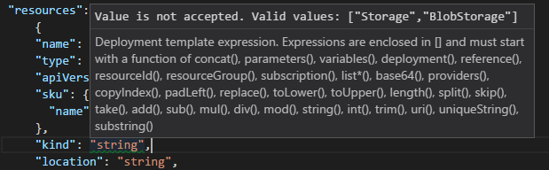
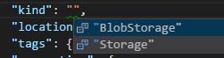
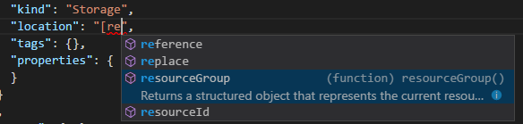

# Create your first Azure Resource Manager template
This topic walks you through the steps of creating your first Azure Resource Manager template. Resource Manager templates are JSON files that define the resources you need to deploy for your solution. To understand the concepts associated with deploying and managing your Azure solutions, see [Azure Resource Manager overview](resource-group-overview.md). If you have existing resources and want to get a template for those resources, see [Export an Azure Resource Manager template from existing resources](resource-manager-export-template.md).

To create and revise templates, you need a JSON editor. [Visual Studio Code](https://code.visualstudio.com/) is a lightweight, open-source, cross-platform code editor. It supports creating and editing Resource Manager templates through an extension. This topic assumes you are using VS Code; however, if you have another JSON editor (like Visual Studio), you can use that editor.

## Get VS Code and extension
1. If needed, install VS Code from [https://code.visualstudio.com/](https://code.visualstudio.com/).

2. Install the [Azure Resource Manager Tools](https://marketplace.visualstudio.com/items?itemName=msazurermtools.azurerm-vscode-tools) extension by accessing Quick Open (Ctrl+P) and running: 

   ```
   ext install msazurermtools.azurerm-vscode-tools
   ```

3. Restart VS Code when prompted to enable the extension.

## Create blank template

Let's start with a blank template that includes only the basic sections of a template.

1. Create a file. 

2. Copy and paste the following JSON syntax into your file:

   ```json
   {
     "$schema": "http://schema.management.azure.com/schemas/2015-01-01/deploymentTemplate.json#",
     "contentVersion": "1.0.0.0",
     "parameters": {  },
     "variables": {  },
     "resources": [  ],
     "outputs": {  }
   }
   ```

3. Save this file as **azuredeploy.json**. 

## Add storage account
1. To define a storage account for deployment, you add that storage account to the **resources** section of your template. To find the values that are available for the storage account, look at the [storage accounts template reference](/azure/templates/microsoft.storage/storageaccounts). Copy the JSON that is shown for the storage account. 

3. Paste that JSON into the **resources** section of your template, as shown in the following example: 

   ```json
   {
     "$schema": "http://schema.management.azure.com/schemas/2015-01-01/deploymentTemplate.json#",
     "contentVersion": "1.0.0.0",
     "parameters": {  },
     "variables": {  },
     "resources": [
       {
         "name": "string",
         "type": "Microsoft.Storage/storageAccounts",
         "apiVersion": "2016-12-01",
         "sku": {
           "name": "string"
         },
         "kind": "string",
         "location": "string",
         "tags": {},
         "properties": {
           "customDomain": {
             "name": "string",
             "useSubDomain": boolean
           },
           "encryption": {
             "services": {
               "blob": {
                 "enabled": boolean
               }
             },
             "keySource": "Microsoft.Storage"
           },
           "accessTier": "string"
         }
       }
     ],
     "outputs": {  }
   }
   ```

  VS Code may indicate that 2016-12-01 is not a valid API version. If you are using a version number from the template reference documentation, you can ignore this warning. You see this warning when the schema has not been updated with the latest version number from the resource provider. 
  
  The preceding example includes many placeholder values and some properties that you might not need in your storage account.

## Set values for storage account

Now, you are ready to set values for your storage account. 

1. Look again at the [storage accounts template reference](/azure/templates/microsoft.storage/storageaccounts) where you copied the JSON. There are several tables that describe the properties and provide available values. 

2. Notice that within the **properties** element, **customDomain**, **encryption**, and **accessTier** are all listed as not required. These values may be important for your scenarios, but to keep this example simple, let's remove them.

   ```json
   "resources": [
     {
       "name": "string",
       "type": "Microsoft.Storage/storageAccounts",
       "apiVersion": "2016-12-01",
       "sku": {
         "name": "string"
       },
       "kind": "string",
       "location": "string",
       "tags": {},
       "properties": {
       }
     }
   ],
   ```

3. Currently, the **kind** element is set to a placeholder value ("string"). VS Code includes many features that help you understand the values to use in your template. Notice that VS Code indicates this value is not valid. If you hover over "string", VS Code suggests that the valid values for **kind** are `Storage` or `BlobStorage`. 

   

   To see the available values, delete the characters between the double-quotes and select **Ctrl+Space**. Select **Storage** from the available options.
  
   

   If you are not using VS Code, look at the storage accounts template reference page. Notice that the description lists the same valid values. Set the element to **Storage**.

   ```json
   "kind": "Storage",
   ```

Your template now looks like:

```json
{
  "$schema": "http://schema.management.azure.com/schemas/2015-01-01/deploymentTemplate.json#",
  "contentVersion": "1.0.0.0",
  "parameters": {  },
  "variables": {  },
  "resources": [
    {
      "name": "string",
      "type": "Microsoft.Storage/storageAccounts",
      "apiVersion": "2016-12-01",
      "sku": {
        "name": "string"
      },
      "kind": "Storage",
      "location": "string",
      "tags": {},
      "properties": {
      }
    }
  ],
  "outputs": {  }
}
```

## Add template function

You use functions within your template to simplify the syntax of the template, and to retrieve values that are only available when the template is being deployed. For the full set of template functions, see [Azure Resource Manager template functions](resource-group-template-functions.md).

To specify that the storage account is deployed to the same location as the resource group, set the **location** property to:

```json
"location": "[resourceGroup().location]",
```

Again, VS Code helps you by suggesting available functions. 



Notice that the function is surrounded by square brackets. The [resourceGroup](resource-group-template-functions-resource.md#resourcegroup) function returns an object with a property called `location`. The resource group holds all related resources for your solution. You could hardcode the location property to a value like "Central US" but you would have to manually change the template to redeploy to a different location. Using the `resourceGroup` function, makes it easy to redeploy this template to a different resource group in a different location.

Your template now looks like:

```json
{
  "$schema": "http://schema.management.azure.com/schemas/2015-01-01/deploymentTemplate.json#",
  "contentVersion": "1.0.0.0",
  "parameters": {  },
  "variables": {  },
  "resources": [
    {
      "name": "string",
      "type": "Microsoft.Storage/storageAccounts",
      "apiVersion": "2016-12-01",
      "sku": {
        "name": "string"
      },
      "kind": "Storage",
      "location": "[resourceGroup().location]",
      "tags": {},
      "properties": {
      }
    }
  ],
  "outputs": {  }
}
```

## Add parameters and variables
There are only two values left to set in your template - **name** and **sku.name**. For these properties, you add parameters that enable you to customize these values during deployment. 

Storage account names have several restrictions that make them difficult to set. The name must be between 3 and 24 characters in length, use only numbers and lower-case letters, and be unique. Rather than trying to guess a unique value that matches the restrictions, use the [uniqueString](resource-group-template-functions-string.md#uniquestring) function to generate a hash value. To give this hash value more meaning, add a prefix that helps you identify it as a storage account after deployment. 

1. To pass in a prefix for the name that matches your naming conventions, go to the **parameters** section of your template. Add a parameter to the template that accepts a prefix for the storage account name:

   ```json
   "parameters": {
     "storageNamePrefix": {
       "type": "string",
       "maxLength": 11,
       "defaultValue": "storage",
       "metadata": {
         "description": "The value to use for starting the storage account name."
       }
     }
   },
   ```

  The prefix is limited to a maximum of 11 characters because `uniqueString` returns 13 characters, and the name cannot exceed 24 characters. If you do not pass in a value for the parameter during deployment, the default value is used.

2. Go to the **variables** section of the template. To construct the name from the prefix and unique string, add the following variable:

   ```json
   "variables": {
     "storageName": "[concat(parameters('storageNamePrefix'), uniqueString(resourceGroup().id))]"
   },
   ```

3. In the **resources** section, set the storage account name to that variable.

   ```json
   "name": "[variables('storageName')]",
   ```

3. To enable passing in different SKUs for the storage account, go to the **parameters** section. After the parameter for storage name prefix, add a parameter that specifies the allowed SKU values and a default value. You can find the allowed values from either the template reference page or VS Code. In the following example, you include all valid values for SKU. However, you could limit the allowed values to only those types of SKUs that you want to deploy through this template.

   ```json
   "parameters": {
     "storageNamePrefix": {
       "type": "string",
       "maxLength": 11,
       "defaultValue": "storage",
       "metadata": {
         "description": "The value to use for starting the storage account name."
       }
     },
     "storageSKU": {
       "type": "string",
       "allowedValues": [
         "Standard_LRS",
         "Standard_ZRS",
         "Standard_GRS",
         "Standard_RAGRS",
         "Premium_LRS"
       ],
       "defaultValue": "Standard_LRS",
       "metadata": {
         "description": "The type of replication to use for the storage account."
       }
     }
   },
   ```

3. Change the SKU property to use the value from the parameter:

   ```json
   "sku": {
     "name": "[parameters('storageSKU')]"
   },
   ```    

4. Save your file.

## Final template

After completing the steps in this article, your template now looks like:

```json
{
  "$schema": "http://schema.management.azure.com/schemas/2015-01-01/deploymentTemplate.json#",
  "contentVersion": "1.0.0.0",
  "parameters": {
    "storageNamePrefix": {
      "type": "string",
      "maxLength": 11,
      "defaultValue": "storage",
      "metadata": {
        "description": "The value to use for starting the storage account name."
      }
    },
    "storageSKU": {
      "type": "string",
      "allowedValues": [
        "Standard_LRS",
        "Standard_ZRS",
        "Standard_GRS",
        "Standard_RAGRS",
        "Premium_LRS"
      ],
      "defaultValue": "Standard_LRS",
      "metadata": {
        "description": "The type of replication to use for the storage account."
      }
    }
  },
  "variables": {
    "storageName": "[concat(parameters('storageNamePrefix'), uniqueString(resourceGroup().id))]"
  },
  "resources": [
    {
      "name": "[variables('storageName')]",
      "type": "Microsoft.Storage/storageAccounts",
      "apiVersion": "2016-12-01",
      "sku": {
        "name": "[parameters('storageSKU')]"
      },
      "kind": "Storage",
      "location": "[resourceGroup().location]",
      "tags": {},
      "properties": {
      }
    }
  ],
  "outputs": {  }
}
```

## Next steps
* Your template is complete, and you are ready to deploy it to your subscription. To deploy, see [Deploy resources to Azure](resource-manager-quickstart-deploy.md).
* To learn more about the structure of a template, see [Authoring Azure Resource Manager templates](resource-group-authoring-templates.md).
* To view complete templates for many different types of solutions, see the [Azure Quickstart Templates](https://azure.microsoft.com/documentation/templates/).
