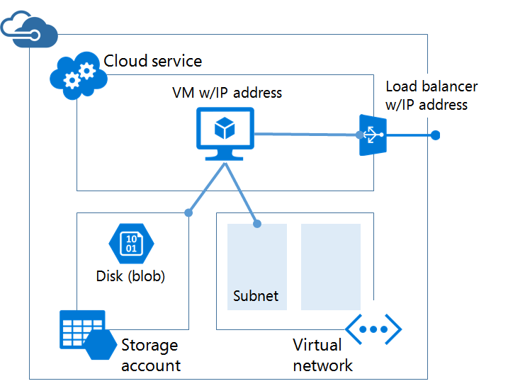

# Azure Resource Manager vs. classic deployment: Understand deployment models and the state of your resources

> [!NOTE]
> The information provided in this article is only used when you migrate from the classic deployment to the Azure Resource Manager deployment.

In this article, you learn about Azure Resource Manager and classic deployment models. The Resource Manager and classic deployment models represent two different ways of deploying and managing your Azure solutions. You work with them through two different API sets, and the deployed resources can contain important differences. The two models are not compatible with each other. This article describes those differences.

To simplify the deployment and management of resources, Microsoft recommends that you use Resource Manager for all new resources. If possible, Microsoft recommends that you redeploy existing resources through Resource Manager.

If you are new to Resource Manager, you may want to first review the terminology defined in the [Azure Resource Manager overview](resource-group-overview.md).

[!INCLUDE [updated-for-az](../../includes/updated-for-az.md)]

## History of the deployment models
Azure originally provided only the classic deployment model. In this model, each resource existed independently; there was no way to group related resources together. Instead, you had to manually track which resources made up your solution or application, and remember to manage them in a coordinated approach. To deploy a solution, you had to either create each resource individually through the portal or create a script that deployed all the resources in the correct order. To delete a solution, you had to delete each resource individually. You could not easily apply and update access control policies for related resources. Finally, you could not apply tags to resources to label them with terms that help you monitor your resources and manage billing.

In 2014, Azure introduced Resource Manager, which added the concept of a resource group. A resource group is a container for resources that share a common lifecycle. The Resource Manager deployment model provides several benefits:

* You can deploy, manage, and monitor all the services for your solution as a group, rather than handling these services individually.
* You can repeatedly deploy your solution throughout its lifecycle and have confidence your resources are deployed in a consistent state.
* You can apply access control to all resources in your resource group, and those policies are automatically applied when new resources are added to the resource group.
* You can apply tags to resources to logically organize all the resources in your subscription.
* You can use JavaScript Object Notation (JSON) to define the infrastructure for your solution. The JSON file is known as a Resource Manager template.
* You can define the dependencies between resources so they are deployed in the correct order.

When Resource Manager was added, all resources were retroactively added to default resource groups. If you create a resource through classic deployment now, the resource is automatically created within a default resource group for that service, even though you did not specify that resource group at deployment. However, just existing within a resource group does not mean that the resource has been converted to the Resource Manager model.

## Understand support for the models

There are three scenarios to be aware of:

1. Cloud Services does not support Resource Manager deployment model.
2. Virtual machines, storage accounts, and virtual networks support both Resource Manager and classic deployment models.
3. All other Azure services support Resource Manager.

For virtual machines, storage accounts, and virtual networks, if the resource was created through classic deployment, you must continue to operate on it through classic operations. If the virtual machine, storage account, or virtual network was created through Resource Manager deployment, you must continue using Resource Manager operations. This distinction can get confusing when your subscription contains a mix of resources created through Resource Manager and classic deployment. This combination of resources can create unexpected results because the resources do not support the same operations.

In some cases, a Resource Manager command can retrieve information about a resource created through classic deployment, or can perform an administrative task such as moving a classic resource to another resource group. But, these cases should not give the impression that the type supports Resource Manager operations. For example, suppose you have a resource group that contains a virtual machine that was created with classic deployment. If you run the following Resource Manager PowerShell command:

```powershell
Get-AzResource -ResourceGroupName ExampleGroup -ResourceType Microsoft.ClassicCompute/virtualMachines
```

It returns the virtual machine:

```powershell
Name              : ExampleClassicVM
ResourceId        : /subscriptions/{guid}/resourceGroups/ExampleGroup/providers/Microsoft.ClassicCompute/virtualMachines/ExampleClassicVM
ResourceName      : ExampleClassicVM
ResourceType      : Microsoft.ClassicCompute/virtualMachines
ResourceGroupName : ExampleGroup
Location          : westus
SubscriptionId    : {guid}
```

However, the Resource Manager cmdlet **Get-AzVM** only returns virtual machines deployed through Resource Manager. The following command does not return the virtual machine created through classic deployment.

```powershell
Get-AzVM -ResourceGroupName ExampleGroup
```

Only resources created through Resource Manager support tags. You cannot apply tags to classic resources.

## Changes for compute, network, and storage
The following diagram displays compute, network, and storage resources deployed through Resource Manager.


Note the following relationships between the resources:

* All the resources exist within a resource group.
* The virtual machine depends on a specific storage account defined in the Storage resource provider to store its disks in blob storage (required).
* The virtual machine references a specific NIC defined in the Network resource provider (required) and an availability set defined in the Compute resource provider (optional).
* The NIC references the virtual machine's assigned IP address (required), the subnet of the virtual network for the virtual machine (required), and to a Network Security Group (optional).
* The subnet within a virtual network references a Network Security Group (optional).
* The load balancer instance references the backend pool of IP addresses that include the NIC of a virtual machine (optional) and references a load balancer public or private IP address (optional).

Here are the components and their relationships for classic deployment:



The classic solution for hosting a virtual machine includes:

* A required cloud service that acts as a container for hosting virtual machines (compute). Virtual machines are automatically provided with a network interface card (NIC) and an IP address assigned by Azure. Additionally, the cloud service contains an external load balancer instance, a public IP address, and default endpoints to allow remote desktop and remote PowerShell traffic for Windows-based virtual machines and Secure Shell (SSH) traffic for Linux-based virtual machines.
* A required storage account that stores the VHDs for a virtual machine, including the operating system, temporary, and additional data disks (storage).
* An optional virtual network that acts as an additional container, in which you can create a subnetted structure and designate the subnet on which the virtual machine is located (network).

The following table describes changes in how Compute, Network, and Storage resource providers interact:

| Item | Classic | Resource Manager |
| --- | --- | --- |
| Cloud Service for Virtual Machines |Cloud Service was a container for holding the virtual machines that required Availability from the platform and Load Balancing. |Cloud Service is no longer an object required for creating a Virtual Machine using the new model. |
| Virtual Networks |A virtual network is optional for the virtual machine. If included, the virtual network cannot be deployed with Resource Manager. |Virtual machine requires a virtual network that has been deployed with Resource Manager. |
| Storage Accounts |The virtual machine requires a storage account that stores the VHDs for the operating system, temporary, and additional data disks. |The virtual machine requires a storage account to store its disks in blob storage. |
| Availability Sets |Availability to the platform was indicated by configuring the same “AvailabilitySetName” on the Virtual Machines. The maximum count of fault domains was 2. |Availability Set is a resource exposed by Microsoft.Compute Provider. Virtual Machines that require high availability must be included in the Availability Set. The maximum count of fault domains is now 3. |
| Affinity Groups |Affinity Groups were required for creating Virtual Networks. However, with the introduction of Regional Virtual Networks, that was not required anymore. |To simplify, the Affinity Groups concept doesn’t exist in the APIs exposed through Azure Resource Manager. |
| Load Balancing |Creation of a Cloud Service provides an implicit load balancer for the Virtual Machines deployed. |The Load Balancer is a resource exposed by the Microsoft.Network provider. The primary network interface of the Virtual Machines that needs to be load balanced should be referencing the load balancer. Load Balancers can be internal or external. A load balancer instance references the backend pool of IP addresses that include the NIC of a virtual machine (optional) and references a load balancer public or private IP address (optional). |
| Virtual IP Address |Cloud Services gets a default VIP (Virtual IP Address) when a VM is added to a cloud service. The Virtual IP Address is the address associated with the implicit load balancer. |Public IP address is a resource exposed by the Microsoft.Network provider. Public IP address can be static (reserved) or dynamic. Dynamic public IPs can be assigned to a Load Balancer. Public IPs can be secured using Security Groups. |
| Reserved IP Address |You can reserve an IP Address in Azure and associate it with a Cloud Service to ensure that the IP Address is sticky. |Public IP Address can be created in static mode and it offers the same capability as a reserved IP address. |
| Public IP Address (PIP) per VM |Public IP Addresses can also be associated to a VM directly. |Public IP address is a resource exposed by the Microsoft.Network provider. Public IP Address can be static (reserved) or dynamic. |
| Endpoints |Input Endpoints needed to be configured on a Virtual Machine to be open up connectivity for certain ports. One of the common modes of connecting to virtual machines done by setting up input endpoints. |Inbound NAT Rules can be configured on Load Balancers to achieve the same capability of enabling endpoints on specific ports for connecting to the VMs. |
| DNS Name |A cloud service would get an implicit globally unique DNS Name. For example: `mycoffeeshop.cloudapp.net`. |DNS Names are optional parameters that can be specified on a Public IP Address resource. The FQDN is in the following format - `<domainlabel>.<region>.cloudapp.azure.com`. |
| Network Interfaces |Primary and Secondary Network Interface and its properties were defined as network configuration of a Virtual machine. |Network Interface is a resource exposed by Microsoft.Network Provider. The lifecycle of the Network Interface is not tied to a Virtual Machine. It references the virtual machine's assigned IP address (required), the subnet of the virtual network for the virtual machine (required), and to a Network Security Group (optional). |

To learn about connecting virtual networks from different deployment models, see [Connect virtual networks from different deployment models in the portal](../vpn-gateway/vpn-gateway-connect-different-deployment-models-portal.md).

## Migrate from classic to Resource Manager
If you are ready to migrate your resources from classic deployment to Resource Manager deployment, see:

1. [Technical deep dive on platform-supported migration from classic to Azure Resource Manager](../virtual-machines/windows/migration-classic-resource-manager-deep-dive.md)
2. [Platform supported migration of IaaS resources from Classic to Azure Resource Manager](../virtual-machines/windows/migration-classic-resource-manager-overview.md)
3. [Migrate IaaS resources from classic to Azure Resource Manager by using Azure PowerShell](../virtual-machines/windows/migration-classic-resource-manager-ps.md)
4. [Migrate IaaS resources from classic to Azure Resource Manager by using Azure CLI](../virtual-machines/virtual-machines-linux-cli-migration-classic-resource-manager.md)

## Frequently asked questions
**Can I create a virtual machine using Resource Manager to deploy in a virtual network created using classic deployment?**

This configuration is not supported. You cannot use Resource Manager to deploy a virtual machine into a virtual network that was created using classic deployment.

**Can I create a virtual machine using Resource Manager from a user image that was created using the classic deployment model?**

This configuration is not supported. However, you can copy the VHD files from a storage account that was created using the classic deployment model, and add them to a new account created through Resource Manager.

**What is the impact on the quota for my subscription?**

The quotas for the virtual machines, virtual networks, and storage accounts created through the Azure Resource Manager are separate from other quotas. Each subscription gets quotas to create the resources using the new APIs. You can read more about the additional quotas [here](../azure-subscription-service-limits.md).

**Can I continue to use my automated scripts for provisioning virtual machines, virtual networks, and storage accounts through the Resource Manager APIs?**

All the automation and scripts that you've built continue to work for the existing virtual machines, virtual networks created under the Azure Service Management mode. However, the scripts have to be updated to use the new schema for creating the same resources through the Resource Manager mode.

**Where can I find examples of Azure Resource Manager templates?**

A comprehensive set of starter templates can be found on [Azure Resource Manager Quickstart Templates](https://azure.microsoft.com/documentation/templates/).

## Next steps

* To walk through the creation of template that defines a virtual machine, storage account, and virtual network, see [Resource Manager template walkthrough](resource-manager-template-walkthrough.md).
* To see the commands for deploying a template, see [Deploy an application with Azure Resource Manager template](resource-group-template-deploy.md).

