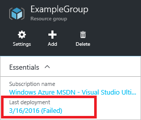
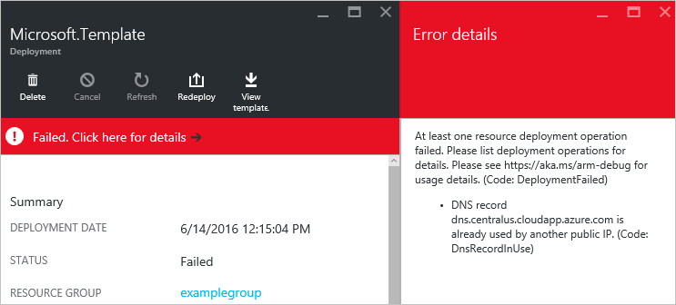
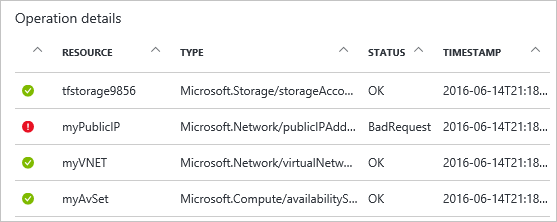

# View deployment operations with Azure Resource Manager

You can view the operations for a deployment through the Azure portal. You may be most interested in viewing the operations when you've received an error during deployment so this article focuses on viewing operations that have failed. The portal provides an interface that enables you to easily find the errors and determine potential fixes.

You can troubleshoot your deployment by looking at either the audit logs, or the deployment operations. This article shows both methods. For help with resolving particular deployment errors, see [Resolve common errors when deploying resources to Azure with Azure Resource Manager](resource-manager-common-deployment-errors.md).

## Portal
To see the deployment operations, use the following steps:

1. For the resource group involved in the deployment, notice the status of the last deployment. You can select this status to get more details.
   
    
2. You see the recent deployment history. Select the deployment that failed.
   
    
3. Select the link to see a description of why the deployment failed. In the image below, the DNS record isn't unique.  
   
    
   
    This error message should be enough for you to begin troubleshooting. However, if you need more details about which tasks were completed, you can view the operations as shown in the following steps.
4. You can view all the deployment operations. Select any operation to see more details.
   
    
   
    In this case, you see that the storage account, virtual network, and availability set were successfully created. The public IP address failed, and other resources were not attempted.
5. You can view events for the deployment by selecting **Events**.
   
    
6. You see all the events for the deployment and select any one for more details. Notice the correlation IDs. This value can be helpful when working with technical support to troubleshoot a deployment.
   
    

## PowerShell
1. To get the overall status of a deployment, use the **Get-AzureRmResourceGroupDeployment** command. 

  ```powershell
  Get-AzureRmResourceGroupDeployment -ResourceGroupName ExampleGroup
  ```

   Or, you can filter the results for only those deployments that have failed.

  ```powershell
  Get-AzureRmResourceGroupDeployment -ResourceGroupName ExampleGroup | Where-Object ProvisioningState -eq Failed
  ```
   
1. To get the correlation ID, use:

  ```powershell
  (Get-AzureRmResourceGroupDeployment -ResourceGroupName ExampleGroup -DeploymentName azuredeploy).CorrelationId
  ```

1. Each deployment includes multiple operations. Each operation represents a step in the deployment process. To discover what went wrong with a deployment, you usually need to see details about the deployment operations. You can see the status of the operations with **Get-AzureRmResourceGroupDeploymentOperation**.

  ```powershell 
  Get-AzureRmResourceGroupDeploymentOperation -ResourceGroupName ExampleGroup -DeploymentName vmDeployment
  ```

    Which returns multiple operations with each one in the following format:

  ```powershell
  Id             : /subscriptions/{guid}/resourceGroups/ExampleGroup/providers/Microsoft.Resources/deployments/Microsoft.Template/operations/A3EB2DA598E0A780
  OperationId    : A3EB2DA598E0A780
  Properties     : @{provisioningOperation=Create; provisioningState=Succeeded; timestamp=2016-06-14T21:55:15.0156208Z;
                   duration=PT23.0227078S; trackingId=11d376e8-5d6d-4da8-847e-6f23c6443fbf;
                   serviceRequestId=0196828d-8559-4bf6-b6b8-8b9057cb0e23; statusCode=OK; targetResource=}
  PropertiesText : {duration:PT23.0227078S, provisioningOperation:Create, provisioningState:Succeeded,
                   serviceRequestId:0196828d-8559-4bf6-b6b8-8b9057cb0e23...}
  ```

1. To get more details about failed operations, retrieve the properties for operations with **Failed** state.

  ```powershell
  (Get-AzureRmResourceGroupDeploymentOperation -DeploymentName Microsoft.Template -ResourceGroupName ExampleGroup).Properties | Where-Object ProvisioningState -eq Failed
  ```
   
    Which returns all the failed operations with each one in the following format:

  ```powershell
  provisioningOperation : Create
  provisioningState     : Failed
  timestamp             : 2016-06-14T21:54:55.1468068Z
  duration              : PT3.1449887S
  trackingId            : f4ed72f8-4203-43dc-958a-15d041e8c233
  serviceRequestId      : a426f689-5d5a-448d-a2f0-9784d14c900a
  statusCode            : BadRequest
  statusMessage         : @{error=}
  targetResource        : @{id=/subscriptions/{guid}/resourceGroups/ExampleGroup/providers/
                          Microsoft.Network/publicIPAddresses/myPublicIP;
                          resourceType=Microsoft.Network/publicIPAddresses; resourceName=myPublicIP}
  ```

    Note the serviceRequestId and the trackingId for the operation. The serviceRequestId can be helpful when working with technical support to troubleshoot a deployment. You will use the trackingId in the next step to focus on a particular operation.
1. To get the status message of a particular failed operation, use the following command:

  ```powershell
  ((Get-AzureRmResourceGroupDeploymentOperation -DeploymentName Microsoft.Template -ResourceGroupName ExampleGroup).Properties | Where-Object trackingId -eq f4ed72f8-4203-43dc-958a-15d041e8c233).StatusMessage.error
  ```

    Which returns:

  ```powershell
  code           message                                                                        details
  ----           -------                                                                        -------
  DnsRecordInUse DNS record dns.westus.cloudapp.azure.com is already used by another public IP. {}
  ```
1. Every deployment operation in Azure includes request and response content. The request content is what you sent to Azure during deployment (for example, create a VM, OS disk, and other resources). The response content is what Azure sent back from your deployment request. During deployment, you can use **DeploymentDebugLogLevel** parameter to specify that the request and/or response are retained in the log. 

  You get that information from the log, and save it locally by using the following PowerShell commands:

  ```powershell
  (Get-AzureRmResourceGroupDeploymentOperation -DeploymentName "TestDeployment" -ResourceGroupName "Test-RG").Properties.request | ConvertTo-Json |  Out-File -FilePath <PathToFile>

  (Get-AzureRmResourceGroupDeploymentOperation -DeploymentName "TestDeployment" -ResourceGroupName "Test-RG").Properties.response | ConvertTo-Json |  Out-File -FilePath <PathToFile>
  ```

## Azure CLI

1. Get the overall status of a deployment with the **azure group deployment show** command.

  ```azurecli
  az group deployment show -g ExampleGroup -n ExampleDeployment
  ```
  
1. One of the returned values is the **correlationId**. This value is used to track related events, and can be helpful when working with technical support to troubleshoot a deployment.

  ```azurecli
  az group deployment show -g ExampleGroup -n ExampleDeployment --query properties.correlationId
  ```

1. To see the operations for a deployment, use:

  ```azurecli
  az group deployment operation list -g ExampleGroup -n ExampleDeployment
  ```

## REST

1. Get information about a deployment with the [Get information about a template deployment](https://docs.microsoft.com/rest/api/resources/deployments#Deployments_Get) operation.

  ```http
  GET https://management.azure.com/subscriptions/{subscription-id}/resourcegroups/{resource-group-name}/providers/microsoft.resources/deployments/{deployment-name}?api-version={api-version}
  ```

    In the response, note in particular the **provisioningState**, **correlationId**, and **error** elements. The **correlationId** is used to track related events, and can be helpful when working with technical support to troubleshoot a deployment.

  ```json
  { 
    ...
    "properties": {
      "provisioningState":"Failed",
      "correlationId":"d5062e45-6e9f-4fd3-a0a0-6b2c56b15757",
      ...
      "error":{
        "code":"DeploymentFailed","message":"At least one resource deployment operation failed. Please list deployment operations for details. Please see http://aka.ms/arm-debug for usage details.",
        "details":[{"code":"Conflict","message":"{\r\n  \"error\": {\r\n    \"message\": \"Conflict\",\r\n    \"code\": \"Conflict\"\r\n  }\r\n}"}]
      }  
    }
  }
  ```

2. Get information about deployments with [List all template deployment operations](https://docs.microsoft.com/rest/api/resources/deployments#Deployments_List). 

  ```http
  GET https://management.azure.com/subscriptions/{subscription-id}/resourcegroups/{resource-group-name}/providers/microsoft.resources/deployments/{deployment-name}/operations?$skiptoken={skiptoken}&api-version={api-version}
  ```
   
    The response includes request and/or response information based on what you specified in the **debugSetting** property during deployment.

  ```json
  {
    ...
    "properties": 
    {
      ...
      "request":{
        "content":{
          "location":"West US",
          "properties":{
            "accountType": "Standard_LRS"
          }
        }
      },
      "response":{
        "content":{
          "error":{
            "message":"Conflict","code":"Conflict"
          }
        }
      }
    }
  }
  ```


## Next steps
* For help with resolving particular deployment errors, see [Resolve common errors when deploying resources to Azure with Azure Resource Manager](resource-manager-common-deployment-errors.md).
* To learn about using the activity logs to monitor other types of actions, see [View activity logs to manage Azure resources](resource-group-audit.md).
* To validate your deployment before executing it, see [Deploy a resource group with Azure Resource Manager template](resource-group-template-deploy.md).

