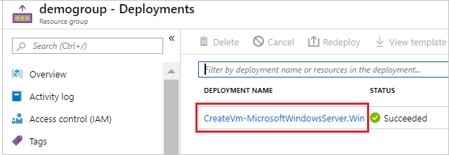
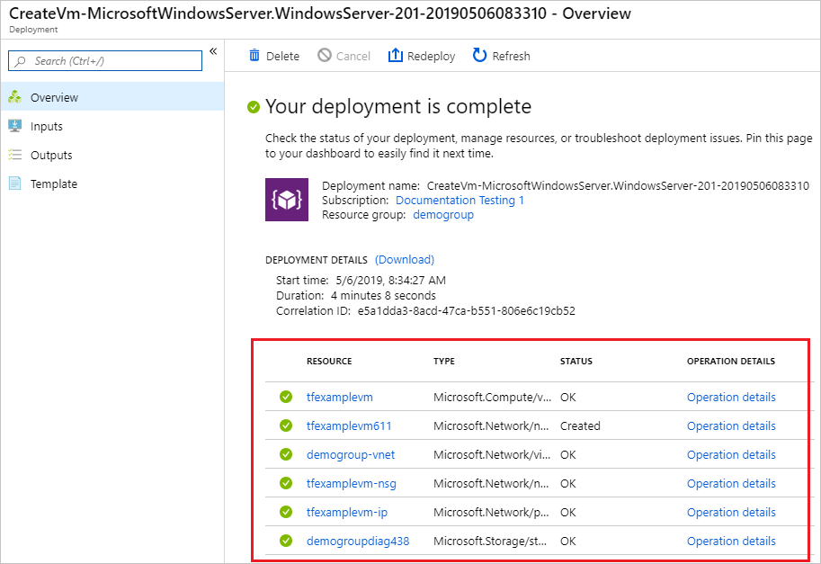
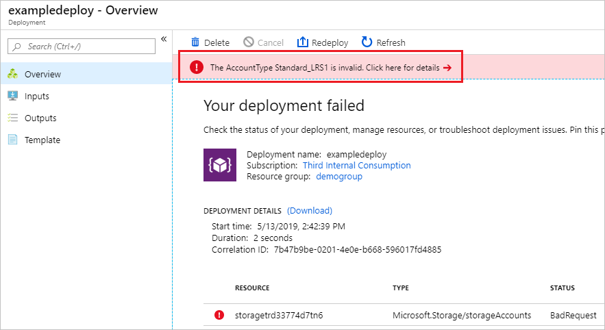
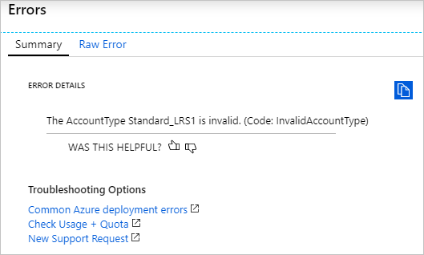
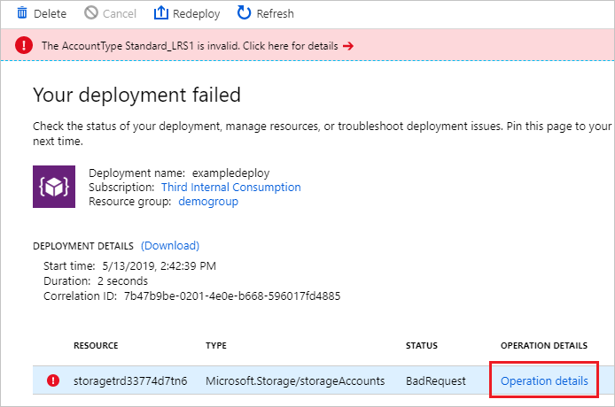
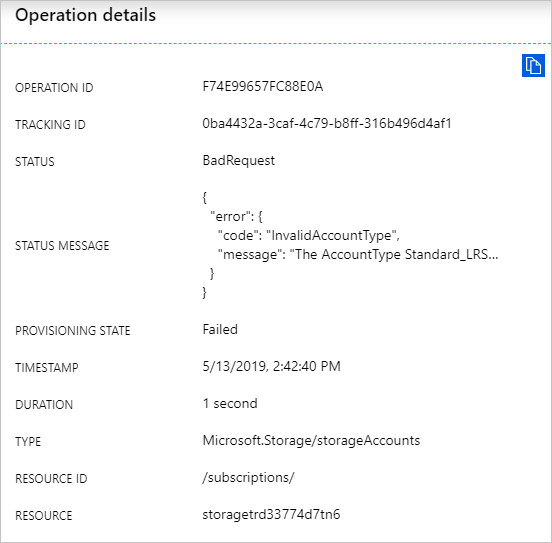

# View deployment history with Azure Resource Manager

Azure Resource Manager enables you to view your deployment history and examine specific operations in past deployments. You can see the resources that were deployed, and get information about any errors.

For help with resolving particular deployment errors, see [Resolve common errors when deploying resources to Azure with Azure Resource Manager](resource-manager-common-deployment-errors.md).

## Portal

To get details about a deployment from the deployment history.

1. Select the resource group you want to examine.

1. Select the link under **Deployments**.

   

1. Select one of the deployments from the deployment history.

   

1. A summary of the deployment is displayed, including a list of the resources that were deployed.

    

1. To view the template used for the deployment, select **Template**. You can download the template to reuse it.

    

1. If your deployment failed, you see an error message. Select the error message for more details.

    

1. The detailed error message is displayed.

    

1. The correlation ID is used to track related events, and can be helpful when working with technical support to troubleshoot a deployment.

    

1. To learn more about the step that failed, select **Operation details**.

    

1. You see the details for that step of the deployment.

    

## PowerShell

[!INCLUDE [updated-for-az](../../includes/updated-for-az.md)]

To get the overall status of a deployment, use the **Get-AzResourceGroupDeployment** command.

```azurepowershell-interactive
Get-AzResourceGroupDeployment -ResourceGroupName ExampleGroup
```

Or, you can filter the results for only those deployments that have failed.

```azurepowershell-interactive
Get-AzResourceGroupDeployment -ResourceGroupName ExampleGroup | Where-Object ProvisioningState -eq Failed
```

The correlation ID is used to track related events, and can be helpful when working with technical support to troubleshoot a deployment. To get the correlation ID, use:

```azurepowershell-interactive
(Get-AzResourceGroupDeployment -ResourceGroupName ExampleGroup -DeploymentName azuredeploy).CorrelationId
```

Each deployment includes multiple operations. Each operation represents a step in the deployment process. To discover what went wrong with a deployment, you usually need to see details about the deployment operations. You can see the status of the operations with **Get-AzResourceGroupDeploymentOperation**.

```azurepowershell-interactive
Get-AzResourceGroupDeploymentOperation -ResourceGroupName ExampleGroup -DeploymentName azuredeploy
```

Which returns multiple operations with each one in the following format:

```powershell
Id             : /subscriptions/{guid}/resourceGroups/ExampleGroup/providers/Microsoft.Resources/deployments/Microsoft.Template/operations/A3EB2DA598E0A780
OperationId    : A3EB2DA598E0A780
Properties     : @{provisioningOperation=Create; provisioningState=Succeeded; timestamp=2019-05-13T21:42:40.7151512Z;
                duration=PT23.0227078S; trackingId=11d376e8-5d6d-4da8-847e-6f23c6443fbf;
                serviceRequestId=0196828d-8559-4bf6-b6b8-8b9057cb0e23; statusCode=OK; targetResource=}
PropertiesText : {duration:PT23.0227078S, provisioningOperation:Create, provisioningState:Succeeded,
                serviceRequestId:0196828d-8559-4bf6-b6b8-8b9057cb0e23...}
```

To get more details about failed operations, retrieve the properties for operations with **Failed** state.

```azurepowershell-interactive
(Get-AzResourceGroupDeploymentOperation -DeploymentName azuredeploy -ResourceGroupName ExampleGroup).Properties | Where-Object ProvisioningState -eq Failed
```

Which returns all the failed operations with each one in the following format:

```powershell
provisioningOperation : Create
provisioningState     : Failed
timestamp             : 2019-05-13T21:42:40.7151512Z
duration              : PT3.1449887S
trackingId            : f4ed72f8-4203-43dc-958a-15d041e8c233
serviceRequestId      : a426f689-5d5a-448d-a2f0-9784d14c900a
statusCode            : BadRequest
statusMessage         : @{error=}
targetResource        : @{id=/subscriptions/{guid}/resourceGroups/ExampleGroup/providers/
                       Microsoft.Network/publicIPAddresses/myPublicIP;
                       resourceType=Microsoft.Network/publicIPAddresses; resourceName=myPublicIP}
```

Note the serviceRequestId and the trackingId for the operation. The serviceRequestId can be helpful when working with technical support to troubleshoot a deployment. You'll use the trackingId in the next step to focus on a particular operation.

To get the status message of a particular failed operation, use the following command:

```azurepowershell-interactive
((Get-AzResourceGroupDeploymentOperation -DeploymentName azuredeploy -ResourceGroupName ExampleGroup).Properties | Where-Object trackingId -eq f4ed72f8-4203-43dc-958a-15d041e8c233).StatusMessage.error
```

Which returns:

```powershell
code           message                                                                        details
----           -------                                                                        -------
DnsRecordInUse DNS record dns.westus.cloudapp.azure.com is already used by another public IP. {}
```

Every deployment operation in Azure includes request and response content. During deployment, you can use **DeploymentDebugLogLevel** parameter to specify that the request and/or response are logged.

You get that information from the log, and save it locally by using the following PowerShell commands:

```powershell
(Get-AzResourceGroupDeploymentOperation -DeploymentName "TestDeployment" -ResourceGroupName "Test-RG").Properties.request | ConvertTo-Json |  Out-File -FilePath <PathToFile>

(Get-AzResourceGroupDeploymentOperation -DeploymentName "TestDeployment" -ResourceGroupName "Test-RG").Properties.response | ConvertTo-Json |  Out-File -FilePath <PathToFile>
```

## Azure CLI

To get the overall status of a deployment, use the **azure group deployment show** command.

```azurecli-interactive
az group deployment show -g ExampleGroup -n ExampleDeployment
```
  
The correlation ID is used to track related events, and can be helpful when working with technical support to troubleshoot a deployment.

```azurecli-interactive
az group deployment show -g ExampleGroup -n ExampleDeployment --query properties.correlationId
```

To see the operations for a deployment, use:

```azurecli-interactive
az group deployment operation list -g ExampleGroup -n ExampleDeployment
```

## REST

To get information about a deployment, use the [Get information about a template deployment](https://docs.microsoft.com/rest/api/resources/deployments) operation.

```
GET https://management.azure.com/subscriptions/{subscription-id}/resourcegroups/{resource-group-name}/providers/microsoft.resources/deployments/{deployment-name}?api-version={api-version}
```

In the response, note in particular the **provisioningState**, **correlationId**, and **error** elements. The **correlationId** is used to track related events, and can be helpful when working with technical support to troubleshoot a deployment.

```json
{ 
 ...
 "properties": {
   "provisioningState":"Failed",
   "correlationId":"d5062e45-6e9f-4fd3-a0a0-6b2c56b15757",
   ...
   "error":{
     "code":"DeploymentFailed","message":"At least one resource deployment operation failed. Please list deployment operations for details. Please see https://aka.ms/arm-debug for usage details.",
     "details":[{"code":"Conflict","message":"{\r\n  \"error\": {\r\n    \"message\": \"Conflict\",\r\n    \"code\": \"Conflict\"\r\n  }\r\n}"}]
   }  
 }
}
```

To get information about deployments, use [List all template deployment operations](https://docs.microsoft.com/rest/api/resources/deployments). 

```
GET https://management.azure.com/subscriptions/{subscription-id}/resourcegroups/{resource-group-name}/providers/microsoft.resources/deployments/{deployment-name}/operations?$skiptoken={skiptoken}&api-version={api-version}
```
   
The response includes request and/or response information based on what you specified in the **debugSetting** property during deployment.

```json
{
 ...
 "properties": 
 {
   ...
   "request":{
     "content":{
       "location":"West US",
       "properties":{
         "accountType": "Standard_LRS"
       }
     }
   },
   "response":{
     "content":{
       "error":{
         "message":"Conflict","code":"Conflict"
       }
     }
   }
 }
}
```

## Next steps
* For help with resolving particular deployment errors, see [Resolve common errors when deploying resources to Azure with Azure Resource Manager](resource-manager-common-deployment-errors.md).
* To learn about using the activity logs to monitor other types of actions, see [View activity logs to manage Azure resources](resource-group-audit.md).
* To validate your deployment before executing it, see [Deploy a resource group with Azure Resource Manager template](resource-group-template-deploy.md).

