# Export an Azure Resource Manager template from existing resources
Resource Manager enables you to export a Resource Manager template from existing resources in your subscription. You can use that generated template to learn about the template syntax or to automate the redeployment of your solution as needed.

It is important to note that there are two different ways to export a template:

* You can export the actual template that you used for a deployment. The exported template includes all the parameters and variables exactly as they appeared in the original template. This approach is helpful when you have deployed resources through the portal. Now, you want to see how to construct the template to create those resources.
* You can export a template that represents the current state of the resource group. The exported template is not based on any template that you used for deployment. Instead, it creates a template that is a snapshot of the resource group. The exported template has many hard-coded values and probably not as many parameters as you would typically define. This approach is useful when you have modified the resource group through the portal or scripts. Now, you need to capture the resource group as a template.

This topic shows both approaches.

In this tutorial, you sign in to the Azure portal, create a storage account, and export the template for that storage account. You add a virtual network to modify the resource group. Finally, you export a new template that represents its current state. Although this article focuses on a simplified infrastructure, you could use these same steps to export a template for a more complicated solution.

## Create a storage account
1. In the [Azure portal](https://portal.azure.com), select **New** > **Storage** > **Storage account**.
   
      
2. Create a storage account with the name **storage**, your initials, and the date. The storage account name must be unique across Azure. If the name is already in use, you see an error message indicating the name is in use. Try a variation. For resource group, select **Create new** and name it **ExportGroup**. You can use the default values for the other properties. Select **Create**.
   
      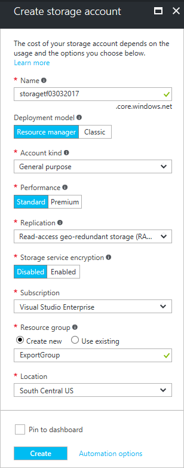

The deployment may take a minute. After the deployment finishes, your subscription contains the storage account.

## View a template from deployment history
1. Go to the resource group blade for your new resource group. Notice that the blade shows the result of the last deployment. Select this link.
   
      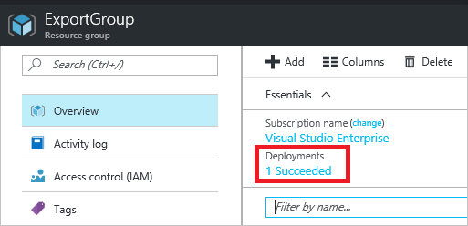
2. You see a history of deployments for the group. In your case, the blade probably lists only one deployment. Select this deployment.
   
     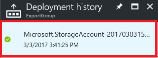
3. The blade displays a summary of the deployment. The summary includes the status of the deployment and its operations and the values that you provided for parameters. To see the template that you used for the deployment, select **View template**.
   
     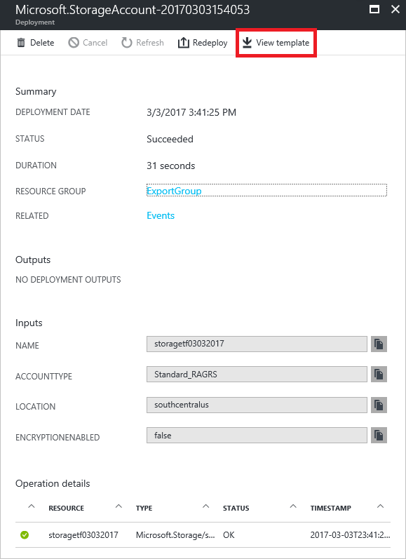
4. Resource Manager retrieves the following seven files for you:
   
   1. **Template** - The template that defines the infrastructure for your solution. When you created the storage account through the portal, Resource Manager used a template to deploy it and saved that template for future reference.
   2. **Parameters** - A parameter file that you can use to pass in values during deployment. It contains the values that you provided during the first deployment, but you can change any of these values when you redeploy the template.
   3. **CLI** - An Azure command-line-interface (CLI) script file that you can use to deploy the template.
   3. **CLI 2.0** - An Azure command-line-interface (CLI) script file that you can use to deploy the template.
   4. **PowerShell** - An Azure PowerShell script file that you can use to deploy the template.
   5. **.NET** - A .NET class that you can use to deploy the template.
   6. **Ruby** - A Ruby class that you can use to deploy the template.
      
      The files are available through links across the blade. By default, the blade displays the template.
      
       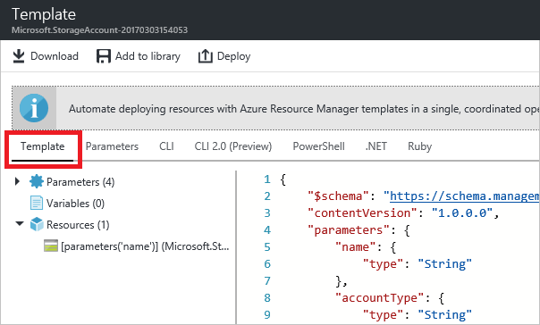
      
      Let's pay particular attention to the template. Your template should look similar to:
      
      ```json
      {
        "$schema": "https://schema.management.azure.com/schemas/2015-01-01/deploymentTemplate.json#",
        "contentVersion": "1.0.0.0",
        "parameters": {
          "name": {
            "type": "String"
          },
          "accountType": {
            "type": "String"
          },
          "location": {
            "type": "String"
          },
          "encryptionEnabled": {
            "defaultValue": false,
            "type": "Bool"
          }
        },
        "resources": [
          {
            "type": "Microsoft.Storage/storageAccounts",
            "sku": {
              "name": "[parameters('accountType')]"
            },
            "kind": "Storage",
            "name": "[parameters('name')]",
            "apiVersion": "2016-01-01",
            "location": "[parameters('location')]",
            "properties": {
              "encryption": {
                "services": {
                  "blob": {
                    "enabled": "[parameters('encryptionEnabled')]"
                  }
                },
                "keySource": "Microsoft.Storage"
              }
            }
          }
        ]
      }
      ```

This template is the actual template used to create your storage account. Notice it contains parameters that enable you to deploy different types of storage accounts. To learn more about the structure of a template, see [Authoring Azure Resource Manager templates](resource-group-authoring-templates.md). For the complete list of the functions you can use in a template, see [Azure Resource Manager template functions](resource-group-template-functions.md).

## Add a virtual network
The template that you downloaded in the previous section represented the infrastructure for that original deployment. However, it will not account for any changes you make after the deployment.
To illustrate this issue, let's modify the resource group by adding a virtual network through the portal.

1. In the resource group blade, select **Add**.
   
      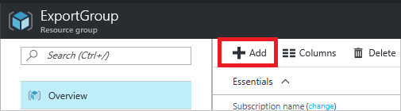
2. Select **Virtual network** from the available resources.
   
      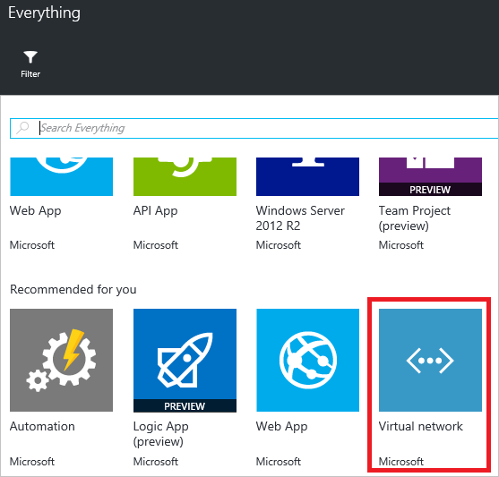
3. Name your virtual network **VNET**, and use the default values for the other properties. Select **Create**.
   
      
4. After the virtual network has successfully deployed to your resource group, look again at the deployment history. You now see two deployments. If you do not see the second deployment, you may need to close your resource group blade and reopen it. Select the more recent deployment.
   
      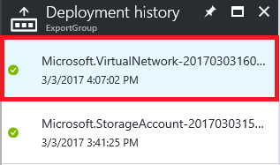
5. View the template for that deployment. Notice that it defines only the virtual network. It does not include the storage account you deployed earlier. You no longer have a template that represents all the resources in your resource group.

## Export the template from resource group
To get the current state of your resource group, export a template that shows a snapshot of the resource group.  

> [!NOTE]
> You cannot export a template for a resource group that has more than 200 resources.
> 
> 

1. To view the template for a resource group, select **Automation script**.
   
      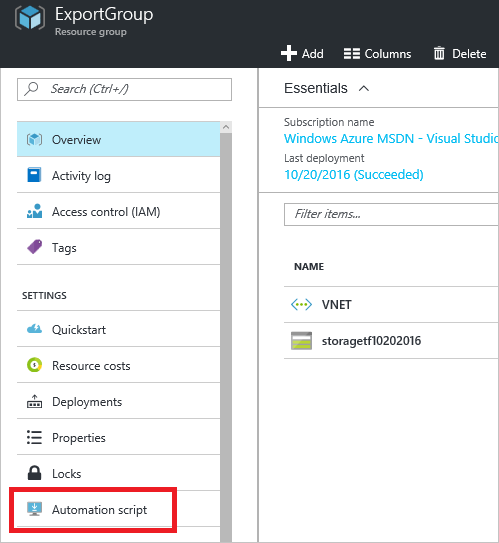
   
     Not all resource types support the export template function. If your resource group only contains the storage account and virtual network shown in this article, you do not see an error. However, if you have created other resource types, you may see an error stating that there is a problem with the export. You learn how to handle those issues in the [Fix export issues](#fix-export-issues) section.
2. You again see the six files that you can use to redeploy the solution, but this time the template is a little different. This template has only two parameters: one for the storage account name, and one for the virtual network name.

   ```json
   "parameters": {
     "virtualNetworks_VNET_name": {
       "defaultValue": "VNET",
       "type": "String"
     },
     "storageAccounts_storagetf05092016_name": {
       "defaultValue": "storagetf05092016",
       "type": "String"
     }
   },
   ```
   
   Resource Manager did not retrieve the templates that you used during deployment. Instead, it generated a new template that's based on the current configuration of the resources. For example, the template sets the storage account location and replication value to:

   ```json 
   "location": "northeurope",
   "tags": {},
   "properties": {
     "accountType": "Standard_RAGRS"
   },
   ```
3. You have a couple of options for continuing to work with this template. You can either download the template and work on it locally with a JSON editor. Or, you can save the template to your library and work on it through the portal.
   
     If you are comfortable using a JSON editor like [VS Code](resource-manager-vs-code.md) or [Visual Studio](vs-azure-tools-resource-groups-deployment-projects-create-deploy.md), you might prefer downloading the template locally and using that editor. If you are not set up with a JSON editor, you might prefer editing the template through the portal. The remainder of this topic assumes you have saved the template to your library in the portal. However, you make the same syntax changes to the template whether working locally with a JSON editor or through the portal.
   
     To work locally, select **Download**.
   
      
   
     To work through the portal, select **Add to library**.
   
      
   
     When adding a template to the library, give the template a name and description. Then, select **Save**.
   
     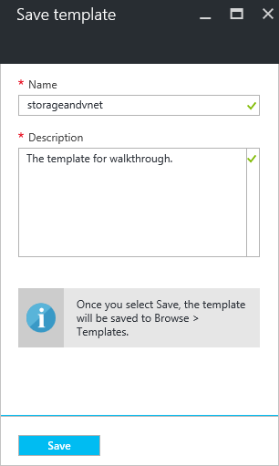
4. To view a template saved in your library, select **More services**, type **Templates** to filter results, select **Templates**.
   
      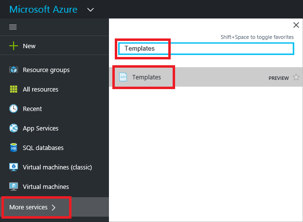
5. Select the template with the name you saved.
   
      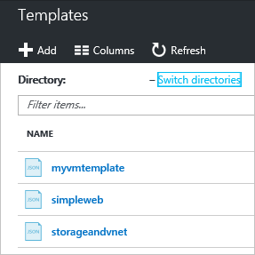

## Customize the template
The exported template works fine if you want to create the same storage account and virtual network for every deployment. However, Resource Manager provides options so that you can deploy templates with a lot more flexibility. For example, during deployment, you might want to specify the type of storage account to create or the values to use for the virtual network address prefix and subnet prefix.

In this section, you add parameters to the exported template so that you can reuse the template when you deploy these resources to other environments. You also add some features to your template to decrease the likelihood of encountering an error when you deploy your template. You no longer have to guess a unique name for your storage account. Instead, the template creates a unique name. You restrict the values that can be specified for the storage account type to only valid options.

1. To customize the template, select **Edit**.
   
     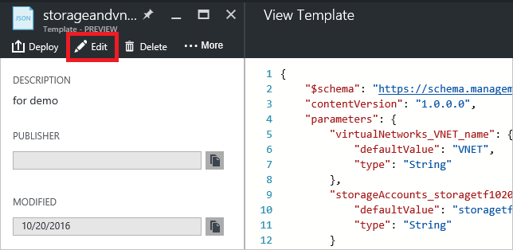
2. Select the template.
   
     
3. To be able to pass the values that you might want to specify during deployment, replace the **parameters** section with new parameter definitions. Notice the values of **allowedValues** for **storageAccount_accountType**. If you accidentally provide an invalid value, that error is recognized before the deployment starts. Also, notice that you are providing only a prefix for the storage account name, and the prefix is limited to 11 characters. When you limit the prefix to 11 characters, you ensure that the complete name does not exceed the maximum number of characters for a storage account. The prefix enables you to apply a naming convention to your storage accounts. You will see how to create a unique name in the next step.

   ```json
   "parameters": {
     "storageAccount_prefix": {
       "type": "string",
       "maxLength": 11
     },
     "storageAccount_accountType": {
       "defaultValue": "Standard_RAGRS",
       "type": "string",
       "allowedValues": [
         "Standard_LRS",
         "Standard_ZRS",
         "Standard_GRS",
         "Standard_RAGRS",
         "Premium_LRS"
       ]
     },
     "virtualNetwork_name": {
       "type": "string"
     },
     "addressPrefix": {
       "defaultValue": "10.0.0.0/16",
       "type": "string"
     },
     "subnetName": {
       "defaultValue": "subnet-1",
       "type": "string"
     },
     "subnetAddressPrefix": {
       "defaultValue": "10.0.0.0/24",
       "type": "string"
     }
   },
   ```

4. The **variables** section of your template is currently empty. In the **variables** section, you create values that simplify the syntax for the rest of your template. Replace this section with a new variable definition. The **storageAccount_name** variable concatenates the prefix from the parameter to a unique string that is generated based on the identifier of the resource group. You no longer have to guess a unique name when providing a parameter value.

   ```json
   "variables": {
     "storageAccount_name": "[concat(parameters('storageAccount_prefix'), uniqueString(resourceGroup().id))]"
   },
   ```

5. To use the parameters and variable in the resource definitions, replace the **resources** section with new resource definitions. Notice that little has changed in the resource definitions other than the value that's assigned to the resource property. The properties are the same as the properties from the exported template. You are simply assigning properties to parameter values instead of hard-coded values. The location of the resources is set to use the same location as the resource group through the **resourceGroup().location** expression. The variable that you created for the storage account name is referenced through the **variables** expression.

   ```json
   "resources": [
     {
       "type": "Microsoft.Network/virtualNetworks",
       "name": "[parameters('virtualNetwork_name')]",
       "apiVersion": "2015-06-15",
       "location": "[resourceGroup().location]",
       "properties": {
         "addressSpace": {
           "addressPrefixes": [
             "[parameters('addressPrefix')]"
           ]
         },
         "subnets": [
           {
             "name": "[parameters('subnetName')]",
             "properties": {
               "addressPrefix": "[parameters('subnetAddressPrefix')]"
             }
           }
         ]
       },
       "dependsOn": []
     },
     {
       "type": "Microsoft.Storage/storageAccounts",
       "name": "[variables('storageAccount_name')]",
       "apiVersion": "2015-06-15",
       "location": "[resourceGroup().location]",
       "tags": {},
       "properties": {
         "accountType": "[parameters('storageAccount_accountType')]"
       },
       "dependsOn": []
     }
   ]
   ```

6. Select **OK** when you are done editing the template.
7. Select **Save** to save the changes to the template.
   
     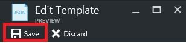
8. To deploy the updated template, select **Deploy**.
   
     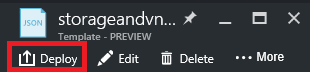
9. Provide parameter values, and select a new resource group to deploy the resources to.

## Update the downloaded parameters file
If you are working with the downloaded files (rather than the portal library), you need to update the downloaded parameter file. It no longer matches the parameters in your template. You do not have to use a parameter file, but it can simplify the process when you redeploy an environment. You use the default values that are defined in the template for many of the parameters so that your parameter file only needs two values.

Replace the contents of the parameters.json file with:

```json
{
  "$schema": "https://schema.management.azure.com/schemas/2015-01-01/deploymentParameters.json#",
  "contentVersion": "1.0.0.0",
  "parameters": {
    "storageAccount_prefix": {
      "value": "storage"
    },
    "virtualNetwork_name": {
      "value": "VNET"
    }
  }
}
```

The updated parameter file provides values only for parameters that do not have a default value. You can provide values for the other parameters when you want a value that is different from the default value.

## Fix export issues
Not all resource types support the export template function. Resource Manager specifically does not export some resource types to prevent exposing sensitive data. For example, if you have a connection string in your site config, you probably do not want it explicitly displayed in an exported template. To resolve this issue, manually add the missing resources back into your template.

> [!NOTE]
> You only encounter export issues when exporting from a resource group rather than from your deployment history. If your last deployment accurately represents the current state of the resource group, you should export the template from the deployment history rather than from the resource group. Only export from a resource group when you have made changes to the resource group that are not defined in a single template.
> 
> 

For example, if you export a template for a resource group that contains a web app, SQL Database, and connection string in the site config, you see the following message:

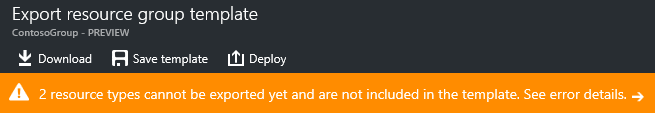

Selecting the message shows you exactly which resource types were not exported. 

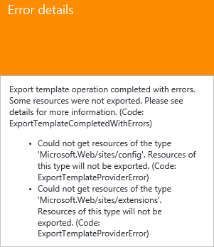

This topic shows common fixes.

### Connection string
In the web sites resource, add a definition for the connection string to the database:

```json
{
  "type": "Microsoft.Web/sites",
  ...
  "resources": [
    {
      "apiVersion": "2015-08-01",
      "type": "config",
      "name": "connectionstrings",
      "dependsOn": [
          "[concat('Microsoft.Web/Sites/', parameters('<site-name>'))]"
      ],
      "properties": {
          "DefaultConnection": {
            "value": "[concat('Data Source=tcp:', reference(concat('Microsoft.Sql/servers/', parameters('<database-server-name>'))).fullyQualifiedDomainName, ',1433;Initial Catalog=', parameters('<database-name>'), ';User Id=', parameters('<admin-login>'), '@', parameters('<database-server-name>'), ';Password=', parameters('<admin-password>'), ';')]",
              "type": "SQLServer"
          }
      }
    }
  ]
}
```    

### Web site extension
In the web site resource, add a definition for the code to install:

```json
{
  "type": "Microsoft.Web/sites",
  ...
  "resources": [
    {
      "name": "MSDeploy",
      "type": "extensions",
      "location": "[resourceGroup().location]",
      "apiVersion": "2015-08-01",
      "dependsOn": [
        "[concat('Microsoft.Web/sites/', parameters('<site-name>'))]"
      ],
      "properties": {
        "packageUri": "[concat(parameters('<artifacts-location>'), '/', parameters('<package-folder>'), '/', parameters('<package-file-name>'), parameters('<sas-token>'))]",
        "dbType": "None",
        "connectionString": "",
        "setParameters": {
          "IIS Web Application Name": "[parameters('<site-name>')]"
        }
      }
    }
  ]
}
```

### Virtual machine extension
For examples of virtual machine extensions, see [Azure Windows VM Extension Configuration Samples](../virtual-machines/windows/extensions-configuration-samples.md?toc=%2fazure%2fvirtual-machines%2fwindows%2ftoc.json).

### Virtual network gateway
Add a virtual network gateway resource type.

```json
{
  "type": "Microsoft.Network/virtualNetworkGateways",
  "name": "[parameters('<gateway-name>')]",
  "apiVersion": "2015-06-15",
  "location": "[resourceGroup().location]",
  "properties": {
    "gatewayType": "[parameters('<gateway-type>')]",
    "ipConfigurations": [
      {
        "name": "default",
        "properties": {
          "privateIPAllocationMethod": "Dynamic",
          "subnet": {
            "id": "[resourceId('Microsoft.Network/virtualNetworks/subnets', parameters('<vnet-name>'), parameters('<new-subnet-name>'))]"
          },
          "publicIpAddress": {
            "id": "[resourceId('Microsoft.Network/publicIPAddresses', parameters('<new-public-ip-address-Name>'))]"
          }
        }
      }
    ],
    "enableBgp": false,
    "vpnType": "[parameters('<vpn-type>')]"
  },
  "dependsOn": [
    "Microsoft.Network/virtualNetworks/codegroup4/subnets/GatewaySubnet",
    "[concat('Microsoft.Network/publicIPAddresses/', parameters('<new-public-ip-address-Name>'))]"
  ]
},
```

### Local network gateway
Add a local network gateway resource type.

```json
{
    "type": "Microsoft.Network/localNetworkGateways",
    "name": "[parameters('<local-network-gateway-name>')]",
    "apiVersion": "2015-06-15",
    "location": "[resourceGroup().location]",
    "properties": {
      "localNetworkAddressSpace": {
        "addressPrefixes": "[parameters('<address-prefixes>')]"
      }
    }
}
```

### Connection
Add a connection resource type.

```json
{
    "apiVersion": "2015-06-15",
    "name": "[parameters('<connection-name>')]",
    "type": "Microsoft.Network/connections",
    "location": "[resourceGroup().location]",
    "properties": {
        "virtualNetworkGateway1": {
        "id": "[resourceId('Microsoft.Network/virtualNetworkGateways', parameters('<gateway-name>'))]"
      },
      "localNetworkGateway2": {
        "id": "[resourceId('Microsoft.Network/localNetworkGateways', parameters('<local-gateway-name>'))]"
      },
      "connectionType": "IPsec",
      "routingWeight": 10,
      "sharedKey": "[parameters('<shared-key>')]"
    }
},
```


## Next steps
Congratulations! You have learned how to export a template from resources that you created in the portal.

* You can deploy a template through [PowerShell](resource-group-template-deploy.md), [Azure CLI](resource-group-template-deploy-cli.md), or [REST API](resource-group-template-deploy-rest.md).
* To see how to export a template through PowerShell, see [Using Azure PowerShell with Azure Resource Manager](powershell-azure-resource-manager.md).
* To see how to export a template through Azure CLI, see [Use the Azure CLI for Mac, Linux, and Windows with Azure Resource Manager](xplat-cli-azure-resource-manager.md).

