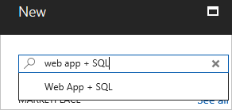
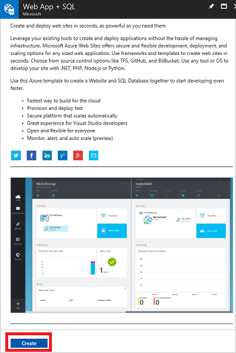
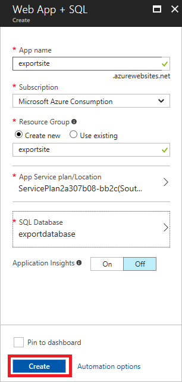
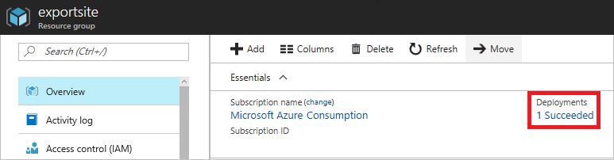
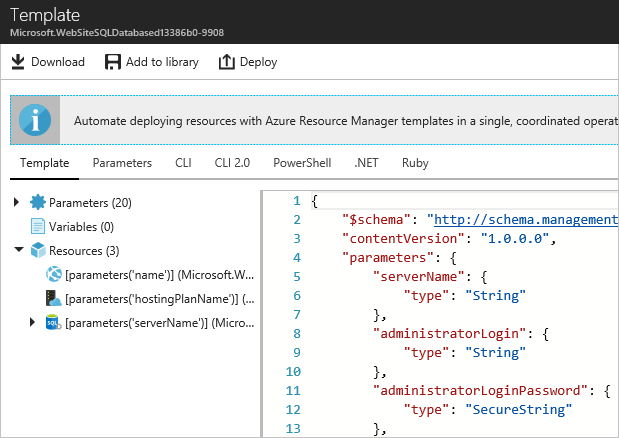
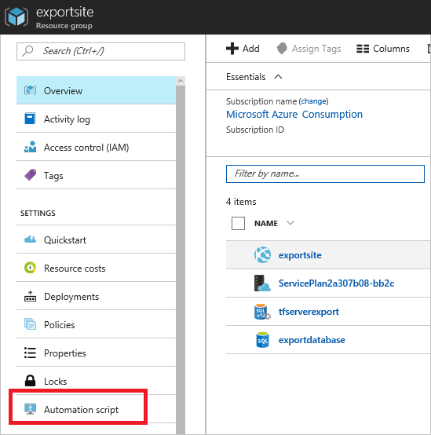
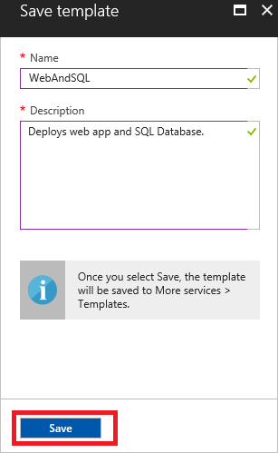
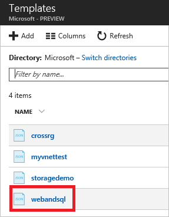
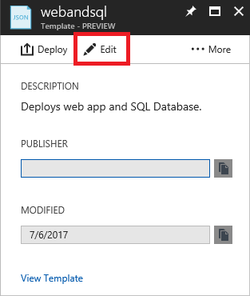
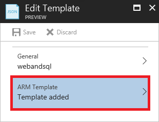

# Export an Azure Resource Manager template from existing resources
In this article, you learn how to export a Resource Manager template from existing resources in your subscription. You can use that generated template to gain a better understanding of template syntax.

There are two ways to export a template:

* You can export the **actual template used for deployment**. The exported template includes all the parameters and variables exactly as they appeared in the original template. This approach is helpful when you deployed resources through the portal, and want to see the template to create those resources. This template is readily usable. 
* You can export a **generated template that represents the current state of the resource group**. The exported template is not based on any template that you used for deployment. Instead, it creates a template that is a snapshot of the resource group. The exported template has many hard-coded values and probably not as many parameters as you would typically define. This approach is useful when you have modified the resource group after deployment. This template usually requires modifications before it is usable.

This topic shows both approaches through the portal.

## Deploy resources
Let's start by deploying resources to Azure that you can use for exporting as a template. If you already have a resource group in your subscription that you want to export to a template, you can skip this section. The remainder of this article assumes you have deployed the web app and SQL database solution shown in this section. If you use a different solution, your experience might be a little different, but the steps to export a template are the same. 

1. In the [Azure portal](https://portal.azure.com), select **New**.
   
      
2. Search for **web app + SQL** and select it from the available options.
   
      

3. Select **Create**.

      

4. Provide the required values for the web app and SQL database. Select **Create**.

      

The deployment may take a minute. After the deployment finishes, your subscription contains the solution.

## View template from deployment history
1. Go to the resource group blade for your new resource group. Notice that the blade shows the result of the last deployment. Select this link.
   
      
2. You see a history of deployments for the group. In your case, the blade probably lists only one deployment. Select this deployment.
   
     
3. The blade displays a summary of the deployment. The summary includes the status of the deployment and its operations and the values that you provided for parameters. To see the template that you used for the deployment, select **View template**.
   
     
4. Resource Manager retrieves the following seven files for you:
   
   1. **Template** - The template that defines the infrastructure for your solution. When you created the storage account through the portal, Resource Manager used a template to deploy it and saved that template for future reference.
   2. **Parameters** - A parameter file that you can use to pass in values during deployment. It contains the values that you provided during the first deployment. You can change any of these values when you redeploy the template.
   3. **CLI** - An Azure command-line-interface (CLI) script file that you can use to deploy the template.
   3. **CLI 2.0** - An Azure command-line-interface (CLI) script file that you can use to deploy the template.
   4. **PowerShell** - An Azure PowerShell script file that you can use to deploy the template.
   5. **.NET** - A .NET class that you can use to deploy the template.
   6. **Ruby** - A Ruby class that you can use to deploy the template.
      
      The files are available through links across the blade. By default, the blade displays the template.
      
       
      
This template is the actual template used to create your web app and SQL database. Notice it contains parameters that enable you to provide different values during deployment. To learn more about the structure of a template, see [Authoring Azure Resource Manager templates](resource-group-authoring-templates.md).

## Export the template from resource group
If you have manually changed your resources or added resources in multiple deployments, retrieving a template from the deployment history does not reflect the current state of the resource group. This section shows you how to export a template that reflects the current state of the resource group. 

> [!NOTE]
> You cannot export a template for a resource group that has more than 200 resources.
> 
> 

1. To view the template for a resource group, select **Automation script**.
   
      
   
     Resource Manager evaluates the resources in the resource group, and generates a template for those resources. Not all resource types support the export template function. You may see an error stating that there is a problem with the export. You learn how to handle those issues in the [Fix export issues](#fix-export-issues) section.
2. You again see the six files that you can use to redeploy the solution. However, this time the template is a little different. Notice that the generated template contains fewer parameters than the template in previous section. Also, many of the values (like location and SKU values) are hard-coded in this template rather than accepting a parameter value. Before reusing this template, you might want to edit the template to make better use of parameters. 
   
3. You have a couple of options for continuing to work with this template. You can either download the template and work on it locally with a JSON editor. Or, you can save the template to your library and work on it through the portal.
   
     If you are comfortable using a JSON editor like [VS Code](https://code.visualstudio.com/) or [Visual Studio](vs-azure-tools-resource-groups-deployment-projects-create-deploy.md), you might prefer downloading the template locally and using that editor. To work locally, select **Download**.
   
      
   
     If you are not set up with a JSON editor, you might prefer editing the template through the portal. The remainder of this topic assumes you have saved the template to your library in the portal. However, you make the same syntax changes to the template whether working locally with a JSON editor or through the portal. To work through the portal, select **Add to library**.
   
      
   
     When adding a template to the library, give the template a name and description. Then, select **Save**.
   
     
4. To view a template saved in your library, select **More services**, type **Templates** to filter results, select **Templates**.
   
      
5. Select the template with the name you saved.
   
      

## Customize the template
The exported template works fine if you want to create the same web app and SQL database for every deployment. However, Resource Manager provides options so that you can deploy templates with a lot more flexibility. This article shows you how to add parameters for the database administrator name and password. You can use this same approach to add more flexibility for other values in the template.

1. To customize the template, select **Edit**.
   
     
2. Select the template.
   
     
3. To be able to pass the values that you might want to specify during deployment, add the following two parameters to the **parameters** section in the template:

   ```json
   "administratorLogin": {
       "type": "String"
   },
   "administratorLoginPassword": {
       "type": "SecureString"
   },
   ```

4. To use the new parameters, replace the SQL server definition in the **resources** section. Notice that **administratorLogin** and **administratorLoginPassword** now use parameter values.

   ```json
   {
       "comments": "Generalized from resource: '/subscriptions/{subscription-id}/resourceGroups/exportsite/providers/Microsoft.Sql/servers/tfserverexport'.",
       "type": "Microsoft.Sql/servers",
       "kind": "v12.0",
       "name": "[parameters('servers_tfserverexport_name')]",
       "apiVersion": "2014-04-01-preview",
       "location": "South Central US",
       "scale": null,
       "properties": {
           "administratorLogin": "[parameters('administratorLogin')]",
           "administratorLoginPassword": "[parameters('administratorLoginPassword')]",
           "version": "12.0"
       },
       "dependsOn": []
   },
   ```

6. Select **OK** when you are done editing the template.
7. Select **Save** to save the changes to the template.
   
     
8. To redeploy the updated template, select **Deploy**.
   
     
9. Provide parameter values, and select a resource group to deploy the resources to.


## Fix export issues
Not all resource types support the export template function. To resolve this issue, manually add the missing resources back into your template. The error message includes the resource types that cannot be exported. Find that resource type in [Template reference](/azure/templates/). For example, to manually add a virtual network gateway, see [Microsoft.Network/virtualNetworkGateways template reference](/azure/templates/microsoft.network/virtualnetworkgateways).

> [!NOTE]
> You only encounter export issues when exporting from a resource group rather than from your deployment history. If your last deployment accurately represents the current state of the resource group, you should export the template from the deployment history rather than from the resource group. Only export from a resource group when you have made changes to the resource group that are not defined in a single template.
> 
> 

## Next steps
You have learned how to export a template from resources that you created in the portal.

* You can deploy a template through [PowerShell](resource-group-template-deploy.md), [Azure CLI](resource-group-template-deploy-cli.md), or [REST API](resource-group-template-deploy-rest.md).
* To see how to export a template through PowerShell, see [Using Azure PowerShell with Azure Resource Manager](powershell-azure-resource-manager.md).
* To see how to export a template through Azure CLI, see [Use the Azure CLI for Mac, Linux, and Windows with Azure Resource Manager](xplat-cli-azure-resource-manager.md).

