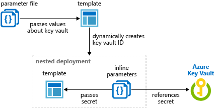

# Use Azure Key Vault to pass secure parameter value during deployment

Instead of putting a secure value (like a password) directly in your template or parameter file, you can retrieve the value from an [Azure Key Vault](../key-vault/key-vault-whatis.md) during a deployment. You retrieve the value by referencing the key vault and secret in your parameter file. The value is never exposed because you only reference its key vault ID. The key vault can exist in a different subscription than the resource group you're deploying to.

## Deploy key vaults and secrets

To access a key vault during template deployment, set `enabledForTemplateDeployment` on the key vault to `true`.

The following Azure CLI and Azure PowerShell samples show how to create the key vault, and add a secret.

```azurecli
az group create --name $resourceGroupName --location $location
az keyvault create \
  --name $keyVaultName \
  --resource-group $resourceGroupName \
  --location $location \
  --enabled-for-template-deployment true
az keyvault secret set --vault-name $keyVaultName --name "ExamplePassword" --value "hVFkk965BuUv"
```

```azurepowershell
New-AzResourceGroup -Name $resourceGroupName -Location $location
New-AzKeyVault `
  -VaultName $keyVaultName `
  -resourceGroupName $resourceGroupName `
  -Location $location `
  -EnabledForTemplateDeployment
$secretvalue = ConvertTo-SecureString 'hVFkk965BuUv' -AsPlainText -Force
$secret = Set-AzKeyVaultSecret -VaultName $keyVaultName -Name 'ExamplePassword' -SecretValue $secretvalue
```

As the owner of the key vault, you automatically have access to creating secrets. If the user working with secrets isn't the owner of the key vault, grant access with:

```azurecli
az keyvault set-policy \
  --upn $userPrincipalName \
  --name $keyVaultName \
  --secret-permissions set delete get list
```

```azurepowershell
$userPrincipalName = "<Email Address of the deployment operator>"

Set-AzKeyVaultAccessPolicy `
  -VaultName $keyVaultName `
  -UserPrincipalName $userPrincipalName `
  -PermissionsToSecrets set,delete,get,list
```

For more information about creating key vaults and adding secrets, see:

- [Set and retrieve a secret by using CLI](../key-vault/quick-create-cli.md)
- [Set and retrieve a secret by using Powershell](../key-vault/quick-create-powershell.md)
- [Set and retrieve a secret by using the portal](../key-vault/quick-create-portal.md)
- [Set and retrieve a secret by using .NET](../key-vault/quick-create-net.md)
- [Set and retrieve a secret by using Node.js](../key-vault/quick-create-node.md)

## Grant access to the secrets

The user who deploys the template must have the `Microsoft.KeyVault/vaults/deploy/action` permission for the scope of the resource group and key vault. The [Owner](../role-based-access-control/built-in-roles.md#owner) and [Contributor](../role-based-access-control/built-in-roles.md#contributor) roles both grant this access. If you created the key vault, you're the owner so you have the permission.

The following procedure shows how to create a role with the minimum permission, and how to assign the user

1. Create a custom role definition JSON file:

    ```json
    {
      "Name": "Key Vault resource manager template deployment operator",
      "IsCustom": true,
      "Description": "Lets you deploy a resource manager template with the access to the secrets in the Key Vault.",
      "Actions": [
        "Microsoft.KeyVault/vaults/deploy/action"
      ],
      "NotActions": [],
      "DataActions": [],
      "NotDataActions": [],
      "AssignableScopes": [
        "/subscriptions/00000000-0000-0000-0000-000000000000"
      ]
    }
    ```
    Replace "00000000-0000-0000-0000-000000000000" with the subscription ID.

2. Create the new role using the JSON file:

    ```azurecli
    az role definition create --role-definition "<PathToRoleFile>"
    az role assignment create \
      --role "Key Vault resource manager template deployment operator" \
      --assignee $userPrincipalName \
      --resource-group $resourceGroupName
    ```

    ```azurepowershell
    New-AzRoleDefinition -InputFile "<PathToRoleFile>" 
    New-AzRoleAssignment `
      -ResourceGroupName $resourceGroupName `
      -RoleDefinitionName "Key Vault resource manager template deployment operator" `
      -SignInName $userPrincipalName
    ```

    The samples assign the custom role to the user on the resource group level.  

When using a Key Vault with the template for a [Managed Application](../managed-applications/overview.md), you must grant access to the **Appliance Resource Provider** service principal. For more information, see [Access Key Vault secret when deploying Azure Managed Applications](../managed-applications/key-vault-access.md).

## Reference secrets with static ID

With this approach, you reference the key vault in the parameter file, not the template. The following image shows how the parameter file references the secret and passes that value to the template.


[Tutorial: Integrate Azure Key Vault in Resource Manager Template deployment](./resource-manager-tutorial-use-key-vault.md) uses this method.

The following template deploys a SQL server that includes an administrator password. The password parameter is set to a secure string. But, the template doesn't specify where that value comes from.

```json
{
  "$schema": "https://schema.management.azure.com/schemas/2015-01-01/deploymentTemplate.json#",
  "contentVersion": "1.0.0.0",
  "parameters": {
    "adminLogin": {
      "type": "string"
    },
    "adminPassword": {
      "type": "securestring"
    },
    "sqlServerName": {
      "type": "string"
    }
  },
  "resources": [
    {
      "name": "[parameters('sqlServerName')]",
      "type": "Microsoft.Sql/servers",
      "apiVersion": "2015-05-01-preview",
      "location": "[resourceGroup().location]",
      "tags": {},
      "properties": {
        "administratorLogin": "[parameters('adminLogin')]",
        "administratorLoginPassword": "[parameters('adminPassword')]",
        "version": "12.0"
      }
    }
  ],
  "outputs": {
  }
}
```

Now, create a parameter file for the preceding template. In the parameter file, specify a parameter that matches the name of the parameter in the template. For the parameter value, reference the secret from the key vault. You reference the secret by passing the resource identifier of the key vault and the name of the secret:

In the following parameter file, the key vault secret must already exist, and you provide a static value for its resource ID.

```json
{
    "$schema": "https://schema.management.azure.com/schemas/2015-01-01/deploymentParameters.json#",
    "contentVersion": "1.0.0.0",
    "parameters": {
        "adminLogin": {
            "value": "exampleadmin"
        },
        "adminPassword": {
            "reference": {
              "keyVault": {
                "id": "/subscriptions/<subscription-id>/resourceGroups/<rg-name>/providers/Microsoft.KeyVault/vaults/<vault-name>"
              },
              "secretName": "ExamplePassword"
            }
        },
        "sqlServerName": {
            "value": "<your-server-name>"
        }
    }
}
```

If you need to use a version of the secret other than the current version, use the `secretVersion` property.

```json
"secretName": "ExamplePassword",
"secretVersion": "cd91b2b7e10e492ebb870a6ee0591b68"
```

Deploy the template and pass in the parameter file:

For Azure CLI, use:

```azurecli
az group create --name $resourceGroupName --location $location
az group deployment create \
    --resource-group $resourceGroupName \
    --template-uri <The Template File URI> \
    --parameters <The Parameter File>
```

For PowerShell, use:

```powershell
New-AzResourceGroup -Name $resourceGroupName -Location $location
New-AzResourceGroupDeployment `
  -ResourceGroupName $resourceGroupName `
  -TemplateUri <The Template File URI> `
  -TemplateParameterFile <The Parameter File>
```

## Reference secrets with dynamic ID

The previous section showed how to pass a static resource ID for the key vault secret from the parameter. However, in some scenarios, you need to reference a key vault secret that varies based on the current deployment. Or, you may want to pass parameter values to the template rather than create a reference parameter in the parameter file. In either case, you can dynamically generate the resource ID for a key vault secret by using a linked template.

You can't dynamically generate the resource ID in the parameters file because template expressions aren't allowed in the parameters file. 

In your parent template, you add the linked template and pass in a parameter that contains the dynamically generated resource ID. The following image shows how a parameter in the linked template references the secret.



The [following template](https://github.com/Azure/azure-quickstart-templates/tree/master/201-key-vault-use-dynamic-id) dynamically creates the key vault ID and passes it as a parameter.

```json
{
    "$schema": "https://schema.management.azure.com/schemas/2015-01-01/deploymentTemplate.json#",
    "contentVersion": "1.0.0.0",
    "parameters": {
        "location": {
            "type": "string",
            "defaultValue": "[resourceGroup().location]",
            "metadata": {
                "description": "The location where the resources will be deployed."
            }
        },
        "vaultName": {
            "type": "string",
            "metadata": {
                "description": "The name of the keyvault that contains the secret."
            }
        },
        "secretName": {
            "type": "string",
            "metadata": {
                "description": "The name of the secret."
            }
        },
        "vaultResourceGroupName": {
            "type": "string",
            "metadata": {
                "description": "The name of the resource group that contains the keyvault."
            }
        },
        "vaultSubscription": {
            "type": "string",
            "defaultValue": "[subscription().subscriptionId]",
            "metadata": {
                "description": "The name of the subscription that contains the keyvault."
            }
        },
        "_artifactsLocation": {
            "type": "string",
            "metadata": {
                "description": "The base URI where artifacts required by this template are located. When the template is deployed using the accompanying scripts, a private location in the subscription will be used and this value will be automatically generated."
            },
            "defaultValue": "https://raw.githubusercontent.com/Azure/azure-quickstart-templates/master/201-key-vault-use-dynamic-id/"
        },
        "_artifactsLocationSasToken": {
            "type": "securestring",
            "metadata": {
                "description": "The sasToken required to access _artifactsLocation.  When the template is deployed using the accompanying scripts, a sasToken will be automatically generated."
            },
            "defaultValue": ""
        }
    },
    "resources": [
        {
            "apiVersion": "2018-05-01",
            "name": "dynamicSecret",
            "type": "Microsoft.Resources/deployments",
            "properties": {
                "mode": "Incremental",
                "templateLink": {
                    "contentVersion": "1.0.0.0",
                    "uri": "[uri(parameters('_artifactsLocation'), concat('./nested/sqlserver.json', parameters('_artifactsLocationSasToken')))]"
                },
                "parameters": {
                    "location": {
                        "value": "[parameters('location')]"
                    },
                    "adminLogin": {
                        "value": "ghuser"
                    },
                    "adminPassword": {
                        "reference": {
                            "keyVault": {
                                "id": "[resourceId(parameters('vaultSubscription'), parameters('vaultResourceGroupName'), 'Microsoft.KeyVault/vaults', parameters('vaultName'))]"
                            },
                            "secretName": "[parameters('secretName')]"
                        }
                    }
                }
            }
        }
    ],
    "outputs": {
        "sqlFQDN": {
            "type": "string",
            "value": "[reference('dynamicSecret').outputs.sqlFQDN.value]"
        }
    }
}
```

Deploy the preceding template, and provide values for the parameters. You can use the example template from GitHub, but you must provide parameter values for your environment.

For Azure CLI, use:

```azurecli
az group create --name $resourceGroupName --location $location
az group deployment create \
    --resource-group $resourceGroupName \
    --template-uri https://raw.githubusercontent.com/Azure/azure-quickstart-templates/master/201-key-vault-use-dynamic-id/azuredeploy.json \
    --parameters vaultName=$keyVaultName vaultResourceGroupName=examplegroup secretName=examplesecret
```

For PowerShell, use:

```powershell
New-AzResourceGroup -Name $resourceGroupName -Location $location
New-AzResourceGroupDeployment `
  -ResourceGroupName $resourceGroupName `
  -TemplateUri https://raw.githubusercontent.com/Azure/azure-quickstart-templates/master/201-key-vault-use-dynamic-id/azuredeploy.json `
  -vaultName $keyVaultName -vaultResourceGroupName $keyVaultResourceGroupName -secretName $secretName
```

## Next steps

- For general information about key vaults, see [What is Azure Key Vault?](../key-vault/key-vault-overview.md).
- For complete examples of referencing key secrets, see [Key Vault examples](https://github.com/rjmax/ArmExamples/tree/master/keyvaultexamples).
