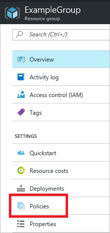
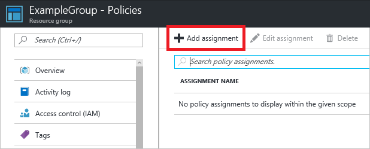
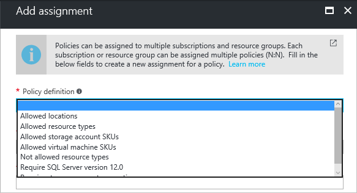
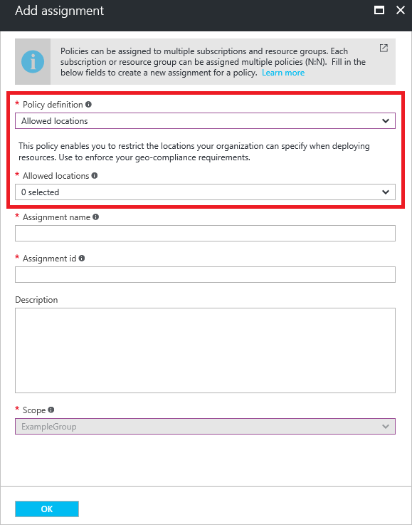
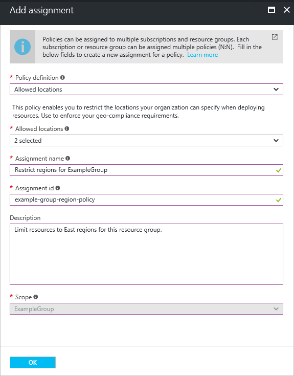
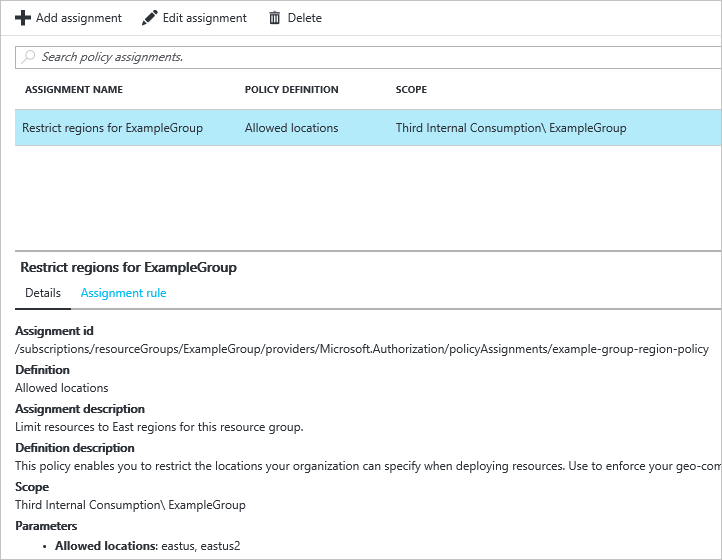
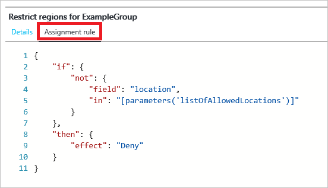
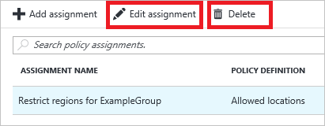
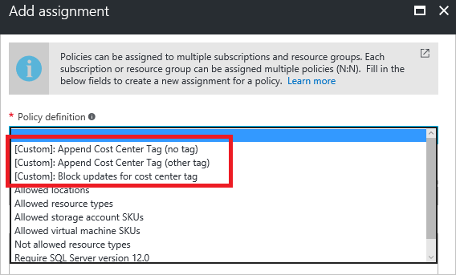

# Use Azure portal to assign and manage resource policies
The Azure portal enables you to assign resource policies to resource groups and subscriptions. The user interface makes it easy to select the policy that you want to assign, and specify parameter values for that policy to customize the policy settings. 

To assign a policy through the portal, the policy definition must already exist in your subscription. Your subscription has several built-in policy definitions that are ready for you to assign to resource groups or subscriptions. You see these built-in policies and any custom policies you have defined when using the portal to assign policies. For an introduction to policies and how to define customized policy, see [Resource policy overview](resource-manager-policy.md).

Policies are inherited by all child resources. So, if a policy is applied to a resource group, it is applicable to all the resources in that resource group. In this article, the term **scope** refers to the resource group or subscription that is assigned the policy. 

Policies are evaluated when creating and updating resources (PUT and PATCH operations).

## Assign a policy

1. To assign a policy to either a resource group or subscription, select that resource group or subscription. In the settings, select **Policies**.

   

2. To create a policy assignment for this scope, select **Add assignment**.

   

3. Select the policy you want to assign. Even if you have not added any policy definitions to your subscription, you see the built-in policies that are available for assignment. These built-in policies cover many common scenarios.

   

4. After selecting a policy, you see a description of the policy, and any parameters for that policy. For example, the following image shows the **Allowed locations** parameter, which is required for the policy that restricts the available locations.

   

5. Through the user interface, select the values to specify for the policy parameters (such as the locations that can be used for deployment).

   

6. Provide values for the other parameters. The scope is automatically assigned based on the blade you selected when starting the policy assignment. Select **OK** when done.

   

  You have assigned the policy to the specified scope.

## View policy assignments

After assigning a policy, you see it in the list of policies for that scope. The **Details** tab shows a summary of the policy assignment.

The **Assignment rule** tab shows the JSON for the policy definition.

## Change an existing policy assignment

To change a policy, select **Edit assignment** or **Delete**

## Assign custom policies

If you have defined custom policies in your subscription, those policies are available for assignment through the portal. Those policies are prefaced with **[Custom]**

## Next steps
* To learn about the JSON syntax for defining policies, see [Resource policy overview](resource-manager-policy.md).
* For guidance on how enterprises can use Resource Manager to effectively manage subscriptions, see [Azure enterprise scaffold - prescriptive subscription governance](resource-manager-subscription-governance.md).
* The policy schema is published at [http://schema.management.azure.com/schemas/2015-10-01-preview/policyDefinition.json](http://schema.management.azure.com/schemas/2015-10-01-preview/policyDefinition.json). 

