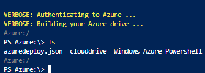
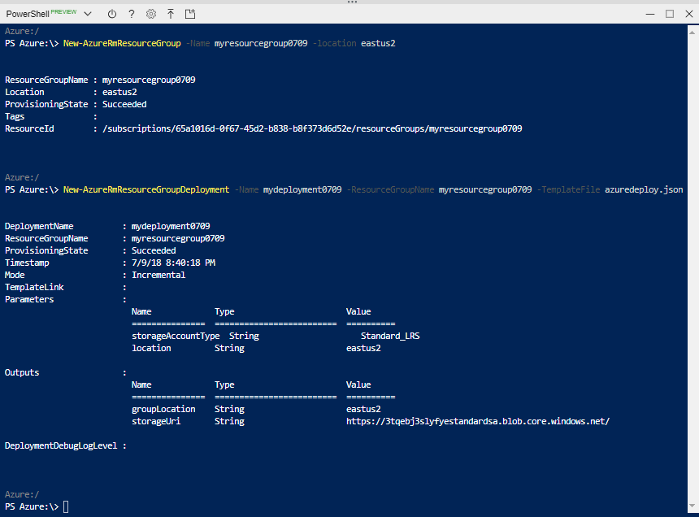

---
title: Use Visual Studio code to create Azure Resource Manager template | Microsoft Docs
description: Use the Azure Resource Manager tools extension to work on Resource Manager templates.
services: azure-resource-manager
documentationcenter: ''
author: mumian
manager: dougeby
editor: tysonn

ms.service: azure-resource-manager
ms.workload: multiple
ms.tgt_pltfrm: na
ms.devlang: na
ms.date: 07/06/2018
ms.topic: quickstart
ms.author: jgao

#Customer intent: As a developer new to Azure deployment, I want to learn how to create a resource manager template so I can deploy an Azure resource.

---

# Quickstart: create Azure Resource Manager templates by using Visual Studio Code

Learn how to create Azure Resource Manager templates by using Visual Studio code and the Azure Resource Manager Tools extension. You can create Resource Manager templates in VS Code without the extension, but the extension provides autocomplete options that simplify template development. It suggests template functions, parameters, and variables that are available in the template. To understand the concepts associated with deploying and managing your Azure solutions, see [Azure Resource Manager overview](resource-group-overview.md).

## Prerequisites

To complete this article, you need:

- [Visual Studio Code](https://code.visualstudio.com/).
- Resource Manager Tools extension.  See [Install the extension
](./resource-manager-create-template-use-visual-studio-code.md#install-the-extension)

## Open a Quickstart template

Instead of creating a template from scratch, you open a template from [Azure Quickstart Templates](https://azure.microsoft.com/resources/templates/). Azure QuickStart Templates is a repository for Resource Manager templates.
The template used in this quickstart is called [Create a standard storage account](https://azure.microsoft.com/resources/templates/101-storage-account-create/).

1. From Visual Studio Code, select **File**>**Open File**.
2. In **File name**, paste the following URL:

    ```
    https://raw.githubusercontent.com/Azure/azure-quickstart-templates/master/101-storage-account-create/azuredeploy.json
    ```
3. Select **Open** to open the file.
4. Select **File**>**Save As** to save a copy of the file in your local computer.


## Edit the template

1. From Visual Studio code, add one more output:

    ```json
    "storageUri": {
      "type": "string",
      "value": "[reference(variables('storageAccountName')).primaryEndpoints.blob]"
    }
    ```
    
    When you are done, the outputs section looks like:
    
    ```json
      "outputs": {
        "storageAccountName": {
          "type": "string",
          "value": "[variables('storageAccountName')]"
        },
        "storageUri": {
          "type": "string",
          "value": "[reference(variables('storageAccountName')).primaryEndpoints.blob]"
        }
      }
    ```
2. Select **File**>**Save** to save the file.

## Deploy the template

There are many methods for deploying templates.  In this quickstart, you use Cloud Shell from the Azure portal.

1. Sign in to the [Azure portal](https://portal.azure.com)
2. Click **Cloud Shell** from the upper right corner as shown in the following image:

    
3. Click **Upload file** from the Cloud shell:

    
4. Select the file you saved earlier in the quickstart.
5. From the cloud shell, run the **ls** command to verify the file is uploaded successfully:

    
6. From the Cloud shell, run the following commands:

    ```powershell
    New-AzureRmResourceGroup -Name <ResourceGroupName> -location <AzureLocation>

    New-AzureRmResourceGroupDeployment -Name <DeployName> -ResourceGroupName <ResourceGroupName> -TemplateFile <TemplateFileName>    
    ```
    Here is a sample screenshot:

    

    In the screenshot, these values are used:

    - <ResourceGroupName>: myresourcegroup0709. There are two appearances of the parameter.  Make sure to use the same value.
    - <AzureLocation>: eastus2
    - <DeployName>: mydeployment0709
    - <TemplateFile>: azuredeploy.json

    From the screenshot output, the storage account name is myresourcegroup0709. 

7. Run the following PowerShell command to list the newly created storage account:

    ```powershell
    Get-AzureRmStorageAccount -Name <StorageAccountName>
    ```


## Next steps
* To learn more about the structure of a template, see [Authoring Azure Resource Manager templates](resource-group-authoring-templates.md).
* To learn about the properties for a storage account, see [storage accounts template reference](/azure/templates/microsoft.storage/storageaccounts).
* To view complete templates for many different types of solutions, see the [Azure Quickstart Templates](https://azure.microsoft.com/documentation/templates/).
