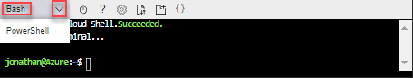
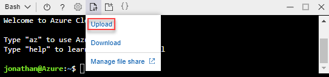
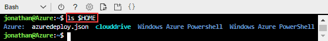
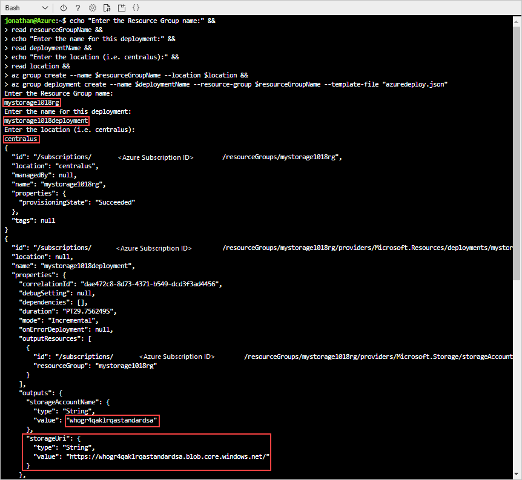

---
title: Use Visual Studio Code to create Azure Resource Manager template | Microsoft Docs
description: Use the Azure Resource Manager tools extension to work on Resource Manager templates.
services: azure-resource-manager
documentationcenter: ''
author: mumian
manager: dougeby
editor: tysonn

ms.service: azure-resource-manager
ms.workload: multiple
ms.tgt_pltfrm: na
ms.devlang: na
ms.date: 07/17/2018
ms.topic: quickstart
ms.author: jgao

#Customer intent: As a developer new to Azure deployment, I want to learn how to create a resource manager template so I can deploy Azure resources.

---

# Quickstart: create Azure Resource Manager templates by using Visual Studio Code

Learn how to create Azure Resource Manager templates by using Visual Studio Code and the Azure Resource Manager Tools extension. You can create Resource Manager templates in Visual Studio Code without the extension, but the extension provides autocomplete options that simplify template development. To understand the concepts associated with deploying and managing your Azure solutions, see [Azure Resource Manager overview](resource-group-overview.md).

If you don't have an Azure subscription, [create a free account](https://azure.microsoft.com/free/) before you begin.

## Prerequisites

To complete this article, you need:

- [Visual Studio Code](https://code.visualstudio.com/).
- Resource Manager Tools extension. To install, use these steps:

    1. Open Visual Studio Code.
    2. Press **CTRL+SHIFT+X** to open the Extensions pane
    3. Search for **Azure Resource Manager Tools**, and then select **Install**.
    4. Select **Reload** to finish the extension installation.

## Open a Quickstart template

Instead of creating a template from scratch, you open a template from [Azure Quickstart Templates](https://azure.microsoft.com/resources/templates/). Azure QuickStart Templates is a repository for Resource Manager templates.

The template used in this quickstart is called [Create a standard storage account](https://azure.microsoft.com/resources/templates/101-storage-account-create/). The template defines an Azure Storage account resource.

1. From Visual Studio Code, select **File**>**Open File**.
2. In **File name**, paste the following URL:

    ```url
    https://raw.githubusercontent.com/Azure/azure-quickstart-templates/master/101-storage-account-create/azuredeploy.json
    ```
3. Select **Open** to open the file.
4. Select **File**>**Save As** to save the file as **azuredeploy.json** to your local computer.

## Edit the template

To learn how to edit a template using Visual Studio Code, you add one more element into the outputs section.

1. From Visual Studio Code, add one more output to the exported template:

    ```json
    "storageUri": {
      "type": "string",
      "value": "[reference(variables('storageAccountName')).primaryEndpoints.blob]"
    }
    ```

    When you are done, the outputs section looks like:

    ```json
    "outputs": {
      "storageAccountName": {
        "type": "string",
        "value": "[variables('storageAccountName')]"
      },
      "storageUri": {
        "type": "string",
        "value": "[reference(variables('storageAccountName')).primaryEndpoints.blob]"
      }
    }
    ```

    If you copied and pasted the code inside Visual Studio Code, try to retype the **value** element to experience the intellisense capability of the Resource Manager Tools extension.

    

2. Select **File**>**Save** to save the file.

## Deploy the template

There are many methods for deploying templates.  In this quickstart, you use the Cloud shell from the Azure portal. The Cloud shell supports both Azure CLI and Azure PowerShell. The instructions provided here use CLI.

1. Sign in to the [Azure portal](https://portal.azure.com)
2. Select **Cloud Shell** from the upper right corner as shown in the following image:

    

3. Select the down arrow and then select **Bash** to switch to CLI from PowerShell.

    
4. Select **Restart** to restart the shell.
5. Select **Upload/download files**, and then select **Upload**.

    
4. Select the file you saved earlier in the quickstart. The default name is **azuredeploy.json**.
5. From the Cloud shell, run the **ls** command to verify the file is uploaded successfully. You can also use the **cat** command to verify the template content.

    
6. From the Cloud shell, run the following commands:

    ```cli
    az group create --name <ResourceGroupName> --location <AzureLocation>

    az group deployment create --name <DeploymentName> --resource-group <ResourceGroupName> --template-file <TemplateFileName>
    ```
    Here is the screenshot of a sample deployment:

    

    On the screenshot, these values are used:

    - **&lt;ResourceGroupName>**: myresourcegroup0709. There are two appearances of the parameter.  Make sure to use the same value.
    - **&lt;AzureLocation>**: eastus2
    - **&lt;DeployName>**: mydeployment0709
    - **&lt;TemplateFile>**: azuredeploy.json

    From the screenshot output, the storage account name is *3tqebj3slyfyestandardsa*. 

7. Run the following PowerShell command to list the newly created storage account:

    ```cli
    az storage account show --resource-group <ResourceGroupName> --name <StorageAccountName>
    ```

## Clean up resources

When the Azure resources are no longer needed, clean up the resources you deployed by deleting the resource group.

1. From the Azure portal, select **Resource group** from the left menu.
2. Enter the resource group name in the **Filter by name** field.
3. Select the resource group name.  You shall see a total of six resources in the resource group.
4. Select **Delete resource group** from the top menu.

## Next steps

In this tutorial, you learned how to create a template using Visual Studio Code, and how to deploy the template using the Azure portal Cloud shell. In the next tutorial, you learn more about how to develop a template, and how to use template reference.

> [!div class="nextstepaction"]
> [Create an encrypted Storage account](./resource-manager-tutorial-create-encrypted-storage-accounts.md)
