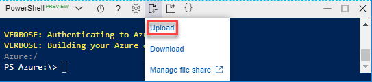
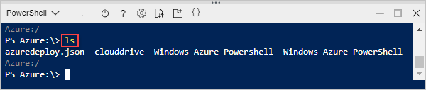
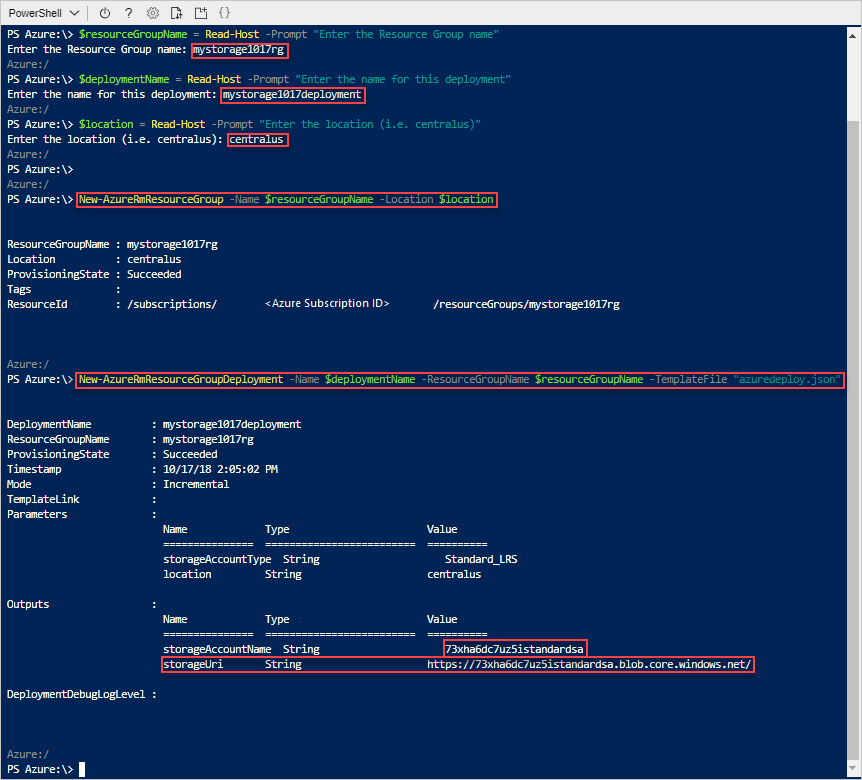

# Quickstart: Create Azure Resource Manager templates by using Visual Studio Code

Learn how to use Visual Studio code and the Azure Resource Manager Tools extension to create and edit Azure Resource Manager templates. You can create Resource Manager templates in Visual Studio Code without the extension, but the extension provides autocomplete options that simplify template development. To understand the concepts associated with deploying and managing your Azure solutions, see [Azure Resource Manager overview](resource-group-overview.md).

If you don't have an Azure subscription, [create a free account](https://azure.microsoft.com/free/) before you begin.

## Prerequisites

To complete this article, you need:

- [Visual Studio Code](https://code.visualstudio.com/).
- Resource Manager Tools extension. To install, use these steps:

    1. Open Visual Studio Code.
    2. Press **CTRL+SHIFT+X** to open the Extensions pane
    3. Search for **Azure Resource Manager Tools**, and then select **Install**.
    4. Select **Reload** to finish the extension installation.

## Open a Quickstart template

Instead of creating a template from scratch, you open a template from [Azure Quickstart Templates](https://azure.microsoft.com/resources/templates/). Azure QuickStart Templates is a repository for Resource Manager templates.

The template used in this quickstart is called [Create a standard storage account](https://azure.microsoft.com/resources/templates/101-storage-account-create/). The template defines an Azure Storage account resource.

1. From Visual Studio Code, select **File**>**Open File**.
2. In **File name**, paste the following URL:

    ```url
    https://raw.githubusercontent.com/Azure/azure-quickstart-templates/master/101-storage-account-create/azuredeploy.json
    ```
3. Select **Open** to open the file.
4. Select **File**>**Save As** to save the file as **azuredeploy.json** to your local computer.

## Edit the template

To learn how to edit a template using Visual Studio Code, you add one more element into the `outputs` section.

1. Add one more output to the exported template:

    ```json
    "storageUri": {
      "type": "string",
      "value": "[reference(variables('storageAccountName')).primaryEndpoints.blob]"
    }
    ```

    When you are done, the outputs section looks like:

    ```json
    "outputs": {
      "storageAccountName": {
        "type": "string",
        "value": "[variables('storageAccountName')]"
      },
      "storageUri": {
        "type": "string",
        "value": "[reference(variables('storageAccountName')).primaryEndpoints.blob]"
      }
    }
    ```

    If you copied and pasted the code inside Visual Studio Code, try to retype the **value** element to experience the IntelliSense capability of the Resource Manager Tools extension.

    

2. Select **File**>**Save** to save the file.

## Deploy the template

There are many methods for deploying templates.  In this quickstart, you use the Azure Cloud shell. Cloud Shell supports both Azure CLI and Azure PowerShell.

1. Sign in to the [Azure Cloud shell](https://shell.azure.com)

    
2. On the upper left corner of the Cloud shell, it shows either **PowerShell** or **Bash**. To use CLI, you need to open a Bash session. To run PowerShell, you need to open a PowerShell session. Select the down arrow to toggle between the Bash and PowerShell. See the previous screenshot. Restarting the shell is required when you switch.
3. Select **Upload/download files**, and then select **Upload**.

    # [CLI](#tab/CLI)

    
   
    # [PowerShell](#tab/PowerShell)
    
    
    
    ---

    You must upload the template file before you can deploy it from the shell.
5. Select the file you saved in the previous section. The default name is **azuredeploy.json**.
6. From the Cloud shell, run the **ls** command to verify the file is uploaded successfully. You can also use the **cat** command to verify the template content. The following image shows running the command from Bash.  You use the same commands from a PowerShell session.

    # [CLI](#tab/CLI)

    
   
    # [PowerShell](#tab/PowerShell)
    
    
    
    ---
7. From the Cloud shell, run the following commands. Select the tab to show the PowerShell code or the CLI code.

    # [CLI](#tab/CLI)
    ```azurecli
    echo "Enter the Resource Group name:" &&
    read resourceGroupName &&
    echo "Enter the name for this deployment:" &&
    read deploymentName &&
    echo "Enter the location (i.e. centralus):" &&
    read location &&
    az group create --name $resourceGroupName --location $location &&
    az group deployment create --name $deploymentName --resource-group $resourceGroupName --template-file "azuredeploy.json"
    ```
   
    # [PowerShell](#tab/PowerShell)
    
    ```azurepowershell
    $resourceGroupName = Read-Host -Prompt "Enter the Resource Group name"
    $deploymentName = Read-Host -Prompt "Enter the name for this deployment"
    $location = Read-Host -Prompt "Enter the location (i.e. centralus)"
    
    New-AzureRmResourceGroup -Name $resourceGroupName -Location $location
    New-AzureRmResourceGroupDeployment -Name $deploymentName -ResourceGroupName $resourceGroupName -TemplateFile "azuredeploy.json"
    ```
    
    ---

    Update the template file name if you save the file to a name other than **azuredeploy.json**.

    The following screenshot shows a sample deployment:

    # [CLI](#tab/CLI)

    
   
    # [PowerShell](#tab/PowerShell)
    
    
    
    ---

    The storage account name and the storage URL in the outputs section are highlighted on the screenshot. You need the storage account name in the next step.

7. Run the following CLI or PowerShell command to list the newly created storage account:

    # [CLI](#tab/CLI)
    ```azurecli
    echo "Enter the Resource Group name:" &&
    read resourceGroupName &&
    echo "Enter the Storage Account name:" &&
    read storageAccountName &&
    az storage account show --resource-group $resourceGroupName --name $storageAccountName
    ```
   
    # [PowerShell](#tab/PowerShell)
    
    ```azurepowershell
    $resourceGroupName = Read-Host -Prompt "Enter the Resource Group name"
    $storageAccountName = Read-Host -Prompt "Enter the Storage Account name"
    Get-AzureRmStorageAccount -ResourceGroupName $resourceGroupName -Name $storageAccountName
    ```
    
    ---

## Clean up resources

When the Azure resources are no longer needed, clean up the resources you deployed by deleting the resource group.

1. From the Azure portal, select **Resource group** from the left menu.
2. Enter the resource group name in the **Filter by name** field.
3. Select the resource group name.  You shall see a total of six resources in the resource group.
4. Select **Delete resource group** from the top menu.

## Next steps

The main focus of this quickstart is to use Visual Studio Code to edit an existing template from Azure Quickstart templates. You also learned how to deploy the template using either CLI or PowerShell from Azure Cloud Shell. The templates from Azure Quickstart templates might not give you everything you need. The next tutorial shows you how to find the information from template reference so you can create an encrypted Azure Storage account.

> [!div class="nextstepaction"]
> [Create an encrypted storage account](./resource-manager-tutorial-create-encrypted-storage-accounts.md)
