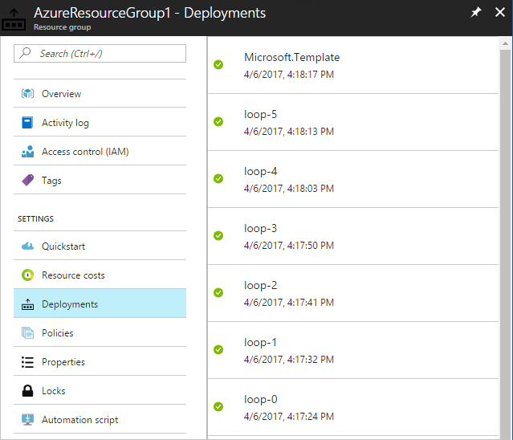

# Patterns for extending the functionality of Azure Resource Manager templates - Sequential Looping

Azure Resource Manager templates support the deployment of a group of similar resources via a copy loop. A copy loop in a resource object can be used to iterate an array of strings that are then used to generate unique names for the resources. A copy loop in the resource object can also be used to iterate over an array of variables that describe the resource.

These patterns all work well, but they only work well when there are no dependencies between each member of the group. During an iteration loop, Resource Manager attempts to deploy resources in parallel. If a first resource depends on a second, the deployment may fail if Resource Manager deploys the second resource before the first resource.

The real problem is that Resource Manager does not currently support `dependsOn` within an iteration loop. However, this functionality can be implemented using existing Resource Manager functionality and some creative resource naming. 

## Sequential looping pattern

The pattern is as follows: a first resource is named using a concatenation of a name prefix and `0`, or, whatever the first index of the loop is. A second resource includes a copy loop, and in the copy loop the next resource name is a concatenation of the name prefix and the result of the `copyIndex(1)` function, which adds 1 to the current `copyIndex()`. The second resource also includes a `dependsOn` element that references the concatenation of the name prefix and the result of the `copyIndex()` function. This approach creates a `dependsOn` relationship from the next resource back to the previous resource. Resource Manager waits to deploy the next resource until the previous resource has deployed.

The following template demonstrates this pattern. The Microsoft.Resources/deployments resource type is just a nested template that doesn't actually deploy anything.

```json
{
  "$schema": "https://schema.management.azure.com/schemas/2015-01-01/deploymentTemplate.json#",
  "contentVersion": "1.0.0.0",
  "parameters": {
    "numberToDeploy": {
      "type": "int",
      "minValue": 2,
      "defaultValue": 5
    }
  },
  "variables": {
    "count": "[sub(parameters('numberToDeploy'), 1)]"
  },
  "resources": [
    {
      "apiVersion": "2015-01-01",
      "type": "Microsoft.Resources/deployments",
      "name": "loop-0",
      "properties": {
        "mode": "Incremental",
        "parameters": {},
        "template": {
          "$schema": "http://schema.management.azure.com/schemas/2015-01-01/deploymentTemplate.json#",
          "contentVersion": "1.0.0.0",
          "parameters": {},
          "variables": {},
          "resources": [],
          "outputs": {
            "collection": {
              "type": "string",
              "value": "loop-0 "
            }
          }
        }
      }
    },
    {
      "apiVersion": "2015-01-01",
      "type": "Microsoft.Resources/deployments",
      "name": "[concat('loop-', copyIndex(1))]",
      "dependsOn": [
        "[concat('loop-', copyIndex())]"
      ],
      "copy": {
        "name": "iterator",
        "count": "[variables('count')]"
      },
      "properties": {
        "mode": "Incremental",
        "template": {
          "$schema": "http://schema.management.azure.com/schemas/2015-01-01/deploymentTemplate.json#",
          "contentVersion": "1.0.0.0",
          "parameters": {},
          "variables": {},
          "resources": [],
          "outputs": {
            "collection": {
              "type": "string",
              "value": "[concat(reference(concat('loop-',copyIndex())).outputs.collection.value,'loop-',copyIndex(1), ' ')]"
            }
          }
        }
      }
    }
  ],
  "outputs": {
    "result": {
      "type": "string",
      "value": "[reference(concat('loop-',variables('count'))).outputs.collection.value]"
    }
  }
}

```
In this template, the first resource object is named `loop-0`. Then, in the second resource object, the next resource name is a concatenation of the word `loop-` and the result of the `copyIndex(1)` function: `loop-1`. The `dependsOn` element references the previous resource because it’s a concatenation of the word `loop-` and the result of the `copyIndex()` function: `loop-0`. The pattern in the second resource object repeats until `count` has been reached, ending with a resource named `loop-4` that `dependsOn` `loop-3`. Notice that `count` is a variable that subtracts `1` from the `numberToDeploy` parameter to keep the zero-based count correct.

## Try the template

If you would like to experiment with this template, follow these steps:

1.	Go to the Azure portal, select the "+" icon, and search for the "template deployment" resource type. When you find it in the search results, select it.
2.	When you get to the "template deployment" page, select the "create" button. You go to the "custom deployment" blade, and see that the template has no resources.
3.	Select the "edit" icon.
4.	Delete the empty template in the right-hand pane.
5.	Copy and paste the preceding sample template into the right-hand pane.
6.	Select the "save" button.
7.	You are returned to the "custom deployment" pane, but this time there are some drop-down boxes. Select your subscription, either create new or use existing resource group, and select a location. Review the terms and conditions, and click the "I agree" button.
8.	Select the "purchase" button.

To verify that the resources are being deployed sequentially, select "resource groups", then select the resource group that you selected earlier. Select the "deployments" button in the resource group blade, and you see the resources deployed in sequential order with corresponding timestamp.



## Next steps

Use this pattern in your templates by adding your resources to the nested template. You can either author them directly in the template element of the `Microsoft.Resources/deployments` resource or link to them using the `templateLink` element. The resource type in the example is a nested template, but any resource type can be deployed. The only exception is that child resources cannot be referenced from within an iteration loop.

* For an introduction to creating multiple instances of a resource, see [Deploy multiple instances of resources in Azure Resource Manager templates](resource-group-create-multiple.md).
* This pattern is also implemented in the [template building blocks project](https://github.com/mspnp/template-building-blocks) and the [Azure reference architectures](/azure/architecture/reference-architectures/).