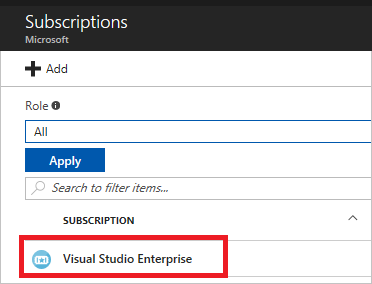
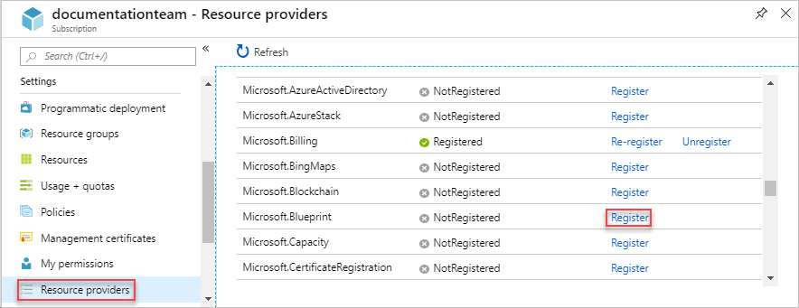
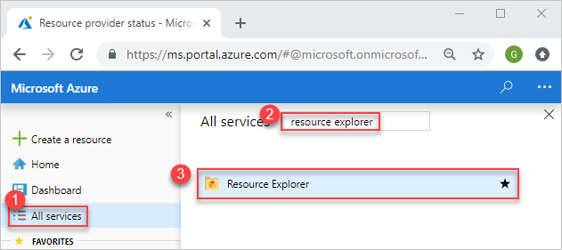
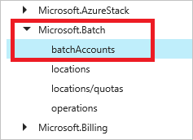
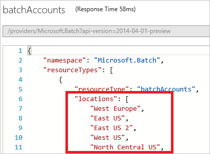
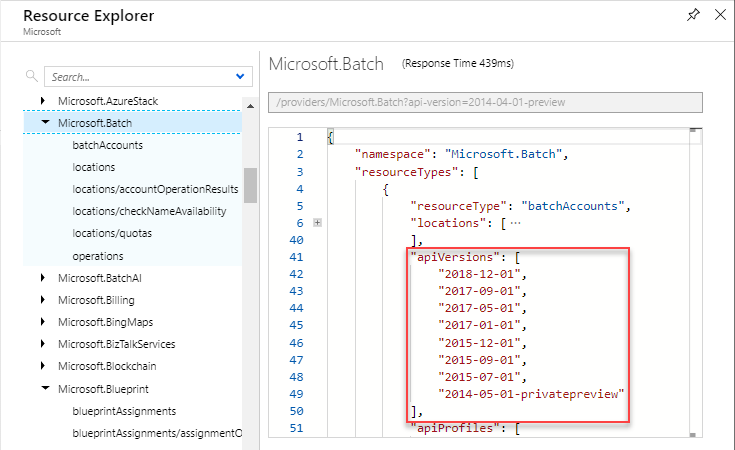

# Resource providers and types

When deploying resources, you frequently need to retrieve information about the resource providers and types. In this article, you learn to:

* View all resource providers in Azure
* Check registration status of a resource provider
* Register a resource provider
* View resource types for a resource provider
* View valid locations for a resource type
* View valid API versions for a resource type

You can perform these steps through the portal, PowerShell, or Azure CLI.

## PowerShell

To see all resource providers in Azure, and the registration status for your subscription, use:

```powershell
Get-AzureRmResourceProvider -ListAvailable | Select-Object ProviderNamespace, RegistrationState
```

Which returns results similar to:

```powershell
ProviderNamespace                RegistrationState
-------------------------------- ------------------
Microsoft.ClassicCompute         Registered
Microsoft.ClassicNetwork         Registered
Microsoft.ClassicStorage         Registered
Microsoft.CognitiveServices      Registered
...
```

By default, many resource providers are automatically registered; however, you may need to manually register some resource providers. To register a resource provider, provide the namespace:

```powershell
Register-AzureRmResourceProvider -ProviderNamespace Microsoft.Batch
```

Which returns results similar to:

```powershell
ProviderNamespace : Microsoft.Batch
RegistrationState : Registering
ResourceTypes     : {batchAccounts, operations, locations, locations/quotas}
Locations         : {West Europe, East US, East US 2, West US...}
```

To see information for a particular resource provider, use:

```powershell
Get-AzureRmResourceProvider -ProviderNamespace Microsoft.Batch
```

Which returns results similar to:

```powershell
{ProviderNamespace : Microsoft.Batch
RegistrationState : Registered
ResourceTypes     : {batchAccounts}
Locations         : {West Europe, East US, East US 2, West US...}

...
```

To see the resource types for a resource provider, use:

```powershell
(Get-AzureRmResourceProvider -ProviderNamespace Microsoft.Batch).ResourceTypes.ResourceTypeName
```

Which returns:

```powershell
batchAccounts
operations
locations
locations/quotas
```

The API version corresponds to a version of REST API operations that are released by the resource provider. As a resource provider enables new features, it releases a new version of the REST API. 

To get the available API versions for a resource type, use:

```powershell
((Get-AzureRmResourceProvider -ProviderNamespace Microsoft.Batch).ResourceTypes | Where-Object ResourceTypeName -eq batchAccounts).ApiVersions
```

Which returns:

```powershell
2017-05-01
2017-01-01
2015-12-01
2015-09-01
2015-07-01
```

Resource Manager is supported in all regions, but the resources you deploy might not be supported in all regions. In addition, there may be limitations on your subscription that prevent you from using some regions that support the resource. 

To get the supported locations for a resource type, use.

```powershell
((Get-AzureRmResourceProvider -ProviderNamespace Microsoft.Batch).ResourceTypes | Where-Object ResourceTypeName -eq batchAccounts).Locations
```

Which returns:

```powershell
West Europe
East US
East US 2
West US
...
```

## Azure CLI
To see all resource providers in Azure, and the registration status for your subscription, use:

```azurecli
az provider list --query "[].{Provider:namespace, Status:registrationState}" --out table
```

Which returns results similar to:

```azurecli
Provider                         Status
-------------------------------- ----------------
Microsoft.ClassicCompute         Registered
Microsoft.ClassicNetwork         Registered
Microsoft.ClassicStorage         Registered
Microsoft.CognitiveServices      Registered
...
```

By default, many resource providers are automatically registered; however, you may need to manually register some resource providers. To register a resource provider, provide the namespace:

```azurecli
az provider register --namespace Microsoft.Batch
```

Which returns a message that registration is on-going.

To see information for a particular resource provider, use:

```azurecli
az provider show --namespace Microsoft.Batch
```

Which returns results similar to:

```azurecli
{
    "id": "/subscriptions/####-####/providers/Microsoft.Batch",
    "namespace": "Microsoft.Batch",
    "registrationsState": "Registering",
    "resourceTypes:" [
        ...
    ]
}
```

To see the resource types for a resource provider, use:

```azurecli
az provider show --namespace Microsoft.Batch --query "resourceTypes[*].resourceType" --out table
```

Which returns:

```azurecli
Result
---------------
batchAccounts
operations
locations
locations/quotas
```

The API version corresponds to a version of REST API operations that are released by the resource provider. As a resource provider enables new features, it releases a new version of the REST API. 

To get the available API versions for a resource type, use:

```azurecli
az provider show --namespace Microsoft.Batch --query "resourceTypes[?resourceType=='batchAccounts'].apiVersions | [0]" --out table
```

Which returns:

```azurecli
Result
---------------
2017-05-01
2017-01-01
2015-12-01
2015-09-01
2015-07-01
```

Resource Manager is supported in all regions, but the resources you deploy might not be supported in all regions. In addition, there may be limitations on your subscription that prevent you from using some regions that support the resource. 

To get the supported locations for a resource type, use.

```azurecli
az provider show --namespace Microsoft.Batch --query "resourceTypes[?resourceType=='batchAccounts'].locations | [0]" --out table
```

Which returns:

```azurecli
Result
---------------
West Europe
East US
East US 2
West US
...
```

## Portal

To see all resource providers in Azure, and the registration status for your subscription, select **Subscriptions**.


Choose the subscription to view.



Select **Resource providers** and view the list of available resource providers.



By default, many resource providers are automatically registered; however, you may need to manually register some resource providers. To register a resource provider, select **Register**.


To see information for a particular resource provider, select **More services**.



Search for **Resource Explorer** and select it from the available options.


Select **Providers**.


Select the resource provider and resource type that you want to view.



Resource Manager is supported in all regions, but the resources you deploy might not be supported in all regions. In addition, there may be limitations on your subscription that prevent you from using some regions that support the resource. The resource explorer displays valid locations for the resource type.



The API version corresponds to a version of REST API operations that are released by the resource provider. As a resource provider enables new features, it releases a new version of the REST API. The resource explorer displays valid API versions for the resource type.



## Next steps
* To learn about creating Resource Manager templates, see [Authoring Azure Resource Manager templates](resource-group-authoring-templates.md).
* To learn about deploying resources, see [Deploy an application with Azure Resource Manager template](resource-group-template-deploy.md).
* To view the operations for a resource provider, see [Azure REST API](/rest/api/).

