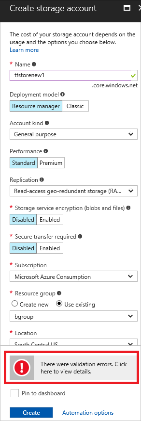
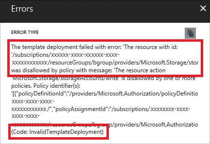
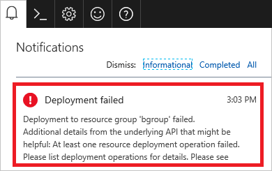

# Understand Azure deployment errors
This topic describes deployment errors and how you can discover more information about an error. For resolutions to common deployment errors, see [Troubleshoot common Azure deployment errors with Azure Resource Manager](resource-manager-common-deployment-errors.md).

## Two types of errors
There are two types of errors you can receive:

* validation errors
* deployment errors

The following image shows the activity log for a subscription. It represents two deployments. In one deployment, the template failed validation (**Validate**) and did not proceed. In the other deployment, the template passed validation but failed when creating the resources (**Write Deployments**). 


Validation errors arise from scenarios that can be determined before deployment. They include syntax errors in your template, or trying to deploy resources that would exceed your subscription quotas. Deployment errors arise from conditions that occur during the deployment process. They include trying to access a resource that is being deployed in parallel.

Both types of errors return an error code that you use to troubleshoot the deployment. Both types of errors appear in the [activity log](resource-group-audit.md). However, validation errors do not appear in your deployment history because the deployment never started.

## Determine error code

You can learn about an error by looking at the error message and the error code. The [Troubleshoot common Azure deployment errors with Azure Resource Manager](resource-manager-common-deployment-errors.md) article lists resolutions by error code. This topic shows how to use the Azure portal to discover the error code.

### Validation errors

When deploying through the portal, you see a validation error after submitting your values.



Select the message for more details. In the following image, you see an **InvalidTemplateDeployment** error and a message that indicates a policy blocked deployment.



### Deployment errors

When the operation passes validation, but fails during deployment, you see the error in the notifications. Select the notification.



You see more details about the deployment. Select the option to find more information about the error.


You see the error message and error codes. Notice there are two error codes. The first error code (**DeploymentFailed**) is a general error that does not provide the details you need to solve the error. The second error code (**StorageAccountNotFound**) provides the details you need. 


## Enable debug logging
Sometimes you need more information about the request and response to discover what went wrong. By using PowerShell or Azure CLI, you can request that additional information is logged during a deployment.

- PowerShell

   In PowerShell, set the **DeploymentDebugLogLevel** parameter to All, ResponseContent, or RequestContent.

  ```powershell
  New-AzureRmResourceGroupDeployment -ResourceGroupName examplegroup -TemplateFile c:\Azure\Templates\storage.json -DeploymentDebugLogLevel All
  ```

   Examine the request content with the following cmdlet:

  ```powershell
  (Get-AzureRmResourceGroupDeploymentOperation -DeploymentName storageonly -ResourceGroupName startgroup).Properties.request | ConvertTo-Json
  ```

   Or, the response content with:

  ```powershell
  (Get-AzureRmResourceGroupDeploymentOperation -DeploymentName storageonly -ResourceGroupName startgroup).Properties.response | ConvertTo-Json
  ```

   This information can help you determine whether a value in the template is being incorrectly set.

- Azure CLI

   Examine the deployment operations with the following command:

  ```azurecli
  az group deployment operation list --resource-group ExampleGroup --name vmlinux
  ```

- Nested template

   To log debug information for a nested template, use the **debugSetting** element.

  ```json
  {
      "apiVersion": "2016-09-01",
      "name": "nestedTemplate",
      "type": "Microsoft.Resources/deployments",
      "properties": {
          "mode": "Incremental",
          "templateLink": {
              "uri": "{template-uri}",
              "contentVersion": "1.0.0.0"
          },
          "debugSetting": {
             "detailLevel": "requestContent, responseContent"
          }
      }
  }
  ```


## Create a troubleshooting template
In some cases, the easiest way to troubleshoot your template is to test parts of it. You can create a simplified template that enables you to focus on the part that you believe is causing the error. For example, suppose you are receiving an error when referencing a resource. Rather than dealing with an entire template, create a template that returns the part that may be causing your problem. It can help you determine whether you are passing in the right parameters, using template functions correctly, and getting the resource you expect.

```json
{
  "$schema": "https://schema.management.azure.com/schemas/2015-01-01/deploymentTemplate.json#",
  "contentVersion": "1.0.0.0",
  "parameters": {
    "storageName": {
        "type": "string"
    },
    "storageResourceGroup": {
        "type": "string"
    }
  },
  "variables": {},
  "resources": [],
  "outputs": {
    "exampleOutput": {
        "value": "[reference(resourceId(parameters('storageResourceGroup'), 'Microsoft.Storage/storageAccounts', parameters('storageName')), '2016-05-01')]",
        "type" : "object"
    }
  }
}
```

Or, suppose you are encountering deployment errors that you believe are related to incorrectly set dependencies. Test your template by breaking it into simplified templates. First, create a template that deploys only a single resource (like a SQL Server). When you are sure you have that resource correctly defined, add a resource that depends on it (like a SQL Database). When you have those two resources correctly defined, add other dependent resources (like auditing policies). In between each test deployment, delete the resource group to make sure you adequately testing the dependencies. 

## Check deployment sequence

Many deployment errors happen when resources are deployed in an unexpected sequence. These errors arise when dependencies are not correctly set. When you are missing a needed dependency, one resource attempts to use a value for another resource but the other does not yet exist. You get an error stating that a resource is not found. You may encounter this type of error intermittently because the deployment time for each resource can vary. For example, your first attempt to deploy your resources succeeds because a required resource randomly completes in time. However, your second attempt fails because the required resource did not complete in time. 

But, you want to avoid setting dependencies that are not needed. When you have unnecessary dependencies, you prolong the duration of the deployment by preventing resources that are not dependent on each other from being deployed in parallel. In addition, you may create circular dependencies that block the deployment. The [reference](resource-group-template-functions-resource.md#reference) function creates an implicit dependency on the referenced resource, when that resource is deployed in the same template. Therefore, you may have more dependencies than the dependencies specified in the **dependsOn** property. The [resourceId](resource-group-template-functions-resource.md#resourceid) function does not create an implicit dependency or validate that the resource exists.

When you encounter dependency problems, you need to gain insight into the order of resource deployment. To view the order of deployment operations:

1. Select the deployment history for your resource group.

   

2. Select a deployment from the history, and select **Events**.

   

3. Examine the sequence of events for each resource. Pay attention to the status of each operation. For example, the following image shows three storage accounts that deployed in parallel. Notice that the three storage accounts are started at the same time.

   

   The next image shows three storage accounts that are not deployed in parallel. The second storage account depends on the first storage account, and the third storage account depends on the second storage account. Therefore, the first storage account is started, accepted, and completed before the next is started.

   

Even for more complicated scenarios, you can use the same technique to discover when deployment is started and completed for each resource. Look through your deployment events to see if the sequence is different than you would expect. If so, reevaluate the dependencies for this resource.

Resource Manager identifies circular dependencies during template validation. It returns an error message that specifically states a circular dependency exists. To solve a circular dependency:

1. In your template, find the resource identified in the circular dependency. 
2. For that resource, examine the **dependsOn** property and any uses of the **reference** function to see which resources it depends on. 
3. Examine those resources to see which resources they depend on. Follow the dependencies until you notice a resource that depends on the original resource.
5. For the resources involved in the circular dependency, carefully examine all uses of the **dependsOn** property to identify any dependencies that are not needed. Remove those dependencies. If you are unsure that a dependency is needed, try removing it. 
6. Redeploy the template.

Removing values from the **dependsOn** property can cause errors when you deploy the template. If you encounter an error, add the dependency back into the template. 

If that approach does not solve the circular dependency, consider moving part of your deployment logic into child resources (such as extensions or configuration settings). Configure those child resources to deploy after the resources involved in the circular dependency. For example, suppose you are deploying two virtual machines but you must set properties on each one that refer to the other. You can deploy them in the following order:

1. vm1
2. vm2
3. Extension on vm1 depends on vm1 and vm2. The extension sets values on vm1 that it gets from vm2.
4. Extension on vm2 depends on vm1 and vm2. The extension sets values on vm2 that it gets from vm1.

The same approach works for App Service apps. Consider moving configuration values into a child resource of the app resource. You can deploy two web apps in the following order:

1. webapp1
2. webapp2
3. config for webapp1 depends on webapp1 and webapp2. It contains app settings with values from webapp2.
4. config for webapp2 depends on webapp1 and webapp2. It contains app settings with values from webapp1.


## Next steps
* For resolutions to common deployment errors, see [Troubleshoot common Azure deployment errors with Azure Resource Manager](resource-manager-common-deployment-errors.md).
* To learn about auditing actions, see [Audit operations with Resource Manager](resource-group-audit.md).
* To learn about actions to determine the errors during deployment, see [View deployment operations](resource-manager-deployment-operations.md).
