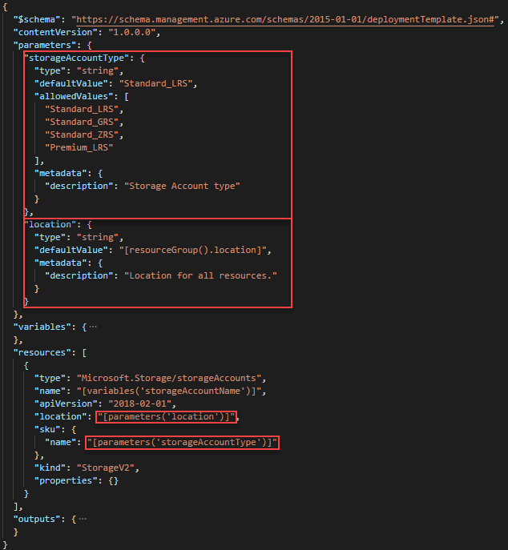
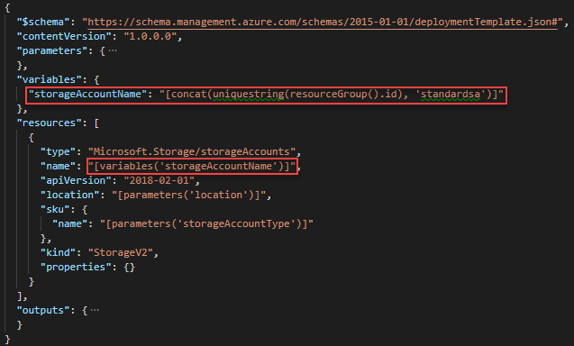

---
title: Create an Azure Resource Manager template for deploying an encrypted storage account | Microsoft Docs
description: Use Visual Studio Code to create a template for deploying an encrypted storage account.
services: azure-resource-manager
documentationcenter: ''
author: mumian
manager: dougeby
editor: tysonn

ms.service: azure-resource-manager
ms.workload: multiple
ms.tgt_pltfrm: na
ms.devlang: na
ms.date: 09/07/2018
ms.topic: tutorial
ms.author: jgao

---

# Tutorial: Create an Azure Resource Manager template for deploying an encrypted storage account

Learn how to find information to complete an Azure Resource Manager template.

In this tutorial, you use a base template from Azure Quickstart templates to create an Azure Storage account.  Using template reference documentation, you customize the base template to create an encrypted storage account.

This tutorial covers the following tasks:

> [!div class="checklist"]
> * Open a Quickstart template
> * Understand the template
> * Edit the template
> * Deploy the template

If you don't have an Azure subscription, [create a free account](https://azure.microsoft.com/free/) before you begin.

## Prerequisites

To complete this article, you need:

* [Visual Studio Code](https://code.visualstudio.com/).
* Resource Manager Tools extension. To install, see [Install the Resource Manager Tools extension](./resource-manager-quickstart-create-templates-use-visual-studio-code.md#prerequisites).

## Open a Quickstart template

The template used in this quickstart is called [Create a standard storage account](https://azure.microsoft.com/resources/templates/101-storage-account-create/). The template defines an Azure Storage account resource.

1. From Visual Studio Code, select **File**>**Open File**.
2. In **File name**, paste the following URL:

    ```url
    https://raw.githubusercontent.com/Azure/azure-quickstart-templates/master/101-storage-account-create/azuredeploy.json
    ```
3. Select **Open** to open the file.
4. Select **File**>**Save As** to save the file as **azuredeploy.json** to your local computer.

## Understand the format

From VS Code, collapse the template to the root level. You have the simplest structure with the following elements:


* **$schema**: specify the location of the JSON schema file that describes the version of the template language.
* **contentVersion**: specify any value for this element to document significant changes in your template.
* **parameters**: specify the values that are provided when deployment is executed to customize resource deployment.
* **variables**: specify the values that are used as JSON fragments in the template to simplify template language expressions.
* **resources**: specify the resource types that are deployed or updated in a resource group.
* **outputs**: specify the values that are returned after deployment.

## Use parameters in template

Parameters enable you to customize the deployment by providing values that are tailored for a particular environment. You use the parameters defined in the template when setting values for the storage account.



In this template, two parameters are defined. Notice a template function is used in location.defaultValue:

```json
"defaultValue": "[resourceGroup().location]",
```

The resourceGroup() function returns an object that represents the current resource group. For a list of template functions, see [Azure Resource Manager template functions](./resource-group-template-functions.md).

To use the parameters defined in the template:

```json
"location": "[parameters('location')]",
"name": "[parameters('storageAccountType')]"
```

## Use variables in template

Variables allow you to construct values that can be used throughout your template. Variables help reducing the complexity of the templates.



This template defines one variable *storageAccountName*. In the definition, two template functions are used:

- **concat()**: concatenates strings. For more information, see [concat](./resource-group-template-functions-string.md#concat).
- **uniqueString()**: creates a deterministic hash string based on the values provided as parameters. Each Azure storage account must have a unique name across of all Azure. This function provides a unique string. For more string functions, see [String functions](./resource-group-template-functions-string.md).

To use the variable defined in the template:

```json
"name": "[variables('storageAccountName')]"
```

## Edit the template

The goal of this tutorial is to define a template to create an encrypted storage account.  The sample template only creates a basic unencrypted storage account. To find the encryption-related configuration, you can use the template reference of Azure Storage account.

1. Browse to [Azure Templates](https://docs.microsoft.com/azure/templates/).
2. In **Filter by title**, enter **storage accounts**.
3. Select **Reference/Template reference/Storage/Storage Accounts** as shown in the following screenshot:

    

    resource-manager-template-resources-reference-storage-accounts
1. Explore the encryption-related information.  
1. Inside the properties element of the storage account resource definition, add the following json:

    ```json
    "encryption": {
        "keySource": "Microsoft.Storage",
        "services": {
            "blob": {
                "enabled": true
            }
        }
    }
    ```
    This part enables the encryption function of the blob storage service.

From Visual Studio Code, modify the template so that the final resources element looks like:


## Deploy the template

Refer to the [Deploy the template](./resource-manager-quickstart-create-templates-use-visual-studio-code.md#deploy-the-template) section in the Visual Studio Code quickstart for the deployment procedure.

The following screenshot shows the CLI command for listing the newly created storage account, which indicates encryption has been enabled for the blob storage.


## Clean up resources

When the Azure resources are no longer needed, clean up the resources you deployed by deleting the resource group.

1. From the Azure portal, select **Resource group** from the left menu.
2. Enter the resource group name in the **Filter by name** field.
3. Select the resource group name.  You shall see a total of six resources in the resource group.
4. Select **Delete resource group** from the top menu.

## Next steps

In this tutorial, you learned how to use template reference to customize an existing template. To learn how to create multiple storage account instances, see:

> [!div class="nextstepaction"]
> [Create multiple instances](./resource-manager-tutorial-create-multiple-instances.md)
