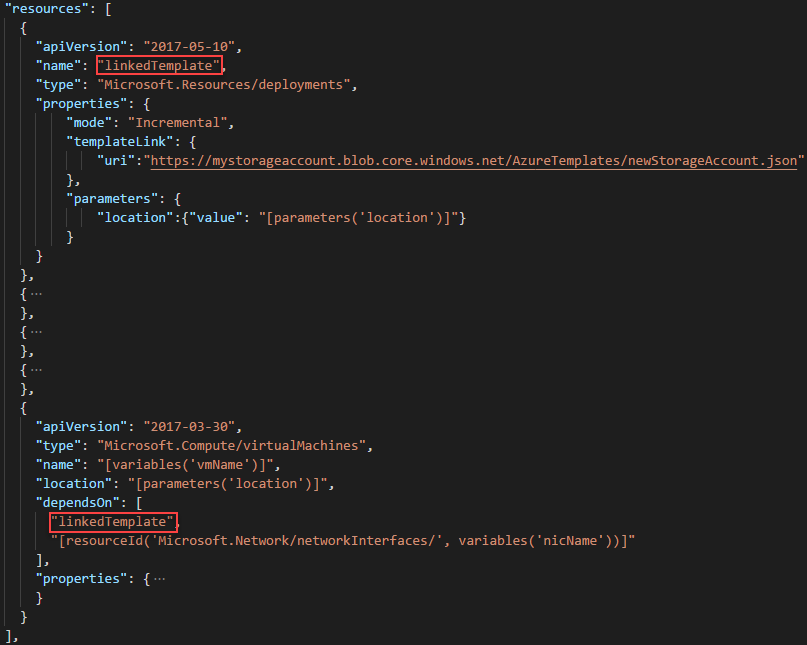

---
title: Create linked Azure Resource Manager templates | Microsoft Docs
description: Learn how to create linked Azure Resource Manager templates for creating virtual machine
services: azure-resource-manager
documentationcenter: ''
author: mumian
manager: dougeby
editor: tysonn

ms.service: azure-resource-manager
ms.workload: multiple
ms.tgt_pltfrm: na
ms.devlang: na
ms.date: 09/07/2018
ms.topic: tutorial
ms.author: jgao
---

# Tutorial: Create linked Azure Resource Manager templates

Learn how to create linked Azure Resource Manager templates. Using linked templates, you can have one template call another template. It is great for modularizing templates. In this tutorial, you use the same template used in [Tutorial: create multiple resource instances using Resource Manager templates](./resource-manager-tutorial-create-multiple-instances.md), which creates a virtual machine, a virtual network, and other dependent resource including a storage account. You separate the storage account resource to a linked template.

This tutorial covers the following tasks:

> [!div class="checklist"]
> * Open a quickstart template
> * Create the linked template
> * Upload the linked template
> * Link to the linked template
> * Configure dependency
> * Get values from linked template
> * Deploy the template

If you don't have an Azure subscription, [create a free account](https://azure.microsoft.com/free/) before you begin.

## Prerequisites

To complete this article, you need:

* [Visual Studio Code](https://code.visualstudio.com/).
* Resource Manager Tools extension.  See [Install the extension
](./resource-manager-quickstart-create-templates-use-visual-studio-code.md#prerequisites).
* Complete [Tutorial: create multiple resource instances using Resource Manager templates](./resource-manager-tutorial-create-multiple-instances.md).

## Open a Quickstart template

Azure QuickStart Templates is a repository for Resource Manager templates. Instead of creating a template from scratch, you can find a sample template and customize it. The template used in this tutorial is called [Deploy a simple Windows VM](https://azure.microsoft.com/resources/templates/101-vm-simple-windows/). This is the same template used in [Tutorial: create multiple resource instances using Resource Manager templates](./resource-manager-tutorial-create-multiple-instances.md). You save two copies of the same template to be used as:

- **The main template**: create all the resources except the storage account.
- **The linked template**: create the storage account.

1. From Visual Studio Code, select **File**>**Open File**.
2. In **File name**, paste the following URL:

    ```url
    https://raw.githubusercontent.com/Azure/azure-quickstart-templates/master/101-vm-simple-windows/azuredeploy.json
    ```
3. Select **Open** to open the file.
4. Select **File**>**Save As** to save a copy of the file to your local computer with the name **azuredeploy.json**.
5. Select **File**>**Save As** to create another copy of the file with the name **linkedTemplate.json**.

## Create the linked template

The linked template creates a storage account. The linked template is almost identical to the standalone template that creates a storage account. In this tutorial, the linked template needs to pass a value back to the main template. This value is defined in the `outputs` element.

1. Open linkedTemplate.json in Visual Studio Code if it is not opened.
2. Make the following changes:

    - Remove all the resources except the storage account. You remove a total of four resources.
    - Update the **outputs** element, so it looks like:

        ```json
        "outputs": {
            "storageUri": {
                "type": "string",
                "value": "[reference(parameters('storageAccountName')).primaryEndpoints.blob]"
              }
        }
        ```
        **storageUri** is required by the virtual machine resource definition in the main template.  You pass the value back to the main template as an output value.
    - Remove the parameters that are never used. These parameters have a green wave line underneath them. You shall only have one parameter left called **location**.
    - Remove the **variables** element. They are no needed in this tutorial.
    - Add a parameter called **storageAccountName**. The storage account name is passed from the main template to the linked template as a parameter.

    When you are done, the template shall look like:

    ```json
    {
        "$schema": "https://schema.management.azure.com/schemas/2015-01-01/deploymentTemplate.json#",
        "contentVersion": "1.0.0.0",
        "parameters": {
          "storageAccountName":{
            "type": "string",
            "metadata": {
              "description": "Azure Storage account name."
            }
          },
          "location": {
            "type": "string",
            "defaultValue": "[resourceGroup().location]",
            "metadata": {
              "description": "Location for all resources."
            }
          }
        },
        "resources": [
          {
            "type": "Microsoft.Storage/storageAccounts",
            "name": "[parameters('storageAccountName')]",
            "apiVersion": "2016-01-01",
            "location": "[parameters('location')]",
            "sku": {
              "name": "Standard_LRS"
            },
            "kind": "Storage",
            "properties": {}
          }
        ],
        "outputs": {
            "storageUri": {
                "type": "string",
                "value": "[reference(parameters('storageAccountName')).primaryEndpoints.blob]"
              }
        }
    }
    ```
3. Save the changes.

## Upload the linked template

The templates need to be accessible from where you run the deployment. This location could be an Azure storage account, Github, or Dropbox. If your templates contain sensitive information, make sure you protect access to them. In this tutorial, you use the Cloud shell deployment method as you used in [Tutorial: create multiple resource instances using Resource Manager templates](./resource-manager-tutorial-create-multiple-instances.md). The main template (azuredeploy.json) is uploaded to the shell. The linked template (linkedTemplate.json) must be shared somewhere.  To reduce the tasks of this tutorial, the linked template defined in the previous section has been uploaded to [an Azure storage account](https://armtutorials.blob.core.windows.net/linkedtemplates/linkedStorageAccount.json).

## Call the linked template

The main template is called azuredeploy.json.

1. Open azuredeploy.json in Visual Studio Code if it is not opened.
2. Delete the storage account resource definition from the template.
3. Add the following json snippet to the place where you had the storage account definition:

    ```json
    {
      "apiVersion": "2017-05-10",
      "name": "linkedTemplate",
      "type": "Microsoft.Resources/deployments",
      "properties": {
          "mode": "Incremental",
          "templateLink": {
              "uri":"https://armtutorials.blob.core.windows.net/linkedtemplates/linkedStorageAccount.json"
          },
          "parameters": {
              "storageAccountName":{"value": "[variables('storageAccountName')]"},
              "location":{"value": "[parameters('location')]"}
          }
      }
    },
    ```

    Pay attention to these details:

    - A `Microsoft.Resources/deployments` resource in the main template is used to link to another template.
    - The `deployments` resource has a name called `linkedTemplate`. This name is used for [configuring dependency](#configure-dependency).  
    - You can only use [Incremental](./deployment-modes.md) deployment mode when calling linked templates.
    - `templateLink/uri` contains the linked template URI. The linked template has been uploaded to a shared storage account. You can update the URI if you upload the template another location on the Internet.
    - Use `parameters` to pass values from the main template to the linked template.
4. Save the changes.

## Configure dependency

Recall from [Tutorial: create multiple resource instances using Resource Manager template](./resource-manager-tutorial-create-multiple-instances.md), the virtual machine resource depends on the storage account:


Because the storage account is defined in the linked template now, you must update the following two elements of the `Microsoft.Compute/virtualMachines` resource.

- Reconfigure the `dependOn` element. The storage account definition is moved to the linked template.
- Reconfigure the `properties/diagnosticsProfile/bootDiagnostics/storageUri` element. In [Create the linked template](#create-the-linked-template), you added an output value:

    ```json
    "outputs": {
        "storageUri": {
            "type": "string",
            "value": "[reference(parameters('storageAccountName')).primaryEndpoints.blob]"
            }
    }
    ```
    This value is required by the main template.

1. Open azuredeploy.json in Visual Studio Code if it is not opened.
2. Expand the virtual machine resource definition, update **dependsOn** as shown in the following screenshot:

    
    
    "linkedTemplate" is the name of the deployments resource.  
3. update **properties/diagnosticsProfile/bootDiagnostics/storageUri** as shown in the previous screenshot.

For more information, see [Use linked and nested templates when deploying Azure resources](./resource-group-linked-templates.md)

## Deploy the template

Refer to the [Deploy the template](./resource-manager-tutorial-create-multiple-instances.md#deploy-the-template) section for the deployment procedure.

## Clean up resources

When the Azure resources are no longer needed, clean up the resources you deployed by deleting the resource group.

1. From the Azure portal, select **Resource group** from the left menu.
2. Enter the resource group name in the **Filter by name** field.
3. Select the resource group name.  You shall see a total of six resources in the resource group.
4. Select **Delete resource group** from the top menu.

## Next steps

In this tutorial, you develop and deploy linked templates. To learn how deploy Azure resources across multiple regions, and how to use safe deployment practices, see


> [!div class="nextstepaction"]
> [Use Azure Deployment Manager](./deployment-manager-tutorial.md)

