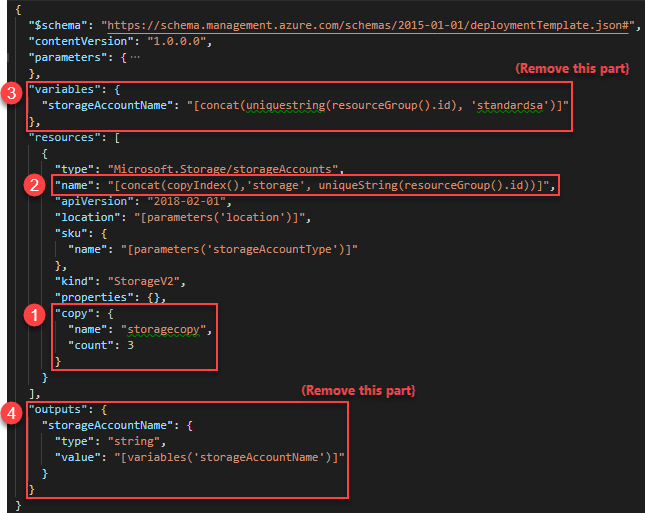

---
title: Create multiple resource instances using Azure Resource Manager   | Microsoft Docs
description: Learn how to create an Azure Resource Manager template to create multiple Azure resource instances.
services: azure-resource-manager
documentationcenter: ''
author: mumian
manager: dougeby
editor: tysonn

ms.service: azure-resource-manager
ms.workload: multiple
ms.tgt_pltfrm: na
ms.devlang: na
ms.date: 09/10/2018
ms.topic: tutorial
ms.author: jgao
---

# Tutorial: Create multiple resource instances using Resource Manager templates

Learn how to iterate in your Azure Resource Manager template to create multiple instances of an Azure resource. In the last tutorial, you modified an existing template to create an encrypted Azure Storage account. In this tutorial,  you modify the same template to create three storage account instances.

> [!div class="checklist"]
> * Open a quickstart template
> * Edit the template
> * Deploy the template

If you don't have an Azure subscription, [create a free account](https://azure.microsoft.com/free/) before you begin.

## Prerequisites

To complete this article, you need:

* [Visual Studio Code](https://code.visualstudio.com/).
* Resource Manager Tools extension. To install, see [Install the Resource Manager Tools extension](./resource-manager-quickstart-create-templates-use-visual-studio-code.md#prerequisites).

## Open a Quickstart template

The template used in this quickstart is called [Create a standard storage account](https://azure.microsoft.com/resources/templates/101-storage-account-create/). The template defines an Azure Storage account resource.

1. From Visual Studio Code, select **File**>**Open File**.
2. In **File name**, paste the following URL:

    ```url
    https://raw.githubusercontent.com/Azure/azure-quickstart-templates/master/101-storage-account-create/azuredeploy.json
    ```
3. Select **Open** to open the file.
4. Select **File**>**Save As** to save the file as **azuredeploy.json** to your local computer.

## Edit the template

The goal of this tutorial is to use resource iteration to create three storage accounts.  The sample template only creates one storage account. 

From Visual Studio Code, make the following four changes:



1. Add a `copy` element to the storage account resource definition. In the copy element, you specify the number of iterations and a name for this loop. The count value must be a positive integer and can't exceed 800.
2. The `copyIndex()` function returns the current iteration in the loop. `copyIndex()` is zero-based. To offset the index value, you can pass a value in the copyIndex() function. For example, *copyIndex(1)*.
3. Delete the **variables** element, because it is not used anymore.
4. Delete the **outputs** element.

The completed template looks like:

```json
{
  "$schema": "https://schema.management.azure.com/schemas/2015-01-01/deploymentTemplate.json#",
  "contentVersion": "1.0.0.0",
  "parameters": {
    "storageAccountType": {
      "type": "string",
      "defaultValue": "Standard_LRS",
      "allowedValues": [
        "Standard_LRS",
        "Standard_GRS",
        "Standard_ZRS",
        "Premium_LRS"
      ],
      "metadata": {
        "description": "Storage Account type"
      }
    },
    "location": {
      "type": "string",
      "defaultValue": "[resourceGroup().location]",
      "metadata": {
        "description": "Location for all resources."
      }
    }
  },
  "resources": [
    {
      "type": "Microsoft.Storage/storageAccounts",
      "name": "[concat(copyIndex(),'storage', uniqueString(resourceGroup().id))]",
      "apiVersion": "2018-02-01",
      "location": "[parameters('location')]",
      "sku": {
        "name": "[parameters('storageAccountType')]"
      },
      "kind": "Storage",
      "properties": {},
      "copy": {
        "name": "storagecopy",
        "count": 3
      }
    }
  ]
}
```

For more information about creating multiple instances, see [Deploy multiple instances of a resource or property in Azure Resource Manager Templates](./resource-group-create-multiple.md)

## Deploy the template

Refer to the [Deploy the template](./resource-manager-quickstart-create-templates-use-visual-studio-code.md#deploy-the-template) section in the Visual Studio Code quickstart for the deployment procedure.

To list all three storage accounts, omit the --name parameter:

# [CLI](#tab/CLI)
```cli
az storage account list --resource-group <ResourceGroupName>
```

# [PowerShell](#tab/PowerShell)

```powershell
Get-AzureRmStorageAccount -ResourceGroupName <ResourceGroupName>
```

---

Compare the storage account names with the name definition in the template.

## Clean up resources

When the Azure resources are no longer needed, clean up the resources you deployed by deleting the resource group.

1. From the Azure portal, select **Resource group** from the left menu.
2. Enter the resource group name in the **Filter by name** field.
3. Select the resource group name.  You shall see a total of six resources in the resource group.
4. Select **Delete resource group** from the top menu.

## Next steps

In this tutorial, you learned how to create multiple storage account instances. So far, you have created one storage account or multiple storage account instances. In the next tutorial, you develop a template with multiple resources and multiple resource types. Some of the resources have dependent resources.

> [!div class="nextstepaction"]
> [Create dependent resources](./resource-manager-tutorial-create-templates-with-dependent-resources.md)
