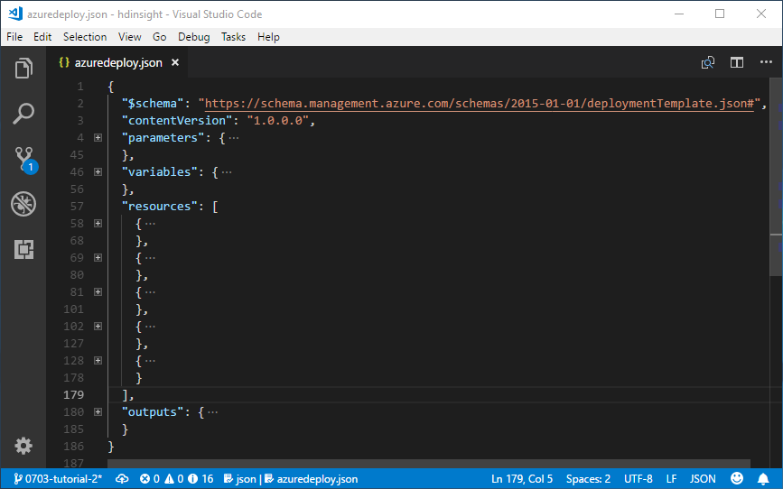
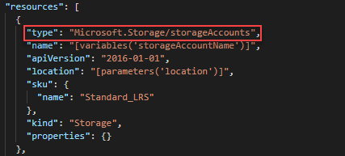
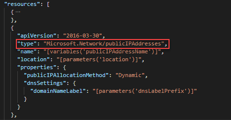
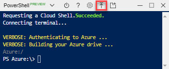

---
title: Create Azure Resource Manager templates with dependent resources | Microsoft Docs
description: Learn how to create an Azure Resource Manager template with multiple resources, and how to deploy it using the Azure portal
services: azure-resource-manager
documentationcenter: ''
author: mumian
manager: dougeby
editor: tysonn

ms.service: azure-resource-manager
ms.workload: multiple
ms.tgt_pltfrm: na
ms.devlang: na
ms.date: 03/04/2019
ms.topic: tutorial
ms.author: jgao
---

# Tutorial: Create Azure Resource Manager templates with dependent resources

Learn how to create an Azure Resource Manager template to deploy multiple resources and configure the deployment order. After you create the template, you deploy the template using the Cloud shell from the Azure portal.

In this tutorial, you create a storage account, a virtual machine, a virtual network, and some other dependent resources. Some of the resources cannot be deployed until another resource exists. For example, you can't create the virtual machine until its storage account and network interface exist. You define this relationship by making one resource as dependent on the other resources. Resource Manager evaluates the dependencies between resources, and deploys them in their dependent order. When resources aren't dependent on each other, Resource Manager deploys them in parallel. For more information, see [Define the order for deploying resources in Azure Resource Manager Templates](./resource-group-define-dependencies.md).


This tutorial covers the following tasks:

> [!div class="checklist"]
> * Open a QuickStart template
> * Explore the template
> * Deploy the template

If you don't have an Azure subscription, [create a free account](https://azure.microsoft.com/free/) before you begin.

## Prerequisites

To complete this article, you need:

* [Visual Studio Code](https://code.visualstudio.com/) with the Resource Manager Tools extension.  See [Install the extension
](./resource-manager-quickstart-create-templates-use-visual-studio-code.md#prerequisites).
* To increase security, use a generated password for the virtual machine administrator account. Here is a sample for generating a password:

    ```azurecli-interactive
    openssl rand -base64 32
    ```
    Azure Key Vault is designed to safeguard cryptographic keys and other secrets. For more information, see [Tutorial: Integrate Azure Key Vault in Resource Manager Template deployment](./resource-manager-tutorial-use-key-vault.md). We also recommend you to update your password every three months.

## Open a Quickstart template

Azure QuickStart Templates is a repository for Resource Manager templates. Instead of creating a template from scratch, you can find a sample template and customize it. The template used in this tutorial is called [Deploy a simple Windows VM](https://azure.microsoft.com/resources/templates/101-vm-simple-windows/).

1. From Visual Studio Code, select **File**>**Open File**.
2. In **File name**, paste the following URL:

    ```url
    https://raw.githubusercontent.com/Azure/azure-quickstart-templates/master/101-vm-simple-windows/azuredeploy.json
    ```
3. Select **Open** to open the file.
4. Select **File**>**Save As** to save a copy of the file to your local computer with the name **azuredeploy.json**.

## Explore the template

When you explore the template in this section, try to answer these questions:

* How many Azure resources defined in this template?
* One of the resources is an Azure storage account.  Does the definition look like the one used in the last tutorial?
* Can you find the template references for the resources defined in this template?
* Can you find the dependencies of the resources?

1. From Visual Studio Code, collapse the elements until you only see the first-level elements and the second-level elements inside **resources**:

    

    There are five resources defined by the template:

   * `Microsoft.Storage/storageAccounts`. See the [template reference](https://docs.microsoft.com/azure/templates/Microsoft.Storage/storageAccounts).
   * `Microsoft.Network/publicIPAddresses`. See the [template reference](https://docs.microsoft.com/azure/templates/microsoft.network/publicipaddresses).
   * `Microsoft.Network/virtualNetworks`. See the [template reference](https://docs.microsoft.com/azure/templates/microsoft.network/virtualnetworks).
   * `Microsoft.Network/networkInterfaces`. See the [template reference](https://docs.microsoft.com/azure/templates/microsoft.network/networkinterfaces).
   * `Microsoft.Compute/virtualMachines`. See the [template reference](https://docs.microsoft.com/azure/templates/microsoft.compute/virtualmachines).

     It is helpful to get some basic understanding of the template before customizing it.

2. Expand the first resource. It is a storage account. Compare the resource definition to the [template reference](https://docs.microsoft.com/azure/templates/Microsoft.Storage/storageAccounts).

    

3. Expand the second resource. The resource type is `Microsoft.Network/publicIPAddresses`. Compare the resource definition to the [template reference](https://docs.microsoft.com/azure/templates/microsoft.network/publicipaddresses).

    
4. Expand the fourth resource. The resource type is `Microsoft.Network/networkInterfaces`:  

    

    The dependsOn element enables you to define one resource as a dependent on one or more resources. The resource depends on two other resources:

    * `Microsoft.Network/publicIPAddresses`
    * `Microsoft.Network/virtualNetworks`

5. Expand the fifth resource. This resource is a virtual machine. It depends on two other resources:

    * `Microsoft.Storage/storageAccounts`
    * `Microsoft.Network/networkInterfaces`

The following diagram illustrates the resources and the dependency information for this template:


By specifying the dependencies, Resource Manager efficiently deploys the solution. It deploys the storage account, public IP address, and virtual network in parallel because they have no dependencies. After the public IP address and virtual network are deployed, the network interface is created. When all other resources are deployed, Resource Manager deploys the virtual machine.

## Deploy the template

[!INCLUDE [updated-for-az](../../includes/updated-for-az.md)]

There are many methods for deploying templates.  In this tutorial, you use Cloud Shell from the Azure portal.

1. Sign in to the [Cloud Shell](https://shell.azure.com). 
2. Select **PowerShell** from the upper left corner of the Cloud shell, and then select **Confirm**.  You use PowerShell in this tutorial.
3. Select **Upload file** from the Cloud shell:

    
4. Select the template you saved earlier in the tutorial. The default name is **azuredeploy.json**.  If you have a file with the same file name, the old file is overwritten without any notification.

    You can optionally use the **ls $HOME** command and the **cat $HOME/azuredeploy.json** command to verify the files areis uploaded successfully. 

5. From the Cloud shell, run the following PowerShell commands. To increase security, use a generated password for the virtual machine administrator account. See [Prerequisites](#prerequisites).

    ```azurepowershell
    $resourceGroupName = Read-Host -Prompt "Enter the Resource Group name"
    $location = Read-Host -Prompt "Enter the location (i.e. centralus)"
    $adminUsername = Read-Host -Prompt "Enter the virtual machine admin username"
    $adminPassword = Read-Host -Prompt "Enter the admin password" -AsSecureString
    $dnsLabelPrefix = Read-Host -Prompt "Enter the DNS label prefix"

    New-AzResourceGroup -Name $resourceGroupName -Location "$location"
    New-AzResourceGroupDeployment `
        -ResourceGroupName $resourceGroupName `
        -adminUsername $adminUsername `
        -adminPassword $adminPassword `
        -dnsLabelPrefix $dnsLabelPrefix `
        -TemplateFile "$HOME/azuredeploy.json"
    ```

8. Run the following PowerShell command to list the newly created virtual machine:

    ```azurepowershell
    $resourceGroupName = Read-Host -Prompt "Enter the Resource Group name"
    Get-AzVM -Name SimpleWinVM -ResourceGroupName $resourceGroupName
    ```

    The virtual machine name is hard-coded as **SimpleWinVM** inside the template.

9. RDP to the virtual machine to verify the virtual machine has been created successfully.

## Clean up resources

When the Azure resources are no longer needed, clean up the resources you deployed by deleting the resource group.

1. From the Azure portal, select **Resource group** from the left menu.
2. Enter the resource group name in the **Filter by name** field.
3. Select the resource group name.  You shall see a total of six resources in the resource group.
4. Select **Delete resource group** from the top menu.

## Next steps

In this tutorial, you developed and deployed a template to create a virtual machine, a virtual network, and the dependent resources. To learn how to deploy Azure resources based on conditions, see:

> [!div class="nextstepaction"]
> [Use conditions](./resource-manager-tutorial-use-conditions.md)
