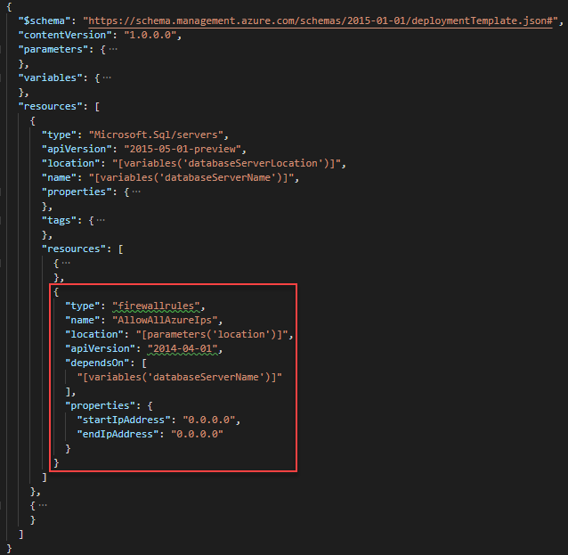
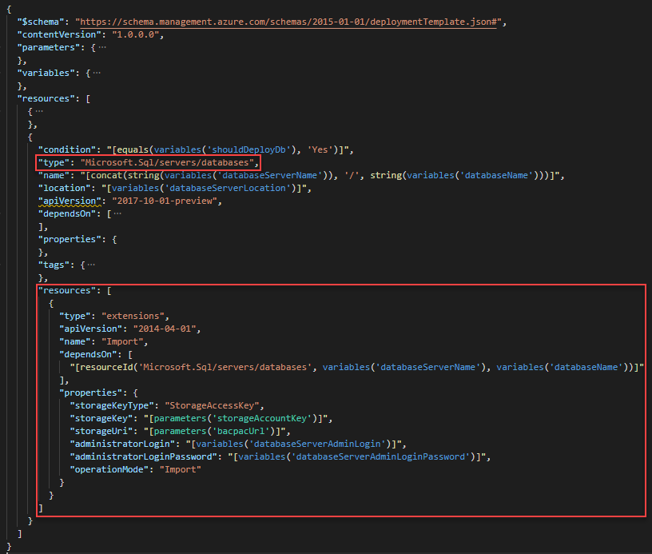

---
title: Import SQL BACPAC files with Azure Resource Manager templates | Microsoft Docs
description: Learn how to use SQL Database extension to import SQL BACPAC files with Azure Resource Manager templates.
services: azure-resource-manager
documentationcenter: ''
author: mumian
manager: dougeby
editor: 

ms.service: azure-resource-manager
ms.workload: multiple
ms.tgt_pltfrm: na
ms.devlang: na
ms.date: 04/08/2019
ms.topic: tutorial
ms.author: jgao
---

# Tutorial: Import SQL BACPAC files with Azure Resource Manager templates

Learn how to use Azure SQL Database extensions to import a BACPAC file with Azure Resource Manager templates. Deployment artifacts are any files, in addition to the main template file that are needed to complete a deployment. The BACPAC file is an artifact. In this tutorial, you create a template to deploy an Azure SQL Server, a SQL Database, and import a BACPAC file. For information about deploying Azure virtual machine extensions using Azure Resource Manager templates, see [# Tutorial: Deploy virtual machine extensions with Azure Resource Manager templates](./resource-manager-tutorial-deploy-vm-extensions.md).

This tutorial covers the following tasks:

> [!div class="checklist"]
> * Prepare a BACPAC file
> * Open a Quickstart template
> * Edit the template
> * Deploy the template
> * Verify the deployment

If you don't have an Azure subscription, [create a free account](https://azure.microsoft.com/free/) before you begin.

## Prerequisites

To complete this article, you need:

* [Visual Studio Code](https://code.visualstudio.com/) with the Resource Manager Tools extension. See [Install the extension
](./resource-manager-quickstart-create-templates-use-visual-studio-code.md#prerequisites).
* To increase security, use a generated password for the SQL Server administrator account. Here is a sample for generating a password:

    ```azurecli-interactive
    openssl rand -base64 32
    ```
    Azure Key Vault is designed to safeguard cryptographic keys and other secrets. For more information, see [Tutorial: Integrate Azure Key Vault in Resource Manager Template deployment](./resource-manager-tutorial-use-key-vault.md). We also recommend you to update your password every three months.

## Prepare a BACPAC file

A BACPAC file is shared on an [Azure Storage account](https://armtutorials.blob.core.windows.net/sqlextensionbacpac/SQLDatabaseExtension.bacpac) with the public access. To create your own, see [Export an Azure SQL database to a BACPAC file](../sql-database/sql-database-export.md). If you choose to publish the file to your own location, you must update the template later in the tutorial.

## Open a Quickstart template

The template used in this tutorial is stored in an [Azure Storage account](https://armtutorials.blob.core.windows.net/createsql/azuredeploy.json). 

1. From Visual Studio Code, select **File**>**Open File**.
2. In **File name**, paste the following URL:

    ```url
    https://armtutorials.blob.core.windows.net/createsql/azuredeploy.json
    ```
3. Select **Open** to open the file.

    There are three resources defined in the template:

   * `Microsoft.Sql/servers`. See the [template reference](https://docs.microsoft.com/azure/templates/microsoft.sql/servers).
   * `Microsoft.SQL/servers/securityAlertPolicies`. See the [template reference](https://docs.microsoft.com/azure/templates/microsoft.sql/servers/securityalertpolicies).
   * `Microsoft.SQL.servers/databases`.  See the [template reference](https://docs.microsoft.com/azure/templates/microsoft.sql/servers/databases).

     It is helpful to get some basic understanding of the template before customizing it.
4. Select **File**>**Save As** to save a copy of the file to your local computer with the name **azuredeploy.json**.

## Edit the template

Add two additional resources to the template.

* To allow the SQL database extension to import BACPAC files, you need to allow access to Azure services. Add the following JSON to the SQL server definition:

    ```json
    {
        "type": "firewallrules",
        "name": "AllowAllAzureIps",
        "location": "[parameters('location')]",
        "apiVersion": "2015-05-01-preview",
        "dependsOn": [
            "[variables('databaseServerName')]"
        ],
        "properties": {
            "startIpAddress": "0.0.0.0",
            "endIpAddress": "0.0.0.0"
        }
    }
    ```

    The template shall look like:

    

* Add a SQL Database extension resource to the database definition with the following JSON:

    ```json
    "resources": [
        {
            "name": "Import",
            "type": "extensions",
            "apiVersion": "2014-04-01",
            "dependsOn": [
                "[resourceId('Microsoft.Sql/servers/databases', variables('databaseServerName'), variables('databaseName'))]"
            ],
            "properties": {
                "storageKeyType": "SharedAccessKey",
                "storageKey": "?",
                "storageUri": "https://armtutorials.blob.core.windows.net/sqlextensionbacpac/SQLDatabaseExtension.bacpac",
                "administratorLogin": "[variables('databaseServerAdminLogin')]",
                "administratorLoginPassword": "[variables('databaseServerAdminLoginPassword')]",
                "operationMode": "Import",
            }
        }
    ]
    ```

    The template shall look like:

    

    To understand the resource definition, see the [SQL Database extension reference](https://docs.microsoft.com/azure/templates/microsoft.sql/servers/databases/extensions). The following are some important elements:

    * **dependsOn**: The extension resource must be created after the SQL database has been created.
    * **storageKeyType**: The type of the storage key to use. The value can be either `StorageAccessKey` or `SharedAccessKey`. Because the provided BACPAC file is shared on an Azure Storage account with public access, `SharedAccessKey' is used here.
    * **storageKey**: The storage key to use. If storage key type is SharedAccessKey, it must be preceded with a "?."
    * **storageUri**: The storage uri to use. If you choose not to use the BACPAC file provided, you need to update the values.
    * **administratorLoginPassword**: The password of the SQL administrator. Use a generated password. See [Prerequisites](#prerequisites).

## Deploy the template

[!INCLUDE [updated-for-az](../../includes/updated-for-az.md)]

Refer to the [Deploy the template](./resource-manager-tutorial-create-templates-with-dependent-resources.md#deploy-the-template) section for the deployment procedure. Use the following PowerShell deployment script instead:

```azurepowershell
$resourceGroupName = Read-Host -Prompt "Enter the Resource Group name"
$location = Read-Host -Prompt "Enter the location (i.e. centralus)"
$adminUsername = Read-Host -Prompt "Enter the SQL admin username"
$adminPassword = Read-Host -Prompt "Enter the admin password" -AsSecureString

New-AzResourceGroup -Name $resourceGroupName -Location $location
New-AzResourceGroupDeployment `
    -ResourceGroupName $resourceGroupName `
    -adminUser $adminUsername `
    -adminPassword $adminPassword `
    -TemplateFile "$HOME/azuredeploy.json"
```

Use a generated password. See [Prerequisites](#prerequisites).

## Verify the deployment

In the portal, select the SQL database from the newly deployed resource group. Select **Query editor (preview)**, and then enter the administrator credentials. You shall see two tables imported into the database:


## Clean up resources

When the Azure resources are no longer needed, clean up the resources you deployed by deleting the resource group.

1. From the Azure portal, select **Resource group** from the left menu.
2. Enter the resource group name in the **Filter by name** field.
3. Select the resource group name.  You shall see a total of six resources in the resource group.
4. Select **Delete resource group** from the top menu.

## Next steps

In this tutorial, you deployed a SQL Server, a SQL Database, and imported a BACPAC file. The BACPAC file is stored in an Azure storage account. Anybody with the URL can access the file. To learn how to secure the BACPAC file (artifact), see

> [!div class="nextstepaction"]
> [Secure the artifacts](./resource-manager-tutorial-secure-artifacts.md)
