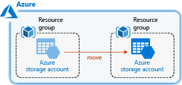

---
title: Move Azure resources to another resource group | Microsoft Docs
description: Learn how to move Azure resources from one resource group to another resource group or from one subscription to another subscription.
services: azure-resource-manager
documentationcenter: ''
author: mumian
manager: dougeby
editor: tysonn

ms.service: azure-resource-manager
ms.workload: multiple
ms.tgt_pltfrm: na
ms.devlang: na
ms.date: 03/04/2019
ms.topic: tutorial
ms.author: jgao
---

# Tutorial: Move Azure resources to another resource group

Learn how to move Azure resources from one resource group to another resource group. You can also move Azure resources from one Azure subscription to another Azure subscription. In this tutorial, you use a resource manager template to deploy two resource groups and one storage account. Then you move the storage account from one resource group to the other.



This tutorial covers the following tasks:

> [!div class="checklist"]
> * Prepare the resources.
> * Verify the resource can be moved.
> * Checklist before moving the resource.
> * Validate the move operation.
> * Move the resource.
> * Clean up resources.

If you don't have an Azure subscription, [create a free account](https://azure.microsoft.com/free/) before you begin.

## Prepare the resources

A template has been created and placed to a [shared storage account](https://armtutorials.blob.core.windows.net/moveresources/azuredeploy.json). The template defines two resource groups and one storage account. When deploying the template, you need to provide a project name. The project name is used to generate unique resource names.  The following JSON is extracted from the template:

```json
"variables": {
  "resourceGroupSource": {
    "name": "[concat(parameters('projectName'), 'rg1')]",
    "location": "eastus"
  },
  "resourceGroupDestination": {
    "name": "[concat(parameters('projectName'), 'rg2')]",
    "location": "westus"      
  },
  "storageAccount": {
    "name": "[concat(parameters('projectName'), 'store')]",
    "location": "eastus"
  }
},
```

Notice the locations defined in the json, the two resource groups are located in East US and West US. The storage account is located in the East US. When you move a resource to another resource group with a different location, the move operation doesn't change the location of the resource.

Select **Try it** to open the Cloud shell, and then execute the PowerShell script inside the Cloud shell:

```azurepowershell-interactive
$projectName = Read-Host -prompt "Enter a project name"
New-AzDeployment `
    -Name $projectname `
    -Location "centralus" `
    -TemplateUri "https://armtutorials.blob.core.windows.net/moveresources/azuredeploy.json" `
    -projectName $projectName
```

Wait until the script is completed successfully, then open the [Azure portal](https://portal.azure.com), and verify the resource groups and the storage account are deployed as expected.

> [!NOTE]
> Because the template defines two resource group, this deployment is considered as subscription level deployment. The portal template deployment doesn't support subscription level deployments. Thus Azure PowerShell is used in this tutorial. Azure CLI also supports subscription level deployments. See [Create resource groups and resources for an Azure subscription](./deploy-to-subscription.md).

## Verify the resource can be moved

Not all the resources can be moved. The resource used in this tutorial is a storage account, which can be moved. To verify whether a resource can be moved, see [Services that can be moved](./resource-group-move-resources.md#services-that-can-be-moved).

## Checklist before moving resources

This step is optional for this tutorial as it has been done.

There are some important steps to do before moving a resource. See [Checklist before moving resources](./resource-group-move-resources.md#checklist-before-moving-resources).

## Validate the move

Validating the move is optional for this tutorial as it has been done.

The validate move operation lets you test your move scenario without actually moving the resources. Use this operation to determine if the move will succeed. For more information, see [Validate the move](./resource-group-move-resources.md#validate-move).

## Move the resource

The storage account is inside the source resource group (rg1), run the following PowerShell script move the resource to the destination resource group (rg2). Make sure to use the same project name as you used when you deploy the resources.

[!INCLUDE [updated-for-az](../../includes/updated-for-az.md)]

```azurepowershell-interactive
$projectName = Read-Host -prompt "Enter a project name"
$resourceGroupSource = $projectName + "rg1"
$resourceGroupDestination = $projectName + "rg2"
$storageAccountName = $projectName + "store"

$storageAccount = Get-AzResource -ResourceGroupName $resourceGroupSource -ResourceName $storageAccountName
Move-AzResource -DestinationResourceGroupName $resourceGroupDestination -ResourceId $storageAccount.ResourceId
```

Open the [Azure portal](https://portal.azure.com), verify the storage account has been moved to the other resource group, and also verify the storage account location is still East US.

When moving resources, both the source group and the target group are locked during the operation. Write and delete operations are blocked on the resource groups until the move completes. This lock means you can't add, update, or delete resources in the resource groups, but it doesn't mean the resources are frozen. For example, if you move a SQL Server and its database to a new resource group, an application that uses the database experiences no downtime. It can still read and write to the database.

## Clean up resources

When the Azure resources are no longer needed, clean up the resources you deployed by deleting the resource group.

1. From the Azure portal, select **Resource group** from the left menu.
2. Enter the resource group name in the **Filter by name** field.
3. Select the source resource group name.  
4. Select **Delete resource group** from the top menu.
5. Select the destination resource group name.  
6. Select **Delete resource group** from the top menu.

## Next steps

In this tutorial, you learned how to move a storage account from a resource group to another resource group. So far, you have been dealing with one storage account or multiple storage account instances. In the next tutorial, you develop a template with multiple resources and multiple resource types. Some of the resources have dependent resources.

> [!div class="nextstepaction"]
> [Create dependent resources](./resource-manager-tutorial-create-templates-with-dependent-resources.md)
