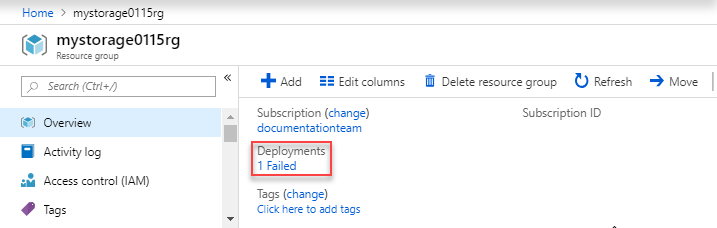
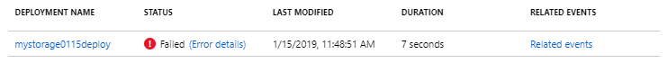
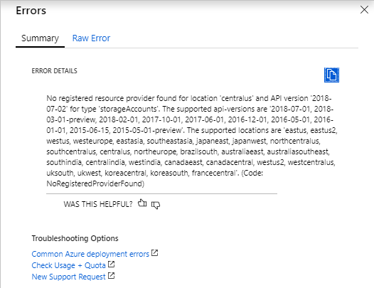
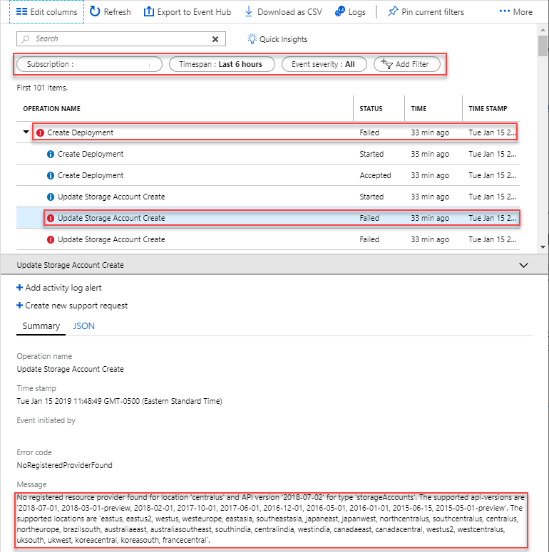

---
title: Troubleshoot Resource Manager deployments | Microsoft Docs
description: Learn how to monitor and troubleshoot Resource Manager deployments.
services: azure-resource-manager
documentationcenter: ''
author: mumian
manager: dougeby
editor: tysonn

ms.service: azure-resource-manager
ms.workload: multiple
ms.tgt_pltfrm: na
ms.devlang: na
ms.date: 01/15/2019
ms.topic: tutorial
ms.author: jgao
---

# Tutorial: Troubleshoot Resource Manager template deployments

Learn how to troubleshoot Resource Manager template deployment errors. In this tutorial, you set up two errors in a template, and learn how to use the activity logs and deployment history to resolve the issues.

There are two types of errors that are related to template deployment:

- **Validation errors** arise from scenarios that can be determined before deployment. They include syntax errors in your template, or trying to deploy resources that would exceed your subscription quotas. 
- **Deployment errors** arise from conditions that occur during the deployment process. They include trying to access a resource that is being deployed in parallel.

Both types of errors return an error code that you use to troubleshoot the deployment. Both types of errors appear in the activity log. However, validation errors don't appear in your deployment history because the deployment never started.

This tutorial covers the following tasks:

> [!div class="checklist"]
> * Create a problematic template
> * Troubleshoot validation errors
> * Troubleshoot deployment errors
> * Clean up resources

If you don't have an Azure subscription, [create a free account](https://azure.microsoft.com/free/) before you begin.

[!INCLUDE [updated-for-az](../../includes/updated-for-az.md)]

## Prerequisites

To complete this article, you need:

- [Visual Studio Code](https://code.visualstudio.com/) with [Resource Manager Tools extension](./resource-manager-quickstart-create-templates-use-visual-studio-code.md#prerequisites).

## Create a problematic template

Open a template called [Create a standard storage account](https://azure.microsoft.com/resources/templates/101-storage-account-create/) from [Azure QuickStart Templates](https://azure.microsoft.com/resources/templates/), and setup two template issues.

1. From Visual Studio Code, select **File**>**Open File**.
2. In **File name**, paste the following URL:

    ```url
    https://raw.githubusercontent.com/Azure/azure-quickstart-templates/master/101-storage-account-create/azuredeploy.json
    ```
3. Select **Open** to open the file.
4. Change the **apiVersion** line to the following line:

    ```json
    "apiVersion1": "2018-07-02",
    ```
    - **apiVersion1** is invalid element name. It is a validation error.
    - The API version shall be "2018-07-01".  It is a deployment error.

5. Select **File**>**Save As** to save the file as **azuredeploy.json** to your local computer.

## Troubleshoot the validation error

Refer to the [Deploy the template](./resource-manager-quickstart-create-templates-use-visual-studio-code.md#deploy-the-template) section to deploy the template.

You shall get an error from the shell similar to:

```
New-AzResourceGroupDeployment : 4:29:24 PM - Error: Code=InvalidRequestContent; Message=The request content was invalid and could not be deserialized: 'Could not find member 'apiVersion1' on object of type 'TemplateResource'. Path 'properties.template.resources[0].apiVersion1', line 36, position 24.'.
```

The error message indicates the problem is with **apiVersion1**.

Use Visual Studio Code to correct the problem by changing **apiVersion1** to **apiVersion**, and then save the template.

## Troubleshoot the deployment error

Refer to the [Deploy the template](./resource-manager-quickstart-create-templates-use-visual-studio-code.md#deploy-the-template) section to deploy the template.

You shall get an error from the shell similar to:

```
New-AzResourceGroupDeployment : 4:48:50 PM - Resource Microsoft.Storage/storageAccounts 'storeqii7x2rce77dc' failed with message '{
  "error": {
    "code": "NoRegisteredProviderFound",
    "message": "No registered resource provider found for location 'centralus' and API version '2018-07-02' for type 'storageAccounts'. The supported api-versions are '2018-07-01, 2018-03-01-preview, 2018-02-01, 2017-10-01, 2017-06-01, 2016-12-01, 2016-05-01, 2016-01-01, 2015-06-15, 2015-05-01-preview'. The supported locations are 'eastus, eastus2, westus, westeurope, eastasia, southeastasia, japaneast, japanwest, northcentralus, southcentralus, centralus, northeurope, brazilsouth, australiaeast, australiasoutheast, southindia, centralindia, westindia, canadaeast, canadacentral, westus2, westcentralus, uksouth, ukwest, koreacentral, koreasouth, francecentral'."
  }
}'
```

The deployment error can be found from the Azure portal using the following procedure:

1. Sign in to the [Azure portal](https://portal.azure.com).
2. Open the resource group by selecting **Resource groups** and then the resource group name. You shall see **1 Failed** under **Deployment**.

    
3. Select **Error details**.

    

    The error message is the same as the one shown earlier:

    

You can also find the error from the activity logs:

1. Sign in to the [Azure portal](https://portal.azure.com).
2. Select **Monitor** > **Activity log**.
3. Use the filters to find the log.

    

Use Visual Studio Code to correct the problem, and then redeploy the template.

For a list of common errors, see [Troubleshoot common Azure deployment errors with Azure Resource Manager](./resource-manager-common-deployment-errors.md).

## Clean up resources

When the Azure resources are no longer needed, clean up the resources you deployed by deleting the resource group.

1. From the Azure portal, select **Resource group** from the left menu.
2. Enter the resource group name in the **Filter by name** field.
3. Select the resource group name.  You shall see a total of six resources in the resource group.
4. Select **Delete resource group** from the top menu.

## Next steps

In this tutorial, you learned how to troubleshoot Resource Manager template deployment errors.  For more information, see [Troubleshoot common Azure deployment errors with Azure Resource Manager](./resource-manager-common-deployment-errors.md).
