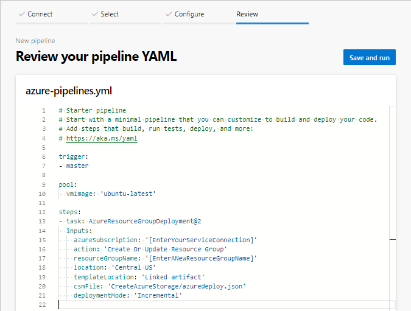
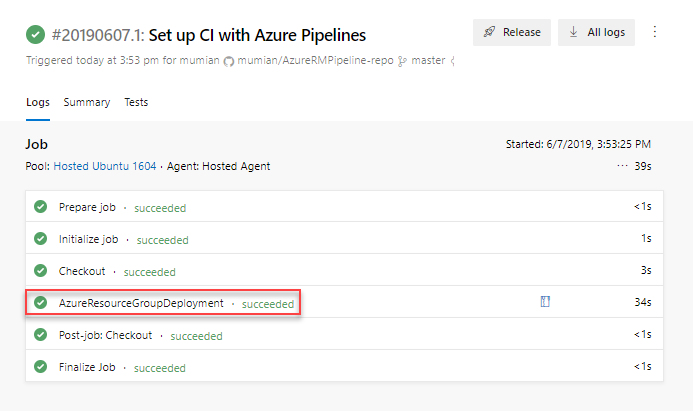
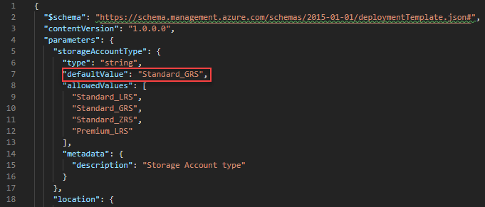

---
title: Continuous integration with Azure Pipelines | Microsoft Docs
description: Learn how to continuously build, test, and deploy Azure Resource Manager templates.
services: azure-resource-manager
documentationcenter: ''
author: mumian
manager: carmonm
editor:

ms.service: azure-resource-manager
ms.workload: multiple
ms.tgt_pltfrm: na
ms.devlang: na
ms.date: 06/07/2019
ms.topic: tutorial
ms.author: jgao
---

# Tutorial: Continous integration of Azure Resource Manager templates with Azure Pipelines

Learn how to utilize Azure Pipelines to continuously build and deploy Azure Resource Manager template projects.

Azure DevOps provides developer services to support teams to plan work, collaborate on code development, and build and deploy applications. Developers can work in the cloud using Azure DevOps Services or on-premises using Azure DevOps Server, formerly named Visual Studio Team Foundation Server (TFS).

Azure DevOps provides an integrated set of features that you can access through your web browser or IDE client. Azure Pipeline is one of these features. Azure Pipelines is a fully featured continuous integration (CI) and continuous delivery (CD) service. It works with your preferred Git provider and can deploy to most major cloud services. Then you can automate the build, testing, and deployment of your code to Microsoft Azure, Google Cloud Platform, or Amazon Web Services.

This tutorial is designed for Azure Resource Manager template developers who are new Azure DevOps Services and Azure Pipelines. If you are already familiar with GitHub and DevOps, you can skip to ...

> [!NOTE]
> Pick a project name. When you go through the tutorial, replace any of the **AzureRmPipeline** with your project name.

This tutorial covers the following tasks:

> [!div class="checklist"]
> * Prepare a GitHub repository
> * Create a DevOps project
> * Import the repository
> *  Create a pipeline
> * Create/update the pipeline
> * Run the pipeline
> * Verify the deployment
> * Clean up resources

If you don't have an Azure subscription, [create a free account](https://azure.microsoft.com/free/) before you begin.

## Prerequisites

To complete this article, you need:

* **A Github account**, where you use it to create a repository for your templates. If you don’t have one, you can [create one for free](https://github.com). For more information about using Github repositories, see [Build GitHub respositories](/azure/devops/pipelines/repos/github).
* **Install Git**. This tutorial instruction uses *Git Bash* or *Git Shell*. For instructions, see [Install Git]( https://www.atlassian.com/git/tutorials/install-git).
* **An Azure DevOps organization**. If you don't have one, you can create one for free. See [Create an organization or project collection]( https://docs.microsoft.com/azure/devops/organizations/accounts/create-organization?view=azure-devops).
* **[Visual Studio Code](https://code.visualstudio.com/) with the Resource Manager Tools extension**. See [Install the extension
](./resource-manager-quickstart-create-templates-use-visual-studio-code.md#prerequisites).

## Prepare a GitHub repository

GitHub is used in this tutorial to store your Resource Manager templates. For other supported repositories, see [repositories supported by Azure DevOps](/azure/devops/pipelines/repos/?view=azure-devops#supported-repository-types).

### Create a GitHub repository

If you don’t have a GitHub account, see [Prerequisites](#prerequisites).

1. Sign in to [GitHub](https://github.com).
2. Select your account image on the upper right corner, and then select **Your repositories**.
3. Select **New**.
4. In **Repository name**, enter **AzureRmPipeline-repo**. Remember to replace any of **AzureRmPipeline** with your project name. You can select either **Public** or **private** for going through this tutorial. And then select **Create repository**.
5. Write down the URL. The repository URL shall be:

    ```url
    https://github.com/[YourAccountName]/[YourRepositoryName]
    ```

This repository is usually referred to as a *remote repository*. Each of the developers of the same project can clone his/her own *local repository*, and merge the changes to the remote repository.

### Clone the repository

You need to clone a local repository so you can work on the files.

1. Open Git Shell or Git Bash.  See [Prerequisites](#prerequisites).
1. Verify your current folder is **github**.
1. Run the following command:

    ```bash
    git clone https://github.com/[YourAccountName]/AzureRmPipeline-repo
    cd AzureRmPipeline-repo
    mkdir CreateAzureStorage
    cd CreateAzureStorage
    pwd
    ```

    Replace **[YourAccountName]** with your actually GitHub account name, and replace **AzureRmPipeline-repo** with your actually repository name you created in the previous procedure.

The **CreateAzureStorage** folder is the folder where the template is stored. The **pwd** command shows the folder path. This is the path where you save the template to in the following procedure.

### Download a Quickstart template

Instead of creating a template, you can download a [Quickstart template]( https://raw.githubusercontent.com/Azure/azure-quickstart-templates/master/101-storage-account-create/azuredeploy.json). This template creates an Azure Storage account.

1. Open Visual Studio code. See [Prerequisites](#prerequisites).
2. Open the template with the following URL:

    ```URL
    https://raw.githubusercontent.com/Azure/azure-quickstart-templates/master/101-storage-account-create/azuredeploy.json
    ```

3. Save the file as **azuredeploy.json** to the **CreateAzureStorage** folder . Both the folder name and the file name are used as they are in the pipeline.  If you change these names, you must update the pipeline accordingly.

### Push the template to the repository

The azuredeploy.json has been added to the local repository. Next, you upload the template to the remote repository.

1. Open *Git Shell* or *Git Bash*, if it is not opened.
1. Change directory to your local repository.
1. Run the following command:

    ```bash
    git add .
    git commit -m “Add a new create storage account template.”
    git push origin master
    ```

    You might get a warning about LF. You can ignore the warning. **master** is the master branch.  You typically create a branch for each update. To simplify the tutorial, you use the master branch directly.
1. Browse to your GitHub repository from a browser.  The URL is **https://github.com/[YourAccountName]/AzureRmPipeline-repo**. You shall see the **CreateAzureStorage** folder and **Azuredeploy.json** inside the folder.

So far, you have created a GitHub repository, and uploaded a template to the repository.

## Create a DevOps project

A DevOps organization is needed before you can proceed to the next procedure.  If you don’t have one, see [Prerequisties](#prerequisites).

1. Sign in to [Azure DevOps](https://dev.azure.com).
1. Select a DevOps organization from the left.
1. Select **Create project**. If you don't have any projects, the create project page is opened automatically.
1. Enter the following values:

    * **Project name**: enter a project name. You can use the project name you picked at the very beginning of the tutorial.
    * **Version control**: Select **Git**. You might need to expand **Advanced** to see **Version control**.

    Use the default value for the other properties.
1. Select **Create project**.

Create a service connection that is used to deploy projects to Azure.

1. Select **Project settings** from the bottom of the left menu.
1. Select **Service connections** under **Pipelines**.
1. Select **New Service connection**, and then select **AzureResourceManager**.
1. Enter the following values:

    * **Connection name**: enter a connection name. For example, **AzureRmPipeline-conn**. Write down this name, you need the name when you create your pipeline.
    * **Scope level**: select **Subscription**.
    * **Subscription**: select your subscription.
    * **Resource Group**: Leave it blank.
    * **Allow all pipelines to use this connection**. (selected)
1. Select **OK**.

## Create an Azure pipeline

1. Select **Pipelines** from the left menu.
1. Select **New pipeline**.
1. From the **Connect** tab, select **Github**. If asked, enter your GitHub credentials, and then follow the instructions.
1. From the **Select** tab, select your repository.  The default name is **[YourAccountName]/AzureRmPipeline-repo**.
1. From the **Configure** tab, select **Starter pipeline**. It shows the **azure-pipelines.yml** pipeline file with two script steps.
1. Replace the **steps** section with the following YAML:

    ```yaml
    steps:
    - task: AzureResourceGroupDeployment@2
      inputs:
        azureSubscription: 'AzureRmPipeline-conn'
        action: 'Create Or Update Resource Group'
        resourceGroupName: '[EnterANewResourceGroupName]'
        location: 'Central US'
        templateLocation: 'Linked artifact'
        csmFile: 'CreateAzureStorage/azuredeploy.json'
        deploymentMode: 'Incremental'
    ```

    It shall look like:

    

    Make the following changes:

    * **azureSubscription**: update the value with the service connection created in the previous procedure.
    * **action**: the **Create Or Update Resource Group** action does two actions - 1. create a resource group if a new resource group name is provided; 2. deploy the template specified.
    * **resourceGroupName**: specify a new resource group name. For example, **AzureRmPipeline-rg**.
    * **location**: specify the location for the resource group.
    * **templateLocation**: when **Linked artifact" is specified, the task looks for the template file directly from the connected repository.
    * **csmFile** is the path to the template file. You don't need to specify a template parameters file because all of the parameters defined in the template have default values.

    For more information about the task, see [Azure Resource Group Deployment task](/azure/devops/pipelines/tasks/deploy/azure-resource-group-deployment)
1. Select **Save and run**.
1. Select **Save and run** again. A copy of the YAML file is saved into the connected repository. You can see the YAML file by browse to your repository.
1. Verify that the pipeline is executed successfully.

    

## Verify the deployment

1. Sign in to the [Azure portal](https://portal.azure.com).
1. Open the resource group. The name is what you specified in the pipeline YAML file.  You shall see one storage account created.  The storage account name starts with **store**.
1. Select the storage account name to open it.
1. Select **Properties**. Notice the **SKU** is **Standard_LRS**.

## Update the template

If you update the template, and push the changes to the remote repository.  The pipeline automatically updates the resources, the storage account in this case.

1. Open **azuredeploy.json** from your local repository in Visual Studio Code.
1. Update the **defaultValue** of **storageAccountType** to **Standard_GRS**. See the following screenshot:

    

1. Save the changes.
1. Push the changes to the remote repository by running the following commands from Git Bash/Shell.

    ```bash
    git pull origin master
    git add .
    git commit -m “Add a new create storage account template.”
    git push origin master
    ```

    The first command syncs the local repository with the remote repository. Remember the pipeline YAML file was added to the remote repository.

    With the master branch of the remote repository updated, the pipeline is fired again.

To verify the changes, you can check the SKU of the storage account.  See [Verify the deployment](#verify-the-deployment).

## Clean up resources

When the Azure resources are no longer needed, clean up the resources you deployed by deleting the resource group.

1. From the Azure portal, select **Resource group** from the left menu.
2. Enter the resource group name in the **Filter by name** field.
3. Select the resource group name.
4. Select **Delete resource group** from the top menu.

## Next steps

In this tutorial, you create an Azure DevOps pipeline to deploy an Azure Resource Manager template. To learn how to deploy Azure resources across multiple regions, and how to use safe deployment practices, see

> [!div class="nextstepaction"]
> [Use Azure Deployment Manager](./resource-manager-tutorial-deploy-vm-extensions.md)
