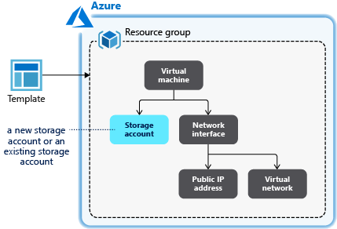
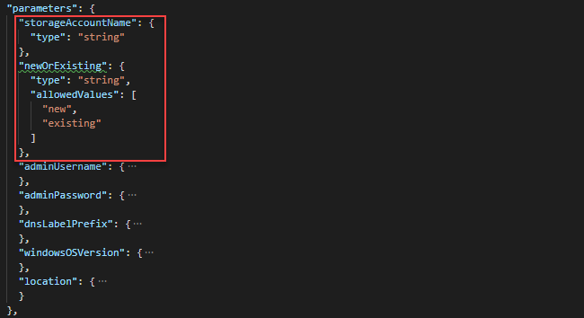
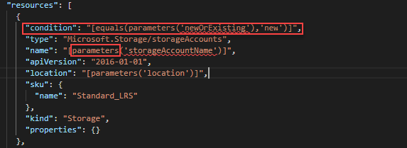

---
title: Use condition in Azure Resource Manager templates | Microsoft Docs
description: Learn how to deploy Azure resources based on conditions.
services: azure-resource-manager
documentationcenter: ''
author: mumian
manager: dougeby
editor: tysonn

ms.service: azure-resource-manager
ms.workload: multiple
ms.tgt_pltfrm: na
ms.devlang: na
ms.date: 05/21/2019
ms.topic: tutorial
ms.author: jgao
---

# Tutorial: Use condition in Azure Resource Manager templates

Learn how to deploy Azure resources based on conditions.

In the [Set resource deployment order](./resource-manager-tutorial-create-templates-with-dependent-resources.md) tutorial, you create a virtual machine, a virtual network, and some other dependent resources including a storage account. Instead of creating a new storage account every time, you let people choose between creating a new storage account and using an existing storage account. To accomplish this goal, you define an additional parameter. If the value of the parameter is "new", a new storage account is created. Otherwise, an existing storage account with the name provided is used.



This tutorial covers the following tasks:

> [!div class="checklist"]
> * Open a QuickStart template
> * Modify the template
> * Deploy the template
> * Clean up resources

This tutorial only covers a basic scenario of using conditions. For more information, see:

* [Template file structure: Condition](./resource-group-authoring-templates.md#condition).
* [Conditionally deploy a resource in an Azure Resource Manager template](/azure/architecture/building-blocks/extending-templates/conditional-deploy).
* [Template function: If](./resource-group-template-functions-logical.md#if).
* [Comparison functions for Azure Resource Manager templates](./resource-group-template-functions-comparison.md)

If you don't have an Azure subscription, [create a free account](https://azure.microsoft.com/free/) before you begin.

## Prerequisites

To complete this article, you need:

* [Visual Studio Code](https://code.visualstudio.com/) with [Resource Manager Tools extension](./resource-manager-quickstart-create-templates-use-visual-studio-code.md#prerequisites).
* To increase security, use a generated password for the virtual machine administrator account. Here is a sample for generating a password:

    ```azurecli-interactive
    openssl rand -base64 32
    ```

    Azure Key Vault is designed to safeguard cryptographic keys and other secrets. For more information, see [Tutorial: Integrate Azure Key Vault in Resource Manager Template deployment](./resource-manager-tutorial-use-key-vault.md). We also recommend you to update your password every three months.

## Open a Quickstart template

Azure QuickStart Templates is a repository for Resource Manager templates. Instead of creating a template from scratch, you can find a sample template and customize it. The template used in this tutorial is called [Deploy a simple Windows VM](https://azure.microsoft.com/resources/templates/101-vm-simple-windows/).

1. From Visual Studio Code, select **File**>**Open File**.
2. In **File name**, paste the following URL:

    ```url
    https://raw.githubusercontent.com/Azure/azure-quickstart-templates/master/101-vm-simple-windows/azuredeploy.json
    ```

3. Select **Open** to open the file.
4. There are five resources defined by the template:

   * `Microsoft.Storage/storageAccounts`. See the [template reference](https://docs.microsoft.com/azure/templates/Microsoft.Storage/storageAccounts).
   * `Microsoft.Network/publicIPAddresses`. See the [template reference](https://docs.microsoft.com/azure/templates/microsoft.network/publicipaddresses).
   * `Microsoft.Network/virtualNetworks`. See the [template reference](https://docs.microsoft.com/azure/templates/microsoft.network/virtualnetworks).
   * `Microsoft.Network/networkInterfaces`. See the [template reference](https://docs.microsoft.com/azure/templates/microsoft.network/networkinterfaces).
   * `Microsoft.Compute/virtualMachines`. See the [template reference](https://docs.microsoft.com/azure/templates/microsoft.compute/virtualmachines).

     It is helpful to get some basic understanding of the template before customizing it.
5. Select **File**>**Save As** to save a copy of the file to your local computer with the name **azuredeploy.json**.

## Modify the template

Make two changes to the existing template:

* Add a storage account name parameter. Users can specify either a new storage account name or an existing storage account name.
* Add a new parameter called **newOrExisting**. The deployment uses this parameter to determine where to create a new storage account or use an existing storage account.

Here is the procedure to make the changes:

1. Open **azuredeploy.json** in Visual Studio Code.
2. Replace the three **variables('storageAccountName')** with **parameters('storageAccountName')** in the whole template.
3. Remove the following variable definition:

    

4. Add the following two parameters to the template:

    ```json
    "storageAccountName": {
      "type": "string"
    },
    "newOrExisting": {
      "type": "string",
      "allowedValues": [
        "new",
        "existing"
      ]
    },
    ```

    The updated parameters definition looks like:

    

5. Add the following line to the beginning of the storage account definition.

    ```json
    "condition": "[equals(parameters('newOrExisting'),'new')]",
    ```

    The condition checks the value of a parameter called **newOrExisting**. If the parameter value is **new**, the deployment creates the storage account.

    The updated storage account definition looks like:

    
6. Update the **storageUri** property of the virtual machine resource definition with the following value:

    ```json
    "storageUri": "[concat('https://', parameters('storageAccountName'), '.blob.core.windows.net')]"
    ```

    This change is necessary when you use an existing storage account under a different resource group.

7. Save the changes.

## Deploy the template

Follow the instructions in [Deploy the template](./resource-manager-tutorial-create-templates-with-dependent-resources.md#deploy-the-template) to open the Cloud shell and upload the revised template, and then run the follow PowerShell script to deploy the template.

```azurepowershell
$resourceGroupName = Read-Host -Prompt "Enter the resource group name"
$storageAccountName = Read-Host -Prompt "Enter the storage account name"
$newOrExisting = Read-Host -Prompt "Create new or use existing (Enter new or existing)"
$location = Read-Host -Prompt "Enter the Azure location (i.e. centralus)"
$vmAdmin = Read-Host -Prompt "Enter the admin username"
$vmPassword = Read-Host -Prompt "Enter the admin password" -AsSecureString
$dnsLabelPrefix = Read-Host -Prompt "Enter the DNS Label prefix"

New-AzResourceGroup -Name $resourceGroupName -Location $location
New-AzResourceGroupDeployment `
    -ResourceGroupName $resourceGroupName `
    -adminUsername $vmAdmin `
    -adminPassword $vmPassword `
    -dnsLabelPrefix $dnsLabelPrefix `
    -storageAccountName $storageAccountName `
    -newOrExisting $newOrExisting `
    -TemplateFile "$HOME/azuredeploy.json"
```

> [!NOTE]
> The deployment fails if **newOrExisting** is **new**, but the storage account with the storage account name specified already exists.

Try making another deployment with **newOrExisting** set to "existing" and specify an exiting storage account. To create a storage account beforehand, see [Create a storage account](../storage/common/storage-quickstart-create-account.md).

## Clean up resources

When the Azure resources are no longer needed, clean up the resources you deployed by deleting the resource group. To delete the resource group, select **Try it** to open the Cloud shell. To paste the PowerShell script, right-click the shell pane, and then select **Paste**.

```azurepowershell-interactive
$resourceGroupName = Read-Host -Prompt "Enter the same resource group name you used in the last procedure"
Remove-AzResourceGroup -Name $resourceGroupName
```

## Next steps

In this tutorial, you developed a template that allows users to choose between creating a new storage account and using an existing storage account. To learn how to retrieve secrets from Azure Key Vault, and use the secrets as passwords in the template deployment, see:

> [!div class="nextstepaction"]
> [Integrate Key Vault in template deployment](./resource-manager-tutorial-use-key-vault.md)
