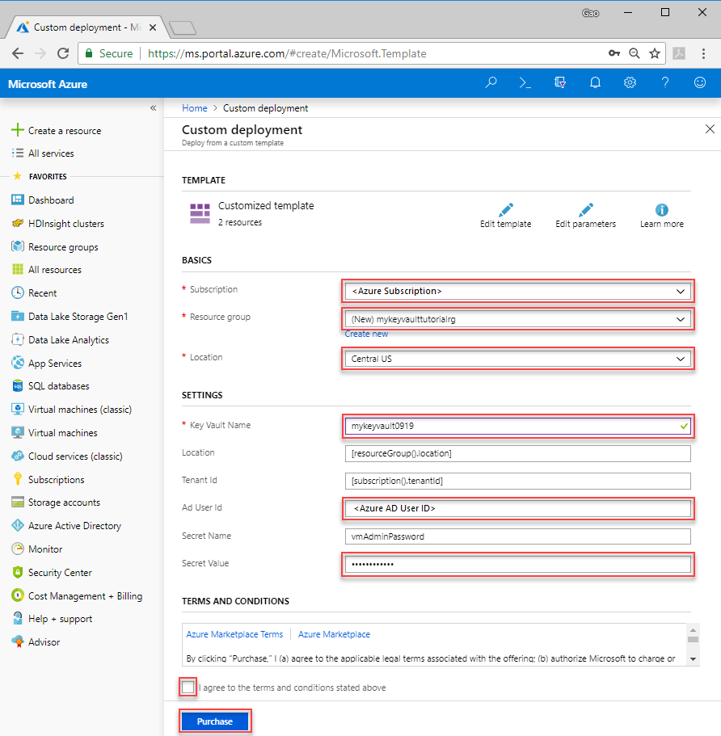
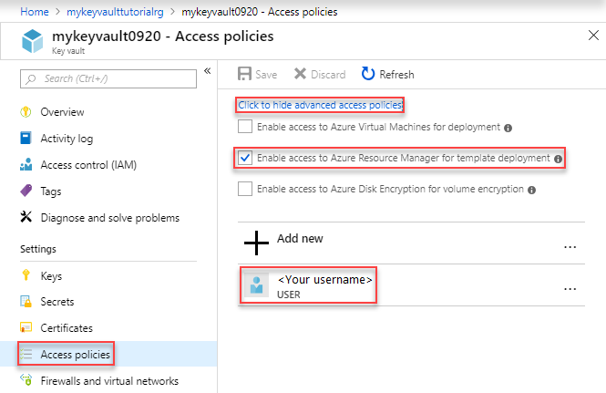

---
title: Integrate Azure Key Vault in Resource Manager template deployment | Microsoft Docs
description: Learn how to use Azure Key Vault to pass secure parameter values during Resource Manager template deployment
services: azure-resource-manager
documentationcenter: ''
author: mumian
manager: dougeby
editor: tysonn

ms.service: azure-resource-manager
ms.workload: multiple
ms.tgt_pltfrm: na
ms.devlang: na
ms.date: 03/04/2019
ms.topic: tutorial
ms.author: jgao
ms.custom: seodec18
---

# Tutorial: Integrate Azure Key Vault in Resource Manager Template deployment

Learn how to retrieve secrets from Azure Key Vault and pass the secrets as parameters during Resource Manager deployment. The value is never exposed because you only reference its key vault ID. For more information, see [Use Azure Key Vault to pass secure parameter value during deployment](./resource-manager-keyvault-parameter.md)

In the [Set resource deployment order](./resource-manager-tutorial-create-templates-with-dependent-resources.md) tutorial, you create a virtual machine, a virtual network, and some other dependent resources. In this tutorial, you customize the template to retrieve the virtual machine administrator password from a key vault.


This tutorial covers the following tasks:

> [!div class="checklist"]
> * Prepare a key vault
> * Open a QuickStart template
> * Edit the parameters file
> * Deploy the template
> * Validate the deployment
> * Clean up resources

If you don't have an Azure subscription, [create a free account](https://azure.microsoft.com/free/) before you begin.

[!INCLUDE [updated-for-az](../../includes/updated-for-az.md)]

## Prerequisites

To complete this article, you need:

* [Visual Studio Code](https://code.visualstudio.com/) with [Resource Manager Tools extension](./resource-manager-quickstart-create-templates-use-visual-studio-code.md#prerequisites).
* To increase security, use a generated password for the virtual machine administrator account. Here is a sample for generating a password:

    ```azurecli-interactive
    openssl rand -base64 32
    ```
    Verify the generated password meets the virtual machine password requirements. Each Azure service has specific password requirements. For the VM password requirements, see [What are the password requirements when creating a VM?](../virtual-machines/windows/faq.md#what-are-the-password-requirements-when-creating-a-vm).

## Prepare a key vault

In this section, you use a Resource Manager template to create a key vault and a secret. This template does:

* Create a key vault with the `enabledForTemplateDeployment` property enables. This property must be true before the template deployment process can access the secrets defined in this key vault.
* Add a secret to the key vault.  The secret stores the virtual machine administrator password.

If you (as the user to deploy the virtual machine template) are not the owner or the contributor of the key vault, the Owner or a Contributor of the key vault must grant you the access to the Microsoft.KeyVault/vaults/deploy/action permission for the key vault. For more information, see [Use Azure Key Vault to pass secure parameter value during deployment](./resource-manager-keyvault-parameter.md)

Your Azure AD user object ID is needed by the template to configure permissions. The following procedure gets the object ID (GUID).

1. Run the following Azure PowerShell or Azure CLI command.  

    # [CLI](#tab/CLI)
    ```azurecli-interactive
    echo "Enter your email address that is associated with your Azure subscription):" &&
    read upn &&
    az ad user show --upn-or-object-id $upn --query "objectId" &&
    ```   
    # [PowerShell](#tab/PowerShell)
    ```azurepowershell-interactive
    $upn = Read-Host -Prompt "Enter your user principal name (email address) used to sign in to Azure"
    (Get-AzADUser -UserPrincipalName $upn).Id
    ```
    or
    ```azurepowershell-interactive
    $displayName = Read-Host -Prompt "Enter your user display name (i.e. John Dole, see the upper right corner of the Azure portal)"
    (Get-AzADUser -DisplayName $displayName).Id
    ```
    ---
2. Write down the object ID. You need it later in the tutorial.

To create a key vault:

1. Select the following image to sign in to Azure and open a template. The template creates a key vault and a secret.

    <a href="https://portal.azure.com/#create/Microsoft.Template/uri/https%3A%2F%2Farmtutorials.blob.core.windows.net%2Fcreatekeyvault%2FCreateKeyVault.json"></a>

2. Select or enter the following values.  Don't select **Purchase** after you enter the values.

    

    * **Subscription**: select an Azure subscription.
    * **Resource group**: assign a unique name. Write down this name, you use the same resource group to deploy the virtual machine in the next session. Placing both the key vault and the virtual machine in the same resource group makes it easier to clean up the resource at the end of the tutorial.
    * **Location**: select a location.  The default location is **Central US**.
    * **Key Vault Name**: assign a unique name. 
    * **Tenant Id**: the template function automatically retrieve your tenant id.  Don't change the default value
    * **Ad User Id**: enter your Azure AD user object ID that you retrieved from the last procedure.
    * **Secret Name**: The default name is **vmAdminPassword**. If you change the secret name here, you need to update the secret name when you deploy the virtual machine.
    * **Secret Value**: Enter your secret.  The secret is the password used to sign in to the virtual machine. It is recommended to use the generated password you created in the last procedure.
    * **I agree to the terms and conditions state above**: Select.
3. Select **Edit template** from the top to take a look of the template.
4. Browse to line 28 of the template JSON file. This is the key vault resource definition.
5. Browse to line 35:

    ```json
    "enabledForTemplateDeployment": true,
    ```
    `enabledForTemplateDeployment` is a Key Vault property. This property must be true before you can retrieve the secrets from this key vault during deployment.
6. Browse to line 89. This is the Key Vault secret definition.
7. Select **Discard** from the bottom of the page. You didn't make any changes.
8. Verify you have provided all the values as shown in the previous screenshot, and then click **Purchase** at the bottom of the page.
9. Select the bell icon (notification) from the top of the page to open the **Notifications** pane. Wait until the resource is deployed successfully.
10. Select **Go to resource group** from the **Notifications** pane. 
11. Select the key vault name to open it.
12. Select **Secrets** from the left pane. **vmAdminPassword** shall be listed there.
13. Select **Access policies** from the left pane. Your name (Active Directory) shall be listed, otherwise you don't have the permission to access the key vault.
14. Select **Click to show advanced access policies**. Notice **Enable access to Azure Resource Manager for template deployment** is selected. This setting is another condition to make the Key Vault integration to work.

    
15. Select **Properties** from the left pane.
16. Make a copy of **Resource ID**. You need this ID when you deploy the virtual machine.  The Resource ID format is:

    ```json
    /subscriptions/<SubscriptionID>/resourceGroups/mykeyvaultdeploymentrg/providers/Microsoft.KeyVault/vaults/<KeyVaultName>
    ```

## Open a Quickstart template

Azure QuickStart Templates is a repository for Resource Manager templates. Instead of creating a template from scratch, you can find a sample template and customize it. The template used in this tutorial is called [Deploy a simple Windows VM](https://azure.microsoft.com/resources/templates/101-vm-simple-windows/).

1. From Visual Studio Code, select **File**>**Open File**.
2. In **File name**, paste the following URL:

    ```url
    https://raw.githubusercontent.com/Azure/azure-quickstart-templates/master/101-vm-simple-windows/azuredeploy.json
    ```
3. Select **Open** to open the file. It is the same scenario used in [Tutorial: create Azure Resource Manager templates with dependent resources](./resource-manager-tutorial-create-templates-with-dependent-resources.md).
4. There are five resources defined by the template:

   * `Microsoft.Storage/storageAccounts`. See the [template reference](https://docs.microsoft.com/azure/templates/Microsoft.Storage/storageAccounts).
   * `Microsoft.Network/publicIPAddresses`. See the [template reference](https://docs.microsoft.com/azure/templates/microsoft.network/publicipaddresses).
   * `Microsoft.Network/virtualNetworks`. See the [template reference](https://docs.microsoft.com/azure/templates/microsoft.network/virtualnetworks).
   * `Microsoft.Network/networkInterfaces`. See the [template reference](https://docs.microsoft.com/azure/templates/microsoft.network/networkinterfaces).
   * `Microsoft.Compute/virtualMachines`. See the [template reference](https://docs.microsoft.com/azure/templates/microsoft.compute/virtualmachines).

     It is helpful to get some basic understanding of the template before customizing it.
5. Select **File**>**Save As** to save a copy of the file to your local computer with the name **azuredeploy.json**.
6. Repeat steps 1-4 to open the following URL, and then save the file as **azuredeploy.parameters.json**.

    ```url
    https://raw.githubusercontent.com/Azure/azure-quickstart-templates/master/101-vm-simple-windows/azuredeploy.parameters.json
    ```

## Edit the parameters file

You don't need to make any changes to the template file.

1. Open **azuredeploy.parameters.json** in Visual Studio Code if it is not opened.
2. Update the **adminPassword** parameter to:

    ```json
    "adminPassword": {
        "reference": {
            "keyVault": {
            "id": "/subscriptions/<SubscriptionID>/resourceGroups/mykeyvaultdeploymentrg/providers/Microsoft.KeyVault/vaults/<KeyVaultName>"
            },
            "secretName": "vmAdminPassword"
        }
    },
    ```

    Replace the **id** with the resource ID of your key vault created in the last procedure.  

    
3. Give the values to:

    * **adminUsername**: name the virtual machine administrator account.
    * **dnsLabelPrefix**: name the dnsLabelPrefix.
4. Save the changes.

## Deploy the template

Follow the instructions in [Deploy the template](./resource-manager-tutorial-create-templates-with-dependent-resources.md#deploy-the-template) to deploy the template. You need to upload both **azuredeploy.json** and **azuredeploy.parameters.json** to the Cloud shell, and then use the following PowerShell script to deploy the template:

```azurepowershell
$resourceGroupName = Read-Host -Prompt "Enter the Resource Group name"
$location = Read-Host -Prompt "Enter the location (i.e. centralus)"

New-AzResourceGroup -Name $resourceGroupName -Location $location
New-AzResourceGroupDeployment `
    -ResourceGroupName $resourceGroupName `
    -TemplateFile "$HOME/azuredeploy.json" `
    -TemplateParameterFile "$HOME/azuredeploy.parameters.json"
```

When you deploy the template, use the same resource group as the key vault. It makes easier when you clean up the resources. You only need to delete one resource group instead of two.

## Validate the deployment

After you have successfully deployed the virtual machine, test the login using the password stored in the key vault.

1. Open the [Azure portal](https://portal.azure.com).
2. Select **Resource grouips**/**YourResourceGroupName>**/**simpleWinVM**
3. Select **connect** from the top.
4. Select **Download RDP File** and then follow the instructions to sign in into the virtual machine using the password stored in the key vault.

## Clean up resources

When the Azure resources are no longer needed, clean up the resources you deployed by deleting the resource group.

1. From the Azure portal, select **Resource group** from the left menu.
2. Enter the resource group name in the **Filter by name** field.
3. Select the resource group name.  You shall see a total of six resources in the resource group.
4. Select **Delete resource group** from the top menu.

## Next steps

In this tutorial, you retrieved a secret from Azure Key Vault, and used the secret in your template deployment.  To learn how to create linked templates, see:

> [!div class="nextstepaction"]
> [Create linked templates](./resource-manager-tutorial-create-linked-templates.md)
