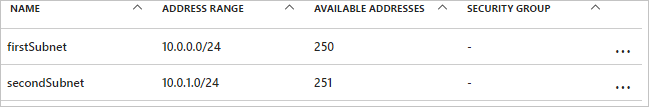
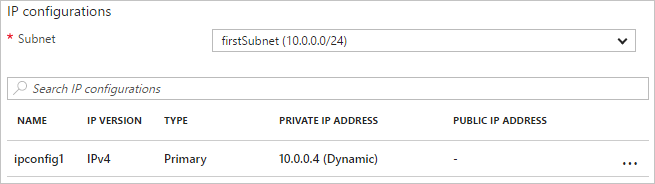

# Patterns for extending the functionality of Azure Resource Manager templates - updating a resource

There are some scenarios in which you need to update a resource during a deployment. You encounter this scenario when you cannot specify all the properties for a resource until other, dependent resources are created. For example, if you create a backend pool for a load balancer, you might update the network interfaces (NICs) on your virtual machines (VMs) to include them in the backend pool. Resource Manager supports updating resources during deployment, but you must design your template correctly to avoid errors and to ensure the deployment is handled as an update.

## Understand the pattern

First, you must reference the resource once in the template to create it, but then you must reference the resource by the same name to update it later. However, if two resources have the same name in a template, Resource Manager throws an exception. To avoid this error, specify the updated resource in a second template that's either linked or included as a subtemplate using the `Microsoft.Resources/deployments` resource type.

Second, in the second template, you must either specify the name of the existing property to change or a new name for a property to add. Then, you must also specify the original properties and their original values. If you fail to provide the original properties and values, Resource Manager assumes you want to create a new resource, and deletes the original resource. It replaces the original resource with a new resource that includes only the new properties you've specified.

Finally, you must make the resource dependent on all related resources that you want to deploy. This dependency ensures the resources are created in the correct order. The order is:

1. Resource created
2. Dependent resources created
3. Resource (from step 1) updated with values from dependent resources (step 2)

## Example template

The following example template demonstrates this pattern. It deploys a virtual network (VNet) named `firstVNet` that has one subnet named `firstSubnet`. It then deploys a virtual network interface (NIC) named `nic1` and associates it with the subnet. Then, a deployment resource named `updateVNet` includes a nested template that references the name of the `firstVNet` resource. 

Look at the `addressSpace` property and the `subnets` property on this resource. Notice that the `addressSpace` value is set to the same property value on the `firstVNet` resource deployment object. In the `subnets` array, the value for `firstSubnet` is set similarly. Because all the original `firstVNet` properties have been specified,  Resource Manager updates the resource in Azure. In this case, the update is the addition of a new subnet named `secondSubnet`.

```json
{
  "$schema": "https://schema.management.azure.com/schemas/2015-01-01/deploymentTemplate.json#",
  "contentVersion": "1.0.0.0",
  "parameters": {},
  "resources": [
      {
      "apiVersion": "2016-03-30",
      "name": "firstVNet",
      "location":"[resourceGroup().location]",
      "type": "Microsoft.Network/virtualNetworks",
      "properties": {
          "addressSpace":{"addressPrefixes": [
              "10.0.0.0/22"
          ]},
          "subnets":[              
              {
                  "name":"firstSubnet",
                  "properties":{
                    "addressPrefix":"10.0.0.0/24"
                  }
              }
            ]
      }
    },
    {
        "apiVersion": "2015-06-15",
        "type":"Microsoft.Network/networkInterfaces",
        "name":"nic1",
        "location":"[resourceGroup().location]",
        "dependsOn": [
            "firstVNet"
        ],
        "properties": {
            "ipConfigurations":[
                {
                    "name":"ipconfig1",
                    "properties": {
                        "privateIPAllocationMethod":"Dynamic",
                        "subnet": {
                            "id": "[concat(resourceId('Microsoft.Network/virtualNetworks','firstVNet'),'/subnets/firstSubnet')]"
                        }
                    }
                }
            ]
        }
    },
    {
      "apiVersion": "2015-01-01",
      "type": "Microsoft.Resources/deployments",
      "name": "updateVNet",
      "dependsOn": [
          "nic1"
      ],
      "properties": {
        "mode": "Incremental",
        "parameters": {},
        "template": {
          "$schema": "http://schema.management.azure.com/schemas/2015-01-01/deploymentTemplate.json#",
          "contentVersion": "1.0.0.0",
          "parameters": {},
          "variables": {},
          "resources": [
              {
                  "apiVersion": "2016-03-30",
                  "name": "firstVNet",
                  "location":"[resourceGroup().location]",
                  "type": "Microsoft.Network/virtualNetworks",
                  "properties": {
                      "addressSpace": "[reference('firstVNet').addressSpace]",
                      "subnets":[
                          {
                              "name":"[reference('firstVNet').subnets[0].name]",
                              "properties":{
                                  "addressPrefix":"[reference('firstVNet').subnets[0].properties.addressPrefix]"
                                  }
                          },
                          {
                              "name":"secondSubnet",
                              "properties":{
                                  "addressPrefix":"10.0.1.0/24"
                                  }
                          }
                     ]
                  }
              }
          ],
          "outputs": {}
          }
        }
    }
  ],
  "outputs": {}
}
```

## Try the template

If you would like to experiment with this template, follow these steps:

1.	Go to the Azure portal, select the "+" icon, and search for the "template deployment" resource type. When you find it in the search results, select it.
2.	When you get to the "template deployment" page, select the **create** button, which opens the "custom deployment" blade.
3.	Select the **edit** icon.
4.	Delete the empty template.
5.	Copy and paste the preceding sample template into the right-hand pane.
6.	Select the **save** button.
7.	You return to the "custom deployment" pane, but this time there are some drop-down boxes. Select your subscription, either create new or use existing resource group, and select a location. Review the terms and conditions, then select the **I agree** button.
8.	Select the **purchase** button.

Once deployment has finished, open the resource group you specified in the portal. You see a VNet named `firstVNet` and a NIC named `nic1`. Click `firstVNet`, then click `subnets`. You see the `firstSubnet` that was originally created, and you see the `secondSubnet` that was added in the `updateVNet` resource. 



Then, go back to the resource group and click `nic1` then click `IP configurations`. In the `IP configurations` section, the `Subnet` is set to `firstSubnet (10.0.0.0/24)`. 



The original `firstVNet` has been updated instead of recreated. If `firstVNet` had been recreated, `nic1` would not be associated with `firstVNet`.

## Next steps

You can use this pattern in your templates to respecify the original properties of the resource you want to update. Specify the update resource either in a linked or nested template using the `Microsoft.Resources/deployments` resource type.

* For an introduction to the `reference()` function, see [Azure Resource Manager template functions](resource-group-template-functions.md).
* This pattern is also implemented in the [template building blocks project](https://github.com/mspnp/template-building-blocks) and the [Azure reference architectures](/azure/architecture/reference-architectures/).