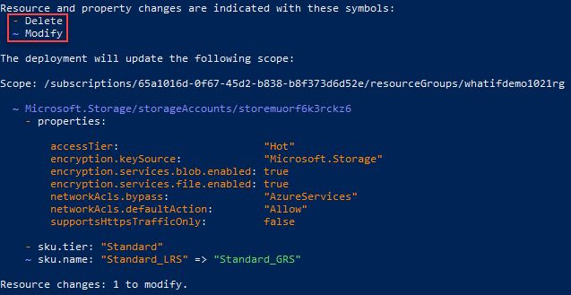
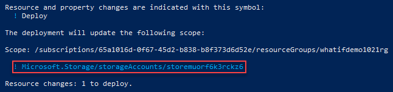
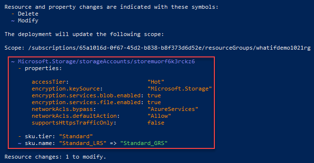
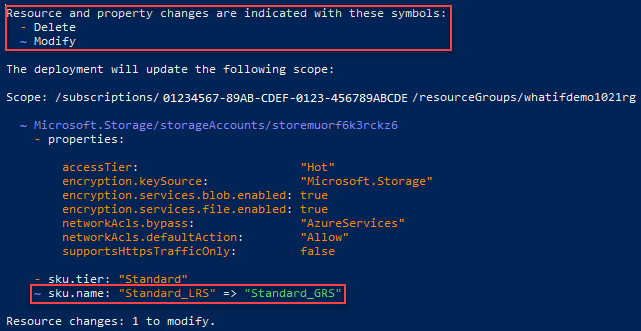
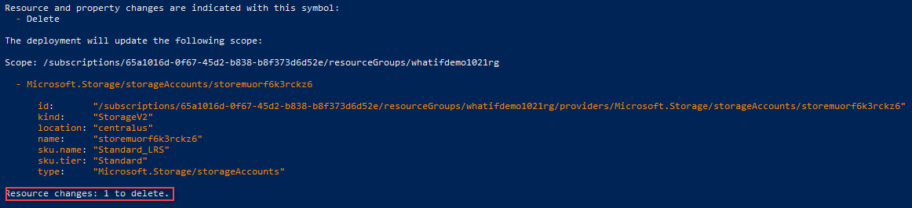

# Resource Manager template deployment what-if operation

Before deploying a template, you can preview the changes that will happen. Azure Resource Manager provides the what-if operation to let you see how resources will be changed if you deploy the template. The what-if operation doesn't make any changes to existing resources. Instead, it predicts the changes if the specified template is deployed. Use this feature to make sure your template doesn't make any unexpected changes.

The what-if operation is currently in preview. To use it, you must sign up for the preview.

You can use the what-if operation with the `New-AzDeploymentWhatIf` PowerShell command or the [Deployments - What If](/rest/api/resources/deployments/whatif) REST operation.

In PowerShell, the output looks like:



## Change types

The what-if operation lists six different types of changes:

- **Create**: The resource doesn't currently exist but is defined in the template. The resource will be created.

- **Delete**: This change type only applies when using [complete mode](deployment-modes.md) for deployment. The resource exists, but isn't defined in the template. With complete mode, the resource will be deleted. Only resources that [support complete mode deletion](complete-mode-deletion.md) are included in this change type.

- **Ignore**: The resource exists, but isn't defined in the template. The resource won't be deployed or modified.

- **Deploy**: The resource exists, and is defined in the template. The resource will be redeployed. The properties of the resource may or may not change. The operation returns this change type when it doesn't have enough information to determine if any properties will change. You only see this condition when [ResultFormat](#result-format) is set to `ResourceIdOnly`.

- **NoChange**: The resource exists, and is defined in the template. The resource will be redeployed, but the properties of the resource won't change. This change type is returned when [ResultFormat](#result-format) is set to `FullResourcePayloads`, which is the default value.

- **Modify**: The resource exists, and is defined in the template. The resource will be redeployed, and the properties of the resource will change. This change type is returned when [ResultFormat](#result-format) is set to `FullResourcePayloads`, which is the default value.

## Deployment scope

You can use the what-if operation for deployments at either the subscription or resource group level. You set the deployment scope with the `-ScopeType` parameter. The accepted values are `Subscription` and `ResourceGroup`. This article demonstrates resource group deployments.

To learn about subscription level deployments, see [Create resource groups and resources at the subscription level](deploy-to-subscription.md#).

## Result format

You can control the level of detail that is returned about the predicted changes. Use the `-ResultFormat` parameter to set whether you want only a list of resources that will change or whether that list of resources should also include details about the properties that will change. To see all properties, set the result format to `FullResourcePayloads`. To see only which resources will change, set the result format to `ResourceIdOnly`. The default value is `FullResourcePayloads`.  

The following screenshots show the two different output formats:

- Resource ID only

    

- Full resource payloads

    

## Run what-if operation

To see how what-if works, let's runs some tests. You'll deploy a template from [Azure Quickstart templates that creates a storage account](https://raw.githubusercontent.com/Azure/azure-quickstart-templates/master/101-storage-account-create/azuredeploy.json). The default storage account type is `Standard_LRS`.

To set up your environment, deploy a storage account resource with the default **Standard_LRS** storage account type.

```azurepowershell-interactive
New-AzResourceGroup `
  -Name ExampleGroup `
  -Location centralus
New-AzResourceGroupDeployment `
  -ResourceGroupName ExampleGroup `
  -TemplateUri "https://raw.githubusercontent.com/Azure/azure-quickstart-templates/master/101-storage-account-create/azuredeploy.json"
```

After the deployment completes, you're ready to test the what-if operation. Run the what-if command but set the storage account type to `Standard_GRS`.

```azurepowershell-interactive
New-AzDeploymentWhatIf `
  -ScopeType ResourceGroup `
  -ResourceGroupName ExampleGroup `
  -TemplateUri "https://raw.githubusercontent.com/Azure/azure-quickstart-templates/master/101-storage-account-create/azuredeploy.json" `
  -storageAccountType Standard_GRS
```

The what-if output is similar to:



Notice at the top of the output that colors are defined to indicate the type of changes.

At the bottom of the output, it shows the sku name (storage account type) will be changed from **Standard_LRS** to **Standard_GRS**.

The what-if operation supports using [deployment mode](deployment-modes.md). The following example tests deploying a [template that has no resources defined](https://github.com/Azure/azure-docs-json-samples/blob/master/empty-template/azuredeploy.json).

```azurepowershell-interactive
New-AzDeploymentWhatIf `
  -ScopeType ResourceGroup `
  -ResourceGroupName ExampleGroup `
  -TemplateUri "https://raw.githubusercontent.com/Azure/azure-docs-json-samples/master/empty-template/azuredeploy.json" `
  -Mode Complete
```

Because no resources are defined in the template and the deployment mode is set to complete, the storage account will be deleted.



It's important to remember what-if makes no actual changes. The storage account still exists in your resource group.

## Next steps

- To deploy templates with Azure PowerShell, see [Deploy resources with Resource Manager templates and Azure PowerShell](resource-group-template-deploy.md).
- To deploy templates with REST, see [Deploy resources with Resource Manager templates and Resource Manager REST API](resource-group-template-deploy-rest.md).
- To roll back to a successful deployment when you get an error, see [Rollback on error to successful deployment](rollback-on-error.md).
