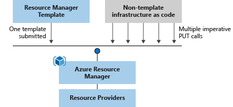
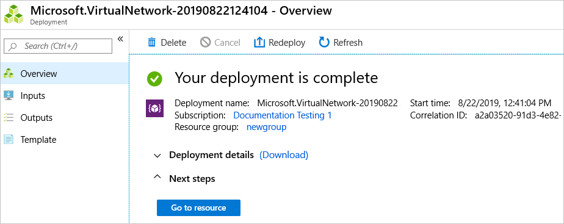
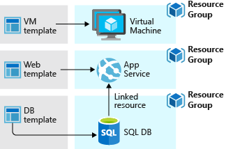

# Azure Resource Manager templates

With the move to the cloud, many teams have adopted agile development methods. These teams iterate quickly. They need to repeatedly deploy their solutions to the cloud, and know their infrastructure is in a reliable state. As infrastructure has become part of the iterative process, the division between operations and development has disappeared. Teams need to manage infrastructure and application code through a unified process.

To meet these challenges, you can automate deployments and use the practice of infrastructure as code. In code, you define the infrastructure that needs to be deployed. The infrastructure code becomes part of your project. Just like application code, you store the infrastructure code in a source repository and version it. Any one on your team can run the code and deploy similar environments.

To implement infrastructure as code for your Azure solutions, use Azure Resource Manager templates. The template is a JavaScript Object Notation (JSON) file that defines the infrastructure and configuration for your project. The template uses declarative syntax, which lets you state what you intend to deploy without having to write the sequence of programming commands to create it. In the template, you specify the resources to deploy and the properties for those resources.

## Why choose Resource Manager templates?

If you're trying to decide between using Resource Manager templates and one of the other infrastructure as code services, consider the following advantages of using templates:

* **Declarative syntax**: Resource Manager templates allow you to create and deploy an entire Azure infrastructure declaratively. For example, you can deploy not only virtual machines, but also the network infrastructure, storage systems and any other resources you may need.

* **Repeatable results**: Repeatedly deploy your infrastructure throughout the development lifecycle and have confidence your resources are deployed in a consistent manner. Templates are idempotent, which means you can deploy the same template many times and get the same resource types in the same state. You can develop one template that represents the desired state, rather than developing lots of separate templates to represent updates.

* **Orchestration**: You don't have to worry about the complexities of ordering operations. Resource Manager orchestrates the deployment of interdependent resources so they're created in the correct order. When possible, Resource Manager deploys resources in parallel so your deployments finish faster than serial deployments. You deploy the template through one command, rather than through multiple imperative commands.

   

* **Built-in validation**: Your template is deployed only after passing validation. Resource Manager checks the template before starting the deployment to make sure the deployment will succeed. Your deployment is less likely to stop in a half-finished state.

* **Modular files**: You can break your templates into smaller, reusable components and link them together at deployment time. You can also nest one template inside another templates.

* **Create any Azure resource**: You can immediately use new Azure services and features in templates. As soon as a resource provider introduces new resources, you can deploy those resources through templates. You don't have to wait for tools or modules to be updated before using the new services.

* **Tracked deployments**: In the Azure portal, you can review the deployment history and get information about the template deployment. You can see the template that was deployed, the parameter values passed in, and any output values. Other infrastructure as code services aren't tracked through the portal.

   

* **Policy as code**: [Azure Policy](../governance/policy/overview.md) is a policy as code framework to automate governance. If you're using Azure policies, policy remediation is done on non-compliant resources when deployed through templates.

* **Deployment Blueprints**: You can take advantage of [Blueprints](../governance/blueprints/overview.md) provided by Microsoft to meet regulatory and compliance standards. These blueprints include pre-built templates for various architectures.

* **Exportable code**: You can get a template for an existing resource group by either exporting the current state of the resource group, or viewing the template used for a particular deployment. Viewing the [exported template](export-template-portal.md) is a helpful way to learn about the template syntax.

* **Authoring tools**: You can author templates with [Visual Studio Code](resource-manager-tools-vs-code.md) and the template tool extension. You get intellisense, syntax highlighting, in-line help, and many other language functions.

## Template file

Within your template, you can write [template expressions](template-expressions.md) that extend the capabilities of JSON. These expressions make use of the [functions](resource-group-template-functions.md) provided by Resource Manager.

The template has the following sections:

* [Parameters](template-parameters.md) - Provide values during deployment that allow the same template to be used with different environments.

* [Variables](template-variables.md) - Define values that are reused in your templates. They can be constructed from parameter values.

* [User-defined functions](template-user-defined-functions.md) - Create customized functions that simplify your template.

* [Resources](resource-group-authoring-templates.md#resources) - Specify the resources to deploy.

* [Outputs](template-outputs.md) - Return values from the deployed resources.

## Template deployment process

When you deploy a template, Resource Manager converts the template into REST API operations. For example, when Resource Manager receives a template with the following resource definition:

```json
"resources": [
  {
    "apiVersion": "2016-01-01",
    "type": "Microsoft.Storage/storageAccounts",
    "name": "mystorageaccount",
    "location": "westus",
    "sku": {
      "name": "Standard_LRS"
    },
    "kind": "Storage",
    "properties": {
    }
  }
]
```

It converts the definition to the following REST API operation, which is sent to the Microsoft.Storage resource provider:

```HTTP
PUT
https://management.azure.com/subscriptions/{subscriptionId}/resourceGroups/{resourceGroupName}/providers/Microsoft.Storage/storageAccounts/mystorageaccount?api-version=2016-01-01
REQUEST BODY
{
  "location": "westus",
  "properties": {
  }
  "sku": {
    "name": "Standard_LRS"
  },
  "kind": "Storage"
}
```

## Template design

How you define templates and resource groups is entirely up to you and how you want to manage your solution. For example, you can deploy your three tier application through a single template to a single resource group.


But, you don't have to define your entire infrastructure in a single template. Often, it makes sense to divide your deployment requirements into a set of targeted, purpose-specific templates. You can easily reuse these templates for different solutions. To deploy a particular solution, you create a master template that links all the required templates. The following image shows how to deploy a three tier solution through a parent template that includes three nested templates.


If you envision your tiers having separate lifecycles, you can deploy your three tiers to separate resource groups. Notice the resources can still be linked to resources in other resource groups.



For information about nested templates, see [Using linked templates with Azure Resource Manager](resource-group-linked-templates.md).

## Next steps

* For information about the properties in template files, see [Understand the structure and syntax of Azure Resource Manager templates](resource-group-authoring-templates.md).
* To explicitly set dependencies so one resource is deployed before another resource, see [Defining dependencies in Azure Resource Manager templates](resource-group-define-dependencies.md).
* You can add a resource to your template and optionally deploy it. For more information, see [Conditional deployment in Resource Manager templates](conditional-resource-deployment.md).
* Rather than repeating blocks of JSON many times in your template, you can specify more than one instance of a variable, property, or resource. For more information, see [Resource, property, or variable iteration in Azure Resource Manager templates](resource-group-create-multiple.md).
* To learn about exporting templates, see [Quickstart: Create and deploy Azure Resource Manager templates by using the Azure portal](./resource-manager-quickstart-create-templates-use-the-portal.md).
