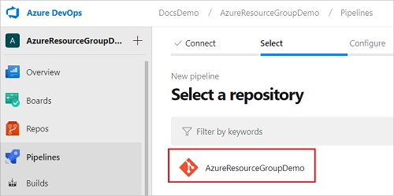
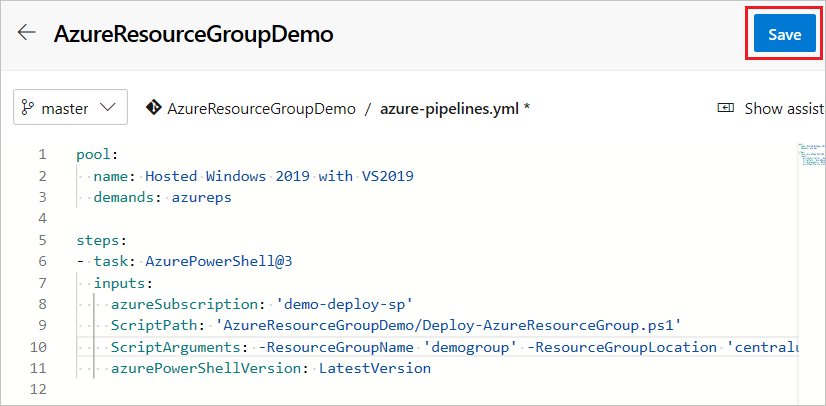
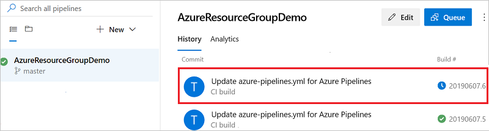

# Integrate ARM templates with Azure Pipelines

Visual Studio provides the Azure Resource Group project for creating Azure Resource Manager (ARM) templates and deploying them to your Azure subscription. You can integrate this project with Azure Pipelines for continuous integration and continuous deployment (CI/CD).

There are two ways to deploy templates with Azure Pipelines:

* **Add task that runs an Azure PowerShell script**. This option has the advantage of providing consistency throughout the development life cycle because you use the same script that is included in the Visual Studio project (Deploy-AzureResourceGroup.ps1). The script stages artifacts from your project to a storage account that Resource Manager can access. Artifacts are items in your project such as linked templates, scripts, and application binaries. Then, the script deploys the template.

* **Add tasks to copy and deploy tasks**. This option offers a convenient alternative to the project script. You configure two tasks in the pipeline. One task stages the artifacts and the other task deploys the template.

This article shows both approaches.

## Prepare your project

This article assumes your Visual Studio project and Azure DevOps organization are ready for creating the pipeline. The following steps show how to make sure you're ready:

* You have an Azure DevOps organization. If you don't have one, [create one for free](/azure/devops/pipelines/get-started/pipelines-sign-up?view=azure-devops). If your team already has an Azure DevOps organization, make sure you're an administrator of the Azure DevOps project that you want to use.

* You've configured a [service connection](/azure/devops/pipelines/library/connect-to-azure?view=azure-devops) to your Azure subscription. The tasks in the pipeline execute under the identity of the service principal. For steps to create the connection, see [Create a DevOps project](deployment-tutorial-pipeline.md#create-a-devops-project).

* You have a Visual Studio project that was created from the **Azure Resource Group** starter template. For information about creating that type of project, see [Creating and deploying Azure resource groups through Visual Studio](create-visual-studio-deployment-project.md).

* Your Visual Studio project is [connected to an Azure DevOps project](/azure/devops/repos/git/share-your-code-in-git-vs-2017?view=azure-devops).

## Create pipeline

1. If you haven't added a pipeline previously, you need to create a new pipeline. From your Azure DevOps organization, select **Pipelines** and **New pipeline**.

   

1. Specify where your code is stored. The following image shows selecting **Azure Repos Git**.

   

1. From that source, select the repository that has the code for your project.

   

1. Select the type of pipeline to create. You can select **Starter pipeline**.

   

You're ready to either add an Azure PowerShell task or the copy file and deploy tasks.

## Azure PowerShell task

This section shows how to configure continuous deployment by using a single task that runs the PowerShell script in your project. The following YAML file creates an [Azure PowerShell task](/azure/devops/pipelines/tasks/deploy/azure-powershell?view=azure-devops):

```yaml
pool:
  name: Hosted Windows 2019 with VS2019
  demands: azureps

steps:
- task: AzurePowerShell@3
  inputs:
    azureSubscription: 'demo-deploy-sp'
    ScriptPath: 'AzureResourceGroupDemo/Deploy-AzureResourceGroup.ps1'
    ScriptArguments: -ResourceGroupName 'demogroup' -ResourceGroupLocation 'centralus'
    azurePowerShellVersion: LatestVersion
```

When you set the task to `AzurePowerShell@3`, the pipeline uses commands from the AzureRM module to authenticate the connection. By default, the PowerShell script in the Visual Studio project uses the AzureRM module. If you've updated your script to use the [Az module](/powershell/azure/new-azureps-module-az), set the task to `AzurePowerShell@4`.

```yaml
steps:
- task: AzurePowerShell@4
```

For `azureSubscription`, provide the name of the service connection you created.

```yaml
inputs:
    azureSubscription: '<your-connection-name>'
```

For `scriptPath`, provide the relative path from the pipeline file to your script. You can look in your repository to see the path.

```yaml
ScriptPath: '<your-relative-path>/<script-file-name>.ps1'
```

If you don't need to stage artifacts, just pass the name and location of a resource group to use for deployment. The Visual Studio script creates the resource group if it doesn't already exist.

```yaml
ScriptArguments: -ResourceGroupName '<resource-group-name>' -ResourceGroupLocation '<location>'
```

If you need to stage artifacts to an existing storage account, use:

```yaml
ScriptArguments: -ResourceGroupName '<resource-group-name>' -ResourceGroupLocation '<location>' -UploadArtifacts -ArtifactStagingDirectory '$(Build.StagingDirectory)' -StorageAccountName '<your-storage-account>'
```

Now, that you understand how to create the task, let's go through the steps to edit the pipeline.

1. Open your pipeline, and replace the contents with your YAML:

   ```yaml
   pool:
     name: Hosted Windows 2019 with VS2019
     demands: azureps

   steps:
   - task: AzurePowerShell@3
     inputs:
       azureSubscription: 'demo-deploy-sp'
       ScriptPath: 'AzureResourceGroupDemo/Deploy-AzureResourceGroup.ps1'
       ScriptArguments: -ResourceGroupName 'demogroup' -ResourceGroupLocation 'centralus' -UploadArtifacts -ArtifactStagingDirectory '$(Build.StagingDirectory)' -StorageAccountName 'stage3a4176e058d34bb88cc'
       azurePowerShellVersion: LatestVersion
   ```

1. Select **Save**.

   

1. Provide a message for the commit, and commit directly to **master**.

1. When you select **Save**, the build pipeline is automatically run. Go back to the summary for your build pipeline, and watch the status.

   

You can select the currently running pipeline to see details about the tasks. When it finishes, you see the results for each step.

## Copy and deploy tasks

This section shows how to configure continuous deployment by using a two tasks to stage the artifacts and deploy the template.

The following YAML shows the [Azure file copy task](/azure/devops/pipelines/tasks/deploy/azure-file-copy?view=azure-devops):

```yaml
- task: AzureFileCopy@3
  displayName: 'Stage files'
  inputs:
    SourcePath: 'AzureResourceGroup1'
    azureSubscription: 'demo-deploy-sp'
    Destination: 'AzureBlob'
    storage: 'stage3a4176e058d34bb88cc'
    ContainerName: 'democontainer'
    outputStorageUri: 'artifactsLocation'
    outputStorageContainerSasToken: 'artifactsLocationSasToken'
    sasTokenTimeOutInMinutes: '240'
```

There are several parts of this task to revise for your environment. The `SourcePath` indicates the location of the artifacts relative to the pipeline file. In this example, the files exist in a folder named `AzureResourceGroup1` which was the name of the project.

```yaml
SourcePath: '<path-to-artifacts>'
```

For `azureSubscription`, provide the name of the service connection you created.

```yaml
azureSubscription: '<your-connection-name>'
```

For storage and container name, provide the names of the storage account and container you want to use for storing the artifacts. The storage account must exist.

```yaml
storage: '<your-storage-account-name>'
ContainerName: '<container-name>'
```

The following YAML shows the [Azure Resource Manager template deployment task](https://github.com/microsoft/azure-pipelines-tasks/blob/master/Tasks/AzureResourceManagerTemplateDeploymentV3/README.md):

```yaml
- task: AzureResourceGroupDeployment@2
  displayName: 'Deploy template'
  inputs:
    deploymentScope: 'Resource Group'
    ConnectedServiceName: 'demo-deploy-sp'
    subscriptionName: '01234567-89AB-CDEF-0123-4567890ABCDEF'
    action: 'Create Or Update Resource Group'
    resourceGroupName: 'demogroup'
    location: 'Central US'
    templateLocation: 'URL of the file'
    csmFileLink: '$(artifactsLocation)WebSite.json$(artifactsLocationSasToken)'
    csmParametersFileLink: '$(artifactsLocation)WebSite.parameters.json$(artifactsLocationSasToken)'
    overrideParameters: '-_artifactsLocation $(artifactsLocation) -_artifactsLocationSasToken "$(artifactsLocationSasToken)"'
    deploymentMode: 'Incremental'
```

There are several parts of this task to revise for your environment.

- `deploymentScope`: Select the scope of deployment from the options: `Management Group`, `Subscription` and `Resource Group`. Use **Resource Group** in this walk through. To learn more about the scopes, see [Deployment scopes](deploy-rest.md#deployment-scope).

- `ConnectedServiceName`: Provide the name of the service connection you created.

    ```yaml
    ConnectedServiceName: '<your-connection-name>'
    ```

- `subscriptionName`: Provide the target subscription ID. This property only applies to the Resource Group deployment scope and the subscription deployment scope.

- `resourceGroupName` and `location`: provide the name and location of the resource group you want to deploy to. The task creates the resource group if it doesn't exist.

    ```yaml
    resourceGroupName: '<resource-group-name>'
    location: '<location>'
    ```

The deployment task links to a template named `WebSite.json` and a parameters file named WebSite.parameters.json. Use the names of your template and parameter files.

Now, that you understand how to create the tasks, let's go through the steps to edit the pipeline.

1. Open your pipeline, and replace the contents with your YAML:

   ```yaml
   pool:
     name: Hosted Windows 2019 with VS2019

   steps:
   - task: AzureFileCopy@3
     displayName: 'Stage files'
     inputs:
       SourcePath: 'AzureResourceGroup1'
       azureSubscription: 'demo-deploy-sp'
       Destination: 'AzureBlob'
       storage: 'stage3a4176e058d34bb88cc'
       ContainerName: 'democontainer'
       outputStorageUri: 'artifactsLocation'
       outputStorageContainerSasToken: 'artifactsLocationSasToken'
       sasTokenTimeOutInMinutes: '240'
    - task: AzureResourceGroupDeployment@2
      displayName: 'Deploy template'
      inputs:
        deploymentScope: 'Resource Group'
        ConnectedServiceName: 'demo-deploy-sp'
        subscriptionName: '01234567-89AB-CDEF-0123-4567890ABCDEF'
        action: 'Create Or Update Resource Group'
        resourceGroupName: 'demogroup'
        location: 'Central US'
        templateLocation: 'URL of the file'
        csmFileLink: '$(artifactsLocation)WebSite.json$(artifactsLocationSasToken)'
        csmParametersFileLink: '$(artifactsLocation)WebSite.parameters.json$(artifactsLocationSasToken)'
        overrideParameters: '-_artifactsLocation $(artifactsLocation) -_artifactsLocationSasToken "$(artifactsLocationSasToken)"'
        deploymentMode: 'Incremental'
   ```

1. Select **Save**.

1. Provide a message for the commit, and commit directly to **master**.

1. When you select **Save**, the build pipeline is automatically run. Go back to the summary for your build pipeline, and watch the status.

   

You can select the currently running pipeline to see details about the tasks. When it finishes, you see the results for each step.

## Next steps

For step-by-step process on using Azure Pipelines with ARM templates, see [Tutorial: Continuous integration of Azure Resource Manager templates with Azure Pipelines](deployment-tutorial-pipeline.md).
