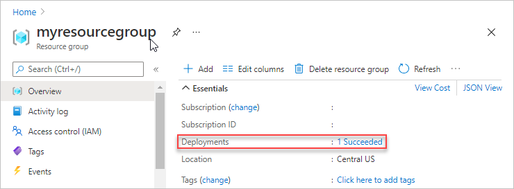
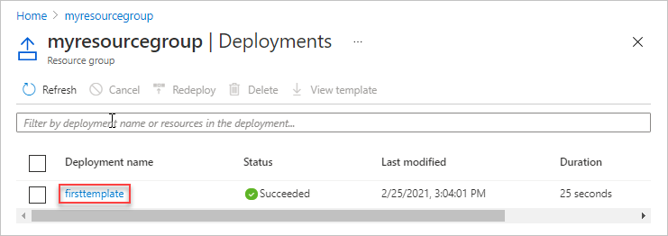
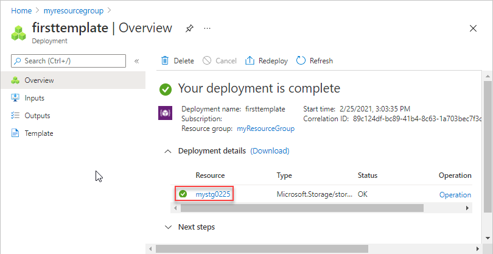

# Tutorial: Create and deploy first Azure Resource Manager Bicep file

This tutorial introduces you to [Bicep](./bicep-overview.md). It shows you how to create a starter Bicep file and deploy it to Azure. You'll learn about the structure of the Bicep file and the tools you'll need for working with Bicep files. It takes about **12 minutes** to complete this tutorial, but the actual time will vary based on how many tools you need to install.

This tutorial is the first of a series. As you progress through the series, you modify the starting Bicep file step by step until you've explored all of the core parts of a Bicep file. These elements are the building blocks for much more complex Bicep files. We hope by the end of the series you're confident creating your own Bicep files and ready to automate your deployments with Bicep files.

If you want to learn about the benefits of using Bicep and why you should automate deployment with Bicep files, see [Bicep](./bicep-overview.md).

If you don't have an Azure subscription, [create a free account](https://azure.microsoft.com/free/) before you begin.

[!INCLUDE [Bicep preview](../../../includes/resource-manager-bicep-preview.md)]

## Get tools

Let's start by making sure you have the tools you need to create and deploy Bicep files. Install these tools on your local machine.

### Editor

To create Bicep files, you need a good editor. We recommend Visual Studio Code with the Bicep extension. If you need to install these tools, see [Configure Bicep development environment](./bicep-install.md#development-environment).

### Command-line deployment

You can deploy Bicep files by using Azure CLI or Azure PowerShell. For Azure CLI, you need version 2.20.0 or later; for Azure PowerShell, you need version 5.6.0 or later. For the installation instructions, see:

- [Install Azure PowerShell](/powershell/azure/install-az-ps)
- [Install Azure CLI on Windows](/cli/azure/install-azure-cli-windows)
- [Install Azure CLI on Linux](/cli/azure/install-azure-cli-linux)
- [Install Azure CLI on macOS](/cli/azure/install-azure-cli-macos)

After installing either Azure PowerShell or Azure CLI, make sure you sign in for the first time. For help, see [Sign in - PowerShell](/powershell/azure/install-az-ps#sign-in) or [Sign in - Azure CLI](/cli/azure/get-started-with-azure-cli#sign-in).

Okay, you're ready to start learning about Bicep.

## Create your first Bicep file

1. Open Visual Studio Code with the Bicep extension installed.
1. From the **File** menu, select **New File** to create a new file.
1. From the **File** menu, select **Save as**.
1. Name the file _azuredeploy_ and select the _bicep_ file extension. The complete name of the file is _azuredeploy.bicep_.
1. Save the file to your workstation. Select a path that is easy to remember because you'll provide that path later when deploying the Bicep file.
1. Copy and paste the following contents into the file:

    ```bicep
    resource stg 'Microsoft.Storage/storageAccounts@2019-06-01' = {
      name: '{provide-unique-name}'
      location: 'eastus'
      sku: {
        name: 'Standard_LRS'
      }
      kind: 'StorageV2'
      properties: {
        supportsHttpsTrafficOnly: true
      }
    }
    ```

    Here's what your Visual Studio Code environment looks like:

    

    The resource declaration has four components:

    - **resource**: keyword.
    - **symbolic name** (stg): A symbolic name is an identifier for referencing the resource throughout your bicep file. It is not what the name of the resource will be when it's deployed. The name of the resource is defined by the **name** property.  See the fourth component in this list. To make the tutorials easy to follow, **stg** is used as the symbolic name for the storage account resource in this tutorial series. To see how to use the symbolic name to get a full list of the object properties, see [Add outputs](./bicep-tutorial-add-outputs.md).
    - **resource type** (Microsoft.Storage/storageAccounts@2019-06-01): It is composed of the resource provider (Microsoft.Storage), resource type (storageAccounts), and apiVersion (2019-06-01). Each resource provider publishes its own API versions, so this value is specific to the type. You can find more types and apiVersions for various Azure resources from [ARM template reference](/azure/templates/).
    - **properties** (everything inside = {...}): These are the specific properties you would like to specify for the given resource type. These are exactly the same properties available to you in an ARM Template. Every resource has a `name` property. Most resources also have a `location` property, which sets the region where the resource is deployed. The other properties vary by resource type and API version. It's important to understand the connection between the API version and the available properties, so let's jump into more detail.

        For this storage account, you can see that API version at [storageAccounts 2019-06-01](/azure/templates/microsoft.storage/2019-06-01/storageaccounts). Notice that you didn't add all of the properties to your Bicep file. Many of the properties are optional. The `Microsoft.Storage` resource provider could release a new API version, but the version you're deploying doesn't have to change. You can continue using that version and know that the results of your deployment will be consistent.

        If you view an older API version, such as [storageAccounts 2016-05-01](/azure/templates/microsoft.storage/2016-05-01/storageaccounts), you'll see that a smaller set of properties is available.

        If you decide to change the API version for a resource, make sure you evaluate the properties for that version and adjust your Bicep file appropriately.

1. Replace `{provide-unique-name}` including the curly braces `{}` with a unique storage account name.

    > [!IMPORTANT]
    > The storage account name must be unique across Azure. The name must have only lowercase letters or numbers. It can be no longer than 24 characters. You might try a naming pattern like using **store1** as a prefix and then adding your initials and today's date. For example, the name you use could look like **store1abc09092019**.

    Guessing a unique name for a storage account isn't easy and doesn't work well for automating large deployments. Later in this tutorial series, you'll use Bicep features that make it easier to create a unique name.

1. Save the file.

Congratulations, you've created your first Bicep file.

## Sign in to Azure

To start working with Azure PowerShell/Azure CLI, sign in with your Azure credentials.

Select the tabs in the following code sections to choose between Azure PowerShell and Azure CLI. The CLI examples in this article are written for the Bash shell.

# [PowerShell](#tab/azure-powershell)

```azurepowershell
Connect-AzAccount
```

# [Azure CLI](#tab/azure-cli)

```azurecli
az login
```

---

If you have multiple Azure subscriptions, select the subscription you want to use. Replace `[SubscriptionID/SubscriptionName]` and the square brackets `[]` with your subscription information:

# [PowerShell](#tab/azure-powershell)

```azurepowershell
Set-AzContext [SubscriptionID/SubscriptionName]
```

# [Azure CLI](#tab/azure-cli)

```azurecli
az account set --subscription [SubscriptionID/SubscriptionName]
```

---

## Create resource group

When you deploy a Bicep file, you specify a resource group that will contain the resources. Before running the deployment command, create the resource group with either Azure CLI or Azure PowerShell.

# [PowerShell](#tab/azure-powershell)

```azurepowershell
New-AzResourceGroup `
  -Name myResourceGroup `
  -Location "Central US"
```

# [Azure CLI](#tab/azure-cli)

```azurecli
az group create \
  --name myResourceGroup \
  --location "Central US"
```

---

## Deploy Bicep file

Bicep is a transparent abstraction over Azure Resource Manager templates (ARM templates). Each Bicep file compiles to a standard ARM template before it is deployed. You can either compile your Bicep file into an ARM template before deploying it or directly deploy your Bicep file. To deploy the Bicep file, use either Azure CLI or Azure PowerShell. Use the resource group you created. Give a name to the deployment so you can easily identify it in the deployment history. For convenience, also create a variable that stores the path to the Bicep file. This variable makes it easier for you to run the deployment commands because you don't have to retype the path every time you deploy. Replace `{provide-the-path-to-the-bicep-file}` including the curly braces `{}` with the path to your Bicep file with the _.bicep_ file extension name.

# [PowerShell](#tab/azure-powershell)

To run this deployment cmdlet, you must have the [latest version](/powershell/azure/install-az-ps) of Azure PowerShell.

```azurepowershell
$bicepFile = "{provide-the-path-to-the-bicep-file}"
New-AzResourceGroupDeployment `
  -Name firstbicep `
  -ResourceGroupName myResourceGroup `
  -TemplateFile $bicepFile
```

# [Azure CLI](#tab/azure-cli)

To run this deployment command, you must have the [latest version](/cli/azure/install-azure-cli) of Azure CLI.

```azurecli
bicepFile="{provide-the-path-to-the-bicep-file}"
az deployment group create \
  --name firstbicep \
  --resource-group myResourceGroup \
  --template-file $bicepFile
```

---

The deployment command returns results. Look for `ProvisioningState` to see whether the deployment succeeded.

> [!NOTE]
> If the deployment failed, use the `verbose` switch to get information about the resources being created. Use the `debug` switch to get more information for debugging.

## Verify deployment

You can verify the deployment by exploring the resource group from the Azure portal.

1. Sign in to the [Azure portal](https://portal.azure.com).

1. From the left menu, select **Resource groups**.

1. Select the resource group deploy in the last procedure. The default name is **myResourceGroup**. You shall see no resource deployed within the resource group.

1. Notice in the upper right of the overview, the status of the deployment is displayed. Select **1 Succeeded**.

   

1. You see a history of deployment for the resource group. Select **firstbicep**.

   

1. You see a summary of the deployment. There is one storage account deployed. Notice on the left you can view inputs, outputs, and the template used during deployment.

   

## Clean up resources

If you're moving on to the next tutorial, you don't need to delete the resource group.

If you're stopping now, you might want to delete the resource group.

1. From the Azure portal, select **Resource group** from the left menu.
2. Enter the resource group name in the **Filter by name** field.
3. Select the resource group name.
4. Select **Delete resource group** from the top menu.

## Next steps

You created a simple Bicep file to deploy to Azure.  In the later tutorials, you learn how to add parameters, variables, outputs, and modules to a Bicep file. These features are the building blocks for much more complex Bicep files.

> [!div class="nextstepaction"]
> [Add parameters](bicep-tutorial-add-parameters.md)
