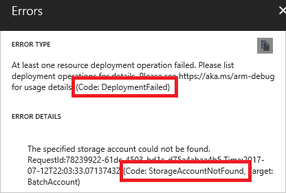

# Troubleshoot common Azure deployment errors with Azure Resource Manager

This article describes some common Azure deployment errors, and provides information to resolve the errors. If you can't find the error code for your deployment error, see [Find error code](#find-error-code).

If you're looking for information about an error code and that information isn't provided in this article, let us know. At the bottom of this page, you can leave feedback. The feedback is tracked with GitHub Issues.

[!INCLUDE [updated-for-az](../../../includes/updated-for-az.md)]

## Error codes

| Error code | Mitigation | More information |
| ---------- | ---------- | ---------------- |
| AccountNameInvalid | Follow naming restrictions for storage accounts. | [Resolve storage account name](error-storage-account-name.md) |
| AccountPropertyCannotBeSet | Check available storage account properties. | [storageAccounts](/azure/templates/microsoft.storage/storageaccounts) |
| AllocationFailed | The cluster or region doesn't have resources available or can't support the requested VM size. Retry the request at a later time, or request a different VM size. | [Provisioning and allocation issues for Linux](../../virtual-machines/linux/troubleshoot-deployment-new-vm.md), [Provisioning and allocation issues for Windows](../../virtual-machines/windows/troubleshoot-deployment-new-vm.md) and [Troubleshoot allocation failures](../../virtual-machines/troubleshooting/allocation-failure.md)|
| AnotherOperationInProgress | Wait for concurrent operation to complete. | |
| AuthorizationFailed | Your account or service principal doesn't have sufficient access to complete the deployment. Check the role your account belongs to, and its access for the deployment scope.<br><br>You might receive this error when a required resource provider isn't registered. | [Azure Role-Based Access Control](../../role-based-access-control/role-assignments-portal.md)<br><br>[Resolve registration](error-register-resource-provider.md) |
| BadRequest | You sent deployment values that don't match what is expected by Resource Manager. Check the inner status message for help with troubleshooting. | [Template reference](/azure/templates/) and [Supported locations](resource-location.md) |
| Conflict | You're requesting an operation that isn't allowed in the resource's current state. For example, disk resizing is allowed only when creating a VM or when the VM is deallocated. | |
| DeploymentActiveAndUneditable | Wait for concurrent deployment to this resource group to complete. | |
| DeploymentFailedCleanUp | When you deploy in complete mode, any resources that aren't in the template are deleted. You get this error when you don't have adequate permissions to delete all of the resources not in the template. To avoid the error, change the deployment mode to incremental. | [Azure Resource Manager deployment modes](deployment-modes.md) |
| DeploymentNameInvalidCharacters | The deployment name can only contain letter, digit, '-', '.' or '_'. | |
| DeploymentNameLengthLimitExceeded | The deployment names are limited to 64 characters.  | |
| DeploymentFailed | The DeploymentFailed error is a general error that doesn't provide the details you need to solve the error. Look in the error details for an error code that provides more information. | [Find error code](#find-error-code) |
| DeploymentQuotaExceeded | If you reach the limit of 800 deployments per resource group, delete deployments from the history that are no longer needed. | [Resolve error when deployment count exceeds 800](deployment-quota-exceeded.md) |
| DnsRecordInUse | The DNS record name must be unique. Enter a different name. | |
| ImageNotFound | Check VM image settings. |  |
| InUseSubnetCannotBeDeleted | You might get this error when trying to update a resource, and the request is processed by deleting and creating the resource. Make sure to specify all unchanged values. | [Update resource](/azure/architecture/building-blocks/extending-templates/update-resource) |
| InvalidAuthenticationTokenTenant | Get access token for the appropriate tenant. You can only get the token from the tenant that your account belongs to. | |
| InvalidContentLink | You've most likely attempted to link to a nested template that isn't available. Double check the URI you provided for the nested template. If the template exists in a storage account, make sure the URI is accessible. You might need to pass a SAS token. Currently, you can't link to a template that is in a storage account behind an [Azure Storage firewall](../../storage/common/storage-network-security.md). Consider moving your template to another repository, like GitHub. | [Linked templates](linked-templates.md) |
| InvalidDeploymentLocation | When deploying at the subscription level, you've provided a different location for a previously used deployment name. | [Subscription level deployments](deploy-to-subscription.md) |
| InvalidParameter | One of the values you provided for a resource doesn't match the expected value. This error can result from many different conditions. For example, a password may be insufficient, or a blob name may be incorrect. The error message should indicate which value needs to be corrected. | |
| InvalidRequestContent | The deployment values either include values that aren't recognized, or required values are missing. Confirm the values for your resource type. | [Template reference](/azure/templates/) |
| InvalidRequestFormat | Enable debug logging when running the deployment, and verify the contents of the request. | [Debug logging](#enable-debug-logging) |
| InvalidResourceNamespace | Check the resource namespace you specified in the **type** property. | [Template reference](/azure/templates/) |
| InvalidResourceReference | The resource either doesn't yet exist or is incorrectly referenced. Check whether you need to add a dependency. Verify that your use of the **reference** function includes the required parameters for your scenario. | [Resolve dependencies](error-not-found.md) |
| InvalidResourceType | Check the resource type you specified in the **type** property. | [Template reference](/azure/templates/) |
| InvalidSubscriptionRegistrationState | Register your subscription with the resource provider. | [Resolve registration](error-register-resource-provider.md) |
| InvalidTemplate | Check your template syntax for errors. | [Resolve invalid template](error-invalid-template.md) |
| InvalidTemplateCircularDependency | Remove unnecessary dependencies. | [Resolve circular dependencies](error-invalid-template.md#circular-dependency) |
| LinkedAuthorizationFailed | Check if your account belongs to the same tenant as the resource group that you're deploying to. | |
| LinkedInvalidPropertyId | The resource ID for a resource isn't resolving correctly. Check that you provide all required values for the resource ID, including subscription ID, resource group name, resource type, parent resource name (if needed), and resource name. | |
| LocationRequired | Provide a location for the resource. | [Set location](resource-location.md) |
| MismatchingResourceSegments | Make sure nested resource has correct number of segments in name and type. | [Resolve resource segments](error-invalid-template.md#incorrect-segment-lengths)
| MissingRegistrationForLocation | Check resource provider registration status and supported locations. | [Resolve registration](error-register-resource-provider.md) |
| MissingSubscriptionRegistration | Register your subscription with the resource provider. | [Resolve registration](error-register-resource-provider.md) |
| NoRegisteredProviderFound | Check resource provider registration status. | [Resolve registration](error-register-resource-provider.md) |
| NotFound | You might be attempting to deploy a dependent resource in parallel with a parent resource. Check if you need to add a dependency. | [Resolve dependencies](error-not-found.md) |
| OperationNotAllowed | The deployment is attempting an operation that exceeds the quota for the subscription, resource group, or region. If possible, revise your deployment to stay within the quotas. Otherwise, consider requesting a change to your quotas. | [Resolve quotas](error-resource-quota.md) |
| ParentResourceNotFound | Make sure a parent resource exists before creating the child resources. | [Resolve parent resource](error-parent-resource.md) |
| PasswordTooLong | You might have selected a password with too many characters, or converted your password value to a secure string before passing it as a parameter. If the template includes a **secure string** parameter, you don't need to convert the value to a secure string. Provide the password value as text. |  |
| PrivateIPAddressInReservedRange | The specified IP address includes an address range required by Azure. Change IP address to avoid reserved range. | [IP addresses](../../virtual-network/public-ip-addresses.md) |
| PrivateIPAddressNotInSubnet | The specified IP address is outside of the subnet range. Change IP address to fall within subnet range. | [IP addresses](../../virtual-network/public-ip-addresses.md) |
| PropertyChangeNotAllowed | Some properties can't be changed on a deployed resource. When updating a resource, limit your changes to permitted properties. | [Update resource](/azure/architecture/building-blocks/extending-templates/update-resource) |
| RequestDisallowedByPolicy | Your subscription includes a resource policy that prevents an action you're trying to perform during deployment. Find the policy that blocks the action. If possible, change your deployment to meet the limitations from the policy. | [Resolve policies](error-policy-requestdisallowedbypolicy.md) |
| ReservedResourceName | Provide a resource name that doesn't include a reserved name. | [Reserved resource names](error-reserved-resource-name.md) |
| ResourceGroupBeingDeleted | Wait for deletion to complete. | |
| ResourceGroupNotFound | Check the name of the target resource group for the deployment. The target resource group must already exist in your subscription. Check your subscription context. | [Azure CLI](/cli/azure/account?#az-account-set) [PowerShell](/powershell/module/Az.Accounts/Set-AzContext) |
| ResourceNotFound | Your deployment references a resource that can't be resolved. Verify that your use of the **reference** function includes the parameters required for your scenario. | [Resolve references](error-not-found.md) |
| ResourceQuotaExceeded | The deployment is trying to create resources that exceed the quota for the subscription, resource group, or region. If possible, revise your infrastructure to stay within the quotas. Otherwise, consider requesting a change to your quotas. | [Resolve quotas](error-resource-quota.md) |
| SkuNotAvailable | Select SKU (such as VM size) that is available for the location you've selected. | [Resolve SKU](error-sku-not-available.md) |
| StorageAccountAlreadyExists | Provide a unique name for the storage account. | [Resolve storage account name](error-storage-account-name.md)  |
| StorageAccountAlreadyTaken | Provide a unique name for the storage account. | [Resolve storage account name](error-storage-account-name.md) |
| StorageAccountNotFound | Check the subscription, resource group, and name of the storage account that you're trying to use. | |
| SubnetsNotInSameVnet | A virtual machine can only have one virtual network. When deploying several NICs, make sure they belong to the same virtual network. | [Multiple NICs](../../virtual-machines/windows/multiple-nics.md) |
| SubscriptionNotRegistered | When deploying network resources, the Microsoft.Network resource provider is automatically registered in the subscription. Sometimes, the automatic registration doesn't complete in time. To avoid this intermittent error, register the Microsoft.Network resource provider before deployment. | [Resolve registration](error-register-resource-provider.md) |
| TemplateResourceCircularDependency | Remove unnecessary dependencies. | [Resolve circular dependencies](error-invalid-template.md#circular-dependency) |
| TooManyTargetResourceGroups | Reduce number of resource groups for a single deployment. | [Cross resource group deployment](cross-resource-group-deployment.md) |

## Find error code

There are two types of errors you can receive:

* validation errors
* deployment errors

Validation errors arise from scenarios that can be determined before deployment. They include syntax errors in your template, or trying to deploy resources that would exceed your subscription quotas. Deployment errors arise from conditions that occur during the deployment process. They include trying to access a resource that is being deployed in parallel.

Both types of errors return an error code that you use to troubleshoot the deployment. Both types of errors appear in the [activity log](../management/view-activity-logs.md). However, validation errors don't appear in your deployment history because the deployment never started.

### Validation errors

When deploying through the portal, you see a validation error after submitting your values.


Select the message for more details. In the following image, you see an **InvalidTemplateDeployment** error and a message that indicates a policy blocked deployment.


### Deployment errors

When the operation passes validation, but fails during deployment, you get a deployment error.

To see deployment error codes and messages with PowerShell, use:

```azurepowershell-interactive
(Get-AzResourceGroupDeploymentOperation -DeploymentName exampledeployment -ResourceGroupName examplegroup).Properties.statusMessage
```

To see deployment error codes and messages with Azure CLI, use:

```azurecli-interactive
az deployment operation group list --name exampledeployment -g examplegroup --query "[*].properties.statusMessage"
```

In the portal, select the notification.


You see more details about the deployment. Select the option to find more information about the error.


You see the error message and error codes. Notice there are two error codes. The first error code (**DeploymentFailed**) is a general error that doesn't provide the details you need to solve the error. The second error code (**StorageAccountNotFound**) provides the details you need.



## Enable debug logging

Sometimes you need more information about the request and response to learn what went wrong. During deployment, you can request that additional information is logged during a deployment.

### PowerShell

In PowerShell, set the **DeploymentDebugLogLevel** parameter to All, ResponseContent, or RequestContent.

```powershell
New-AzResourceGroupDeployment `
  -Name exampledeployment `
  -ResourceGroupName examplegroup `
  -TemplateFile c:\Azure\Templates\storage.json `
  -DeploymentDebugLogLevel All
```

Examine the request content with the following cmdlet:

```powershell
(Get-AzResourceGroupDeploymentOperation `
-DeploymentName exampledeployment `
-ResourceGroupName examplegroup).Properties.request `
| ConvertTo-Json
```

Or, the response content with:

```powershell
(Get-AzResourceGroupDeploymentOperation `
-DeploymentName exampledeployment `
-ResourceGroupName examplegroup).Properties.response `
| ConvertTo-Json
```

This information can help you determine whether a value in the template is being incorrectly set.

### Azure CLI

Currently, Azure CLI doesn't support turning on debug logging, but you can retrieve debug logging.

Examine the deployment operations with the following command:

```azurecli
az deployment operation group list \
  --resource-group examplegroup \
  --name exampledeployment
```

Examine the request content with the following command:

```azurecli
az deployment operation group list \
  --name exampledeployment \
  -g examplegroup \
  --query [].properties.request
```

Examine the response content with the following command:

```azurecli
az deployment operation group list \
  --name exampledeployment \
  -g examplegroup \
  --query [].properties.response
```

### Nested template

To log debug information for a nested template, use the **debugSetting** element.

```json
{
  "type": "Microsoft.Resources/deployments",
  "apiVersion": "2016-09-01",
  "name": "nestedTemplate",
  "properties": {
    "mode": "Incremental",
    "templateLink": {
      "uri": "{template-uri}",
      "contentVersion": "1.0.0.0"
    },
    "debugSetting": {
       "detailLevel": "requestContent, responseContent"
    }
  }
}
```

## Create a troubleshooting template

In some cases, the easiest way to troubleshoot your template is to test parts of it. You can create a simplified template that enables you to focus on the part that you believe is causing the error. For example, suppose you're receiving an error when referencing a resource. Rather than dealing with an entire template, create a template that returns the part that may be causing your problem. It can help you determine whether you're passing in the right parameters, using template functions correctly, and getting the resource you expect.

```json
{
  "$schema": "https://schema.management.azure.com/schemas/2019-04-01/deploymentTemplate.json#",
  "contentVersion": "1.0.0.0",
  "parameters": {
  "storageName": {
    "type": "string"
  },
  "storageResourceGroup": {
    "type": "string"
  }
  },
  "variables": {},
  "resources": [],
  "outputs": {
  "exampleOutput": {
    "value": "[reference(resourceId(parameters('storageResourceGroup'), 'Microsoft.Storage/storageAccounts', parameters('storageName')), '2016-05-01')]",
    "type" : "object"
  }
  }
}
```

Or, suppose you're getting deployment errors that you believe are related to incorrectly set dependencies. Test your template by breaking it into simplified templates. First, create a template that deploys only a single resource (like a SQL Server). When you're sure you have that resource correctly defined, add a resource that depends on it (like a SQL Database). When you have those two resources correctly defined, add other dependent resources (like auditing policies). In between each test deployment, delete the resource group to make sure you adequately testing the dependencies.

## Next steps

* To go through a troubleshooting tutorial, see [Tutorial: Troubleshoot Resource Manager template deployments](template-tutorial-troubleshoot.md)
* To learn about auditing actions, see [Audit operations with Resource Manager](../management/view-activity-logs.md).
* To learn about actions to determine the errors during deployment, see [View deployment operations](deployment-history.md).
