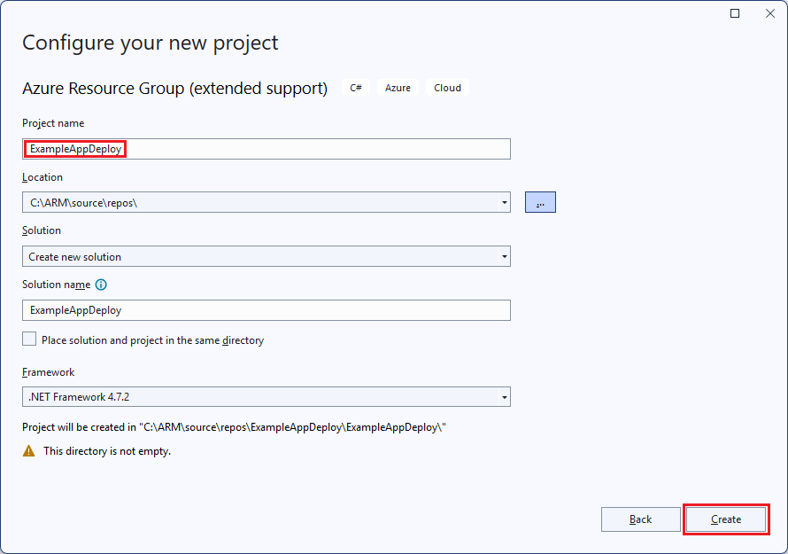
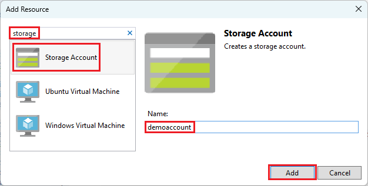
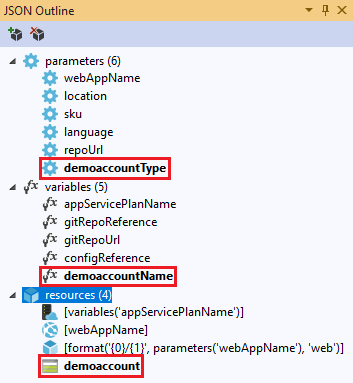
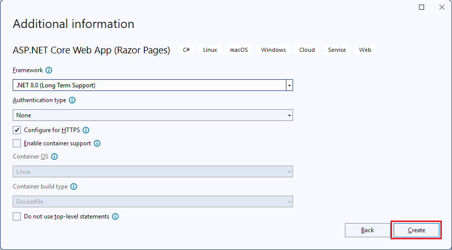

# Creating and deploying Azure resource groups through Visual Studio

With Visual Studio, you can create a project that deploys your infrastructure and code to Azure. For example, you can deploy the web host, website, and code for the website. Visual Studio provides many different starter templates for deploying common scenarios. In this article, you deploy a web app.

This article shows how to use [Visual Studio 2019 or later with the Azure development and ASP.NET workloads installed](/visualstudio/install/install-visual-studio?view=vs-2019). If you use Visual Studio 2017, your experience is largely the same.

## Create Azure Resource Group project

In this section, you create an Azure Resource Group project with a **Web app** template.

1. In Visual Studio, choose **File**>**New**>**Project**.
1. Select the **Azure Resource Group** project template and **Next**.

    

1. Give your project a name. The other default settings are probably fine, but review them to make they work for your environment. When done, select **Create**.

    

1. Choose the template that you want to deploy to Azure Resource Manager. Notice there are many different options based on the type of project you wish to deploy. For this article, choose the **Web app** template and **OK**.

    

    The template you pick is just a starting point; you can add and remove resources to fulfill your scenario.

1. Visual Studio creates a resource group deployment project for the web app. To see the files for your project, look at the node in the deployment project.

    

    Since you chose the Web app template, you see the following files:

   | File name | Description |
   | --- | --- |
   | Deploy-AzureResourceGroup.ps1 |A PowerShell script that runs PowerShell commands to deploy to Azure Resource Manager. Visual Studio uses this PowerShell script to deploy your template. |
   | WebSite.json |The Resource Manager template that defines the infrastructure you want deploy to Azure, and the parameters you can provide during deployment. It also defines the dependencies between the resources so Resource Manager deploys the resources in the correct order. |
   | WebSite.parameters.json |A parameters file that has values needed by the template. You pass in parameter values to customize each deployment. |

    All resource group deployment projects have these basic files. Other projects may have additional files to support other functionality.

## Customize Resource Manager template

You can customize a deployment project by modifying the Resource Manager template that describes the resources you want to deploy. To learn about the elements of the Resource Manager template, see [Authoring Azure Resource Manager templates](template-syntax.md).

1. To work on your template, open **WebSite.json**.

1. The Visual Studio editor provides tools to assist you with editing the Resource Manager template. The **JSON Outline** window makes it easy to see the elements defined in your template.

   

1. Select an element in the outline to go to that part of the template.

   

1. You can add a resource by either selecting the **Add Resource** button at the top of the JSON Outline window, or by right-clicking **resources** and selecting **Add New Resource**.

   

1. Select **Storage Account** and give it a name. Provide a name that is no more than 11 characters, and only contains numbers and lower-case letters.

   

1. Notice that not only was the resource added, but also a parameter for the type storage account, and a variable for the name of the storage account.

   

1. The parameter for the type of storage account is pre-defined with allowed types and a default type. You can leave these values or edit them for your scenario. If you don't want anyone to deploy a **Premium_LRS** storage account through this template, remove it from the allowed types.

   ```json
   "demoaccountType": {
     "type": "string",
     "defaultValue": "Standard_LRS",
     "allowedValues": [
       "Standard_LRS",
       "Standard_ZRS",
       "Standard_GRS",
       "Standard_RAGRS"
     ]
   }
   ```

1. Visual Studio also provides intellisense to help you understand the properties that are available when editing the template. For example, to edit the properties for your App Service plan, navigate to the **HostingPlan** resource, and add a value for the **properties**. Notice that intellisense shows the available values and provides a description of that value.

   

   You can set **numberOfWorkers** to 1, and save the file.

   ```json
   "properties": {
     "name": "[parameters('hostingPlanName')]",
     "numberOfWorkers": 1
   }
   ```

1. Open the **WebSite.parameters.json** file. You use the parameters file to pass in values during deployment that customize the resource being deployed. Give the hosting plan a name, and save the file.

   ```json
   {
     "$schema": "https://schema.management.azure.com/schemas/2015-01-01/deploymentParameters.json#",
     "contentVersion": "1.0.0.0",
     "parameters": {
       "hostingPlanName": {
         "value": "demoHostPlan"
       }
     }
   }
   ```

## Deploy project to Azure

You're now ready to deploy your project to a resource group.

By default, the PowerShell script (Deploy-AzureResourceGroup.ps1) in the project uses the AzureRM module. If you still have the AzureRM module installed and want to continue using it, you can use this default script. With this script, you can use the Visual Studio interface to deploy your solution.

However, if you've migrated to the new [Az module](/powershell/azure/new-azureps-module-az), you need to add a new script to your project. To add a script that uses the Az module, copy the [Deploy-AzTemplate.ps1](https://github.com/Azure/azure-quickstart-templates/blob/master/Deploy-AzTemplate.ps1) script and add it to your project. To use this script for deployment, you must run it from a PowerShell console, rather than using Visual Studio's deployment interface.

Both approaches are shown in this article. This article refers to the default script as the AzureRM module script, and the new script as the Az module script.

### Az module script

For the Az module script, open a PowerShell console and run:

```powershell
.\Deploy-AzTemplate.ps1 -ArtifactStagingDirectory . -Location centralus -TemplateFile WebSite.json -TemplateParametersFile WebSite.parameters.json
```

### AzureRM module script

For the AzureRM module script, use Visual Studio:

1. On the shortcut menu of the deployment project node, choose **Deploy** > **New**.

    

1. The **Deploy to Resource Group** dialog box appears. In the **Resource group** dropdown box, choose an existing resource group or create a new one. Select **Deploy**.

    

1. In the **Output** windows, you see the status of the deployment. When the deployment has finished, the last message indicates a successful deployment with something similar to:

   ```output
   18:00:58 - Successfully deployed template 'website.json' to resource group 'ExampleAppDeploy'.
   ```

## View deployed resources

Let's check the results.

1. In a browser, open the [Azure portal](https://portal.azure.com/) and sign in to your account. To see the resource group, select **Resource groups** and the resource group you deployed to.

1. You see all the deployed resources. Notice that the name of the storage account isn't exactly what you specified when adding that resource. The storage account must be unique. The template automatically adds a string of characters to the name you provided to create a unique name.

    

## Add code to project

At this point, you've deployed the infrastructure for your app, but there's no actual code deployed with the project.

1. Add a project to your Visual Studio solution. Right-click the solution, and select **Add** > **New Project**.

    

1. Add an **ASP.NET Core Web Application**.

    

1. Give your web app a name, and select **Create**.

    

1. Select **Web Application** and **Create**.

    

1. After Visual Studio creates your web app, you see both projects in the solution.

    

1. Now, you need to make sure your resource group project is aware of the new project. Go back to your resource group project (ExampleAppDeploy). Right-click **References** and select **Add Reference**.

    

1. Select the web app project that you created.

   

   By adding a reference, you link the web app project to the resource group project, and automatically sets some properties. You see these properties in the **Properties** window for the reference. The **Include File Path** has the path where the package is created. Note the folder (ExampleApp) and file (package.zip). You need to know these values because you provide them as parameters when deploying the app.

   

1. Go back to your template (WebSite.json) and add a resource to the template.

    

1. This time select **Web Deploy for Web Apps**.

    

   Save your template.

1. There are some new parameters in your template. They were added in the previous step. You don't need to provide values for **_artifactsLocation** or **_artifactsLocationSasToken** because those values are automatically generated. However, you have to set the folder and file name to the path that contains the deployment package. The names of these parameters end with **PackageFolder** and **PackageFileName**. The first part of the name is the name of the Web Deploy resource you added. In this article, they're named **ExampleAppPackageFolder** and **ExampleAppPackageFileName**.

   Open **Website.parameters.json** and set those parameters to the values you saw in the reference properties. Set **ExampleAppPackageFolder** to the name of the folder. Set **ExampleAppPackageFileName** to the name of the zip file.

   ```json
   {
     "$schema": "https://schema.management.azure.com/schemas/2015-01-01/deploymentParameters.json#",
     "contentVersion": "1.0.0.0",
     "parameters": {
       "hostingPlanName": {
         "value": "demoHostPlan"
       },
       "ExampleAppPackageFolder": {
         "value": "ExampleApp"
       },
       "ExampleAppPackageFileName": {
         "value": "package.zip"
       }
     }
   }
   ```

## Deploy code with infrastructure

Because you added code to the project, your deployment is a little different this time. During deployment, you stage artifacts for your project to a place that Resource Manager can access. The artifacts are staged to a storage account.

### Az module script

There's one small change you need to make to your template if you're using the Az module script. This script adds a slash to the artifacts location but your template doesn't expect that slash. Open WebSite.json and find the properties for the MSDeploy extension. It has a property named **packageUri**. Remove the slash between the artifacts location and the package folder.

It should look like:

```json
"packageUri": "[concat(parameters('_artifactsLocation'), parameters('ExampleAppPackageFolder'), '/', parameters('ExampleAppPackageFileName'), parameters('_artifactsLocationSasToken'))]",
```

Notice in the preceding example there is no `'/',` between **parameters('_artifactsLocation')** and **parameters('ExampleAppPackageFolder')**.

Rebuild the project. Building the project makes sure the files you need to deploy are added to the staging folder.

Now, open a PowerShell console and run:

```powershell
.\Deploy-AzTemplate.ps1 -ArtifactStagingDirectory .\bin\Debug\staging\ExampleAppDeploy -Location centralus -TemplateFile WebSite.json -TemplateParametersFile WebSite.parameters.json -UploadArtifacts -StorageAccountName <storage-account-name>
```

### AzureRM module script

For the AzureRM module script, use Visual Studio:

1. To redeploy, choose **Deploy**, and the resource group you deployed earlier.

    

1. Select the storage account you deployed with this resource group for the **Artifact storage account**.

   

## View web app

1. After the deployment has finished, select your web app in the portal. Select the URL to browse to the site.

   

1. Notice that you've successfully deployed the default ASP.NET app.

   

## Add operations dashboard

You aren't limited to only the resources that are available through the Visual Studio interface. You can customize your deployment by adding a custom resource to your template. To show adding a resource, you add an operational dashboard to manage the resource you deployed.

1. Open the WebSite.json file and add the following JSON after the storage account resource but before the closing `]` of the resources section.

   ```json
    ,{
      "properties": {
        "lenses": {
          "0": {
            "order": 0,
            "parts": {
              "0": {
                "position": {
                  "x": 0,
                  "y": 0,
                  "colSpan": 4,
                  "rowSpan": 6
                },
                "metadata": {
                  "inputs": [
                    {
                      "name": "resourceGroup",
                      "isOptional": true
                    },
                    {
                      "name": "id",
                      "value": "[resourceGroup().id]",
                      "isOptional": true
                    }
                  ],
                  "type": "Extension/HubsExtension/PartType/ResourceGroupMapPinnedPart"
                }
              },
              "1": {
                "position": {
                  "x": 4,
                  "y": 0,
                  "rowSpan": 3,
                  "colSpan": 4
                },
                "metadata": {
                  "inputs": [],
                  "type": "Extension[azure]/HubsExtension/PartType/MarkdownPart",
                  "settings": {
                    "content": {
                      "settings": {
                        "content": "__Customizations__\n\nUse this dashboard to create and share the operational views of services critical to the application performing. To customize simply pin components to the dashboard and then publish when you're done. Others will see your changes when you publish and share the dashboard.\n\nYou can customize this text too. It supports plain text, __Markdown__, and even limited HTML like images  and <a href='https://azure.microsoft.com' target='_blank'>links</a> that open in a new tab.\n",
                        "title": "Operations",
                        "subtitle": "[resourceGroup().name]"
                      }
                    }
                  }
                }
              }
            }
          }
        },
        "metadata": {
          "model": {
            "timeRange": {
              "value": {
                "relative": {
                  "duration": 24,
                  "timeUnit": 1
                }
              },
              "type": "MsPortalFx.Composition.Configuration.ValueTypes.TimeRange"
            }
          }
        }
      },
      "type": "Microsoft.Portal/dashboards",
      "apiVersion": "2015-08-01-preview",
      "name": "[concat('ARM-',resourceGroup().name)]",
      "location": "[resourceGroup().location]",
      "tags": {
        "hidden-title": "[concat('OPS-',resourceGroup().name)]"
      }
    }
   ```

1. Redeploy your project.

1. After deployment has finished, view your dashboard in the portal. Select **Dashboard** and pick the one you deployed.

   

1. You see the customized dashboard.

   

You can manage access to the dashboard by using RBAC groups. You can also customize the dashboard's appearance after it's deployed. However, if you redeploy the resource group, the dashboard is reset to its default state in your template. For more information about creating dashboards, see [Programmatically create Azure Dashboards](../../azure-portal/azure-portal-dashboards-create-programmatically.md).

## Clean up resources

When the Azure resources are no longer needed, clean up the resources you deployed by deleting the resource group.

1. From the Azure portal, select **Resource groups** from the left menu.

1. Select the resource group name.

1. Select **Delete resource group** from the top menu.

## Next steps

In this article, you learned how to create and deploy templates using Visual Studio. To learn more about template development, see our new beginner tutorial series:

> [!div class="nextstepaction"]
> [Beginner tutorials](./template-tutorial-create-first-template.md)
