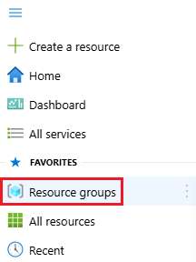
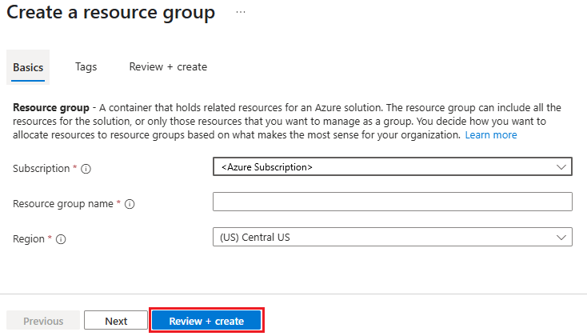
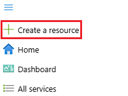
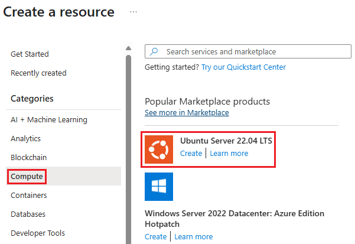
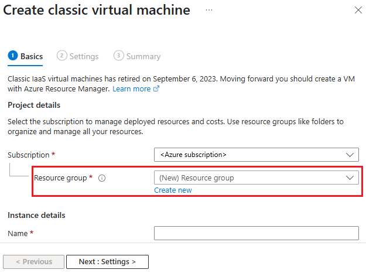
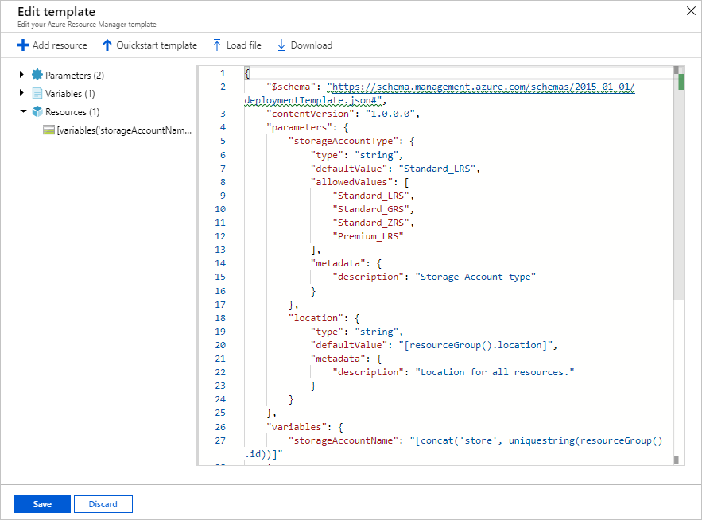

# Deploy resources with ARM templates and Azure portal

Learn how to use the [Azure portal](https://portal.azure.com) with [Azure Resource Manager templates (ARM templates)](overview.md) to deploy your Azure resources. To learn about managing your resources, see [Manage Azure resources by using the Azure portal](../management/manage-resources-portal.md).

Deploying Azure resources by using the Azure portal usually involves two steps:

- Create a resource group.
- Deploy resources to the resource group.

Also, you can create a customized ARM template to deploy Azure resources.

This article shows both methods.

## Create a resource group

1. To create a new resource group, select **Resource groups** from the [Azure portal](https://portal.azure.com).

   

1. Under Resource groups, select **Add**.

   

1. Select or enter the following property values:

    - **Subscription**: Select an Azure subscription.
    - **Resource group**: Give the resource group a name.
    - **Region**: Specify an Azure location. This location is where the resource group stores metadata about the resources. For compliance reasons, you may want to specify where that metadata is stored. In general, we recommend that you specify a location where most of your resources will be. Using the same location can simplify your template.

   

1. Select **Review + create**.
1. Review the values, and then select **Create**.
1. Select **Refresh** before you can see the new resource group in the list.

## Deploy resources to a resource group

After you create a resource group, you can deploy resources to the group from the Marketplace. The Marketplace provides pre-defined solutions for common scenarios.

1. To start a deployment, select **Create a resource** from the [Azure portal](https://portal.azure.com).

   

1. Find the type of resource you would like to deploy. The resources are organized in categories. If you don't see the particular solution you would like to deploy, you can search the Marketplace for it. The following screenshot shows that Ubuntu Server is selected.

   

1. Depending on the type of selected resource, you have a collection of relevant properties to set before deployment. For all types, you must select a destination resource group. The following image shows how to create a Linux virtual machine and deploy it to the resource group you created.

   

   You can decide to create a resource group when deploying your resources. Select **Create new** and give the resource group a name.

1. Your deployment begins. The deployment could take several minutes. Some resources take longer time than other resources. When the deployment has finished, you see a notification. Select **Go to resource** to open

   

1. After deploying your resources, you can add more resources to the resource group by selecting **Add**.

   

Although you didn't see it, the portal used an ARM template to deploy the resources you selected. You can find the template from the deployment history. For more information, see [Export template after deployment](export-template-portal.md#export-template-after-deployment).

## Deploy resources from custom template

If you want to execute a deployment but not use any of the templates in the Marketplace, you can create a customized template that defines the infrastructure for your solution. To learn about creating templates, see [Understand the structure and syntax of ARM templates](./syntax.md).

> [!NOTE]
> The portal interface doesn't support referencing a [secret from a Key Vault](key-vault-parameter.md). Instead, use [PowerShell](deploy-powershell.md) or [Azure CLI](deploy-cli.md) to deploy your template locally or from an external URI.

1. To deploy a customized template through the portal, select **Create a resource**, search for **template**. and then select **Template deployment**.

   

1. Select **Create**.
1. You see several options for creating a template:

    - **Build your own template in editor**: Create your own template in the portal template editor.
    - **Common templates**: Select from common solutions.
    - **Load a GitHub quickstart template**: Select from [quickstart templates](https://azure.microsoft.com/resources/templates/).

   

    This tutorial provides the instruction for loading a quickstart template.

1. Under **Load a GitHub quickstart template**, type or select **storage-account-create**.

    You have two options:

    - **Select template**: deploy the template.
    - **Edit template**: edit the quickstart template before you deploy it.

1. Select **Edit template** to explore the portal template editor. The template is loaded in the editor. Notice there are two parameters: `storageAccountType` and `location`.

   

1. Make a minor change to the template. For example, update the `storageAccountName` variable to:

    ```json
    "storageAccountName": "[concat('azstore', uniquestring(resourceGroup().id))]"
    ```

1. Select **Save**. Now you see the portal template deployment interface. Notice the two parameters that you defined in the template.
1. Enter or select the property values:

    - **Subscription**: Select an Azure subscription.
    - **Resource group**: Select **Create new** and give a name.
    - **Location**: Select an Azure location.
    - **Storage Account Type**: Use the default value. The camel-cased parameter name, *storageAccountType*, defined in the template is turned into a space-separated string when displayed on the portal.
    - **Location**: Use the default value.
    - **I agree to the terms and conditions stated above**: (select)

1. Select **Purchase**.

## Next steps

- To troubleshoot deployment errors, see [View deployment operations](deployment-history.md).
- To export a template from a deployment or resource group, see [Export ARM templates](export-template-portal.md).