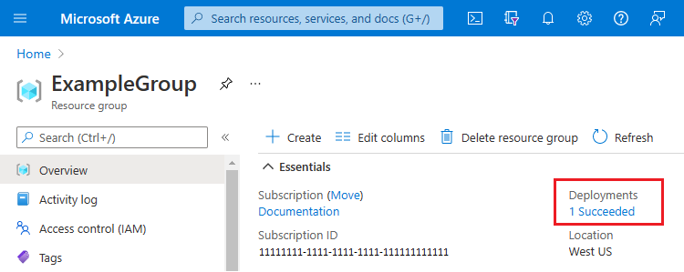
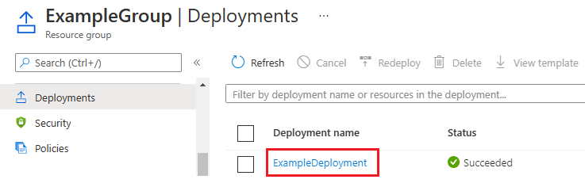
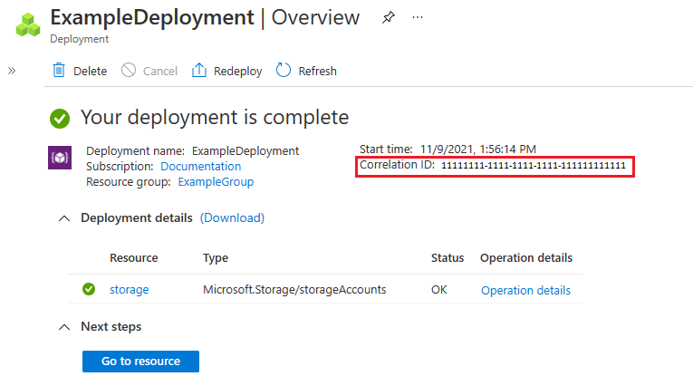
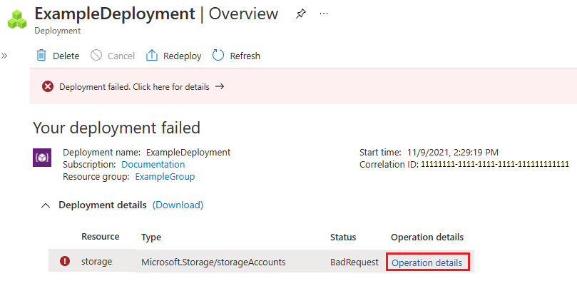
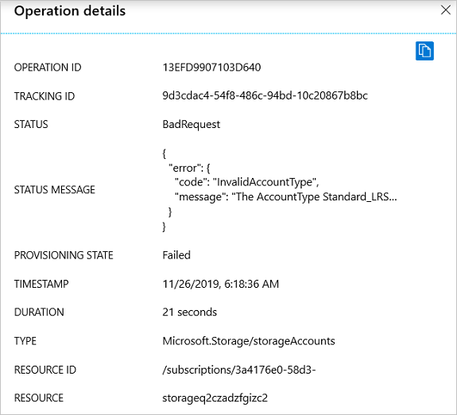

# View deployment history with Azure Resource Manager

Azure Resource Manager enables you to view your deployment history. You can examine specific operations in past deployments and see which resources were deployed. This history contains information about any errors.

The deployment history for a resource group is limited to 800 deployments. As you near the limit, deployments are automatically deleted from the history. For more information, see [Automatic deletions from deployment history](deployment-history-deletions.md).

For help with resolving particular deployment errors, see [Resolve common errors when deploying resources to Azure with Azure Resource Manager](common-deployment-errors.md).

## Get deployments and correlation ID

You can view details about a deployment through the Azure portal, PowerShell, Azure CLI, or REST API. Each deployment has a correlation ID, which is used to track related events. If you [create an Azure support request](../../azure-portal/supportability/how-to-create-azure-support-request.md), support may ask you for the correlation ID. Support uses the correlation ID to identify the operations for the failed deployment.

# [Portal](#tab/azure-portal)

1. Select the resource group you want to examine.

1. Select the link under **Deployments**.

   

1. Select one of the deployments from the deployment history.

   

1. A summary of the deployment is displayed, including the correlation ID.

    

# [PowerShell](#tab/azure-powershell)

To list all deployments for a resource group, use the [Get-AzResourceGroupDeployment](/powershell/module/az.resources/Get-AzResourceGroupDeployment) command.

```azurepowershell-interactive
Get-AzResourceGroupDeployment -ResourceGroupName ExampleGroup
```

To get a specific deployment from a resource group, add the **DeploymentName** parameter.

```azurepowershell-interactive
Get-AzResourceGroupDeployment -ResourceGroupName ExampleGroup -DeploymentName ExampleDeployment
```

To get the correlation ID, use:

```azurepowershell-interactive
(Get-AzResourceGroupDeployment -ResourceGroupName ExampleGroup -DeploymentName ExampleDeployment).CorrelationId
```

# [Azure CLI](#tab/azure-cli)

To list the deployment for a resource group, use [az deployment group list](/cli/azure/group/deployment#az_deployment_group_list).

```azurecli-interactive
az deployment group list --resource-group ExampleGroup
```

To get a specific deployment, use the [az deployment group show](/cli/azure/group/deployment#az_deployment_group_show).

```azurecli-interactive
az deployment group show --resource-group ExampleGroup --name ExampleDeployment
```

To get the correlation ID, use:

```azurecli-interactive
az deployment group show --resource-group ExampleGroup --name ExampleDeployment --query properties.correlationId
```

# [HTTP](#tab/http)

To list the deployments for a resource group, use the following operation. For the latest API version number to use in the request, see  [Deployments - List By Resource Group](/rest/api/resources/deployments/listbyresourcegroup).

```
GET https://management.azure.com/subscriptions/{subscriptionId}/resourcegroups/{resourceGroupName}/providers/Microsoft.Resources/deployments/?api-version={api-version}
```

To get a specific deployment. use the following operation. For the latest API version number to use in the request, see [Deployments - Get](/rest/api/resources/deployments/get).

```
GET https://management.azure.com/subscriptions/{subscription-id}/resourcegroups/{resource-group-name}/providers/microsoft.resources/deployments/{deployment-name}?api-version={api-version}
```

The response includes the correlation ID.

```json
{
 ...
 "properties": {
   "mode": "Incremental",
   "provisioningState": "Failed",
   "timestamp": "2019-11-26T14:18:36.4518358Z",
   "duration": "PT26.2091817S",
   "correlationId": "47ff4228-bf2e-4ee5-a008-0b07da681230",
   ...
 }
}
```

---

## Get deployment operations and error message

Each deployment can include multiple operations. To see more details about a deployment, view the deployment operations. When a deployment fails, the deployment operations include an error message.

# [Portal](#tab/azure-portal)

1. On the summary for a deployment, select **Operation details**.

    

1. You see the details for that step of the deployment. When an error occurs, the details include the error message.

    

# [PowerShell](#tab/azure-powershell)

To view the deployment operations for deployment to a resource group, use the [Get-AzResourceGroupDeploymentOperation](/powershell/module/az.resources/get-azdeploymentoperation) command.

```azurepowershell-interactive
Get-AzResourceGroupDeploymentOperation -ResourceGroupName ExampleGroup -DeploymentName ExampleDeploy
```

To view failed operations, filter operations with **Failed** state.

```azurepowershell-interactive
(Get-AzResourceGroupDeploymentOperation -ResourceGroupName ExampleGroup -DeploymentName ExampleDeploy).Properties | Where-Object ProvisioningState -eq Failed
```

To get the status message of failed operations, use the following command:

```azurepowershell-interactive
((Get-AzResourceGroupDeploymentOperation -ResourceGroupName ExampleGroup -DeploymentName ExampleDeploy ).Properties | Where-Object ProvisioningState -eq Failed).StatusMessage.error
```

# [Azure CLI](#tab/azure-cli)

To view the deployment operations for deployment to a resource group, use the [az deployment operation group list](/cli/azure/deployment/operation/group#az_deployment-operation-group-list) command. You must have Azure CLI 2.6.0 or later.

```azurecli-interactive
az deployment operation group list --resource-group ExampleGroup --name ExampleDeployment
```

To view failed operations, filter operations with **Failed** state.

```azurecli-interactive
az deployment operation group list --resource-group ExampleGroup --name ExampleDeploy --query "[?properties.provisioningState=='Failed']"
```

To get the status message of failed operations, use the following command:

```azurecli-interactive
az deployment operation group list --resource-group ExampleGroup --name ExampleDeploy --query "[?properties.provisioningState=='Failed'].properties.statusMessage.error"
```

# [HTTP](#tab/http)

To get deployment operations, use the following operation. For the latest API version number to use in the request, see [Deployment Operations - List](/rest/api/resources/deploymentoperations/list).

```
GET https://management.azure.com/subscriptions/{subscription-id}/resourcegroups/{resource-group-name}/providers/microsoft.resources/deployments/{deployment-name}/operations?$skiptoken={skiptoken}&api-version={api-version}
```

The response includes an error message.

```json
{
  "value": [
    {
      "id": "/subscriptions/xxxx/resourceGroups/examplegroup/providers/Microsoft.Resources/deployments/exampledeploy/operations/13EFD9907103D640",
      "operationId": "13EFD9907103D640",
      "properties": {
        "provisioningOperation": "Create",
        "provisioningState": "Failed",
        "timestamp": "2019-11-26T14:18:36.3177613Z",
        "duration": "PT21.0580179S",
        "trackingId": "9d3cdac4-54f8-486c-94bd-10c20867b8bc",
        "serviceRequestId": "01a9d0fe-896b-4c94-a30f-60b70a8f1ad9",
        "statusCode": "BadRequest",
        "statusMessage": {
          "error": {
            "code": "InvalidAccountType",
            "message": "The AccountType Standard_LRS1 is invalid. For more information, see - https://aka.ms/storageaccountskus"
          }
        },
        "targetResource": {
          "id": "/subscriptions/xxxx/resourceGroups/examplegroup/providers/Microsoft.Storage/storageAccounts/storageq2czadzfgizc2",
          "resourceType": "Microsoft.Storage/storageAccounts",
          "resourceName": "storageq2czadzfgizc2"
        }
      }
    },
    ...
  ]
}
```

---

## Next steps

* For help with resolving particular deployment errors, see [Resolve common errors when deploying resources to Azure with Azure Resource Manager](common-deployment-errors.md).
* To learn about how deployments are managed in the history, see [Automatic deletions from deployment history](deployment-history-deletions.md).
* To validate your deployment before executing it, see [Deploy a resource group with Azure Resource Manager template](deploy-powershell.md).
