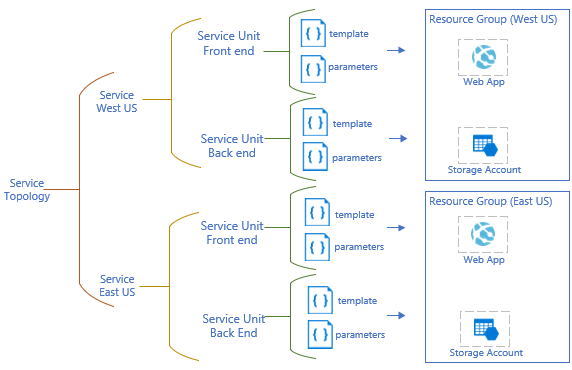
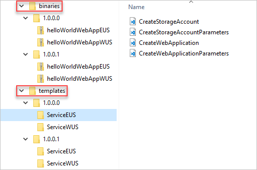
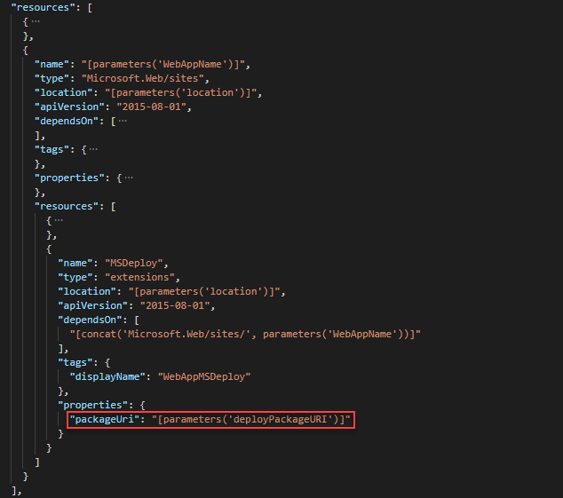
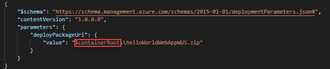
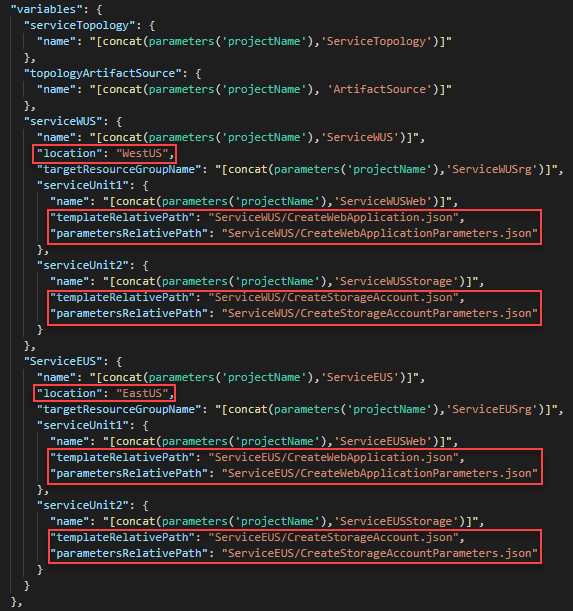
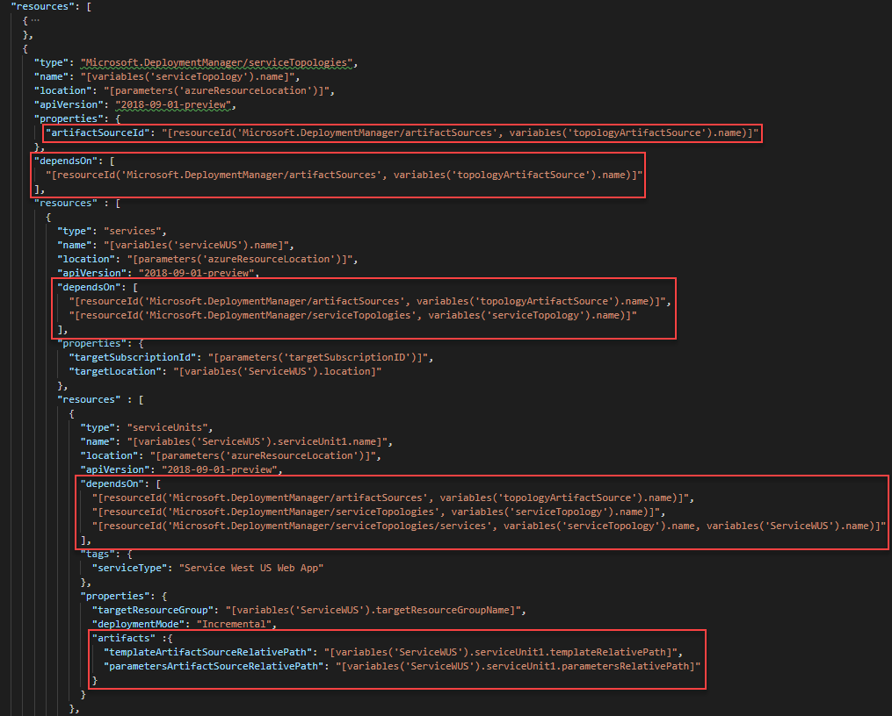
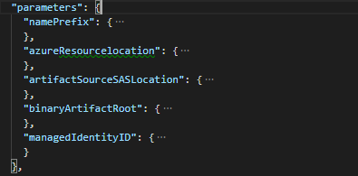
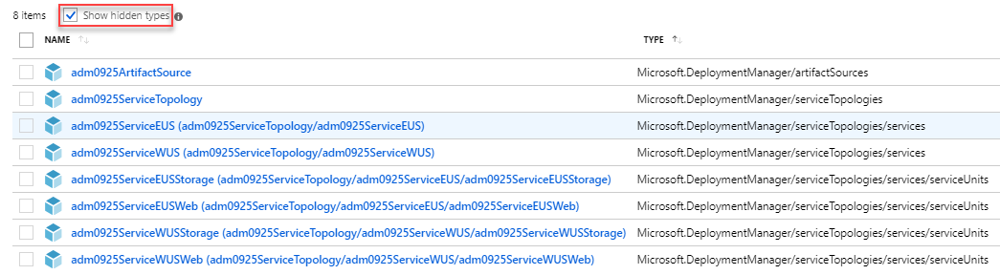

# Tutorial: Use Azure Deployment Manager with Resource Manager templates (Public preview)

Learn how to use [Azure Deployment Manager](./deployment-manager-overview.md) to deploy your applications across multiple regions. If you prefer a faster approach, [Azure Deployment Manager quickstart](https://github.com/Azure-Samples/adm-quickstart) creates the required configurations in your subscription and customizes the artifacts to deploy an application across multiple regions. The quickstart performs the same tasks as it does in this tutorial.

To use Deployment Manager, you need to create two templates:

* **A topology template**: describes the Azure resources the make up your applications and where to deploy them.
* **A rollout template**: describes the steps to take when deploying your applications.

> [!IMPORTANT]
> If your subscription is marked for Canary to test out new Azure features, you can only use Azure Deployment Manager to deploy to the Canary regions. 

This tutorial covers the following tasks:

> [!div class="checklist"]
> * Understand the scenario
> * Download the tutorial files
> * Prepare the artifacts
> * Create the user-defined managed identity
> * Create the service topology template
> * Create the rollout template
> * Deploy the templates
> * Verify the deployment
> * Deploy the newer version
> * Clean up resources

Additional resources:

* The [Azure Deployment Manager REST API reference](https://docs.microsoft.com/rest/api/deploymentmanager/).
* [Tutorial: Use health check in Azure Deployment Manager](./deployment-manager-tutorial-health-check.md).

If you don't have an Azure subscription, [create a free account](https://azure.microsoft.com/free/) before you begin.

[!INCLUDE [updated-for-az](../../../includes/updated-for-az.md)]

## Prerequisites

To complete this article, you need:

* Some experience with developing [Azure Resource Manager templates](overview.md).
* Azure PowerShell. For more information, see [Get started with Azure PowerShell](https://docs.microsoft.com/powershell/azure/get-started-azureps).
* Deployment Manager cmdlets. To install these prerelease cmdlets, you need the latest version of PowerShellGet. To get the latest version, see [Installing PowerShellGet](/powershell/scripting/gallery/installing-psget). After installing PowerShellGet, close your PowerShell window. Open a new elevated PowerShell window, and use the following command:

    ```powershell
    Install-Module -Name Az.DeploymentManager
    ```

## Understand the scenario

The service topology template describes the Azure resources the make up your service and where to deploy them. The service topology definition has the following hierarchy:

* Service topology
  * Services
    * Service units

The following diagram illustrates the service topology used in this tutorial:



There are two services allocated in the west U.S. and the east U.S. locations.  Each service has two service units - a web application frontend and a storage account for the backend. The service unit definitions contain links to the template and parameter files for creating the web applications and the storage accounts.

## Download the tutorial files

1. Download [the templates and the artifacts](https://github.com/Azure/azure-docs-json-samples/raw/master/tutorial-adm/ADMTutorial.zip) used by this tutorial.
2. Unzip the files to your location computer.

Under the root folder, there are two folders:

* **ADMTemplates**: contains the Deployment Manager templates, that include:
  * CreateADMServiceTopology.json
  * CreateADMServiceTopology.Parameters.json
  * CreateADMRollout.json
  * CreateADMRollout.Parameters.json
* **ArtifactStore**: contains both the template artifacts and the binary artifacts. See [Prepare the artifacts](#prepare-the-artifacts).

Note there are two sets of templates.  One set is the Deployment Manager templates that are used to deploy the service topology and the rollout; the other set is called from the service units to create web services and storage accounts.

## Prepare the artifacts

The ArtifactStore folder from the download contains two folders:



* The **templates** folder: contains the template artifacts. **1.0.0.0** and **1.0.0.1** represent the two versions of the binary artifacts. Within each version, there is a folder for each service (Service East U.S. and Service West U.S.). Each service has a pair of template and parameter files for creating a storage account, and another pair for creating a web application. The web application template calls a compressed package, which contains the web application files. The compressed file is a binary artifact stored in the binaries folder.
* The **binaries** folder: contains the binary artifacts. **1.0.0.0** and **1.0.0.1** represent the two versions of the binary artifacts. Within each version, there is one zip file for creating the web application in the west U.S. location, and the other zip file to create the web application in the east U.S. location.

The two versions (1.0.0.0 and 1.0.0.1) are for the [revision deployment](#deploy-the-revision). Even though both the template artifacts and the binary artifacts have two versions, only the binary artifacts are different between the two versions. In practice, binary artifacts are updated more frequently comparing to template artifacts.

1. Open **\ArtifactStore\templates\1.0.0.0\ServiceWUS\CreateStorageAccount.json** in a text editor. It is a basic template for creating a storage account.
2. Open **\ArtifactStore\templates\1.0.0.0\ServiceWUS\CreateWebApplication.json**.

    

    The template calls a deploy package, which contains the files of the web application. In this tutorial, the compressed package only contains an index.html file.
3. Open  **\ArtifactStore\templates\1.0.0.0\ServiceWUS\CreateWebApplicationParameters.json**.

    

    The value of deployPackageUri is the path to the deployment package. The parameter contains a **$containerRoot** variable. The value of $containerRoot is provided in the [rollout template](#create-the-rollout-template) by concatenating the artifact source SAS location, artifact root, and deployPackageUri.
4. Open **\ArtifactStore\binaries\1.0.0.0\helloWorldWebAppWUS.zip\index.html**.

    ```html
    <html>
      <head>
        <title>Azure Deployment Manager tutorial</title>
      </head>
      <body>
        <p>Hello world from west U.S.!</p>
        <p>Version 1.0.0.0</p>
      </body>
    </html>
    ```

    The html shows the location and the version information. The binary file in the 1.0.0.1 folder shows "Version 1.0.0.1". After you deploy the service, you can browse to these pages.
5. Check out other artifact files. It helps you to understand the scenario better.

Template artifacts are used by the service topology template, and binary artifacts are used by the rollout template. Both the topology template and the rollout template define an artifact source Azure resource, which is a resource used to point Resource Manager to the template and binary artifacts that are used in the deployment. To simplify the tutorial, one storage account is used to store both the template artifacts and the binary artifacts. Both artifact sources point to the same storage account.

Run the following PowerShell script to create a resource group, create a storage container, create a blob container, upload the downloaded files, and then create a SAS token.

> [!IMPORTANT]
> **projectName** in the PowerShell script is used to generate names for the Azure services that are deployed in this tutorial. Different Azure services have different requirements on the names. To ensure the deployment is successful, choose a name with less than 12 characters with only lower case letters and numbers.
> Save a copy of the project name. You use the same projectName through the tutorial.

```azurepowershell
$projectName = Read-Host -Prompt "Enter a project name that is used to generate Azure resource names"
$location = Read-Host -Prompt "Enter the location (i.e. centralus)"
$filePath = Read-Host -Prompt "Enter the folder that contains the downloaded files"


$resourceGroupName = "${projectName}rg"
$storageAccountName = "${projectName}store"
$containerName = "admfiles"
$filePathArtifacts = "${filePath}\ArtifactStore"

New-AzResourceGroup -Name $resourceGroupName -Location $location

$storageAccount = New-AzStorageAccount -ResourceGroupName $resourceGroupName `
  -Name $storageAccountName `
  -Location $location `
  -SkuName Standard_RAGRS `
  -Kind StorageV2

$storageContext = $storageAccount.Context

$storageContainer = New-AzStorageContainer -Name $containerName -Context $storageContext -Permission Off


$filesToUpload = Get-ChildItem $filePathArtifacts -Recurse -File

foreach ($x in $filesToUpload) {
    $targetPath = ($x.fullname.Substring($filePathArtifacts.Length + 1)).Replace("\", "/")

    Write-Verbose "Uploading $("\" + $x.fullname.Substring($filePathArtifacts.Length + 1)) to $($storageContainer.CloudBlobContainer.Uri.AbsoluteUri + "/" + $targetPath)"
    Set-AzStorageBlobContent -File $x.fullname -Container $storageContainer.Name -Blob $targetPath -Context $storageContext | Out-Null
}

$token = New-AzStorageContainerSASToken -name $containerName -Context $storageContext -Permission rl -ExpiryTime (Get-date).AddMonths(1)

$url = $storageAccount.PrimaryEndpoints.Blob + $containerName + $token

Write-Host $url
```

Make a copy of the URL with the SAS token. This URL is needed to populate a field in the two parameter files, topology parameters file and rollout parameters file.

Open the container from the Azure portal and verify that both the **binaries** and the **templates** folders and the files are uploaded.

## Create the user-assigned managed identity

Later in the tutorial, you deploy a rollout. A user-assigned managed identity is needed to perform the deployment actions (for example, deploy the web applications and the storage account). This identity must be granted access to the Azure subscription you're deploying the service to, and have sufficient permission to complete the artifact deployment.

You need to create a user-assigned managed identity and configure the access control for your subscription.

1. Sign in to the [Azure portal](https://portal.azure.com).
2. Create a [user-assigned managed identity](../../active-directory/managed-identities-azure-resources/how-to-manage-ua-identity-portal.md).
3. From the portal, select **Subscriptions** from the left menu, and then select your subscription.
4. Select **Access control (IAM)**, and then select **Add role assignment**.
5. Enter or select the following values:

    

    * **Role**: give sufficient permission to complete the artifact deployment (the web applications and the storage accounts). Select **Contributor** in this tutorial. In practice, you want to restrict the permissions to the minimum.
    * **Assigned access to**: select **User Assigned Managed Identity**.
    * Select the user-assigned managed identity you created earlier in the tutorial.
6. Select **Save**.

## Create the service topology template

Open **\ADMTemplates\CreateADMServiceTopology.json**.

### The parameters

The template contains the following parameters:

* **projectName**: This name is used to create the names for the Deployment Manager resources. For example, using "jdoe", the service topology name is **jdoe**ServiceTopology.  The resource names are defined in the variables section of this template.
* **azureResourcelocation**: To simplify the tutorial, all resources share this location unless it is specified otherwise.
* **artifactSourceSASLocation**: The SAS URI to the Blob container where service unit template and parameters files are stored for deployment.  See [Prepare the artifacts](#prepare-the-artifacts).
* **templateArtifactRoot**: The offset path from the Blob container where the templates and parameters are stored. The default value is **templates/1.0.0.0**. Don't change this value unless you want to change the folder structure explained in [Prepare the artifacts](#prepare-the-artifacts). Relative paths are used in this tutorial.  The full path is constructed by concatenating **artifactSourceSASLocation**, **templateArtifactRoot**, and **templateArtifactSourceRelativePath** (or **parametersArtifactSourceRelativePath**).
* **targetSubscriptionID**: The subscription ID to which the Deployment Manager resources are going to be deployed and billed. Use your subscription ID in this tutorial.

### The variables

The variables section defines the names of the resources, the Azure locations for the two services: **Service WUS** and **Service EUS**, and the artifact paths:



Compare the artifact paths with the folder structure that you uploaded to the storage account. Notice the artifact paths are relative paths. The full path is constructed by concatenating **artifactSourceSASLocation**, **templateArtifactRoot**, and **templateArtifactSourceRelativePath** (or **parametersArtifactSourceRelativePath**).

### The resources

On the root level, there are two resources defined: *an artifact source*,  and *a service topology*.

The artifact source definition is:


The following screenshot only shows some parts of the service topology, services, and service units definitions:



* **artifactSourceId** is used to associate the artifact source resource to the service topology resource.
* **dependsOn**: All the service topology resources depend on the artifact source resource.
* **artifacts** point to the template artifacts.  Relative paths are used here. The full path is constructed by concatenating artifactSourceSASLocation (defined in the artifact source), artifactRoot (defined in the artifact source), and templateArtifactSourceRelativePath (or parametersArtifactSourceRelativePath).

### Topology parameters file

You create a parameters file used with the topology template.

1. Open **\ADMTemplates\CreateADMServiceTopology.Parameters** in Visual Studio Code or any text editor.
2. Fill the parameter values:

    * **projectName**: Enter a string with 4-5 characters. This name is used to create unique azure resource names.
    * **azureResourceLocation**: If you are not familiar with Azure locations, use **centralus** in this tutorial.
    * **artifactSourceSASLocation**: Enter the SAS URI to the root directory (the Blob container) where service unit template and parameters files are stored for deployment.  See [Prepare the artifacts](#prepare-the-artifacts).
    * **templateArtifactRoot**: Unless you change the folder structure of the artifacts, use **templates/1.0.0.0** in this tutorial.

> [!IMPORTANT]
> The topology template and the rollout template share some common parameters. These parameters must have the same values. These parameters are: **projectName**, **azureResourceLocation**, and **artifactSourceSASLocation** (both artifact sources share the same storage account in this tutorial).

## Create the rollout template

Open **\ADMTemplates\CreateADMRollout.json**.

### The parameters

The template contains the following parameters:



* **projectName**: This name is used to create the names for the Deployment Manager resources. For example, using "jdoe", the rollout name is **jdoe**Rollout.  The names are defined in the variables section of the template.
* **azureResourcelocation**: To simplify the tutorial, all Deployment Manager resources share this location unless it is specified otherwise.
* **artifactSourceSASLocation**: The SAS URI to the root directory (the Blob container) where service unit template and parameters files are stored for deployment.  See [Prepare the artifacts](#prepare-the-artifacts).
* **binaryArtifactRoot**:  The default value is **binaries/1.0.0.0**. Don't change this value unless you want to change the folder structure explained in [Prepare the artifacts](#prepare-the-artifacts). Relative paths are used in this tutorial.  The full path is constructed by concatenating **artifactSourceSASLocation**, **binaryArtifactRoot**, and the **deployPackageUri** specified in the CreateWebApplicationParameters.json.  See [Prepare the artifacts](#prepare-the-artifacts).
* **managedIdentityID**: The user-assigned managed identity that performs the deployment actions. See [Create the user-assigned managed identity](#create-the-user-assigned-managed-identity).

### The variables

The variables section defines the names of the resources. Make sure the service topology name, the service names, and the service unit names match the names defined in the [topology template](#create-the-service-topology-template).


### The resources

On the root level, there are three resources defined: an artifact source, a step, and a rollout.

The artifact source definition is identical to the one defined in the topology template.  See [Create the service topology template](#create-the-service-topology-template) for more information.

The following screenshot shows the wait step definition:


The duration is using the [ISO 8601 standard](https://en.wikipedia.org/wiki/ISO_8601#Durations). **PT1M** (capital letters are required) is an example of a 1-minute wait.

The following screenshot only shows some parts of the rollout definition:


* **dependsOn**: The rollout resource depends on the artifact source resource, and any of the steps defined.
* **artifactSourceId**: used to associate the artifact source resource to the rollout resource.
* **targetServiceTopologyId**: used to associate the service topology resource to the rollout resource.
* **deploymentTargetId**: It is the service unit resource ID of the service topology resource.
* **preDeploymentSteps** and **postDeploymentSteps**: contains the rollout steps. In the template, a wait step is called.
* **dependsOnStepGroups**: configure the dependencies between the step groups.

### Rollout parameters file

You create a parameters file used with the rollout template.

1. Open **\ADMTemplates\CreateADMRollout.Parameters** in Visual Studio Code or any text editor.
2. Fill the parameter values:

    * **projectName**: Enter a string with 4-5 characters. This name is used to create unique azure resource names.
    * **azureResourceLocation**: Specify an Azure location.
    * **artifactSourceSASLocation**: Enter the SAS URI to the root directory (the Blob container) where service unit template and parameters files are stored for deployment.  See [Prepare the artifacts](#prepare-the-artifacts).
    * **binaryArtifactRoot**: Unless you change the folder structure of the artifacts, use **binaries/1.0.0.0** in this tutorial.
    * **managedIdentityID**: Enter the user-assigned managed identity. See [Create the user-assigned managed identity](#create-the-user-assigned-managed-identity). The syntax is:

        ```
        "/subscriptions/<SubscriptionID>/resourcegroups/<ResourceGroupName>/providers/Microsoft.ManagedIdentity/userassignedidentities/<ManagedIdentityName>"
        ```

> [!IMPORTANT]
> The topology template and the rollout template share some common parameters. These parameters must have the same values. These parameters are: **projectName**, **azureResourceLocation**, and **artifactSourceSASLocation** (both artifact sources share the same storage account in this tutorial).

## Deploy the templates

Azure PowerShell can be used to deploy the templates.

1. Run the script to deploy the service topology.

    ```azurepowershell
    # Create the service topology
    New-AzResourceGroupDeployment `
        -ResourceGroupName $resourceGroupName `
        -TemplateFile "$filePath\ADMTemplates\CreateADMServiceTopology.json" `
        -TemplateParameterFile "$filePath\ADMTemplates\CreateADMServiceTopology.Parameters.json"
    ```

    If you run this script from a different PowerShell session from the one you ran the [Prepare the artifacts](#prepare-the-artifacts) script, you need to repopulate the variables first, which include **$resourceGroupName** and **$filePath**.

    > [!NOTE]
    > `New-AzResourceGroupDeployment` is an asynchronous call. The success message only means the deployment has successfully begun. To verify the deployment, see step 2 and step 4 of this procedure.

2. Verify the service topology and the underlined resources have been created successfully using the Azure portal:

    

    **Show hidden types** must be selected to see the resources.

3. <a id="deploy-the-rollout-template"></a>Deploy the rollout template:

    ```azurepowershell
    # Create the rollout
    New-AzResourceGroupDeployment `
        -ResourceGroupName $resourceGroupName `
        -TemplateFile "$filePath\ADMTemplates\CreateADMRollout.json" `
        -TemplateParameterFile "$filePath\ADMTemplates\CreateADMRollout.Parameters.json"
    ```

4. Check the rollout progress using the following PowerShell script:

    ```azurepowershell
    # Get the rollout status
    $rolloutname = "${projectName}Rollout" # "adm0925Rollout" is the rollout name used in this tutorial
    Get-AzDeploymentManagerRollout `
        -ResourceGroupName $resourceGroupName `
        -Name $rolloutName `
        -Verbose
    ```

    The Deployment Manager PowerShell cmdlets must be installed before you can run this cmdlet. See Prerequisites. The -Verbose switch can be used to see the whole output.

    The following sample shows the running status:

    ```
    VERBOSE:

    Status: Succeeded
    ArtifactSourceId: /subscriptions/<AzureSubscriptionID>/resourceGroups/adm0925rg/providers/Microsoft.DeploymentManager/artifactSources/adm0925ArtifactSourceRollout
    BuildVersion: 1.0.0.0

    Operation Info:
        Retry Attempt: 0
        Skip Succeeded: False
        Start Time: 03/05/2019 15:26:13
        End Time: 03/05/2019 15:31:26
        Total Duration: 00:05:12

    Service: adm0925ServiceEUS
        TargetLocation: EastUS
        TargetSubscriptionId: <AzureSubscriptionID>

        ServiceUnit: adm0925ServiceEUSStorage
            TargetResourceGroup: adm0925ServiceEUSrg

            Step: Deploy
                Status: Succeeded
                StepGroup: stepGroup3
                Operation Info:
                    DeploymentName: 2F535084871E43E7A7A4CE7B45BE06510adm0925ServiceEUSStorage
                    CorrelationId: 0b6f030d-7348-48ae-a578-bcd6bcafe78d
                    Start Time: 03/05/2019 15:26:32
                    End Time: 03/05/2019 15:27:41
                    Total Duration: 00:01:08
                Resource Operations:

                    Resource Operation 1:
                    Name: txq6iwnyq5xle
                    Type: Microsoft.Storage/storageAccounts
                    ProvisioningState: Succeeded
                    StatusCode: OK
                    OperationId: 64A6E6EFEF1F7755

    ...

    ResourceGroupName       : adm0925rg
    BuildVersion            : 1.0.0.0
    ArtifactSourceId        : /subscriptions/<SubscriptionID>/resourceGroups/adm0925rg/providers/Microsoft.DeploymentManager/artifactSources/adm0925ArtifactSourceRollout
    TargetServiceTopologyId : /subscriptions/<SubscriptionID>/resourceGroups/adm0925rg/providers/Microsoft.DeploymentManager/serviceTopologies/adm0925ServiceTopology
    Status                  : Running
    TotalRetryAttempts      : 0
    OperationInfo           : Microsoft.Azure.Commands.DeploymentManager.Models.PSRolloutOperationInfo
    Services                : {adm0925ServiceEUS, adm0925ServiceWUS}
    Name                    : adm0925Rollout
    Type                    : Microsoft.DeploymentManager/rollouts
    Location                : centralus
    Id                      : /subscriptions/<SubscriptionID>/resourcegroups/adm0925rg/providers/Microsoft.DeploymentManager/rollouts/adm0925Rollout
    Tags                    :
    ```

    After the rollout is deployed successfully, you shall see two more resource groups created, one for each service.

## Verify the deployment

1. Open the [Azure portal](https://portal.azure.com).
2. Browse to the newly create web applications under the new resource groups created by the rollout deployment.
3. Open the web application in a web browser. Verify the location and the version on the index.html file.

## Deploy the revision

When you have a new version (1.0.0.1) for the web application. You can use the following procedure to redeploy the web application.

1. Open CreateADMRollout.Parameters.json.
2. Update **binaryArtifactRoot** to **binaries/1.0.0.1**.
3. Redeploy the rollout as instructed in [Deploy the templates](#deploy-the-rollout-template).
4. Verify the deployment as instructed in [Verify the deployment](#verify-the-deployment). The web page shall show the 1.0.0.1 version.

## Clean up resources

When the Azure resources are no longer needed, clean up the resources you deployed by deleting the resource group.

1. From the Azure portal, select **Resource group** from the left menu.
2. Use the **Filter by name** field to narrow down the resource groups created in this tutorial. There shall be 3-4:

    * **&lt;projectName>rg**: contains the Deployment Manager resources.
    * **&lt;projectName>ServiceWUSrg**: contains the resources defined by ServiceWUS.
    * **&lt;projectName>ServiceEUSrg**: contains the resources defined by ServiceEUS.
    * The resource group for the user-defined managed identity.
3. Select the resource group name.
4. Select **Delete resource group** from the top menu.
5. Repeat the last two steps to delete other resource groups created by this tutorial.

## Next steps

In this tutorial, you learned how to use Azure Deployment Manager. To integrate health monitoring in Azure Deployment Manager, see [Tutorial: Use health check in Azure Deployment Manager](./deployment-manager-tutorial-health-check.md).
