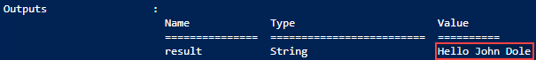
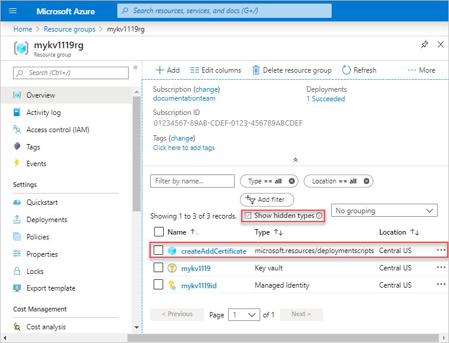

# Use deployment scripts in templates (Preview)

Learn how to use deployment scripts in Azure Resource templates. With a new resource type called `Microsoft.Resources/deploymentScripts`, users can execute deployment scripts in template deployments and review execution results. These scripts can be used for performing custom steps such as:

- add users to a directory
- create an app registration
- perform data plane operations, for example, copy blobs or seed database
- look up and validate a license key
- create a self-signed certificate
- create an object in Azure AD
- look up IP Address blocks from custom system

The benefits of deployment script:

- Easy to code, use, and debug. You can develop deployment scripts in your favorite development environments. The scripts can be embedded in templates or in external script files.
- You can specify the script language and platform. Currently, only Azure PowerShell deployment scripts on the Linux environment are supported.
- Allow specifying the identities that are used to execute the scripts. Currently, only [Azure user-assigned managed identity](../../active-directory/managed-identities-azure-resources/overview.md) is supported.
- Allow passing command-line arguments to the script.
- Can specify script outputs and pass them back to the deployment.

> [!NOTE]
> The deployment script is currently in preview. To use it, you must [sign up for the preview](https://aka.ms/armtemplatepreviews).

> [!IMPORTANT]
> Two deployment script resources, a storage account and a container instance, are created in the same resource group for script execution and troubleshooting. These resources are usually deleted by the script service when the deployment script execution gets in a terminal state. You are billed for the resources until the resources are deleted. To learn more, see [Clean-up deployment script resources](#clean-up-deployment-script-resources).

## Prerequisites

- **A user-assigned managed identity with the contributor's role at the subscription level**. This identity is used to execute deployment scripts. To create one, see [Create a user-assigned managed identity by using the Azure portal](../../active-directory/managed-identities-azure-resources/how-to-manage-ua-identity-portal.md), or [by using Azure CLI](../../active-directory/managed-identities-azure-resources/how-to-manage-ua-identity-cli.md), or [by using Azure PowerShell](../../active-directory/managed-identities-azure-resources/how-to-manage-ua-identity-powershell.md). You need the identity ID when you deploy the template. The format of the identity is:

  ```json
  /subscriptions/<SubscriptionID>/resourcegroups/<ResourceGroupName>/providers/Microsoft.ManagedIdentity/userAssignedIdentities/<IdentityID>
  ```

  Use the following PowerShell script to get the ID by providing the resource group name and the identity name.

  ```azurepowershell-interactive
  $idGroup = Read-Host -Prompt "Enter the resource group name for the managed identity"
  $idName = Read-Host -Prompt "Enter the name of the managed identity"

  $id = (Get-AzUserAssignedIdentity -resourcegroupname $idGroup -Name idName).Id
  ```

- **Azure PowerShell version 2.7.0, 2.8.0 or 3.0.0**. You don't need these versions for deploying templates. But these versions are needed for testing deployment scripts locally. See [Install the Azure PowerShell module](/powershell/azure/install-az-ps). You can use a preconfigured Docker image.  See [Configure development environment](#configure-development-environment).

## Resource schema

The following json is an example.  The latest template schema can be found [here](/azure/templates/microsoft.resources/deploymentscripts).

```json
{
  "type": "Microsoft.Resources/deploymentScripts",
  "apiVersion": "2019-10-01-preview",
  "name": "myDeploymentScript",
  "location": "[resourceGroup().location]",
  "kind": "AzurePowerShell",
  "identity": {
    "type": "userAssigned",
    "userAssignedIdentities": {
      "/subscriptions/01234567-89AB-CDEF-0123-456789ABCDEF/resourceGroups/myResourceGroup/providers/Microsoft.ManagedIdentity/userAssignedIdentities/myID": {}
    }
  },
  "properties": {
    "forceUpdateTag": 1,
    "azPowerShellVersion": "2.8",
    "arguments": "[concat('-name ', parameters('name'))]",
    "scriptContent": "
      param([string] $name)
      $output = 'Hello {0}' -f $name
      Write-Output $output
      $DeploymentScriptOutputs = @{}
      $DeploymentScriptOutputs['text'] = $output
    ",
    "primaryScriptUri": "https://raw.githubusercontent.com/Azure/azure-docs-json-samples/master/deployment-script/deploymentscript-helloworld.json",
    "supportingScriptUris":[],
    "timeout": "PT30M",
    "cleanupPreference": "OnSuccess",
    "retentionInterval": "P1D"
  }
}
```

> [!NOTE]
> The example is for demonstration purpose.  **scriptContent** and **primaryScriptUris** can't coexist in a template.

Property value details:

- **Identity**: The deployment script service uses a user-assigned managed identity to execute the scripts. Currently, only user-assigned managed identity is supported.
- **kind**: Specify the type of script. Currently, only Azure PowerShell script is support. The value is **AzurePowerShell**.
- **forceUpdateTag**: Changing this value between template deployments forces the deployment script to re-execute. Use the newGuid() or utcNow() function that needs to be set as the defaultValue of a parameter. To learn more, see [Run script more than once](#run-script-more-than-once).
- **azPowerShellVersion**: Specify the Azure PowerShell module version to be used. Deployment script currently supports version 2.7.0, 2.8.0, and 3.0.0.
- **arguments**: Specify the parameter values. The values are separated by spaces.
- **scriptContent**: Specify the script content. To run an external script, use `primaryScriptUri` instead. For examples, see [Use inline script](#use-inline-scripts) and [Use external script](#use-external-scripts).
- **primaryScriptUri**: Specify a publicly accessible Url to the primary powershell script with supported PowerShell file extension.
- **supportingScriptUris**: Specify an array of publicly accessible Urls to supporting powershell files that will be called in either `ScriptContent` or `PrimaryScriptUri`.
- **timeout**: Specify the maximum allowed script execution time specified in the [ISO 8601 format](https://en.wikipedia.org/wiki/ISO_8601). Default value is **P1D**.
- **cleanupPreference**. Specify the preference of cleaning up deployment resources when the script execution gets in a terminal state. Default setting is **Always**, which means deleting the resources despite the terminal state (Succeeded, Failed, Canceled). To learn more, see [Clean up deployment script resources](#clean-up-deployment-script-resources).
- **retentionInterval**: Specify the interval for which the service retains the deployment script resources after the deployment script execution reaches a terminal state. The deployment script resources will be deleted when this duration expires. Duration is based on the [ISO 8601 pattern](https://en.wikipedia.org/wiki/ISO_8601). The default value is **P1D**, which means seven days. This property is used when cleanupPreference is set to *OnExpiration*. The *OnExpiration* property is not enabled currently. To learn more, see [Clean up deployment script resources](#clean-up-deployment-script-resources).

## Use inline scripts

The following template has one resource defined with the `Microsoft.Resources/deploymentScripts` type.

[!code-json[](~/resourcemanager-templates/deployment-script/deploymentscript-helloworld.json?range=1-54)]

> [!NOTE]
> Because the inline deployment scripts are enclosed in double quotes, the strings inside the deployment scripts need to be enclosed in single quotes instead. The escape character for PowerShell is **&#92;**. You can also consider using string substitution as it is shown in the previous JSON sample. See the default value of the name parameter.

The script takes one parameter, and output the parameter value. **DeploymentScriptOutputs** is used for storing outputs.  In the outputs section, the **value** line shows how to access the stored values. `Write-Output` is used for debugging purpose. To learn how to access the output file, see [Debug deployment scripts](#debug-deployment-scripts).  For the property descriptions, see [Resource schema](#resource-schema).

To run the script, select **Try it** to open the Cloud shell, and then paste the following code into the shell pane.

```azurepowershell-interactive
$resourceGroupName = Read-Host -Prompt "Enter the name of the resource group to be created"
$location = Read-Host -Prompt "Enter the location (i.e. centralus)"
$id = Read-Host -Prompt "Enter the user-assigned managed identity ID"

New-AzResourceGroup -Name $resourceGroupName -Location $location

New-AzResourceGroupDeployment -ResourceGroupName $resourceGroupName -TemplateUri "https://raw.githubusercontent.com/Azure/azure-docs-json-samples/master/deployment-script/deploymentscript-helloworld.json" -identity $id

Write-Host "Press [ENTER] to continue ..."
```

The output looks like:



## Use external scripts

In addition to inline scripts, you can also use external script files. Currently only PowerShell scripts with the **ps1** file extension are supported. To use external script files, replace `scriptContent` with `primaryScriptUri`. For example:

```json
"primaryScriptURI": "https://raw.githubusercontent.com/Azure/azure-docs-json-samples/master/deployment-script/deploymentscript-helloworld.ps1",
```

To see an example, select [here](https://github.com/Azure/azure-docs-json-samples/blob/master/deployment-script/deploymentscript-helloworld-primaryscripturi.json).

The external script files must be accessible.  To secure your script files that are stored in Azure storage accounts, see [Tutorial: Secure artifacts in Azure Resource Manager template deployments](./template-tutorial-secure-artifacts.md).

## Use supporting scripts

You can separate complicated logics into one or more supporting script files. The `supportingScriptURI` property allows you to provide an array of URIs to the supporting script files if needed:

```json
"scriptContent": "
    ...
    ./Create-Cert.ps1
    ...
"

"supportingScriptUris": [
  "https://raw.githubusercontent.com/Azure/azure-docs-json-samples/master/deployment-script/create-cert.ps1"
],
```

Supporting script files can be called from both inline scripts and primary script files.

The supporting files are copied to azscripts/azscriptinput at the runtime. Use relative path to reference the supporting files from inline scripts and primary script files.

## Work with outputs from deployment scripts

The following template shows how to pass values between two deploymentScripts resources:

[!code-json[](~/resourcemanager-templates/deployment-script/deploymentscript-basic.json?range=1-84)]

In the first resource, you define a variable called **$DeploymentScriptOutputs**, and use it to store the output values. To access the output value from another resource within the template, use:

```json
reference('<ResourceName>').output.text
```

## Debug deployment scripts

The script service creates a [storage account](../../storage/common/storage-account-overview.md) and a [container instance](../../container-instances/container-instances-overview.md) for script execution. Both resources have the **azscripts** suffix in the resource names.


The user script, the execution results, and the stdout file are stored in the files shares of the storage account. There is a folder called **azscripts**. In the folder, there are two more folders for the input and the output files: **azscriptinput** and **azscriptoutput**.

The output folder contains a **executionresult.json** and the script output file. You can see the script execution error message in **executionresult.json**. The output file is created only when the script is executed successfully. The input folder contains a system PowerShell script file and the user deployment script files. You can replace the user deployment script file with a revised one, and rerun the deployment script from the Azure container instance.

You can get the deployment script resource deployment information at the resource group level and the subscription level by using REST API:

```rest
/subscriptions/<SubscriptionID>/resourcegroups/<ResourceGroupName>/providers/microsoft.resources/deploymentScripts/<DeploymentScriptResourceName>?api-version=2019-10-01-preview
```

```rest
/subscriptions/<SubscriptionID>/providers/microsoft.resources/deploymentScripts?api-version=2019-10-01-preview
```

The following example uses [ARMClient](https://github.com/projectkudu/ARMClient):

```azurepowershell
armclient login
armclient get /subscriptions/01234567-89AB-CDEF-0123-456789ABCDEF/resourcegroups/myrg/providers/microsoft.resources/deploymentScripts/myDeployementScript?api-version=2019-10-01-preview
```

The output is similar to:

[!code-json[](~/resourcemanager-templates/deployment-script/deploymentscript-status.json?range=1-48)]

The output shows the deployment state, and the deployment script resource IDs.

The following REST API returns the log:

```rest
/subscriptions/<SubscriptionID>/resourcegroups/<ResourceGroupName>/providers/microsoft.resources/deploymentScripts/<DeploymentScriptResourceName>/logs?api-version=2019-10-01-preview
```

It only works before the deployment script resources are deleted.

To see the deploymentScripts resource in the portal, select **Show hidden types**:



## Clean up deployment script resources

Deployment script creates a storage account and a container instance that are used for executing deployment scripts and storing debug information. These two resources are created in the same resource group as the provisioned resources, and will be deleted by the script service when script expires. You can control the life cycle of these resources.  Until they are deleted, you are billed for both resources. For the price information, see [Container Instances pricing](https://azure.microsoft.com/pricing/details/container-instances/) and [Azure Storage pricing](https://azure.microsoft.com/pricing/details/storage/).

The life cycle of these resources is controlled by the following properties in the template:

- **cleanupPreference**: Clean up preference when the script execution gets in a terminal state.  The supported values are:

  - **Always**: Delete the resources once script execution gets in a terminal state. Since the deploymentScripts resource may still be present after the resources are cleaned up, the system script would copy the script execution results, for example, stdout, outputs, return value, etc. to DB before the resources are deleted.
  - **OnSuccess**: Delete the resources only when the script execution is successful. You can still access the resources to find the debug information.
  - **OnExpiration**: Delete the resources only when the **retentionInterval** setting is expired. This property is currently disabled.

- **retentionInterval**: Specify the time interval that a script resource will be retained and after which will be expired and deleted.

> [!NOTE]
> It is not recommended to use the deployment script resources for other purposes.

## Run script more than once

Deployment script execution is an idempotent operation. If none of the deploymentScripts resource properties (including the inline script) is changed, the script will not be executed when you redeploy the template. The deployment script service compares the resource names in the template with the existing resources in the same resource group. There are two options if you want to execute the same deployment script multiple times:

- Change the name of your deploymentScripts resource. For example, use the [utcNow](./template-functions-string.md#utcnow) template function as the resource name or as a part of the resource name. Changing the resource name creates a new deploymentScripts resource. It is good for keeping a history of script execution.

    > [!NOTE]
    > The utcNow function can only be used in the default value for a parameter.

- Specify a different value in the `forceUpdateTag` template property.  For example, use utcNow as the value.

> [!NOTE]
> Write the deployment scripts that are idempotent. This ensures that if they run again accidentally, it will not cause system changes. For example, if the deployment script is used to create an Azure resource, verify the resource doesn't exist before creating it, so the script will succeed or you don't create the resource again.

## Configure development environment

Currently, deployment script supports Azure PowerShell version 2.7.0, 2.8.0, and 3.0.0.  If you have a Windows computer, you can install one of the supported Azure PowerShell versions and start developing and testing deployment scripts.  If you don't have a Windows computer or you don't have one of these Azure PowerShell versions installed, you can use a pre-configured docker container image. The following procedure shows you how to configure the docker image on Windows. For Linux and Mac, you can find the information on the Internet.

1. Install [Docker Desktop](https://www.docker.com/products/docker-desktop) on your development computer.
1. Open Docker Desktop.
1. Select the Docker Desktop icon from taskbars, and then select **Settings**.
1. Select **Shared Drives**, select a local drive that you want to be available to your containers, and then select **Apply**

    

1. Enter your windows credentials at the prompt.
1. Open a terminal window, either Command Prompt or Windows PowerShell (Do not use PowerShell ISE).
1. Pull the deployment script container image to the local computer:

    ```command
    docker pull mcr.microsoft.com/azuredeploymentscripts-powershell:az2.7
    ```

    The example uses version 2.7.0.

1. Run the docker image locally.

    ```command
    docker run -v <host drive letter>:/<host directory name>:/data -it mcr.microsoft.com/azuredeploymentscripts-powershell:az2.7
    ```

    Replace **&lt;host driver letter>** and **&lt;host directory name>** with an existing folder on the shared drive.  It maps the folder to the **/data** folder in the container. For examples, to map D:\docker:

    ```command
    docker run -v d:/docker:/data -it mcr.microsoft.com/azuredeploymentscripts-powershell:az2.7
    ```

    **-it** means keeping the container image alive.

1. Select **Share it** when you get a prompt.
1. Run a PowerShell script as shown in the following screenshot (given that you have a helloworld.ps1 file in d:\docker folder.)

    

After the PowerShell script is tested successfully, you can use it as a deployment script.

## Next steps

In this article, you learned how to use deployment scripts. To walk through a deployment script tutorial:

> [!div class="nextstepaction"]
> [Tutorial: Use deployment scripts in Azure Resource Manager templates](./template-tutorial-deployment-script.md)