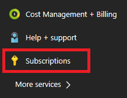

# Resolve errors for resource quotas

This article describes quota errors you may encounter when deploying resources.

[!INCLUDE [updated-for-az](../../../includes/updated-for-az.md)]

## Symptom

If you deploy a template that creates resources that exceed your Azure quotas, you get a deployment error that looks like:

```
Code=OperationNotAllowed
Message=Operation results in exceeding quota limits of Core.
Maximum allowed: 4, Current in use: 4, Additional requested: 2.
```

Or, you may see:

```
Code=ResourceQuotaExceeded
Message=Creating the resource of type <resource-type> would exceed the quota of <number>
resources of type <resource-type> per resource group. The current resource count is <number>,
please delete some resources of this type before creating a new one.
```

## Cause

Quotas are applied per resource group, subscriptions, accounts, and other scopes. For example, your subscription may be configured to limit the number of cores for a region. If you attempt to deploy a virtual machine with more cores than the permitted amount, you receive an error stating the quota has been exceeded.
For complete quota information, see [Azure subscription and service limits, quotas, and constraints](../../azure-resource-manager/management/azure-subscription-service-limits.md).

## Troubleshooting

### Azure CLI

For Azure CLI, use the `az vm list-usage` command to find virtual machine quotas.

```azurecli
az vm list-usage --location "South Central US"
```

Which returns:

```output
[
  {
    "currentValue": 0,
    "limit": 2000,
    "name": {
      "localizedValue": "Availability Sets",
      "value": "availabilitySets"
    }
  },
  ...
]
```

### PowerShell

For PowerShell, use the **Get-AzVMUsage** command to find virtual machine quotas.

```powershell
Get-AzVMUsage -Location "South Central US"
```

Which returns:

```output
Name                             Current Value Limit  Unit
----                             ------------- -----  ----
Availability Sets                            0  2000 Count
Total Regional Cores                         0   100 Count
Virtual Machines                             0 10000 Count
```

## Solution

To request a quota increase, go to the portal and file a support issue. In the support issue, request an increase in your quota for the region into which you want to deploy.

> [!NOTE]
> Remember that for resource groups, the quota is for each individual region, not for the entire subscription. If you need to deploy 30 cores in West US, you have to ask for 30 Resource Manager cores in West US. If you need to deploy 30 cores in any of the regions to which you have access, you should ask for 30 Resource Manager cores in all regions.
>
>

1. Select **Subscriptions**.

   

2. Select the subscription that needs an increased quota.

   

3. Select **Usage + quotas**

   

4. In the upper right corner, select **Request increase**.

   

5. Fill in the forms for the type of quota you need to increase.

   