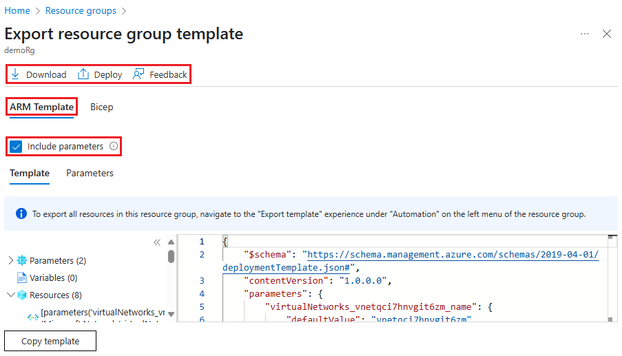
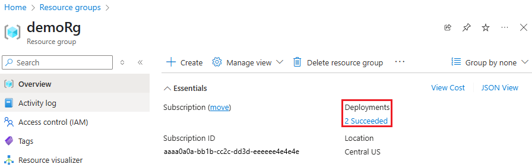
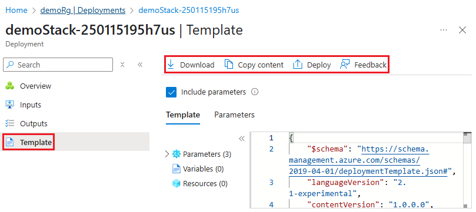

# Single and multi-resource export to a template in Azure portal

To assist with creating Azure Resource Manager templates, you can export a template from existing resources. The exported template helps you understand the JSON syntax and properties that deploy your resources. To automate future deployments, start with the exported template and modify it for your scenario.

Resource Manager enables you to pick one or more resources for exporting to a template. You can focus on exactly the resources you need in the template.

This article shows how to export templates through the portal. You can also use [Azure CLI](../management/manage-resource-groups-cli.md#export-resource-groups-to-templates), [Azure PowerShell](../management/manage-resource-groups-powershell.md#export-resource-groups-to-templates), or [REST API](/rest/api/resources/resourcegroups/exporttemplate).

## Choose the right export option

There are two ways to export a template:

* **Export from resource group or resource**. This option generates a new template from existing resources. The exported template is a "snapshot" of the current state of the resource group. You can export an entire resource group or specific resources within that resource group.

* **Export before deployment or from history**. This option retrieves an exact copy of a template used for deployment.

Depending on the option you choose, the exported templates have different qualities.

| From resource group or resource | Before deployment or from history |
| --------------------- | ----------------- |
| Template is snapshot of the resources' current state. It includes any manual changes you made after deployment. | Template only shows state of resources at the time of deployment. Any manual changes you made after deployment aren't included. |
| You can select which resources from a resource group to export. | All resources for a specific deployment are included. You can't pick a subset of those resources or add resources that were added at a different time. |
| Template includes all properties for the resources, including some properties you wouldn't normally set during deployment. You might want to remove or clean up these properties before reusing the template. | Template includes only the properties needed for the deployment. The template is ready-to-use. |
| Template probably doesn't include all of the parameters you need for reuse. Most property values are hard-coded in the template. To redeploy the template in other environments, you need to add parameters that increase the ability to configure the resources.  You can unselect **Include parameters** so that you can author your own parameters. | Template includes parameters that make it easy to redeploy in different environments. |

Export the template from a resource group or resource, when:

* You need to capture changes to the resources that were made after the original deployment.
* You want to select which resources are exported.

Export the template before deployment or from the history, when:

* You want an easy-to-reuse template.
* You don't need to include changes you made after the original deployment.

## Limitations

When exporting from a resource group or resource, the exported template is generated from the [published schemas](https://github.com/Azure/azure-resource-manager-schemas/tree/master/schemas) for each resource type. Occasionally, the schema doesn't have the latest version for a resource type. Check your exported template to make sure it includes the properties you need. If necessary, edit the exported template to use the API version you need.

The export template feature doesn't support exporting Azure Data Factory resources. To learn about how you can export Data Factory resources, see [Copy or clone a data factory in Azure Data Factory](https://aka.ms/exportTemplateViaAdf).

To export resources created through classic deployment model, you must [migrate them to the Resource Manager deployment model](https://aka.ms/migrateclassicresourcetoarm).

## Export template from a resource group

To export one or more resources from a resource group:

1. Select the resource group that contains the resources you want to export.

1. Select one or more resources by selecting the checkboxes.  To select all, select the checkbox on the left of **Name**. The **Export template** menu item only becomes enabled after you've selected at least one resource.

   

    On the screenshot, only the storage account is selected.
1. Select **Export template**.

1. The exported template is displayed, and is available to download and deploy.

   

   **Include parameters** is selected by default.  When selected, all template parameters will be included when the template is generated. If you’d like to author your own parameters, toggle this checkbox to not include them.

## Export template from a resource

To export one resource:

1. Select the resource group containing the resource you want to export.

1. Select the resource that you want to export to open the resource.

1. For that resource, select **Export template** in the left pane.

   

1. The exported template is displayed, and is available to download and deploy. The template only contains the single resource. **Include parameters** is selected by default.  When selected, all template parameters will be included when the template is generated. If you’d like to author your own parameters, toggle this checkbox to not include them.

## Export template before deployment

1. Select the Azure service you want to deploy.

1. Fill in the values for the new service.

1. After passing validation, but before starting the deployment, select **Download a template for automation**.

   

1. The template is displayed and is available for download and deploy.

## Export template after deployment

You can export the template that was used to deploy existing resources. The template you get is exactly the one that was used for deployment.

1. Select the resource group you want to export.

1. Select the link under **Deployments**.

   

1. Select one of the deployments from the deployment history.

   

1. Select **Template**. The template used for this deployment is displayed, and is available for download.

   

## Next steps

- Learn how to export templates with [Azure CLI](../management/manage-resource-groups-cli.md#export-resource-groups-to-templates), [Azure PowerShell](../management/manage-resource-groups-powershell.md#export-resource-groups-to-templates), or [REST API](/rest/api/resources/resourcegroups/exporttemplate).
- To learn the Resource Manager template syntax, see [Understand the structure and syntax of Azure Resource Manager templates](template-syntax.md).
- To learn how to develop templates, see the [step-by-step tutorials](/azure/azure-resource-manager/).
- To view the Azure Resource Manager template schemas, see [template reference](/azure/templates/).
