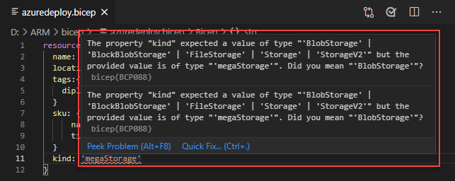
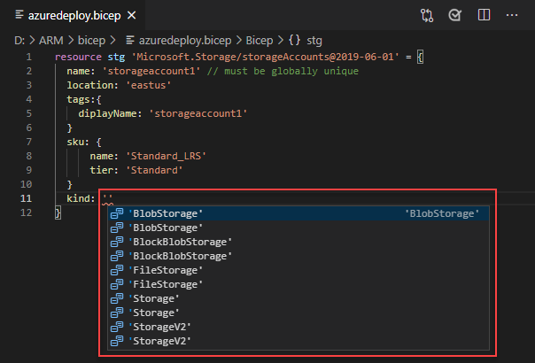
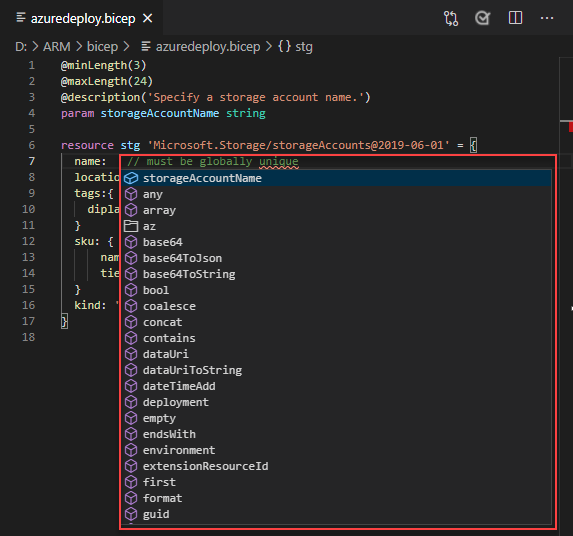

# Quickstart: Create Bicep files with Visual Studio Code

The Bicep extension for Visual Studio Code provides language support and resource autocompletion. These tools help create and validate [Bicep](./bicep-overview.md) files. In this quickstart, you use the extension to create a Bicep file from scratch. While doing so you experience the extensions capabilities such as validation, and completions.

To complete this quickstart, you need [Visual Studio Code](https://code.visualstudio.com/), with the [Bicep extension](https://marketplace.visualstudio.com/items?itemName=ms-azuretools.vscode-bicep) installed. You also need either the latest [Azure CLI](/cli/azure/) or the latest [Azure PowerShell module](/powershell/azure/new-azureps-module-az) installed and authenticated.

If you don't have an Azure subscription, [create a free account](https://azure.microsoft.com/free/) before you begin.

## Create a Bicep file

Create and open with Visual Studio Code a new file named *azuredeploy.bicep*.

## Add an Azure resource

Add a basic storage account resource to the bicep file.

```bicep
resource stg 'Microsoft.Storage/storageAccounts@2019-06-01' = {
  name: 'storageaccount1' // must be globally unique
  location: 'eastus'
  tags:{
    diplayName: 'storageaccount1'
  }
  sku: {
      name: 'Standard_LRS'
      tier: 'Standard'
  }
  kind: 'Storage'
}
```

The resource declaration has four components:

- **resource**: Keyword.
- **symbolic name** (stg): Symbolic name is an identifier for referencing the resource throughout your bicep file. It is not what the name of the resource will be when it's deployed. The name of the resource is defined by the **name** property.  See the fourth component in this list.
- **resource type** (Microsoft.Storage/storageAccounts@2019-06-01): It is composed of the resource provider (Microsoft.Storage), resource type (storageAccounts), and apiVersion (2019-06-01). Each resource provider publishes its own API versions, so this value is specific to the type. You can find more types and apiVersions for various Azure resources from [ARM template reference](/azure/templates/).
- **properties** (everything inside = {...}): Specify the properties for the resource type. Every resource has a `name` property. Most resources also have a `location` property, which sets the region where the resource is deployed. The other properties vary by resource type and API version.

## Completion and validation

One of the most powerful capabilities of the extension is its integration with Azure schemas. Azure schemas provide the extension with validation and resource-aware completion capabilities. Let's modify the storage account to see validation and completion in action.

First, update the storage account kind to an invalid value such as `megaStorage`. Notice that this action produces a warning indicating that `megaStorage` is not a valid value.



To use the completion capabilities, remove `megaStorage`, place the cursor inside of the single quotes, and press `ctrl` + `space`. This action presents a completion list of valid values.



## Add parameters

Now create and use a parameter to specify the storage account name.

Add the following code to the beginning of the file:

```bicep
@minLength(3)
@maxLength(24)
@description('Specify a storage account name.')
param storageAccountName string
```

Azure storage account names have a minimum length of 3 characters and a maximum of 24. Use `minLength` and `maxLength` to provide appropriate values.

Now, on the storage resource, update the name property to use the parameter. To do so, remove the current storage resource name including the single quotes. press `ctrl` + `space`. Select the **storageAccountName** parameter from the list. Notice the parameters can be referenced directly by using their names in Bicep. The JSON templates require a parameter() function.



## Deploy the Bicep file

Open the integrated Visual Studio Code terminal using the `ctrl` + ```` ` ```` key combination, change the current directory to where the Bicep file is located, and then use either the Azure CLI or Azure PowerShell module to deploy the Bicep file.

# [CLI](#tab/CLI)

```azurecli
az group create --name arm-vscode --location eastus

az deployment group create --resource-group arm-vscode --template-file azuredeploy.bicep --parameters storageAccountName={your-unique-name}
```

# [PowerShell](#tab/PowerShell)

```azurepowershell
New-AzResourceGroup -Name arm-vscode -Location eastus

New-AzResourceGroupDeployment -ResourceGroupName arm-vscode -TemplateFile ./azuredeploy.bicep -storageAccountName "{your-unique-name}"
```

---

## Clean up resources

When the Azure resources are no longer needed, use the Azure CLI or Azure PowerShell module to delete the quickstart resource group.

# [CLI](#tab/CLI)

```azurecli
az group delete --name arm-vscode
```

# [PowerShell](#tab/PowerShell)

```azurepowershell
Remove-AzResourceGroup -Name arm-vscode
```

---

## Next steps

> [!div class="nextstepaction"]
> [Beginner Bicep tutorials](./bicep-tutorial-create-first-bicep.md)
